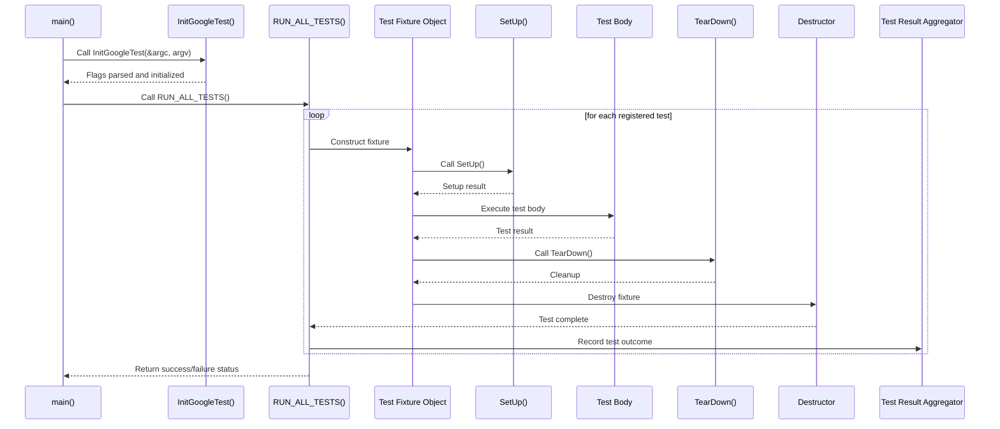

# Test Discovery & Execution Flow

Understanding how GoogleTest handles the automatic discovery, initialization, and execution of tests is crucial for writing efficient and maintainable test suites. This guide walks you through the end-to-end lifecycle of your tests — from registration to reporting — clarifying what occurs behind the scenes every time you run your test executable.

---

## Automatic Test Registration and Discovery

GoogleTest simplifies your testing workflow by automatically registering all tests defined using the `TEST()`, `TEST_F()`, `TEST_P()`, and other related macros. This means you do not have to explicitly list or call individual tests.

- Each test definition triggers automatic registration during static initialization before `main()` runs.
- GoogleTest keeps a global registry of all tests present in your program.
- Upon execution, the test framework queries this registry to identify which tests are available to run.

**Why This Matters:** This automatic registration ensures that all your tests are discoverable regardless of how many source files or modules you have, removing the manual burden and preventing errors from missing or forgotten tests.

---

## Initialization: Preparing the Test Environment

Before any tests run, GoogleTest requires proper initialization to configure its runtime environment:

1. **Calling `testing::InitGoogleTest(&argc, argv)`**
   - Parses command-line flags and options.
   - Removes recognized GoogleTest flags to prevent interference with user arguments.
   - Configures internal settings such as the output format, test filter patterns, repeat counts, sharding, and others.

2. **Customizing Initialization**
   - Users can modify test environment conditions, set up global fixtures, or prepare logger configurations before running tests.
   - Because `InitGoogleTest()` discards recognized flags from `argv`, your test can freely access remaining arguments.

> **Tip:**  
> Always call `InitGoogleTest()` before running tests. Failing to do so will result in ignored or default settings and can cause tests to behave unexpectedly.

---

## Executing Tests: The Lifecycle of a Single Test

GoogleTest treats each test as an isolated unit to ensure clarity and reproducibility.

For every test in the registered set, the following user-centric sequence occurs:

1. **Test Fixture Construction**
   - If the test is a simple `TEST()`, GoogleTest creates a fresh instance for that test.
   - For `TEST_F()` tests (fixtures), a fixture object is constructed.
   - The constructor runs, setting up initial member variables.

2. **Setup Phase (`SetUp()`)**
   - If overridden, this method prepares resources needed for the test execution.
   - Ideal for allocating objects, opening files, or initializing mocks.

3. **Test Body Execution**
   - The actual test method runs, making assertions and validations.
   - Both `ASSERT_` and `EXPECT_` macros influence this phase differently: fatal failures abort the test body while nonfatal ones allow it to continue.

4. **Teardown Phase (`TearDown()`)**
   - If overridden, cleans up resources initialized in `SetUp()`.
   - It runs even after fatal failures, ensuring proper cleanup.

5. **Test Fixture Destruction**
   - The fixture’s destructor is called, finalizing all cleanup.

6. **Test Result Collection**
   - GoogleTest aggregates results, tracking successes, failures, and skipped tests.



---

## Handling Command-Line Options

GoogleTest supports a rich set of command-line flags that control its behavior at runtime. These options are parsed during `InitGoogleTest()` and influence the test execution flow significantly:

- **Filtering Tests**
  - `--gtest_filter=` allows you to specify which tests to run, supporting wildcard and negation patterns.
- **Sharding**
  - Flags like `--gtest_total_shards` and `--gtest_shard_index` partition tests for parallel execution in distributed environments.
- **Repeating Tests**
  - `--gtest_repeat=` runs tests multiple times for stability checks.
- **Output Formats**
  - `--gtest_output=` can generate XML reports helpful for CI integration.
- **Internal Behaviors**
  - Debugging flags such as `--gtest_break_on_failure` and `--gtest_catch_exceptions` enhance diagnostic capabilities.

Manually passing these flags or scripting their input can tune your testing runs without touching code.

---

## Test Execution Flow Details

The overall flow from the moment you run a GoogleTest binary to when it returns is streamlined yet powerful:

1. **Static Initialization**
   - All tests register themselves in the global test registry *before* `main()` begins.

2. **Main Function Execution**
   - Commonly, you either rely on the provided `gtest_main` which includes a `main()` that automatically calls `InitGoogleTest()` and `RUN_ALL_TESTS()`.
   - Or you provide your own main function that calls these explicitly.

3. **Test Execution via RUN_ALL_TESTS()**
   - Runs all tests matching filters and obeying command-line flags.

4. **Reporting Results**
   - Outputs to console and potentially to files.
   - Determines exit code (`0` success, `1` failure) used by CI tools.

---

## Practical Tips and Best Practices

- **Run `InitGoogleTest()` before any test execution**: Never omit this step to ensure proper flag parsing.
- **Call `RUN_ALL_TESTS()` once**: Calling multiple times may lead to undefined behavior.
- **Use test filters to speed debug cycles**: Instead of running the full suite, narrow down the tests.
- **Leverage sharding for parallel execution**: Scale tests efficiently across machines.
- **Handle fatal vs non-fatal assertions with care**: Understand that `ASSERT_*` failures abort test body but not the entire run.

---

## Troubleshooting Common Issues

<AccordionGroup title="Common Pitfalls in Test Execution">
<Accordion title="Tests Not Running or Detected">
Check whether your test macros are coded correctly (`TEST()`, `TEST_F()`), and ensure all source files are linked. Call `InitGoogleTest()` properly to register tests.
</Accordion>
<Accordion title="Command-Line Flags Not Taking Effect">
Confirm `InitGoogleTest()` consumes and parses your flags correctly; all recognized flags are removed from `argv`.
</Accordion>
<Accordion title="Unexpected Test Failures or Early Aborts">
Verify your use of `ASSERT_*` macro calls and understand their impact on aborting the current test.
</Accordion>
</AccordionGroup>

---

## Summary

GoogleTest automates the process of test discovery and execution, abstracting away the complexity of test registration, initialization, and result aggregation to provide a streamlined, consistent testing experience. Through automatic registration, configurable command-line options, and a clear test lifecycle, it supports robust, maintainable, and scalable C++ testing.

For detailed API usage and additional features like parameterized tests and mocking integration, consult the respective guides.

---

## References

- [GoogleTest Primer](primer.md) — for starting with basic test writing
- [Core Testing APIs: Test Definition and Execution](api-reference/core-testing-apis/test-definition-and-execution.md) — comprehensive API reference
- [Command-Line Flags Overview](advanced.md) — all available testing flags
- [Mocking and GoogleMock Concepts](overview/core-concepts/mocking.mdx) — integration with mocks
- [Getting Started: Writing Your First Test](guides/getting-started/writing-first-test.mdx)
- [Troubleshooting Common Setup Issues](getting-started/troubleshooting-resources/troubleshooting-common-issues.mdx)

---

## Example: Typical main() for Running Tests

```cpp
#include <gtest/gtest.h>

int main(int argc, char** argv) {
  testing::InitGoogleTest(&argc, argv);  // Flag parsing and setup
  return RUN_ALL_TESTS();                // Execute all registered tests
}
```

Linking with `gtest_main` provides this automatically so you often don't write your own.