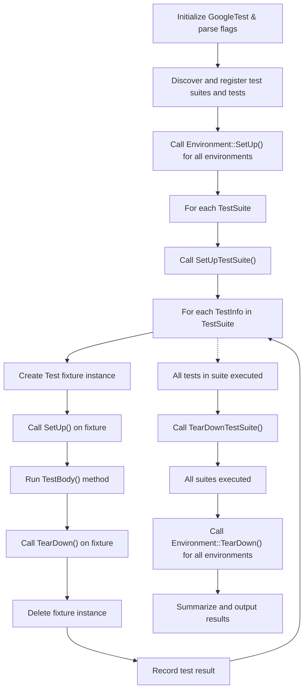

# Test Lifecycle and Execution Model

Understanding the flow from test discovery to execution is crucial to mastering how GoogleTest manages the lifecycle of your tests. This guide walks you through the stages from the registration of tests, initialization and tear-down of environments, to the execution of individual test cases, including setup/teardown phases, result collection, and reporting mechanisms. Through this understanding, you will gain insight into how GoogleTest ensures test isolation, supports flexible configuration, and maintains cross-platform compatibility.

---

## 1. Test Registration and Discovery

When you write tests using GoogleTest's macros like `TEST()` or `TEST_F()`, each test is automatically registered with the GoogleTest framework before execution begins. This automatic registration:

- Creates internal `TestInfo` objects that describe each test, including metadata such as test name, suite name, source file, and line number.
- Organizes tests into `TestSuite` collections, grouping related tests by test fixture or suite name.
- Ensures each test is accounted for in the overall `UnitTest` singleton, which aggregates all test suites and controls execution.

If you prefer dynamic registration (e.g., runtime-generated tests), the `RegisterTest` API allows you to programmatically register tests with custom fixture factories before the test run.

<Check>
Your test program need only invoke `RUN_ALL_TESTS()` to run all registered tests automatically. Manual listing, ordering, or management of tests is unnecessary thanks to this automatic test registration.
</Check>

## 2. Global Environment Setup and Teardown

Before running any test, GoogleTest sets up global test environments:

- Users can subclass `testing::Environment` and override `SetUp()` and `TearDown()` to prepare or cleanup global resources shared by multiple test suites.
- These environments are registered via `AddGlobalTestEnvironment()` before the test run.
- `SetUp()` methods of all registered environments run once before the first test iteration.
- After all tests are run (including repeated test runs, if requested), their `TearDown()` methods are called in reverse order.

<Info>
If the `--gtest_recreate_environments_when_repeating` flag is enabled (default), environments are recreated before each repeat iteration, ensuring fresh states.
</Info>

## 3. Test Program Execution Flow

The heart of the testing framework lies in executing the registered tests in a controlled and isolated manner. The key phases include:

### 3.1 Initialization

- GoogleTest parses command-line flags during `InitGoogleTest()`.
- It evaluates filters (`--gtest_filter`) to determine which tests/suites should run.
- Sharding parameters (`GTEST_TOTAL_SHARDS` and `GTEST_SHARD_INDEX`) are applied to split tests across parallel runs.
- If set, tests will be shuffled (`--gtest_shuffle`) to uncover order dependencies.

### 3.2 Test Iterations

- Tests can be repeated (`--gtest_repeat`) multiple times to identify flaky tests.
- For each iteration:
  - The registered environments have their `SetUp()` called.
  - Each test suite with tests to run has their `SetUpTestSuite()` invoked once before its first test.
  - Each test in the suite is run individually, isolated.
  - `TearDownTestSuite()` is called after the last test in the suite.
  - The environments are torn down (`TearDown()`) after all suites finish.

<Note>
If no tests match the filter or are selected for the current shard, environments' setup and teardown are bypassed.
</Note>

### 3.3 Individual Test Execution

For each individual test:

- A new test fixture object is created (for `TEST_F` or fixture-based tests).
- Fixture's `SetUp()` is called to prepare the test environment.
- The test's `TestBody()` function runs, which contains the actual test code.
- Fixture's `TearDown()` is called to clean up.
- The fixture object is destroyed, ensuring no state leaks between tests.

<Warning>
Tests run in isolation. Each test has a fresh fixture instance to guarantee independence and improve repeatability.
</Warning>

### 3.4 Lifecycles for Parameterized and Typed Tests

- For value-parameterized (`TEST_P`) and typed tests (`TYPED_TEST`), the lifecycle remains the same, but:
  - The fixtures receive parameters via `GetParam()` or `TypeParam`.
  - Test suites and tests are instantiated for each parameter or type.
  - Setup/teardown behave similarly, but must be declared `public` for correct visibility.

## 4. Setup and Teardown Hierarchy

GoogleTest provides multiple extensibility points for initialization and cleanup at various granularities:

| Level           | Setup Method            | Teardown Method           | When It Runs                                          |
|-----------------|------------------------|---------------------------|------------------------------------------------------|
| Global          | `Environment::SetUp()` | `Environment::TearDown()` | Before all tests / After all tests                    |
| Test Suite      | `Test::SetUpTestSuite()` | `Test::TearDownTestSuite()` | Before first test in suite / After last test in suite |
| Individual Test | `Test::SetUp()`           | `Test::TearDown()`          | Before and after each test respectively              |

This multi-level setup/teardown strategy allows you to optimize resource allocation, e.g., by sharing expensive setup for all tests in a suite, while maintaining test isolation at the individual test level.

<Info>
`SetUpTestSuite()` and `TearDownTestSuite()` are static methods defined on your fixture class, whereas `SetUp()` and `TearDown()` are instance methods overriding the base `Test`.
</Info>

## 5. Result Reporting and Test Status Tracking

As tests run, GoogleTest:

- Tracks individual assertion results with `TestPartResult` objects.
- Aggregates these results into `TestResult` objects associated with each `TestInfo`.
- Maintains test suite and program-level pass/fail counts and timestamps.
- Supports reporting skipped tests and disabled tests.
- Provides access to result data through the singleton `UnitTest` and `TestSuite` interfaces.

### 5.1 Programmatic Access

By calling methods such as:

- `UnitTest::GetInstance()->current_test_info()` to identify the currently running test
- `TestInfo::result()` to get detailed results
- `TestSuite::failed_test_count()` and `UnitTest::failed_test_count()` to get aggregate failure counts

users and listeners can dynamically inspect the test execution state.

### 5.2 Event Listener Notifications

GoogleTest provides a `TestEventListener` interface for hooking into test events during execution:

- Start/end of the test program, iterations, test suites, and individual tests
- When individual test parts (assertions) finish
- Environment setup/teardown

These notifications empower users to customize reporting, logging, and integrate with external tools.

<Check>
GoogleTest ships with default listeners for console output and XML/JSON report generation, which can be replaced or extended.
</Check>

## 6. Test Isolation and Exception Safety

To support test isolation and robustness:

- Each test runs with a fresh fixture instance to avoid shared state pollution.
- GoogleTest catches exceptions thrown by tests by default (controlled by `catch_exceptions` flag).
- Fatal failures abort the current test function, preventing cascade failures.
- Flags exist to customize behaviors such as breaking on failure or throwing exceptions on failure.

<Warning>
Misnaming lifecycle functions (e.g., `Setup()` instead of `SetUp()`) causes silent errors. GoogleTest provides compile-time checks to catch these errors.
</Warning>

## 7. Cross-Platform Execution Considerations

GoogleTest abstracts operating-system details:

- Provides consistent timing and timestamp APIs.
- Supports signal handling for fatal failures on supported platforms.
- Uses platform-specific mechanisms for process exit, stack trace capture, and file system paths.
- Ensures compatibility with Windows, Linux, macOS, and embedded systems.

<Info>
This abstraction ensures that test lifecycle and result reporting mechanisms behave uniformly across environments.
</Info>

## 8. Sample Execution Flow Diagram

## 9. Troubleshooting and Best Practices

- **Test Isolation:** Always avoid sharing mutable state across tests. Use fixtures responsibly.
- **Setup/Teardown:** Ensure `SetUpTestSuite()`/`TearDownTestSuite()` manage shared resources properly.
- **Flags:** Use flags like `--gtest_filter` and `--gtest_repeat` to focus and debug tests.
- **Exception Handling:** Be aware of flags like `--gtest_catch_exceptions` for controlling exceptions.
- **Naming:** Follow correct naming conventions (`SetUp` not `Setup`) to avoid silent failures.
- **Event Listeners:** Utilize event listeners to build custom test reports or integrate with CI systems.

<Tip>
Run tests individually to isolate failures quickly, and use sharding for scaling on parallel machines.
</Tip>

---

For a detailed walk-through on writing tests and using features aligned with the test lifecycle, refer to the [GoogleTest Primer](../primer.md) and [Advanced GoogleTest Topics](../advanced.md).

To extend your tests with sophisticated mocking support, visit the [Mocking Reference](../api_reference/mocking_api/mock_object_basics.md) and [gMock for Dummies](../gmock_for_dummies.md).

For programmatically tracking and customizing test execution, explore the [TestEventListener interface](../api_reference/testing.md#TestEventListener) and [TestEventListeners](../api_reference/testing.md#TestEventListeners).

---