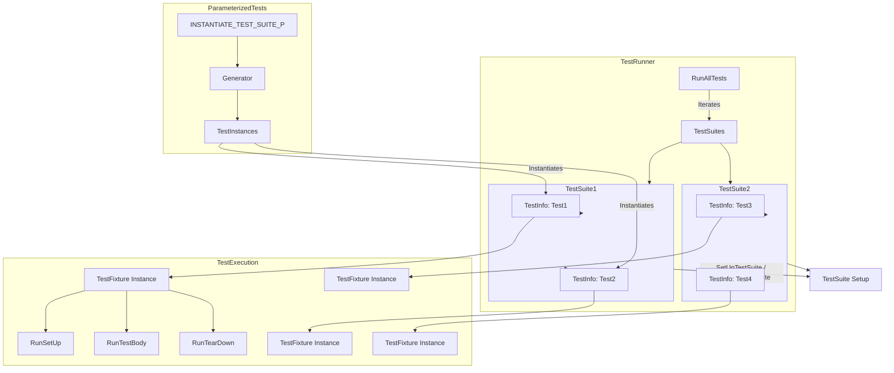

# xUnit Model and Test Discovery

GoogleTest implements a robust and scalable xUnit architecture that facilitates writing, organizing, discovering, and running test cases automatically. This page demystifies how GoogleTest represents test cases, fixtures, and parameterized tests internally and how the framework discovers and executes them seamlessly. Understanding these concepts empowers users to design maintainable and scalable test suites.

---

## 1. The xUnit Architecture in GoogleTest

At its core, GoogleTest is built upon the xUnit testing architecture, a pattern widely adopted for unit testing. This architecture structures tests into:

- **Test Fixtures** (test classes) that define the shared environment and setup for tests.
- **Test Cases** or **Test Suites**—groups of related tests using common fixtures.
- **Individual Tests**, defined as separate functions within these test suites.

GoogleTest manages these elements dynamically, enabling:

- Independent and repeatable execution of tests.
- Automatic discovery and registration of tests without manual enumeration.
- Parameterized and type-parameterized tests for broad and flexible coverage.

### Why the xUnit Model Matters to Users

The xUnit model in GoogleTest ensures predictable, isolated test execution, which improves both reliability and debuggability. When tests fail, you can pinpoint the source quickly due to isolated fixtures and detailed reporting.

---

## 2. Defining Test Fixtures and Test Cases

GoogleTest expects tests to be organized into test fixtures—C++ classes deriving from `::testing::Test` or specialized variants like `TestWithParam<T>` for parameterized tests. You define fixtures with member variables and setup/teardown routines.

Tests use fixtures to share this setup and are defined using macros such as `TEST_F` for fixture-based tests or `TEST_P` for parameterized variants.

### Example: Simple Fixture With Tests
```cpp
class MyTestFixture : public ::testing::Test {
 protected:
  void SetUp() override {
    // initialization
  }

  void TearDown() override {
    // cleanup
  }

  int shared_resource_;
};

TEST_F(MyTestFixture, TestOne) {
  EXPECT_EQ(shared_resource_, 42);
}

TEST_F(MyTestFixture, TestTwo) {
  EXPECT_TRUE(SomeCheck());
}
```

Each `TEST_F` will run independently with a new instance of `MyTestFixture`.

### Test Suite and Fixture Identity

In GoogleTest, a test fixture name and test suite name are synonymous. The fixture name defines the suite under which test functions belong. GoogleTest requires all tests in a suite to share the same fixture class.

---

## 3. Parameterized Tests and Test Generation

GoogleTest extends the xUnit model by supporting *value-parameterized tests* (`TEST_P`) and associated `INSTANTIATE_TEST_SUITE_P`, allowing a single test logic to run across multiple parameters transparently.

### Defining a Value-Parameterized Test:

```cpp
class FooTest : public ::testing::TestWithParam<int> {
  // Setup and members
};

TEST_P(FooTest, WorksWithParam) {
  int param = GetParam();
  EXPECT_TRUE(DoSomething(param));
}

INSTANTIATE_TEST_SUITE_P(
    RangeTests, FooTest,
    ::testing::Range(1, 4)  // Will run tests with param 1, 2, 3
);
```

### Behind the Scenes: Test Expansion and Registration

- Upon GoogleTest initialization (`InitGoogleTest()`), all parameterized tests declared by `TEST_P` macros are registered but not yet instantiated.
- When `INSTANTIATE_TEST_SUITE_P` is called, GoogleTest:
  - Invokes the parameter generator (e.g., `Range()`, `Values()`, `Combine()`) to produce parameter sequences.
  - Creates and registers concrete test instances for each parameter value (each acting like a separate test).
- This deferred evaluation means test parameters are only generated once during initialization, ensuring reproducibility and isolation.

### Parameter Generators

GoogleTest provides several built-in parameter generators that create value sequences for parameterized tests:

| Generator      | Behavior                                                 | Example                          |
|----------------|----------------------------------------------------------|---------------------------------|
| `Range`        | Sequential range of values `[start, end)` with optional step | `Range(0, 5, 2)` yields 0, 2, 4 |
| `Values`       | List of enumerated values                                 | `Values(3, 5, 8)`                |
| `ValuesIn`     | Values from containers or arrays                          | `ValuesIn(std::vector<int>{1,2,3})` |
| `Bool`         | Produces false and true                                   | `Bool()`                        |
| `Combine`      | Cartesian product of multiple generators producing tuples | `Combine(Values(1,2), Values('a','b'))` |
| `ConvertGenerator` | Converts generated types via casting or a custom callable | Often used for custom parameter adaptions |

### Example: Combine Generator

```cpp
INSTANTIATE_TEST_SUITE_P(
    MyComboTests, MyTestSuite,
    ::testing::Combine(::testing::Values(1, 2), ::testing::Values('a', 'b')));
```

This expands to four tests with parameters `(1, 'a')`, `(1, 'b')`, `(2, 'a')`, and `(2, 'b')`.

---

## 4. Test Registration and Execution Flow

### Test Registration

- Test registration occurs at static initialization time when macros like `TEST`, `TEST_F`, or `TEST_P` are used.
- Each test is represented by a `TestInfo` object containing metadata such as test suite name, test name, type and value parameters, source file, and line number.
- All registered tests are collected within `TestSuite` objects that group tests by fixture.

### Test Execution Process

1. When `RUN_ALL_TESTS()` is invoked, GoogleTest prepares the environment and filters tests based on user-specified filters and sharding.
2. The framework iterates over all applicable `TestSuite` instances.
3. For each `TestSuite`, GoogleTest will:
   - Call `SetUpTestSuite()` (optional user-defined; runs once before all tests in suite).
   - Execute each registered `TestInfo` test:
     - Create a new test fixture instance using the factory stored in `TestInfo`.
     - Call `SetUp()` of the fixture.
     - Run the test body.
     - Call `TearDown()` of the fixture.
     - Delete the fixture instance.
   - Call `TearDownTestSuite()` (optional user-defined; runs once after all tests in suite).

### Outcome Reporting

- Results of each test (pass, fail, skip) are recorded in `TestResult` objects attached to `TestInfo`.
- Listeners subscribed to GoogleTest events receive notifications on test start, failures, and completion.
- Support for detailed reporting includes XML/JSON output generation, console printing, and customizable event listeners.

---

## 5. Scalability and Extensibility in GoogleTest's xUnit Model

### Scalable Test Definitions

- The use of parameterized tests avoids test duplication.
- Abstract test suites (with deferred instantiation) enable library-style reusable test logic.
- Type-parameterized tests (`TYPED_TEST`, `TYPED_TEST_SUITE`) support running the same suite over multiple types, useful for templates and generic programming.

### Test Discovery

- Tests are discovered automatically via static registration—no manual registration needed.
- Filtering on test names, types, and parameters is natively supported.
- Support for test sharding enables distributing tests across parallel runners.

### Hooks and Extensions

- Users can extend test suite behavior with `SetUpTestSuite()` and `TearDownTestSuite()` for expensive setup and teardown shared by all tests.
- Global environments (`testing::Environment`) provide setup/teardown at the test program level.
- Event listener API enables custom output, logging, or integration with external systems.

---

## 6. Visualizing the Relationships



---

## 7. Practical Tips for Users

- **Always name your test suites and test names without underscores (`_`)** to avoid name collisions and registration conflicts.
- **Use parameterized tests to avoid repetitious code** and increase test coverage efficiently.
- **Define `SetUpTestSuite()` and `TearDownTestSuite()` for expensive shared resource management** instead of duplicating this in every test.
- **Be mindful that tests are independent**: each test gets a fresh fixture instance; avoid dependencies between tests.
- **Use the `INSTANTIATE_TEST_SUITE_P` only once per parameterized test suite** to avoid confusing multiple expansions.
- **Provide custom parameter name generators when using complex parameter types** to make test output and filtering easier.

---

## 8. Troubleshooting Common Issues

- **Tests not running?** Ensure parameterized tests (`TEST_P`) are properly instantiated with `INSTANTIATE_TEST_SUITE_P`.
- **Fixture conflicts?** All tests in a test suite must share the same fixture class; mixing `TEST` and `TEST_F` in the same suite leads to runtime errors.
- **Skipped tests?** Check if filtering or sharding configuration accidentally excludes tests.
- **Test name conflicts?** Avoid underscores in test suite and test names.

For more details, see [Test Discovery and Execution Guide](../guides/core_testing_workflows/test_discovery_execution.md).

---

## 9. Summary

GoogleTest’s implementation of the xUnit architecture streamlines the process of defining, discovering, and running tests. Through fixtures, parameterized tests, and automatic registration, users can manage complex test suites with ease, leveraging built-in generators and extensibility points to tailor testing workflows for real-world scenarios. This model guarantees independent and reproducible tests, supports scalable test generation, and provides detailed reporting. Understanding this architecture is fundamental for harnessing GoogleTest’s full potential.

---

## See Also

- [GoogleTest Primer](../primer.md) for beginner-friendly test writing
- [Advanced Testing Patterns: Parameterized Tests](../advanced.md#value-parameterized-tests)
- [Testing Reference: Core Macros](../api-reference/core-testing-api/test-case-definition.md)
- [Test Discovery and Execution Guide](../guides/core_testing_workflows/test_discovery_execution.md)
- [GoogleTest Architecture Overview](../overview/architecture-integration-usecases/architecture-overview.md)

---

