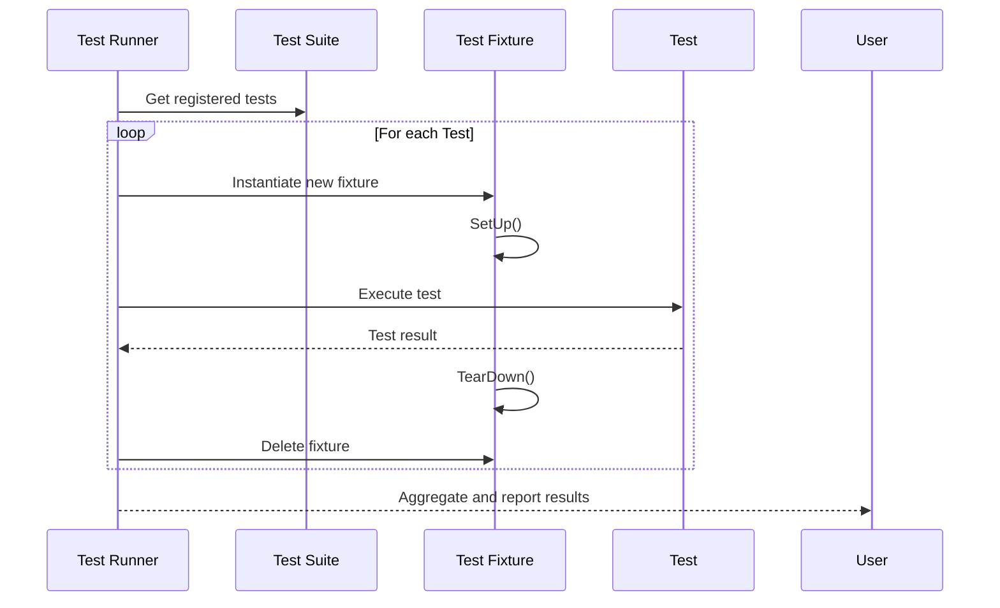
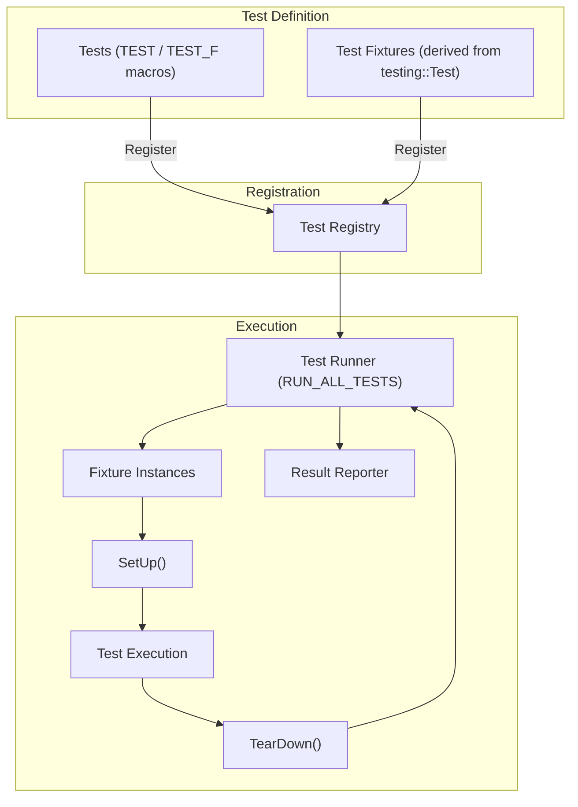

# Architecture Overview

Explore the core architecture of GoogleTest and GoogleMock, focusing on test lifecycle management, component boundaries, and the relationship between tests, test fixtures, and the runner. Understand how tests are automatically registered and executed, and how GoogleTest leverages the xUnit model to support flexible and maintainable test suites.

---

## Introduction to GoogleTest Architecture

GoogleTest is designed around the principles of the xUnit testing architecture, which promotes clearly organized, independent, and repeatable tests. Its architecture facilitates the automatic registration, discovery, execution, and reporting of tests in a streamlined and extensible manner.

This page explains how the core components of GoogleTest interact to manage the lifecycle of tests, including how tests, test fixtures, and the test runner collaborate seamlessly.

## Core Components and Their Responsibilities

### 1. Test

A **Test** is an individual unit of verification meant to check a specific aspect or behavior of the code under test. In GoogleTest, tests are defined as functions (using `TEST()` macros) or methods in test fixture classes (`TEST_F()` macros).

- Each test runs independently with its own fresh instance of the test fixture (when applicable).
- GoogleTest automatically registers these test units without requiring the developer to manually catalogue them.

### 2. Test Fixture

A **Test Fixture** is a class derived from `testing::Test` that provides a shared setup and teardown environment for a group of related tests. It enables:

- Reuse of code for initializing common objects across different tests.
- Isolation by creating a new fixture instance for each test, ensuring tests do not affect each other.

Example test fixture setup using `SetUp()` and `TearDown()` methods defines pre- and post-conditions for each test.

### 3. Test Suite

Previously called "Test Case," a **Test Suite** is a collection of logically related tests that share a common fixture (optional).

- Tests are grouped by naming their containing test suite in the `TEST()` macro, e.g., `TEST(FactorialTest, HandlesZeroInput)`.

### 4. Test Runner

The **Test Runner** coordinates the entire testing process:

- It discovers all registered tests automatically.
- It constructs test fixture instances.
- It manages the test execution lifecycle, calling setup, running the test, and teardown in sequence.
- It collates and reports test results.

The main entry point `RUN_ALL_TESTS()` initiates this operation, running all tests across all suites.

---

## How Tests Are Registered and Executed

GoogleTest leverages static initialization and registration of tests so that when a test binary is launched, all tests are already known to the framework.

1. **Registration:** When developers use `TEST()` or `TEST_F()` macros, GoogleTest internally registers the test functions with a central registry.

2. **Discovery:** Upon invocation of the test runner (`RUN_ALL_TESTS()`), GoogleTest queries the registry to obtain the list of all available tests.

3. **Execution:** For each test:
    - GoogleTest creates a new test fixture object (if applicable).
    - Calls the `SetUp()` method to prepare the environment.
    - Runs the test function / method.
    - Calls the `TearDown()` method for cleanup.
    - Deletes the fixture instance.

4. **Reporting:** The runner collects success/failure status and details message for each test.

---

## Lifecycle Flow of a Single Test

This sequence highlights the isolation of tests and guarantees repeatability by recreating the fixture for each test.

---

## Relation to the xUnit Model

GoogleTest follows the proven [xUnit architecture model](https://en.wikipedia.org/wiki/XUnit) familiar from frameworks like JUnit and NUnit, which helps:

- Standardize test definition and organization.
- Provide clear fixtures for sharing setup logic.
- Facilitate writing independent and isolated tests.
- Structure test reporting and execution consistently.

By following this model, GoogleTest enables users to adopt it quickly, reuse established patterns, and leverage familiar concepts for effective testing.

---

## Example Use Case: Testing a Queue Class

Imagine you want to test a FIFO queue class. You write a test fixture `QueueTest` that populates several queues with different initial states. Using `TEST_F()`, you write multiple tests:

- Some tests verify behavior on empty queues.
- Others verify dequeue operation correctness.

GoogleTest automatically runs each test:

- It creates a fresh `QueueTest` object.
- Calls `SetUp()` (or the constructor) to initialize queue states.
- Executes the specific test method.
- Calls `TearDown()` (or destructor).

If one test fails, GoogleTest provides detailed diagnostics, and you can run that test in isolation for quick debugging.

---

## Test Registration Under the Hood

GoogleTest uses static global instances and macros to register tests automatically, avoiding the need for users to list test cases manually. This means:

- All tests are discovered without additional code.
- Running only a subset of tests or filtering is supported via command-line flags.

This automation frees users from housekeeping chores, letting them focus on writing and maintaining tests.

---

## Supporting Test Suites with Fixtures and Tests

GoogleTest groups tests in test suites, which are collections of related test functions or fixture-based tests:

- The test suite name is the first argument in `TEST()` or the fixture class name in `TEST_F()`.
- Tests in the same suite can share data and helper functions via fixtures.
- Suites improve organization, report grouping, and filtering capabilities.

---

## Integration with GoogleMock

GoogleMock extends GoogleTest by enabling the creation and use of mock objects within tests. The architecture links:

- Mock classes that simulate dependencies.
- Expectations and matchers that validate interactions.
- Seamless composition into test fixtures and test cases.

GoogleMock relies on GoogleTest’s core test lifecycle management, and integrated build and invocation patterns.

---

## Tips and Best Practices

- Define test suites to logically organize related tests.
- Use test fixtures to share setup for common objects.
- Prefer isolated tests for easier debugging and maintenance.
- Let GoogleTest manage test registration; declare tests as `TEST()` and `TEST_F()`.
- Use the built-in runner and `RUN_ALL_TESTS()` entry point for reliable execution.

---

## Troubleshooting Common Issues

- **Duplicate test names:** Ensure unique test suite and test names within a binary.
- **Mixing `TEST` and `TEST_F` incorrectly:** Remember that `TEST_F` requires a previously defined fixture class.
- **Ignoring `RUN_ALL_TESTS()` return value:** Always return it in `main()`.
- **Fixture state shared across tests:** Avoid shared mutable state; each test gets a fresh fixture.

For deeper troubleshooting, consult the [GoogleTest Primer](primer.md) and [Test Discovery and Execution Model](test-discovery-execution.md) documentation.

---

## Summary Diagram: GoogleTest Architecture Overview

This model shows the flow from test definition through registration to execution and reporting.

---

For more detailed technical guidance, visit the [GoogleTest Primer](primer.md) and explore the GoogleMock documentation for mocking integration.

---

<Info>
This overview focuses exclusively on the architecture of GoogleTest and GoogleMock's test lifecycle and component relationships; for detailed usage and API references, consult respective guides and references.
</Info>
