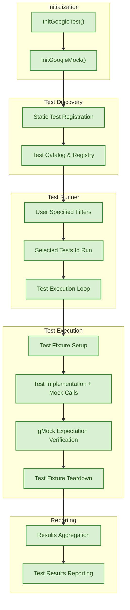

# GoogleTest & GoogleMock Architecture

GoogleTest and GoogleMock form a cohesive C++ testing framework and mocking library designed to simplify test creation, execution, and verification. This page provides an overview of the architecture of these tools, focusing specifically on the test runner, discovery mechanisms, and the interaction of core components that unify the execution flow of both GoogleTest and GoogleMock.

---

## Architecture Overview

At its core, GoogleTest operates as a sophisticated test execution and management system. It initializes the test environment, discovers all tests available in your codebase, executes them according to user specifications, and reports results clearly and reliably. GoogleMock extends GoogleTest by integrating mocking capabilities into this workflow, allowing for detailed verification of object interactions via mock objects.

### Core Components and Their Roles

- **Test Runner:** The executable that orchestrates the entire testing process. It handles initilization, triggers test discovery, manages execution order, and finalizes reporting.

- **Test Discovery:** GoogleTest automatically discovers all test cases and test fixtures in the linked test binaries. It identifies these using static registration mechanisms to gather all defined tests before execution.

- **Test Execution Management:** Once discovery is complete, the runner begins sequential execution of each test, managing setup, teardown, assertion validation, and failure reporting.

- **GoogleMock Integration:** GoogleMock hooks into the test runner, overlaying mock object lifecycle management and expectation verification within the test execution process, thus providing seamless interaction validation alongside test assertions.

### Initialization Flow

When a GoogleTest/GoogleMock test binary launches, the following sequence unfolds:

1. **Initialization:** The test framework initializes globally via `InitGoogleTest()` and `InitGoogleMock()`. This sets up internal registries and configures any command-line flags.

2. **Test Registration:** All defined tests are statically registered before `main()` runs, allowing the framework to collect all tests into an internal catalog.

3. **Test Discovery:** The runner queries the internal catalog to build a list of tests to execute, applying any user filters or sharding options.

4. **Test Execution:** Tests run one-by-one, encompassing fixture setup, test body execution (including mock interactions), and fixture teardown.

5. **Verification:** GoogleMock verifies that all expectations on mock objects have been met at both the individual test and global teardown stages.

6. **Reporting:** The runner outputs detailed results, including pass/fail status, failure messages, and summary stats.

### Unified Workflow Supporting GoogleTest & GoogleMock

The architecture ensures that both GoogleTest and GoogleMock work in harmony without the user needing to separately manage them:

- Mock object creation and expectation setting occur within test bodies.
- The test runner automatically ensures expectation verification during teardown.
- GoogleMock's internal components register with GoogleTest's lifecycle, integrating failure reporting and result aggregation.

This unified flow allows test developers to focus purely on test logic and verification rather than on framework internals or execution mechanics.

---

## Test Runner Architecture

The test runner is the main executable interface of GoogleTest. Users typically invoke it by building a test executable that links GoogleTest and/or GoogleMock libraries.

- It begins by invoking initialization routines that prepare GoogleTest and GoogleMock environments.
- Using internal registries, it enumerates all test cases and suites.
- It processes flags such as filter expressions and repetition counts to determine test execution scope.
- Each test is executed in isolation, invoking associated fixtures and mocks.
- Results are collected synchronously, enabling immediate failure reporting when assertions or mock expectations fail.

## Test Discovery Mechanisms

GoogleTest uses static registries implemented via linker tricks that collect all test definitions across the codebase into a centralized repository.

- Test cases and fixtures are registered at static initialization time.
- The runner accesses this repository to detect all tests before any test execution begins.
- This architecture eliminates the need for manual test lists or configuration files.

This mechanism ensures that all tests defined with macros like `TEST()` and `TEST_F()` are available for execution automatically.

## GoogleMock Integration Points

- Mock class definitions using macros like `MOCK_METHOD` register the mock methods alongside GoogleTest’s internal metadata.
- Setting expectations on mock methods using `EXPECT_CALL` adds entries to the mock framework’s internal expectation registry.
- When tests run, hook-ins inside the mock framework automatically monitor calls and verify that expectations are satisfied.
- If violations occur (unexpected calls, unmet expectations), errors are surfaced via GoogleTest's failure reporting mechanism.
- Mock lifecycle events (e.g., verification on destruction) are synchronized within the test life cycle.

---

## Diagram: GoogleTest & GoogleMock System Architecture

---

## Practical Insights

- The unified architecture allows tests to seamlessly mix GoogleTest assertions and GoogleMock expectations.
- Test discovery requires no manual configuration, enabling rapid test iteration.
- Mock expectations are verified automatically during the teardown phase of tests, ensuring precise validation without additional coding.
- Developers are freed from managing lifecycle intricacies between tests and mocks.
- The test runner supports filtering and sequencing, facilitating flexible test execution strategies including partial runs and ordered sequences.

## Troubleshooting Common Scenarios

- **Uninitialized GoogleMock**: Ensure `InitGoogleMock()` is called during initialization to properly link mocking into the test lifecycle.
- **Missing Test Discovery**: Verify that tests are defined using GoogleTest macros so they register properly.
- **Unexpected Mock Failures**: Inspect mock expectations and verify the order and argument matchers.
- **Mock Leak Warnings**: Use `Mock::AllowLeak()` if intentional; otherwise ensure mock objects are destructed to trigger verification.

---

By understanding the architecture outlined above, users can leverage GoogleTest and GoogleMock to build robust, maintainable, and efficient C++ test suites that encompass both state verification and interaction-based testing with ease.

---

# References and Further Reading

- [GoogleTest Architecture Overview](../architecture-features-integration/architecture-overview)
- [gMock Cookbook — Practical Mocking Recipes](../gmock_cook_book)
- [GoogleMock README](../../../googlemock/README.md)
- [Mocking Reference](../reference/mocking.md)
- [Managing Mock Strictness](../../guides/mocking-advanced-testing/strictness-niceness.mdx)
- [Setting Up Your First Test](../../guides/getting-started/setup-first-test.mdx)
