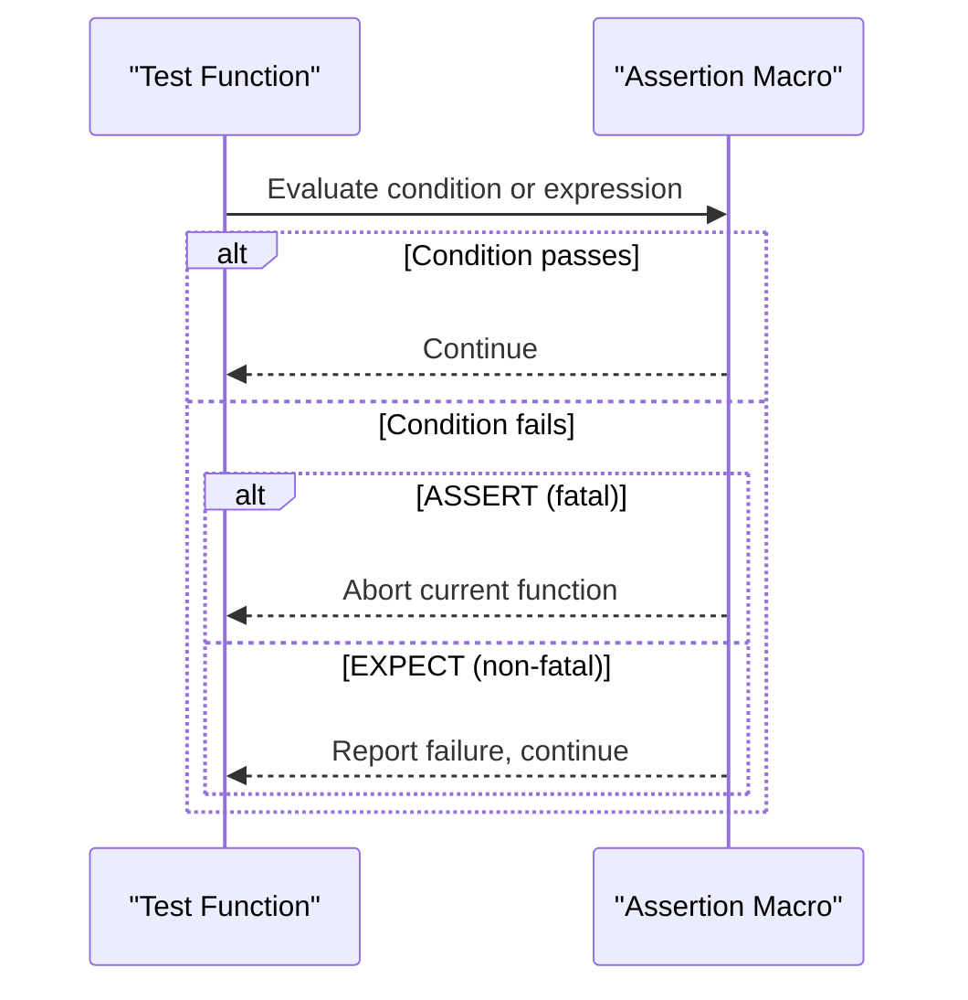

# Assertion Model & Test Failures

Understand the rich assertion ecosystem in GoogleTest, including fatal, non-fatal, and user-defined assertions, and how they impact test outcomes. This guide walks you through how failures are reported, managed, and configured across different workflows. It covers death tests and available output formats to provide clarity on interpreting and controlling test results.

---

## 1. Introduction to GoogleTest Assertions

Assertions are the core mechanism in GoogleTest to verify program correctness during testing. They come in various forms that differ in severity and behavior upon failure. Understanding these different kinds is vital to write effective and maintainable tests.

### 1.1 Fatal vs. Non-Fatal Assertions

- **Fatal Assertions (`ASSERT_*`)**
  - Cause the current function to abort immediately if the assertion fails.
  - Must be used in functions that return `void`.
  - Ideal for conditions that must halt further test execution to avoid invalid state or undefined behavior.

- **Non-Fatal Assertions (`EXPECT_*`)**
  - Report failure but allow the current function to continue running.
  - Useful for verifying multiple related conditions in a single test.

> **Tip:** Use fatal assertions to prevent cascading errors in a test, and non-fatal assertions when you want to collect as much failure information as possible.

### 1.2 User-Defined Assertions

GoogleTest supports user-defined assertions that return a special `AssertionResult`, allowing for richer failure messages.

Example:

```cpp
testing::AssertionResult IsEven(int n) {
  if ((n % 2) == 0)
    return testing::AssertionSuccess();
  else
    return testing::AssertionFailure() << n << " is odd";
}
```

This detailed feedback helps when `EXPECT_TRUE(IsEven(value))` fails, providing custom success and failure descriptions.

---

## 2. Assertion Macros Overview

GoogleTest provides a wide range of assertion macros to cover most testing needs.

### 2.1 Basic Boolean Assertions

- `EXPECT_TRUE(condition)` / `ASSERT_TRUE(condition)` verifies condition is true
- `EXPECT_FALSE(condition)` / `ASSERT_FALSE(condition)` verifies condition is false

### 2.2 Binary Comparison Assertions

Verify relations between two values using:

- `EXPECT_EQ(val1, val2)` / `ASSERT_EQ(val1, val2)` for equality
- `EXPECT_NE(val1, val2)` / `ASSERT_NE(val1, val2)` for inequality
- `EXPECT_LT(val1, val2)` / `ASSERT_LT(val1, val2)` for less-than
- `EXPECT_LE(val1, val2)` / `ASSERT_LE(val1, val2)` for less-than-or-equal
- `EXPECT_GT(val1, val2)` / `ASSERT_GT(val1, val2)` for greater-than
- `EXPECT_GE(val1, val2)` / `ASSERT_GE(val1, val2)` for greater-than-or-equal

**Caveat:** When comparing C strings (e.g., `const char*`), use `EXPECT_STREQ` and related string assertions instead, to compare contents and not pointer addresses.

### 2.3 String Assertions

For C strings and wide strings:

- `EXPECT_STREQ(str1, str2)` / `ASSERT_STREQ` asserts strings have the same content
- `EXPECT_STRNE(str1, str2)` / `ASSERT_STRNE` asserts strings have different content
- `EXPECT_STRCASEEQ(str1, str2)` / `ASSERT_STRCASEEQ` ignores case
- `EXPECT_STRCASENE(str1, str2)` / `ASSERT_STRCASENE` asserts strings differ ignoring case

### 2.4 Floating-Point Comparison

Direct equality on floating-points is often inappropriate due to rounding errors. Use:

- `EXPECT_FLOAT_EQ(val1, val2)` / `ASSERT_FLOAT_EQ(val1, val2)` for floats within 4 ULPs
- `EXPECT_DOUBLE_EQ(val1, val2)` / `ASSERT_DOUBLE_EQ(val1, val2)` for doubles within 4 ULPs
- `EXPECT_NEAR(val1, val2, abs_error)` / `ASSERT_NEAR(val1, val2, abs_error)` asserts difference within absolute error

### 2.5 Predicate Assertions

Verify conditions with custom predicates that can print detailed messages:

- `EXPECT_PRED1(pred, val1)`, ..., `EXPECT_PRED5(pred, val1, ..., val5)`
- Corresponding `ASSERT_PRED*` variants

Also, predicate format assertions:

- `EXPECT_PRED_FORMAT*` macros allow full customization of the failure message by implementing predicate-formatters.

Example from [Advanced Topics](../advanced.md):

```cpp
// Predicate formatter example
testing::AssertionResult AssertMutuallyPrime(const char* m_expr,
                                             const char* n_expr,
                                             int m, int n) {
  if (MutuallyPrime(m, n)) return testing::AssertionSuccess();
  return testing::AssertionFailure() << m_expr << " and " << n_expr
      << " (" << m << " and " << n << ") are not mutually prime.";
}
```

### 2.6 Explicit Success and Failure

- `SUCCEED()` generates a non-failure success assertion -- useful for documentation
- `FAIL()` generates an immediate fatal failure (terminates the current function)
- `ADD_FAILURE()` generates a non-fatal failure

---

## 3. Understanding Assertion Failures and Test Behavior

### 3.1 Failure Types and Their Impact

- **Fatal Failure:** Aborts the current function immediately. Test is failed.
- **Non-Fatal Failure:** Records test failure but continues execution.

### 3.2 Propagation of Fatal Failures

Fatal failures only abort the function containing the assertion. The test itself continues unless the fatal assertion occurs in the test body.

> **Tip:** To stop the entire test on failure inside a helper function, use `ASSERT_NO_FATAL_FAILURE()` in the caller or convert fatal failures to exceptions (if enabled).

### 3.3 Skipping Tests

Use `GTEST_SKIP()` to skip tests at runtime, useful for conditional test execution based on the environment or runtime state.

### 3.4 Adding Traces

Use `SCOPED_TRACE()` to add contextual information that propagates through nested calls, aiding in locating failure origins especially within loops or shared helpers.

---

## 4. Death Tests

Death tests verify that a piece of code terminates the process in an expected manner.

### 4.1 Writing Death Tests

- Use macros like `EXPECT_DEATH(statement, regex)`, `ASSERT_DEATH`, `EXPECT_EXIT`, etc.
- The signature verifies:
  1. The statement causes termination (not throwing exceptions).
  2. Exit status meets the matcher/predicate supplied.
  3. Output on `stderr` matches the regex.

Example:

```cpp
EXPECT_DEATH({ Foo(42); }, "Error on line .* of Foo()");
EXPECT_EXIT(NormalExit(), testing::ExitedWithCode(0), "Success");
```

### 4.2 Important Notes

- Tests with mocks that exit must allow mocks to leak (`Mock::AllowLeak`) to prevent false leak failures.
- Death tests should be named to end with `DeathTest` to control execution order and thread safety.
- Setting `GTEST_FLAG(death_test_style)` allows choosing between `fast` and `threadsafe` modes.

---

## 5. Assertion Output Formats

GoogleTest supports outputting test results in multiple formats for integration with other tools:

### 5.1 Text Output

Plain human-readable console output.

### 5.2 XML Output

- Controlled by `--gtest_output=xml[:file_path]`
- Provides structured reporting of suites, tests, failures, and timing.
- Useful for CI/CD systems.

### 5.3 JSON Output

- Controlled by `--gtest_output=json[:file_path]`
- Provides a structured, schema-validated JSON document for detailed reporting.

---

## 6. Troubleshooting Common Assertion Failures

### 6.1 Failure Messages and Diagnostics

- Failure messages contain:
  - Actual and expected values
  - Location of the assertion
  - Sometimes stack trace (depending on verbosity)
- Use `--gmock_verbose=info` to gain insight into matching expectations and call resolutions.

### 6.2 Common Pitfalls

- Using `EXPECT_EQ` for C strings instead of `EXPECT_STREQ`
- Overly tight expectations causing brittle tests
- Forgetting to specify `EXPECT_CALL` causing uninteresting call warnings
- Mixing fatal and non-fatal failures improperly

### 6.3 Tips for Success

- Write clear, minimal expectations
- Use matchers to relax argument matching, e.g. `_` to match anything
- Use `NiceMock` or `StrictMock` wrappers to control mock warning and failure behaviors
- Utilize `SCOPED_TRACE` for better error localization
- Verify and clear mocks explicitly if destruction timing is uncertain

---

## 7. Best Practices for Using Assertions

- Prefer `EXPECT_*` unless the rest of the test cannot continue after failure
- Use user-defined predicates for complex conditions
- Use `EXPECT_THAT` with matchers for expressive, readable assertions
- Avoid over-specifying expectations to keep tests resilient
- Separate verification of call counts and argument correctness when using mocks
- Use `ASSERT_DEATH` properly to test termination scenarios

## 8. Related Concepts and Next Steps

- Mocking and expectations are tightly linked to assertions; consult [Mocking Fundamentals](/api-reference/core-apis/mocking-core-api) and [gMock Cookbook](docs/gmock_cook_book.md) for advanced mock assertion strategies.
- Learn about parameterized assertions and typed tests for scalable test patterns.
- Understand test output, including XML and JSON formats, for integrating with CI tools.

---

## 9. Visualizing Assertion Flow (Simplified)



---

## References

- [GoogleTest Assertions Reference](docs/reference/assertions.md)
- [GoogleTest Advanced Topics](docs/advanced.md#assertion-placement)
- [gMock Cookbook on Assertions](docs/gmock_cook_book.md#SettingExpectations)
- [Death Tests](docs/advanced.md#death-tests)


---

For practical examples and best practices, explore the related guides and reference sections linked above. Mastering assertions is fundamental to effective and reliable testing with GoogleTest.