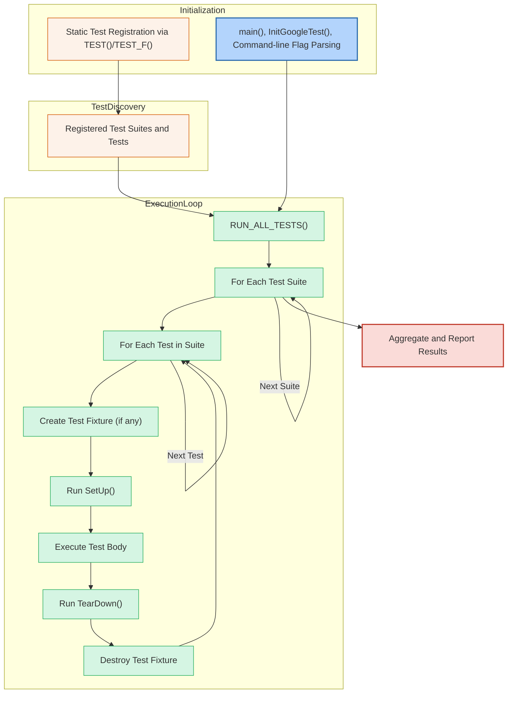

# Test Discovery and Execution Model

GoogleTest has been meticulously designed to automate the entire lifecycle of discovering, organizing, and executing tests. This allows developers to focus on writing meaningful tests without worrying about manually managing which tests to run or in what order.

This guide delves into how GoogleTest handles test discovery, the structure of test suites, how tests are registered internally, and how the main entrypoint and test runner orchestrate the execution—including parallel execution and maintaining consistent test ordering.

---

## Understanding Test Discovery in GoogleTest

At its core, GoogleTest automatically identifies all defined tests across your codebase at runtime without requiring explicit enumeration. When you define tests using the `TEST()` or `TEST_F()` macros, each test registers itself with GoogleTest’s internal registry.

This automatic registration is the cornerstone of GoogleTest’s instant test discovery, enabling `RUN_ALL_TESTS()` to execute every available test seamlessly.

### How Test Registration Works

- When you write a test using `TEST(TestSuiteName, TestName)`, GoogleTest expands this into a static object that registers the test with the framework before `main()` runs.
- This registration happens during static initialization in your program, meaning tests are known and listed even before entering `main()`.

> **Tip:** Because GoogleTest relies on static initialization, all test definitions must be linked into the binary you run. Unlinked test files simply won’t appear.

### Test Suites and Their Structure

Tests are grouped within **test suites** (also historically called test cases). These suites serve as logical containers for related tests:

- The first argument to the `TEST()` macro defines the *test suite name*.
- Tests within a suite share naming context but each test name must be unique within that suite.
- Test fixtures (`TEST_F`) extend suites by allowing shared setup and teardown for multiple related tests.

Grouping tests into suites improves organization and enables running subsets of tests conveniently.

---

## The Execution Flow: From Main to Test Runs

How GoogleTest initiates and runs tests depends on the entrypoint setup in your test program:

### The Main Entrypoint

- Most users simply link with `gtest_main`, which provides a default implementation of `main()`.
- This `main()` initializes GoogleTest by calling `testing::InitGoogleTest()`, which parses command-line flags used to configure test execution.
- Once initialized, `main()` calls `RUN_ALL_TESTS()`, triggering the discovery and running of all registered tests.

```cpp
int main(int argc, char **argv) {
  testing::InitGoogleTest(&argc, argv);
  return RUN_ALL_TESTS();
}
```

- For advanced scenarios where you need custom initialization, you can provide your own `main()`, but you must still call `InitGoogleTest()` before `RUN_ALL_TESTS()`.

> **Warning:** Always return the result of `RUN_ALL_TESTS()` from `main()`. GoogleTest uses the return code to signal success (`0`) or failure (`1`), which is vital for integration with CI systems.

### Running Tests

When `RUN_ALL_TESTS()` begins:

1. It queries the internal registry for the full list of test suites and their tests.
2. Runs each test suite in order, and then runs each test within the suite in the order of registration.
3. For each individual test:
   - GoogleTest creates a fresh test fixture instance (if applicable).
   - Calls `SetUp()`, runs the test body, then calls `TearDown()`.
4. Continues this process for every test, even when some tests fail (optional failure modes exist).
5. Reports aggregate results once complete.

---

## Test Ordering and Parallelization

### Consistent Test Ordering

GoogleTest executes tests in the deterministic order of their static registration, which matches the order of your source files and test macro definitions.

- This consistent ordering ensures reproducibility when debugging intermittent issues.
- Tests inside the same suite run sequentially in the order defined.
- Suites themselves are run sequentially.

### Parallelizing Test Runs

GoogleTest can be integrated with tools or build systems (e.g., Bazel, CTest) to run tests in parallel by splitting test binaries.

- GoogleTest itself does not internally parallelize tests within a single binary.
- Users typically run multiple test binaries concurrently or invoke tests filtered by suite/name to parallelize test execution effectively.

> **Best Practice:** Structure your test suites to support isolated, fast-running tests for smooth parallelization strategies.

---

## Special Cases: Platform-Specific Entrypoints

GoogleTest recognizes that some embedded platforms or environments have different program entry points.

For example, on Arduino-like platforms:

- The entry points are `setup()` and `loop()` instead of `main()`.
- GoogleTest adapts by initializing in `setup()` and running tests inside `loop()`.

For platforms like QuRT where argc/argv may not be available, GoogleTest provides an alternative `main()` signature.

Such platform-specific considerations enable GoogleTest’s portability across various environments.

---

## Visualizing the Test Discovery and Execution Flow



---

## Troubleshooting and Best Practices

### Common Issues

- **Tests Not Running:** This is often due to source files containing tests not being linked into your test binary.

- **Multiple `main` Definitions:** Avoid linking both your own `main()` and GoogleTest’s `gtest_main`.

- **Ignoring Return Value of `RUN_ALL_TESTS()`:** This breaks CI detection of test failures.


### Best Practices for Test Discovery and Execution

- Organize tests logically within test suites for easier filtering and management.
- Use `TEST_F` fixtures when tests share common setup to reduce boilerplate and improve clarity.
- For large test suites, consider splitting tests across multiple binaries to enable parallel execution.
- Use command-line flags parsed by `InitGoogleTest()` to filter tests and control execution behavior.

---

## Additional Resources

- [GoogleTest Primer](https://github.com/google/googletest/blob/main/docs/primer.md) – a complete beginner-friendly introduction including tests and fixtures.
- [System Architecture Overview](/overview/architecture-and-integration/system-architecture) – for a deeper understanding of how tests interact with the GoogleTest internals.
- [Writing Your First Test Case](/guides/core-workflows/writing-tests) – start hands-on with creating and running tests.
- [Continuous Integration and Test Automation](/guides/integration-and-scenarios/ci-cd-practices) – how to integrate GoogleTest into your automated workflows.

---

<Info>
GoogleTest ensures that test discovery is fully automatic and driven by test registration during static initialization, freeing you from manual bookkeeping. The `main()` function acts as the launchpad, initializing the framework, processing flags, and running tests in a way that guarantees stable, consistent results.
</Info>

<Check>
To successfully run your test suite:
- Link your test object files correctly.
- Use either `gtest_main` or a well-defined custom `main()`.
- Always check `RUN_ALL_TESTS()` return code.
- Structure tests in well-named suites and fixtures.
</Check>
