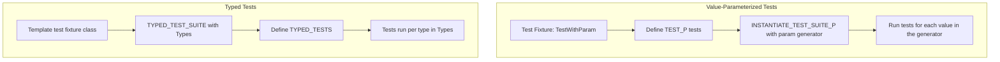

# Parameterized and Typed Tests

GoogleTest empowers C++ developers to avoid repetitive tests by running the **same test logic** across multiple input values or types. This document unveils how **value-parameterized tests** and **typed tests** enhance **test coverage** and **maintainability** through powerful parameterization patterns. You will learn how to create scalable, DRY (Don't Repeat Yourself) test suites that adapt cleanly to varying inputs and type contexts.

---

## Value-Parameterized Tests: Testing with Multiple Input Values

Imagine you have a function or a class method that needs verification across many input values — writing separate tests for each is tedious and error-prone. Value-parameterized tests let you **define the test once** and **run it with different parameter values** automatically.

### How It Works

1. **Define a Test Fixture Class** derived from `::testing::TestWithParam<T>`, where `T` is the **type of the parameter** your test will receive.
2. **Write test cases using `TEST_P` macro** inside this fixture class. Access the current parameter using `GetParam()`.
3. **Instantiate the test suite** by enumerating parameter values using `INSTANTIATE_TEST_SUITE_P`, supplying a unique instantiation name and a parameter generator.

### Example

```cpp
class FooTest : public ::testing::TestWithParam<int> {
  // Setup your fixture here if needed
};

TEST_P(FooTest, IsEven) {
  int value = GetParam();
  EXPECT_EQ(value % 2, 0);  // Assert that value is even
}

INSTANTIATE_TEST_SUITE_P(EvenNumbers, FooTest, ::testing::Values(2, 4, 6, 8));
```

This will run `FooTest.IsEven` test 4 times with the values 2, 4, 6, and 8.

### Parameter Generators

GoogleTest provides several **built-in generators** to cover various value sequences: 

| Generator              | Description                               |
|-----------------------|-------------------------------------------|
| `Range(begin, end[, step])`      | Yields values from `begin` (inclusive) to `end` (exclusive) stepping by `step` (default 1) |
| `Values(v1, v2, ..., vN)`        | Yields explicitly listed values                        |
| `ValuesIn(container)`             | Yields values from a container or iterator range      |
| `Bool()`                        | Yields `false`, `true`                             |
| `Combine(g1, g2, …, gN)`         | Cartesian product of multiple generators, yielding tuples |

You can **combine** generators to test multiple parameters and complex cases.

### Example: Using Combine

```cpp
class AnimalTest : public ::testing::TestWithParam<std::tuple<std::string, int>> {};

TEST_P(AnimalTest, CheckAnimalAge) {
  auto [animal, age] = GetParam();
  EXPECT_GE(age, 0);
}

INSTANTIATE_TEST_SUITE_P(
    VariousAnimals, AnimalTest,
    ::testing::Combine(
        ::testing::Values("cat", "dog"),
        ::testing::Range(0, 10)));
```

This runs tests with every combination of "cat" or "dog" and ages `0` through `9`.

### Custom Test Name Generators

By default, GoogleTest enumerates parameterized test instances with indices (`/0`, `/1`, etc.). You can provide a custom function to **generate descriptive test names** based on parameters,

```cpp
INSTANTIATE_TEST_SUITE_P(MyInst, FooTest, ::testing::Values(10, 20, 30),
                         [](const ::testing::TestParamInfo<int>& info) {
                            return "Param_" + std::to_string(info.param);
                         });
```

This aids readability and debugging in larger suites.

---

## Typed Tests: Testing Multiple Types with the Same Logic

Some functionality depends on *types* rather than just values—e.g., templates, or generic classes. Typed tests allow running the identical test logic across a list of types in a declarative and type-safe way.

### How Typed Tests Work

1. **Create a template test fixture class**, parameterized by a *type*.
2. **Register a list of types** with the fixture using `TYPED_TEST_SUITE`.
3. **Define tests using the `TYPED_TEST` macro**, which uses a special type alias `TypeParam` inside to refer to the current tested type.

### Example

```cpp
template <typename T>
class StackTest : public ::testing::Test {
 public:
  void SetUp() override { stack_ = std::stack<T>(); }
  std::stack<T> stack_;
};

using MyTypes = ::testing::Types<int, double, std::string>;
TYPED_TEST_SUITE(StackTest, MyTypes);

TYPED_TEST(StackTest, IsEmptyInitially) {
  EXPECT_TRUE(this->stack_.empty());
}

TYPED_TEST(StackTest, CanPushAndPop) {
  this->stack_.push(TypeParam{});
  EXPECT_FALSE(this->stack_.empty());
  this->stack_.pop();
  EXPECT_TRUE(this->stack_.empty());
}
```

Each typed test runs once per type in `MyTypes`.

### Customizing Type Names

You can supply a custom *name generator* class to `TYPED_TEST_SUITE` which defines a static `GetName(int)` function template to generate readable test suite names for each type:

```cpp
class NameGenerator {
 public:
  template <typename T>
  static std::string GetName(int) {
    if constexpr (std::is_same_v<T, int>) return "int";
    if constexpr (std::is_same_v<T, double>) return "double";
    if constexpr (std::is_same_v<T, std::string>) return "string";
    return "unknown";
  }
};

TYPED_TEST_SUITE(StackTest, MyTypes, NameGenerator);
```

### Type-Parameterized Tests: Advanced

For situations requiring more flexible or reusable type-parameterized test suites, GoogleTest supports:

- `TYPED_TEST_SUITE_P` and `TYPED_TEST_P` for declaring tests without listing types immediately.
- `REGISTER_TYPED_TEST_SUITE_P` to register test names.
- `INSTANTIATE_TYPED_TEST_SUITE_P` to instantiate suites with actual types later.

This advanced pattern supports shared test definitions across different type sets.

---

## Best Practices

- **Prefer Value-Parameterized Tests** when different input data drive the same logic.
- **Use Typed Tests** to verify template or generic code correctness across type instantiations.
- **Combine parameter generators** for multi-dimensional coverage.
- **Use descriptive instantiation names** to ease debugging and test discovery.
- When writing fixtures, provide `SetUpTestSuite` or `SetUp` methods to prepare state if needed.
- Avoid overly complex parameters that obscure test intent.

<Check>
Remember: Proper parameterized tests reduce code duplication, improve test clarity, and reveal subtle bugs across all input variations efficiently.
</Check>

---

## Troubleshooting

**Problem:** Tests don't appear for expected parameters
- Verify that `INSTANTIATE_TEST_SUITE_P` is called for each `TEST_P` fixture.
- Check that parameter generators produce input values matching the parameter type.
- Custom name generators must produce valid C++ test names (alphanumeric + underscore).

**Problem:** Duplicate test names causing conflicts
- Use unique instantiation prefixes.
- Ensure custom name generators yield unique names.

**Problem:** Test instantiations don't run
- Confirm tests are compiled and linked correctly.
- Avoid disabling parameterized tests unintentionally.

---

## Related Resources

- [Value-Parameterized Tests (Advanced User Guide)](../advanced.md#value-parameterized-tests)
- [Typed Tests (Advanced User Guide)](../advanced.md#typed-tests)
- [GoogleTest Samples with Parameterized and Typed Tests](https://github.com/google/googletest/tree/main/googletest/samples)
- [GoogleTest Test Fixtures & Suites API Reference](https://google.github.io/googletest/reference/testing_8h.html)

---

## Summary Diagram


