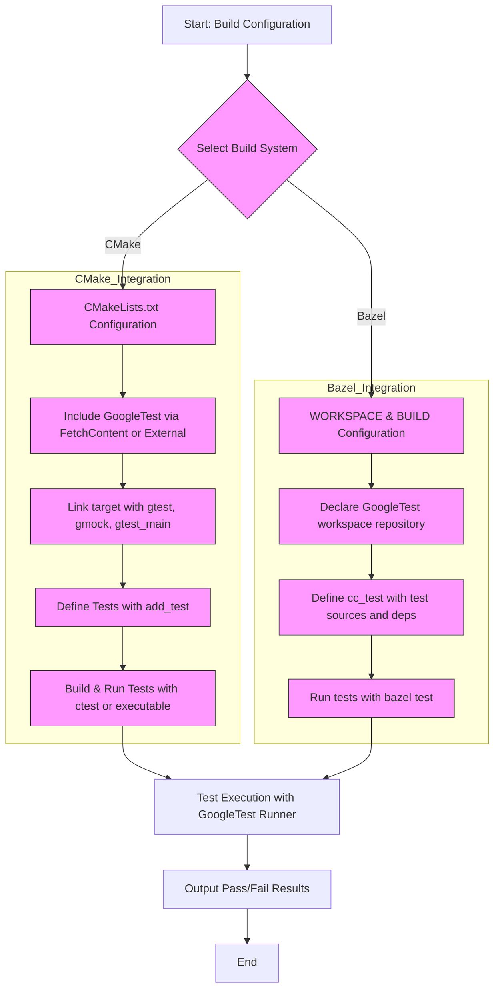

# Build System and Integration Patterns

This guide outlines the primary integration scenarios for linking GoogleTest with C++ projects. It focuses on using popular build systems like CMake and Bazel, detailing the inclusion of essential headers, test runners, and entry points required for seamless integration.

---

## Introduction

Integrating GoogleTest into your C++ project requires configuring your build system to properly locate its headers and libraries, setting up your test binaries with the right dependencies, and invoking test execution appropriately. This guide walks you through the common integration scenarios, emphasizing how to link GoogleTest with C++ projects efficiently using CMake and Bazel.

Whether you are just starting with GoogleTest or aiming to scale your tests in large projects, understanding the integration patterns ensures faster builds, maintainable configuration, and reliable test execution.

## Core Headers and Entry Points

GoogleTest and GoogleMock integration requires including certain headers and arranging your test entry point properly.

- **Headers to Include**:
  - `<gtest/gtest.h>`: Core GoogleTest functionalities including assertions and test fixtures.
  - `<gmock/gmock.h>`: Enables mocking features provided by GoogleMock.

Example Basic Test File Header:

```cpp
#include <gtest/gtest.h>
// Include this if you need mocking features
#include <gmock/gmock.h>
```

- **Main Entry Point**:

  GoogleTest provides a default main function via the `gtest_main` library, which you can link to avoid writing your own main. If custom initialization or setup is needed, you can define your own main:

  ```cpp
  #include <gtest/gtest.h>

  int main(int argc, char** argv) {
      ::testing::InitGoogleTest(&argc, argv);
      return RUN_ALL_TESTS();
  }
  ```

## Integration with CMake

CMake is one of the most popular build systems for C++ projects. GoogleTest supports easy integration via the following patterns.

### FetchContent (Preferred for Modern Projects)

FetchContent allows downloading and building GoogleTest as part of your build process:

```cmake
include(FetchContent)

FetchContent_Declare(
  googletest
  URL https://github.com/google/googletest/archive/refs/tags/release-1.13.0.zip
)

FetchContent_MakeAvailable(googletest)

add_executable(my_tests test_main.cc my_tests.cc)
target_link_libraries(my_tests PRIVATE gtest gtest_main gmock)
```

- The `gtest` and `gmock` targets provide the GoogleTest and GoogleMock libraries.
- `gtest_main` provides the default test executable main function.

### Manual GoogleTest Installation

If you have GoogleTest installed externally (system-wide or via submodules), link your test target as:

```cmake
target_link_libraries(my_tests PRIVATE gtest gtest_main gmock)
```

Make sure to specify include directories if CMake does not automatically detect:

```cmake
target_include_directories(my_tests PRIVATE ${GTEST_INCLUDE_DIRS})
```

### Best Practices for CMake Integration

- Use `gtest_main` to avoid writing a custom main function unless customization is required.
- Add tests with `add_test()` to CTest to enable running tests via `ctest`.

Example:

```cmake
add_test(NAME MyTest COMMAND my_tests)
```

## Integration with Bazel

GoogleTest and GoogleMock have native Bazel support. To integrate:

### Workspace Setup

Declare external repositories in your `WORKSPACE` file:

```python
http_archive(
    name = "com_google_googletest",
    urls = ["https://github.com/google/googletest/archive/release-1.13.0.zip"],
    strip_prefix = "googletest-release-1.13.0",
)
```

### BUILD File Setup

Reference GoogleTest in your `BUILD` files:

```python
cc_test(
    name = "my_tests",
    srcs = ["my_tests.cc"],
    deps = [
        "@com_google_googletest//:gtest",
        "@com_google_googletest//:gmock",
    ],
)
```

- `cc_test` creates an executable and test target.
- Dependencies link GoogleTest and GoogleMock libraries.

### Using Bazel Test Runner

Run your test with Bazel’s built-in test runner:

```bash
bazel test //:my_tests
```

## Test Runners

- **Default GoogleTest Runner**:
  - Invoked via linking with `gtest_main` and/or using Bazel's `cc_test`.
  - Supports command line flags like `--gtest_filter` for selecting tests.

- **Custom Test Runner**:
  - Users can provide their own main function for special initialization.
  - Use `::testing::InitGoogleTest()` and `RUN_ALL_TESTS()` for test execution control.

## Common Pitfalls and Troubleshooting

- **Linking Errors**:
  - Ensure `gtest` and `gmock` (and `gtest_main` if needed) are correctly linked.
  - Verify include directories are correctly set.

- **Missing Tests Executed**:
  - When using Bazel, ensure your `cc_test` rule includes `srcs` with all test files.
  - For CMake, add tests with `add_test()` or ensure test binaries run needed tests.

- **Main Function Conflicts**:
  - Link either your own main or `gtest_main`—do not link both.

- **Multi-threaded Tests on Some Platforms**:
  - GoogleTest supports multi-threaded tests, but some platforms require specific link flags or additional setup.

## Summary Diagram of Integration Flow



## Additional Resources

- [gMock Cookbook](https://google.github.io/googletest/gmock_cook_book.html): Recipes and best practices for using GoogleMock.
- [gMock Cheat Sheet](https://google.github.io/googletest/gmock_cheat_sheet.html): Quick syntax and usage guide.
- [Mocking Reference](https://google.github.io/googletest/reference/mocking.html): Detailed API for mocking methods.
- [CMake FetchContent Documentation](https://cmake.org/cmake/help/latest/module/FetchContent.html): For adding external dependencies.
- [Bazel External Dependencies](https://docs.bazel.build/versions/master/external.html): Managing third-party libraries.

## Practical Tips

- Always link with `gtest_main` when you don't need custom main behavior.
- Group your tests logically and add them to your build system so they can be run automatically.
- Use the verbose flag `--gtest_verbose` to get detailed test output if debugging test failures.
- For large projects, prefer dependency management via FetchContent or Bazel external repositories over manual copying.

## Troubleshooting

<AccordionGroup title="Common Issues and Solutions">
<Accordion title="Linker errors for GoogleTest symbols">
Make sure you link your test target against both `gtest` and `gmock` libraries. For CMake, linking with `gtest_main` also provides the default main function.
</Accordion>
<Accordion title="Tests not running on Bazel">
Verify that your `cc_test` rule in `BUILD` file lists all the test source files in `srcs` and includes the correct dependencies for GoogleTest and GoogleMock.
</Accordion>
<Accordion title="Main function conflicts">
Avoid defining your own `main()` if you link against `gtest_main`. Choose one or the other.
</Accordion>
<Accordion title="Include file not found errors">
Check your project's include paths. When using FetchContent in CMake or external repositories in Bazel, the include directories should be propagated automatically.
</Accordion>
</AccordionGroup>

---

This concludes the overview of build system and integration patterns for GoogleTest in C++ projects.

For detailed step-by-step instructions and examples, refer to the related guides:
- [Integrating with Bazel and CMake](/guides/integration-solutions/build-integration)
- [First Test Workflow and Mocking](/getting-started/first-test-workflow/basic-mocking-intro)
- [Troubleshooting Common Setup Issues](/getting-started/troubleshooting-validation/common-setup-issues)


---

### Code Example: Minimal CMakeLists.txt Snippet

```cmake
cmake_minimum_required(VERSION 3.14)
project(MyTests)

include(FetchContent)
FetchContent_Declare(
  googletest
  URL https://github.com/google/googletest/archive/refs/tags/release-1.13.0.zip
)
FetchContent_MakeAvailable(googletest)

add_executable(my_test test_main.cpp)
target_link_libraries(my_test PRIVATE gtest gtest_main gmock)
add_test(NAME MyTest COMMAND my_test)
```

### Code Example: Minimal Bazel BUILD Snippet

```python
load("@bazel_tools//tools/build_defs/pkg:pkg.bzl", "pkg_binary")

cc_test(
    name = "my_test",
    srcs = ["test_main.cpp"],
    deps = [
        "@com_google_googletest//:gtest",
        "@com_google_googletest//:gmock",
    ],
)
```

---

<Check>
Ensure you set up your build system to include and link GoogleTest before writing and running tests. Refer to the full integration guide for complex build configurations and platform-specific notes.
</Check>
