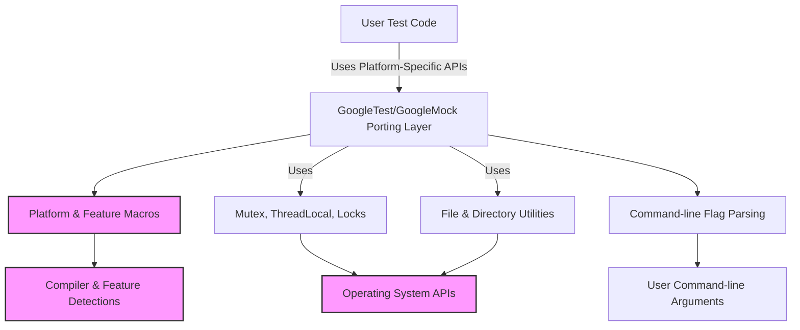

# Portability and Platform Abstractions

GoogleTest and GoogleMock are designed to operate reliably across a wide range of platforms and compilers. This page explains the internal porting layers and abstraction mechanisms that make this possible, detailing how platform differences are detected, accommodated, and leveraged to maintain consistent behavior. It also highlights the configuration options, flags, and platform checks users and integrators should be aware of.

---

## Why Platform Abstractions Matter

Testing frameworks need to be dependable on all supported development and deployment environments. Differences in operating systems, compiler versions, threading models, exception support, file system capabilities, and encoding standards can all impact correctness and stability.

GoogleTest embraces portability as core design:

- **Uniform behavior** across Windows, Linux, macOS, and embedded platforms.
- Seamless operation with various compilers including MSVC, GCC, Clang, IntelLLVM, and others.
- Graceful fallback on unsupported features, e.g., disabling exceptions or threads where absent.


## Overview of the Porting Layer

The portability features reside in header files such as:

- `gtest-port.h`: The foundational portability header for GoogleTest, containing environment detection, platform macro definitions, and utility functions.
- `gtest-port-arch.h`: Focuses on architecture and platform identification macros.
- `gmock-port.h`: Extends GoogleTest's portability with GoogleMock-specific definitions.

These headers define macros that identify the platform and compiler features, enabling conditional compilation and platform-specific optimizations.


### Key Platform Macros

GoogleTest internally defines macros like:

- `GTEST_OS_WINDOWS`, `GTEST_OS_LINUX`, `GTEST_OS_MAC`, etc.
- More specific platform variants like `GTEST_OS_WINDOWS_MINGW`, `GTEST_OS_LINUX_ANDROID`, `GTEST_OS_WINDOWS_DESKTOP`.

These macros are crucial to:

- Enable platform-specific APIs such as Windows kernel handles, POSIX threads.
- Adapt to filesystem APIs and path separators.
- Work around compiler quirks and feature gaps.


### Feature Detection Macros

Besides platform identity, feature availability is captured through macros such as:

- `GTEST_HAS_EXCEPTIONS` — indicates if C++ exceptions are enabled.
- `GTEST_HAS_PTHREAD` — signals availability of POSIX pthreads.
- `GTEST_HAS_RTTI` — indicates if RTTI (Run-Time Type Information) is enabled.
- `GTEST_HAS_STD_WSTRING` — for availability of `std::wstring`.
- `GTEST_HAS_FILE_SYSTEM` — signals if file system operations are supported.
- `GTEST_HAS_STREAM_REDIRECTION` — determines if I/O stream redirection is feasible.


## Internal Utilities for Cross-Platform Compatibility

GoogleTest provides several wrappers and utilities that hide platform-specific details:

- **File and Directory Operations**: Functions like `ChDir()`, `FOpen()`, `Stat()`, `RmDir()` abstract platform differences, especially for Windows vs POSIX systems.
- **Character Handling**: Safe casts for character classification (`IsAlpha()`, `IsSpace()`, etc.) to support platforms with varying `char` signedness.
- **Synchronization Primitives**:
  - `Mutex`, `MutexLock`, and `ThreadLocal` implementing thread safety abstractions on Windows and pthread-based platforms.
  - Dummy implementations exist when threading is unsupported.


## Compiler and C++ Feature Checks

To guarantee compatibility, GoogleTest enforces minimum C++ standards (at least C++17). It detects compiler versions and capabilities:

- Supports MSVC 2015 or newer.
- Detects availability of attributes like `[[nodiscard]]`, `__attribute__((noinline))`, etc.
- Checks for support of `std::string_view`, `std::span`, and three-way comparison.

This detection drives conditional usage of modern language features, improving performance and maintainability without sacrificing backward compatibility.


## Default Settings and Configurations

GoogleTest sets sensible defaults but allows users fine control over behavior via flags and macros:

- `GTEST_HAS_PTHREAD` defaults depending on detected platform.
- `GTEST_HAS_EXCEPTIONS` auto-detected but can be overridden.
- Path separator macros (`GTEST_PATH_SEP_`) adjust for Windows vs UNIX-style paths.

Users can customize some of these settings in their build environment or by providing `custom/gtest-port.h` files if needed.


## GoogleMock-specific Porting Extensions

`gmock-port.h` builds upon GoogleTest's portability facilities:

- Defines and manages GoogleMock-specific command-line flags such as `--gmock_verbose`, `--gmock_catch_leaked_mocks`, and `--gmock_default_mock_behavior`.
- Supports flag parsing and initialization routines via `InitGoogleMock()`.
- Ensures GoogleMock's behaviors align with platform idiosyncrasies and the GoogleTest infrastructure.


## Practical User Considerations

### Using GoogleTest and GoogleMock Across Platforms

Thanks to these abstractions, developers can write tests once and rely on GoogleTest to handle platform differences transparently.

### Configuration Tips

- Always call initialization functions like `InitGoogleTest()` or `InitGoogleMock()` at program startup to enable proper flag parsing and environment setup.
- Be aware that some features like death tests require filesystem support and may not work on embedded or restricted platforms.
- Thread safety depends on platform support; test accordingly.

### Common Pitfalls

- Attempting to use exceptions or RTTI in environments where they are disabled can cause compilation or runtime issues.
- On Windows, path differences may lead to incorrect file references; use provided path macros when possible.


## Illustration: How Portability Layers Work Together



This diagram shows that the user's test code depends on the porting layer, which orchestrates platform and compiler feature detection, provides utility wrappers for OS-specific functions, and manages flag parsing to expose consistent behavior.


## Summary

GoogleTest's portability and platform abstraction layer is a cornerstone enabling it to function seamlessly on a diverse set of environments. By isolating platform-specific details and encapsulating conditional feature use, it ensures developers experience consistent APIs, reliable test behavior, and reduced maintenance overhead.

For contributors and integrators, understanding this layer aids in debugging platform-specific issues and extending support.

---

## Additional Resources

- [System Architecture Overview](/overview/architecture-features-integration/system-architecture-overview): Understand how portability fits into the overall framework.
- [Supported Platforms & Integrations](/overview/architecture-features-integration/supported-platforms-integration): Details on officially supported platforms and integrations.
- [Installation and System Requirements](/getting-started/installation-prerequisites/system-requirements) to ensure your environment meets GoogleTest's needs.
- [Troubleshooting Common Setup Issues](/getting-started/troubleshooting-validation/common-setup-issues) for help with platform-related build or runtime problems.

---

## Practical Tips

- Always ensure your compiler supports at least C++17, as GoogleTest enforces this for portability.
- Use the GoogleTest flag APIs (`GTEST_FLAG_GET` and `GTEST_FLAG_SET`) to interact programmatically with test flags.
- When integrating with new or custom platforms, carefully evaluate whether support macros like `GTEST_HAS_PTHREAD` or `GTEST_HAS_EXCEPTIONS` need to be overridden.

## Troubleshooting

If you face platform-specific issues:

- Verify your compiler and OS macros are correctly detected via verbose build logs.
- Confirm that threading support macros match your environment to avoid subtle concurrency bugs.
- Check for proper initialization through `InitGoogleTest()` and `InitGoogleMock()`, without which flags might not be parsed, leading to unexpected behavior.

---

## Example: Handling GoogleMock Flags on Initialization

GoogleMock provides specific flags for verbosity and mock behavior which are parsed at startup:

```cpp
int main(int argc, char** argv) {
  testing::InitGoogleMock(&argc, argv);  // Parses --gmock_* flags and removes them from argv
  return RUN_ALL_TESTS();
}
```

This ensures that platform-specific command-line argument handling is compatible.

---

The platform and portability layer abstract complexities, letting you focus on writing effective, portable tests with confidence.


<Accordion title="Common Platform Checks and Flag Usage">
GoogleTest defines flags like:
- `GTEST_HAS_PTHREAD` — enables pthread usage.
- `GTEST_HAS_EXCEPTIONS` — controls exception handling behavior.

Understanding these flags can help diagnose compatibility issues.

For example, setting `-DGTEST_HAS_PTHREAD=0` disables pthreads explicitly.
</Accordion>