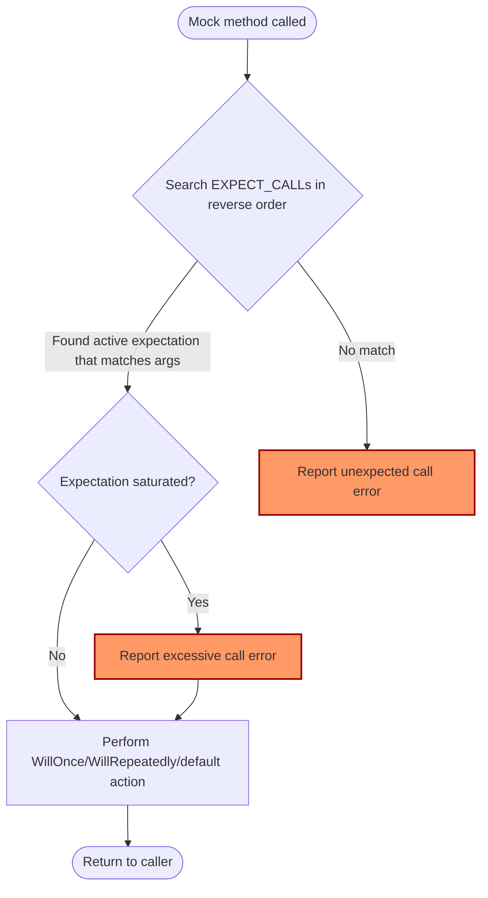

# Mocking: Expectations, Matches, and Cardinalities

Understanding how to precisely specify and verify expected interactions with mock objects is fundamental when using GoogleMock. This guide breaks down the essential concepts of **expectations**, **matchers**, **cardinalities**, and **default actions**, empowering you to create expressive, reliable, and maintainable tests that monitor your code’s dependency interactions.

---

## Setting Expectations with `EXPECT_CALL`

At the heart of mocking lies the ability to state which calls you expect your mock objects to receive. The `EXPECT_CALL` macro lets you define these expectations declaratively, describing:

- Which *mock method* is expected to be called.
- What *arguments* those calls should have.
- How *many times* the call should happen.
- What *behavior* to execute when the call happens.

### Basic Syntax

```cpp
EXPECT_CALL(mock_object, Method(matchers...))
    .Times(cardinality)
    .WillOnce(action)
    .WillRepeatedly(action);
```

- `mock_object`: The instance of your mock class.
- `Method`: The mock method name.
- `matchers...`: Argument expectations, explained below.
- `Times`: How many calls are expected.
- `WillOnce`/`WillRepeatedly`: Specifies the mock method’s behavior when invoked.


### Progressive Specification

Only `EXPECT_CALL` itself is mandatory to start an expectation. Clauses like `.Times()`, `.WillOnce()`, and `.WillRepeatedly()` are optional and build on the expectation’s precision and behavior.

Without `.Times()`, GoogleMock uses intuitive defaults inferred from actions attached.

---

## Matchers: Defining Expected Arguments

Expectations gain power with **matchers**, which let you specify expected argument values or properties rather than exact constants.

- `100` as an argument means exactly 100 (equivalent to `Eq(100)`).
- `_` denotes wildcard: any value is accepted.
- Parameterized matchers like `Ge(100)` means "argument ≥ 100".

### Example:

```cpp
using ::testing::_;
using ::testing::Ge;

EXPECT_CALL(turtle, Forward(Ge(100)));  // Expects Forward called with ≥ 100
EXPECT_CALL(turtle, GoTo(50, _));       // Expects x=50, y any value
```

### Multi-argument Matchers with `.With()`

Beyond matching arguments individually, `.With()` allows matching all arguments as a tuple using a tuple matcher. For example:

```cpp
EXPECT_CALL(my_mock, SetPosition(_, _))
    .With(Lt());  // First argument less than second
```

---

## Cardinalities: Controlling Call Counts

Cardinalities express "how many times" you expect a mock method to be called. The `.Times()` clause accepts cardinalities such as:

| Cardinality     | Meaning                                                |
|-----------------|--------------------------------------------------------|
| `AnyNumber()`   | Any number of calls (including zero)                   |
| `AtLeast(n)`    | At least **n** calls                                     |
| `AtMost(n)`     | At most **n** calls                                      |
| `Between(m, n)` | Between **m** and **n** calls (inclusive)               |
| `Exactly(n)` or `n` | Exactly **n** calls. `0` means a call should never occur |

### Example:

```cpp
EXPECT_CALL(turtle, PenDown())
    .Times(3);  // Expect exactly 3 calls
```

### Cardinality Inference

If `.Times()` is omitted, GoogleMock infers cardinality based on attached actions:

- No `.WillOnce()` or `.WillRepeatedly()` &rarr; `Times(1)`
- N `.WillOnce()` but no `.WillRepeatedly()` &rarr; `Times(N)`
- N `.WillOnce()` plus one `.WillRepeatedly()` &rarr; `Times(AtLeast(N))`

### Special Case: Prevent Calls

Use `.Times(0)` to explicitly disallow calls, failing the test if the method is called.

---

## Actions: Specifying Mock Behavior

Mocks don’t have real implementations. Actions tell GoogleMock what to do when a mocked method is called.

### Default Actions

- Methods returning built-in or pointer types have *default actions* returning zeros, false, or default-constructed values.
- Void methods simply return.

### Specifying Actions

Use `.WillOnce()` and `.WillRepeatedly()` to specify custom behaviors. For example:

```cpp
using ::testing::Return;

EXPECT_CALL(turtle, GetX())
    .WillOnce(Return(100))
    .WillOnce(Return(150))
    .WillRepeatedly(Return(200));
```

This means the first call returns 100, second 150, and all subsequent calls 200.

### Important Action Notes

- `.WillOnce()` actions are consumed in order per call.
- If calls exceed `.WillOnce()` count, default action or `.WillRepeatedly()` applies.
- Evaluate side effects **only once** when setting up expectations. For example, 
  
  ```cpp
  int n = 100;
  EXPECT_CALL(turtle, GetX())
      .WillRepeatedly(Return(n++));  // Only returns 100 always, not incrementing
  ```

  To reflect incremental changes, use lambdas or custom actions.

---

## Working with Multiple Expectations

GoogleMock selects the *last* matching expectation that hasn’t been saturated.

Example:

```cpp
EXPECT_CALL(turtle, Forward(_));    // General expectation
EXPECT_CALL(turtle, Forward(10))
    .Times(2);                      // More specific expectation
```

Calling `Forward(10)` twice matches the second expectation. A third such call causes an error. Calls like `Forward(20)` match the general expectation.

**Tip:** Place more specific expectations later so they override more general ones.

---

## Ordering Calls

By default, the order of calls matching expectations is unrestricted.

### Enforcing Order with `InSequence`

Wrap expectations in a scope with an `InSequence` object to enforce order:

```cpp
{
  testing::InSequence seq;
  EXPECT_CALL(turtle, PenDown());
  EXPECT_CALL(turtle, Forward(100));
  EXPECT_CALL(turtle, PenUp());
}
```

Calls must occur *exactly* in this order, or the test will fail.

### Partial Ordering

Use `Sequence` objects and assign expectations to sequences to express a Directed Acyclic Graph (DAG) of call order constraints. See the [Mocking Reference](reference/mocking.md#EXPECT_CALL.InSequence) for details.

---

## Retiring Expectations with `RetiresOnSaturation`

By default, expectations remain active even after they are saturated, meaning they keep matching calls and cause errors on excess calls.

Use `.RetiresOnSaturation()` to "retire" an expectation once its cardinality is met. Then later matching calls will match earlier expectations.

Example:

```cpp
EXPECT_CALL(mock, SetNumber(_))          // #1
    .Times(testing::AnyNumber());
EXPECT_CALL(mock, SetNumber(7))          // #2
    .Times(2)
    .RetiresOnSaturation();
```

Once two calls to `SetNumber(7)` occur, the expectation #2 retires and future calls match expectation #1.

---

## Understanding Uninteresting vs Unexpected Calls

- **Uninteresting calls:** Calls to mock methods with *no* expectations set.
  - By default, these trigger warnings but not errors.
  - Can be suppressed using `NiceMock`.
- **Unexpected calls:** Calls that *do not* match *any* expectation despite some expectations existing.
  - These are always errors.
  - Not affected by `NiceMock` or `StrictMock` modifiers.

For finer control of uninteresting calls, see the [Mock Strictness Modes](reference/mocking.md#NiceMock) in the Mocking Reference.

---

## Practical Example

```cpp
class MockTurtle : public Turtle {
 public:
  MOCK_METHOD(void, PenUp, (), (override));
  MOCK_METHOD(void, PenDown, (), (override));
  MOCK_METHOD(void, Forward, (int distance), (override));
  MOCK_METHOD(int, GetX, (), (const, override));
};

TEST(PainterTest, CanDraw) {
  MockTurtle turtle;

  // Expect PenDown to be called exactly once
  EXPECT_CALL(turtle, PenDown())
      .Times(1);

  // Forward is expected to be called at least twice, with distance >= 100
  EXPECT_CALL(turtle, Forward(testing::Ge(100)))
      .Times(testing::AtLeast(2))
      .WillRepeatedly(testing::Return());

  Painter painter(&turtle);
  painter.Draw();  // Exercise code that triggers mock calls
}
```

---

## Tips and Best Practices

- Always set expectations **before** exercising the code using the mock. Delayed expectations lead to undefined behavior.
- Use `_` matcher to avoid over-specifying arguments you don't care about.
- Prefer `.RetiresOnSaturation()` when expecting calls with exact counts to avoid "sticky" expectation errors.
- Use `NiceMock` to silence uninteresting call warnings when you want to ignore them.
- Use meaningful cardinalities to express intent clearly and avoid brittle tests.
- Use sequences (`InSequence`, `Sequence`) to enforce strict or partial call ordering.

---

## Troubleshooting Common Issues

| Problem                                         | Cause and Fix                                                 |
|------------------------------------------------|--------------------------------------------------------------|
| Uninteresting call warning                       | No `EXPECT_CALL` set for called method; use `NiceMock` or add an `EXPECT_CALL` with `.Times(AnyNumber())` if call is allowed. |
| Unexpected call error                            | Call does not match any expectation; check arguments or add explicit expectations. |
| Excessive call error                             | Call made more times than allowed; use `.RetiresOnSaturation()` or adjust `.Times()`. |
| Missing action causing default value return     | No `.WillOnce()` or `.WillRepeatedly()` defined; add one or rely on default actions. |
| Order failure                                   | Calls out of specified sequence; adjust `InSequence` usage or remove ordering constraints. |

---

## Visualization of Call Matching Logic



This flow depicts how GoogleMock attempts to find the last matching expectation, checks if the cardinality allows the call, and either executes the action or reports errors.

---

## Further Reading and Resources

- [gMock Cheat Sheet](https://google.github.io/googletest/gmock_cheat_sheet.html) for quick reference
- [GoogleMock Cookbook](https://google.github.io/googletest/gmock_cook_book.html) for recipes and best practices
- [Mocking Reference](https://google.github.io/googletest/reference/mocking.md) for detailed API and syntax
- See guides on [Using Mocks for Dependency Isolation](https://google.github.io/googletest/guides/core-workflows/using-mocks.html) to learn typical workflows
- Understand mock strictness modes via [Strict, Nice, and Naggy Mocks](https://google.github.io/googletest/guides/advanced-patterns/mock-strictness.html)

---