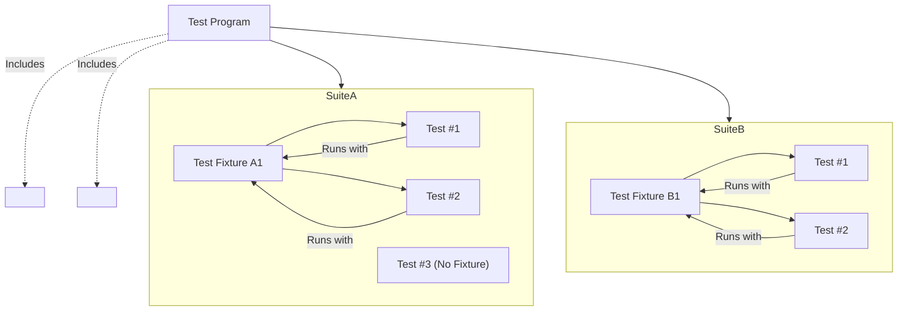

# Test Structure and the xUnit Model

GoogleTest is built upon the widely recognized xUnit architecture, a proven pattern for organizing and running tests efficiently. This page clarifies the fundamental organizational concepts of GoogleTest’s testing framework, including test cases, test fixtures, test suites, and their roles within the framework. Additionally, it explains the relationship between GoogleTest and GoogleMock, along with the main headers to include for each.

---

## Understanding the xUnit Architecture in GoogleTest

At its core, GoogleTest leverages the xUnit model, which is familiar to users of frameworks like JUnit or NUnit. The architecture is designed to provide:

- **Test organization** through hierarchical grouping.
- **Isolation and reuse of test code** using fixtures.
- **Extensibility** through seamless integration with GoogleMock.

### Key Concepts

1. **Test**: The smallest executable unit in GoogleTest. Each test examines one specific behavior or aspect of the code.

2. **Test Case / Test Suite**: A group of related tests. Over time, "Test Suite" has replaced the older term "Test Case" in GoogleTest to align better with common terminology. A test suite allows grouping tests logically and sharing setup/teardown code.

3. **Test Fixture**: A class derived from `testing::Test` that provides a setup environment shared across tests within a suite. This allows reuse of common objects, cleaner tests, and better organization.

4. **Test Program**: The executable that runs all defined test suites and their tests.

---

## Test Cases, Suites, and Fixtures: What They Mean and How They Relate

| Concept       | Explanation | How It’s Used in GoogleTest |
| ------------- | ----------- | --------------------------- |
| Test          | A single function verifying one behavior | Created using the `TEST()` macro |
| Test Suite    | A collection of related tests | Contains tests grouped by the first argument to `TEST()` or `TEST_F()` |
| Test Fixture  | A reusable class that sets up a common environment | Declared as a class inheriting from `testing::Test` and used with `TEST_F()` |

### Writing Tests

- Use the `TEST(TestSuiteName, TestName)` macro for simple tests without shared environments.
- Use the `TEST_F(FixtureClassName, TestName)` macro to write tests that share setup/teardown logic defined in a test fixture.

This structure isolates each test, ensuring reliable, independent test execution.

### Test Fixture Workflow

1. Define a fixture class derived from `testing::Test`.
2. Define shared data members or helper functions within the fixture.
3. Implement `SetUp()` and `TearDown()` methods if needed.
4. Write tests using the fixture with `TEST_F()`, which automatically handles fixture construction and destruction per test.

This flow guarantees each test starts with a fresh fixture instance, avoiding unintended shared state.

---

## Test Suite and Fixture Example

```cpp
#include <gtest/gtest.h>

// Class under test
class Stack {
 public:
  void Push(int x) { data_.push_back(x); }
  void Pop() { data_.pop_back(); }
  int Top() const { return data_.back(); }
  bool Empty() const { return data_.empty(); }
 private:
  std::vector<int> data_;
};

// Fixture for Stack tests
class StackTest : public testing::Test {
 protected:
  void SetUp() override {
    stack_.Push(1);
    stack_.Push(2);
  }

  Stack stack_;
};

// Test using the fixture
TEST_F(StackTest, PopRemovesTopElement) {
  stack_.Pop();
  EXPECT_EQ(stack_.Top(), 1);
}

TEST_F(StackTest, EmptyIsFalseWhenElementsExist) {
  EXPECT_FALSE(stack_.Empty());
}
```

This example demonstrates:
- Test fixture `StackTest` defines a common setup.
- Two tests within the `StackTest` suite share this environment.

---

## Test Execution Hierarchy

- **Test Program**: Contains all test suites.
- **Test Suite**: Contains multiple tests; grouped by feature or class.
- **Test**: Smallest unit, runs independently.

Each test runs with its own fresh fixture instance if applicable.

---

## Suites vs Fixtures Terminology

| Old Term    | New Preferred Term | Notes |
| ----------- | ------------------ | ----- |
| Test Case   | Test Suite         | GoogleTest has deprecated `TestCase` for better alignment with industry terms |
| Test Fixture| Test Fixture       | Unchanged; custom setup per suite/tests |

Users are encouraged to use `TEST_SUITE` or `TEST` macros with `TEST_F` for fixtures.

---

## Relationship Between GoogleTest and GoogleMock

GoogleMock (`gMock`) extends GoogleTest by providing a powerful mocking framework:

- **Headers**:
  - Include `<gtest/gtest.h>` for core testing functions and macros.
  - Include `<gmock/gmock.h>` to access mocking features.

- **Integration**:
  - GoogleMock depends on GoogleTest but adds mocking capabilities such as `MOCK_METHOD` and `EXPECT_CALL`.
  - GoogleMock also provides `ON_CALL` to specify default mock method behavior.

- **Main Headers**:
  - `gtest/gtest.h`: For defining and running tests, assertions, fixtures.
  - `gmock/gmock.h`: For defining mocks, expectations, actions.

Users can interleave GoogleTest and GoogleMock components effortlessly within their tests.

---

## Typical Inclusion and Initialization

```cpp
#include <gtest/gtest.h>
#include <gmock/gmock.h>  // For using mocks

int main(int argc, char **argv) {
  testing::InitGoogleMock(&argc, argv);  // Initializes both GoogleTest and GoogleMock
  return RUN_ALL_TESTS();
}
```

Calling `InitGoogleMock()` initializes both frameworks and parses command-line flags.

---

## Summary of Key Concepts

- GoogleTest bases its design on the xUnit architecture familiar across languages.
- Tests are organized into test suites (previously called test cases).
- Shared setup is provided by test fixtures subclassing `testing::Test` used via `TEST_F()`.
- GoogleMock extends GoogleTest by providing mocking constructs and expectations.
- Test programs start by initializing GoogleMock (`InitGoogleMock`) and then running all tests.

---

## Best Practices

- Organize tests logically into suites that correspond to components or behaviors.
- Use fixtures to avoid repeated setup code among tests.
- Always set expectations in mocks *before* exercising code that uses mocks.
- Prefer `TEST_F` when tests share state or common setup.
- Link against `gtest_main` or `gmock_main` to avoid custom main function unless customization is needed.

---

## Troubleshooting Common Confusions

<AccordionGroup title="Common Questions Users Have About Test Structure">
<Accordion title="What is the difference between a test case, test suite, and test fixture?">
GoogleTest uses "test suite" (previously "test case") to group related tests logically. A test fixture is a class providing a common environment for multiple tests within a suite. Each test runs independently with a fresh fixture instance.
</Accordion>
<Accordion title="Should I use TEST or TEST_F macros?">
Use `TEST` when your test does not require shared setup/teardown. Use `TEST_F` when tests share common state or setup provided by a test fixture class.
</Accordion>
<Accordion title="How do GoogleTest and GoogleMock relate to each other?">
GoogleMock builds upon GoogleTest. You include `<gmock/gmock.h>` to access mocking features while relying on `<gtest/gtest.h>` for basic test infrastructure. Initializing GoogleMock also initializes GoogleTest.
</Accordion>
</AccordionGroup>

---

## Visualizing the Test Structure


```

This diagram encapsulates the hierarchical nature of test organization in GoogleTest and GoogleMock, showing test programs containing suites, suites containing test fixtures and/or tests, and the relationship between headings and inclusions.

---

## Additional Resources

- [GoogleTest Primer](docs/primer.md) — For basics on test writing and fixture use.
- [gMock for Dummies](docs/gmock_for_dummies.md) — To learn mocking concepts and GoogleMock syntax.
- [Mocking Reference](docs/reference/mocking.md) — Detailed API documentation.
- [System Architecture Overview](/overview/architecture-features-integration/system-architecture-overview) — For how GoogleTest and GoogleMock interact internally.

---

By understanding the xUnit model and test structure underpinning GoogleTest, users can organize their tests clearly and leverage the powerful fixture and mocking facilities effectively, leading to robust, maintainable, and scalable tests.
