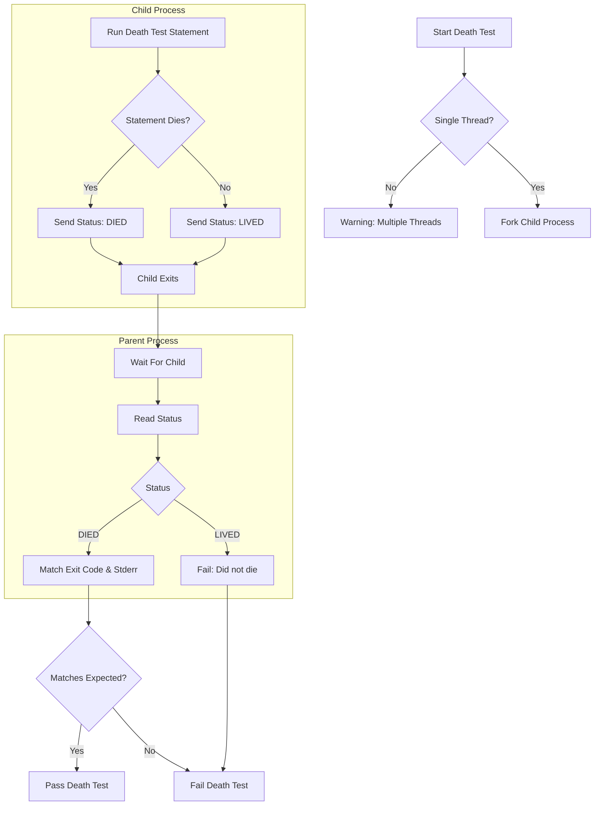

# Death Tests and Error Handling Models

Death tests in GoogleTest are a specialized testing mechanism designed to verify that certain code paths cause the process to terminate, typically due to fatal errors or assertions. Understanding how death tests work and the underlying error handling models is critical for writing reliable tests that confirm your program fails safely and predictably.

---

## Understanding Death Tests

### What Are Death Tests?
Death tests are tests that expect the code being tested to terminate abnormally or exit intentionally. They are useful for validating failure paths where the program should abort, exit with a non-zero status, or be terminated by a signal. This ensures critical invariants and error handling checks trigger as designed.

> **Example:**
> ```cpp
> TEST(ServerDeathTest, InvalidPort) {
>   ASSERT_DEATH(server.SendMessage(56, "Hello"), "Invalid port number");
> }
> ```
> This test asserts that sending a message to an invalid port causes the process to die with an error message matching the regex `Invalid port number`.

### Why Use Death Tests?
- Ensure preconditions, postconditions, and invariants crash the program as intended.
- Validate that fatal failures (like `LOG(DFATAL)` or `CHECK` failures) trigger.
- Guard against silent failures that leave the program in an inconsistent state.

---

## Death Test Macros and Assertions

GoogleTest provides a set of macros that allow you to write death tests with expressive matcher predicates and output expectations.

### Key Macros

| Macro                | Behavior                                                                                                         |
|----------------------|------------------------------------------------------------------------------------------------------------------|
| `ASSERT_DEATH(stmt, regex)` | Asserts that `stmt` causes the program to terminate with a nonzero exit code and produces stderr matching `regex`. |
| `EXPECT_DEATH(stmt, regex)` | Like `ASSERT_DEATH` but does not abort the current test on failure.                                                |
| `ASSERT_EXIT(stmt, predicate, regex)` | Asserts `stmt` exits with an exit status matching `predicate` and produces stderr matching `regex`.           |
| `EXPECT_EXIT(stmt, predicate, regex)` | Like `ASSERT_EXIT` but allows test continuation on failure.                                                    |
| `EXPECT_DEBUG_DEATH(stmt, regex)` | Asserts death only in debug mode; runs `stmt` normally otherwise.                                               |

### Predicates for Exit Status

GoogleTest supplies predicates to specify constraints for exit status:

- `ExitedWithCode(code)` — expects the program to exit normally with exit code `code`.
- `KilledBySignal(signal)` — expects the program to be killed by a specified signal (POSIX only).

> **Example:**
> ```cpp
> EXPECT_EXIT(server.ExitNow(), ::testing::ExitedWithCode(0), "Exiting");
> ```

### How Regex Matching Works
- POSIX systems use extended regex syntax.
- Windows and Mac use a simpler regex variant supporting a limited pattern set.

Supported features include:
- Literals, character classes like `\d`, `\s`, `\w`
- Quantifiers like `? * +`
- Anchors `^` and `$`

Unsupported features:
- Union (`x|y`), grouping `()`, brackets `[]`, and repetition counts `{m,n}`.

> **Tip:** Ensure regexes used in death tests conform to the supported syntax to prevent runtime failures.

---

## How Death Tests Operate Internally

Understanding this helps in writing robust and correct death tests.

### Execution Flow
1. **Single Thread Check:** Death tests verify that only a single thread is active because forking in a multithreaded context is unsafe.
2. **Forking or spawning subprocess:** 
   - In **fast** style, the child process immediately runs the death test code after fork.
   - In **threadsafe** style, the child process *re-executes* the test binary, filtering to run only the requested death test. This improves safety but has overhead.
3. **Parent waits for child:** Parent process waits for the child's termination.
4. **Status and output validation:** Parent checks child's exit code and stderr output against predicates and regex.

### Death Test Styles

| Style      | Behavior                                                         | Platform Notes                                            |
|------------|------------------------------------------------------------------|-----------------------------------------------------------|
| `fast`     | Executes death test immediately after fork                      | Default on POSIX; Windows treats all as threadsafe        |
| `threadsafe`| Re-executes binary filtering for the targeted death test        | More thread-safe on POSIX; default inside Google internal builds |

### Platform Differences
- Windows always uses a thread-safe style via `CreateProcess`.
- Fuchsia uses its own sandboxed process spawning mechanism.
- POSIX systems use `fork` or `clone`, with pipe/handle communication.

### Caveats
- Death tests run the `statement` in a child process; side effects in that process do *not* affect the parent.
- Avoid `return` or exceptions inside death test statements; these cause failure.

---

## Writing Effective Death Tests

### Best Practices
- **Name test suites ending with `DeathTest`:** Ensures they run early due to threading concerns.
- **Use regex sparingly:** Use the simplest regex needed to match expected error output.
- **Use predicates to verify exit codes or signals:** Avoid assuming any non-zero code is sufficient.
- **Avoid side effects in death test statements:** Since child's memory is isolated.
- **Avoid multiple death assertions on the same line:** Causes compilation failures.

### Examples
```cpp
// Assert program dies with error containing 'Invalid port number'
ASSERT_DEATH(server.SendMessage(56, "Hello"), "Invalid port number");

// Loop death test
for (int i = 0; i < 5; i++) {
  EXPECT_DEATH(server.ProcessRequest(i), "Invalid request .* in ProcessRequest()") << "iteration " << i;
}

// Assert exit with 0 code and message 'Exiting'
ASSERT_EXIT(server.ExitNow(), ::testing::ExitedWithCode(0), "Exiting");

// Assert killed by SIGHUP signal
bool KilledBySIGHUP(int exit_code) {
  return WIFSIGNALED(exit_code) && WTERMSIG(exit_code) == SIGHUP;
}
ASSERT_EXIT(client.HangUpServer(), KilledBySIGHUP, "Hanging up!");
```

### Debug Mode Differences: `EXPECT_DEBUG_DEATH`
- In debug builds, this asserts death on the statement.
- In release (opt) builds, it just runs the statement.
- Useful for testing `LOG(DFATAL)` consequences where debug and release modes differ.

> **Tip:** Stream side-effect checks in `EXPECT_DEBUG_DEATH` to assert correctness in opt mode.

### Handling Complex Expressions
Use compound statements `{ ... }` or function calls within death tests for clarity:

```cpp
EXPECT_DEATH({
  int x = 2;
  DoWork(x);
}, "^Error:");
```

---

## Troubleshooting Death Tests

### Common Issues
- **Death tests hang or don't die:** 
  - Check if `return` or exceptions are escaping the death test.
  - Review threading warnings; multithreaded tests can interfere with `fork()`.
- **Regex mismatches:** 
  - Use supported regex syntax.
  - Ensure output matches the pattern, including line breaks.
- **Multiple death assertions on the same line:** 
  - Split assertions over different lines.
- **Side effects not visible in parent:** 
  - Remember that child process modifications don't propagate.
- **Unexpected non-zero exit codes:** 
  - Verify exit status predicates correctly match expected codes.

### Tips
- Use `SCOPED_TRACE()` to provide context when death tests are within loops or helpers.
- Name death test suites `*DeathTest` to mitigate threading issues with test ordering.
- Consider using `GTEST_FLAG_SET(death_test_style, "threadsafe")` for safer runs in multithreaded environments.

---

## How GoogleTest Internally Handles Death Tests

To provide a mental model of what occurs behind the scenes:

<Accordion title="Detailed Death Test Workflow">
When a death test macro (e.g., `ASSERT_DEATH`) is invoked:
1. A death test object is created by the current death test factory.
2. The test factory selects the strategy based on `--gtest_death_test_style`:
   - `fast`: Forks and runs the test in the child post-fork.
   - `threadsafe`: Forks and re-executes binary with filtering.
3. The parent process waits on the child's termination, reading from a pipe.
4. The child executes the test statement capturing stderr for matching.
5. The parent validates:
   - The child died (did not survive test code).
   - The child's exit status matches predicates.
   - The child's stderr matches the provided regex matcher.
6. If any validation fails, the death test fails with detailed error messages including child output.

This model works across POSIX, Windows, and Fuchsia platforms, each implementing the process control differently but preserving the outcome semantics.
</Accordion>

---

## Summary

Death tests are a crucial mechanism for validating that error-prone code paths terminate as expected. GoogleTest offers a flexible framework supporting multiple styles of death tests, cross-platform process handling, and detailed diagnostics to foster robust test coverage for fatal errors and assertions.

---

## Additional Notes

- Avoid `return` statements or unhandled exceptions inside death test statements; they cause failure.
- On POSIX, forking with multiple threads generates warnings because only single-threaded context is safe.
- Use the `--gtest_death_test_style` flag or programmatic `GTEST_FLAG_SET` to choose the death test mode.

---

## References

- [Assertions Reference — Death Assertions](../reference/assertions.md#death)
- [Advanced GoogleTest Topics — Death Tests](docs/advanced.md#death-tests)
- [Death Tests Tutorial Guide](guides/advanced_usage_best_practices/death_tests.md)
- [Core Testing API — Test Macros and Suite Framework](api-reference/core-testing-api/test-macros-framework.md)
- [Matchers Reference](api-reference/assertions-matchers-advanced/basic-advanced-matchers.md)

---

## Practical Example Using Death Tests

```cpp
TEST(MyDeathTest, FailsOnInvalidInput) {
  int value = -1;
  ASSERT_DEATH(ProcessValue(value), "Negative value not allowed");
}

TEST(MyDeathTest, ExitsCleanly) {
  EXPECT_EXIT(CleanShutdown(), ::testing::ExitedWithCode(0), "Shutdown complete");
}
```

Both affect program termination; the first expects failure with matching output, while the second expects an exit code and specific output.

---

## Troubleshooting Checklist

<AccordionGroup title="Death Tests Troubleshooting Tips">
<Accordion title="Child Process Doesn’t Die">
Verify the test code actually calls exit or causes a fatal failure.
Avoid early returns or exceptions that escape.
</Accordion>
<Accordion title="Regex Matching Fails">
Simplify regex patterns; ensure compatibility with GoogleTest regex syntax.
Check multi-line outputs carefully.
</Accordion>
<Accordion title="Multiple Threads Warning">
Rename test suites to end with `DeathTest` to cause early execution.
Consider switching to `threadsafe` death test style.
</Accordion>
</AccordionGroup>

---

## Key Terms Glossary

| Term           | Explanation                                                         |
|----------------|---------------------------------------------------------------------|
| Death Test     | Test that expects the program to terminate abnormally.              |
| Death Test Style | Mode of execution: `fast` or `threadsafe`, affecting process control. |
| Exit Status    | The integer code returned by a process upon termination.            |
| Matcher        | Expression or functor to verify content of stderr in death tests.   |
| Predicate      | Function or functor checking exit code for `ASSERT_EXIT`/`EXPECT_EXIT`. |

---

## Visualizing Death Test Flow (simplified)



---

## Summary
Use death tests to verify your code terminates properly on fatal failures, employing macros like `ASSERT_DEATH`, `EXPECT_EXIT`, and predicates such as `ExitedWithCode`. Select appropriate death test styles and matchers to ensure robust, cross-platform validation of failure conditions. Write tests that avoid side effects and understand the child process isolation to reduce errors and flakiness.

---

## Further Reading
- [GoogleTest Primer](overview/product-intro-and-value/what-is-googletest.md)
- [Death Test Usage Guide](guides/advanced_usage_best_practices/death_tests.md)
- [Assertions Reference - Death Macros](docs/reference/assertions.md#death)
- [Matchers Architecture](core-concepts/mocking-and-matchers/matcher-architecture.md)

---

For expert usage, combine death tests with logging, scoped traces, and predicate-format assertions to maximize diagnostic clarity during test failures.