# Internal Utilities and Portability Layer

Discover the suite of utility classes, platform abstractions, type traits, and portability macros that support cross-platform reliability and extensibility. This guide is essential for contributors and advanced users modifying or extending the GoogleTest framework, providing key insights into internal mechanisms and foundational utilities.

---

## Overview

GoogleTest’s internal utilities and portability layer provide the foundational building blocks for consistent behavior across platforms and compilers. These utilities handle low-level tasks such as type traits, string manipulation, hardware characteristics, platform-specific considerations, and internal macros that facilitate compile-time and run-time operations.

Understanding these internals is crucial for contributors working on extending GoogleTest, fixing platform compatibility, or creating custom extensions to the framework.

## Utility Classes and Type Traits

Internal utilities include generalized classes and templates that help with type introspection and enable safer, more expressive template metaprogramming.

### Type Identification

- **TypeId and TypeIdHelper**: These allow GoogleTest to assign and compare unique IDs to different test fixture classes at compile time, ensuring that each fixture type is uniquely identified. This mechanism prevents mixing tests of different fixture classes in the same test suite.

### Floating Point Comparison

- **FloatingPoint Template Class**: This sophisticated floating-point comparison utility addresses issues with direct equality of floating-point numbers due to rounding errors. It works by interpreting the underlying bit patterns and comparing values within a tolerance defined in Units in the Last Place (ULPs). This enables GoogleTest’s floating-point equality assertions to be both precise and reliable across platforms.

### Container Detection Traits

- Traits like `IsContainer`, `IsHashTable`, and `IsRecursiveContainer` help GoogleTest internally recognize standard-like containers, hash tables, and whether containers recursively store themselves. These are useful when matchers are applied to containers or when adapting native arrays for comparison.

### Native Array Adaptation

- **NativeArray**: Adapts raw C-style arrays into an STL-style container interface for use in tests and matchers. It supports multi-dimensional arrays and can be constructed either by reference or by copying.

### Tuple-like Utilities

- **FlatTuple and Related Helpers**: These utilities provide a tuple implementation optimized to reduce template instantiation depth and enable GoogleTest to handle large tuples efficiently. It's a foundation for managing multiple test and parameter types with improved compilation performance.

## Portability Macros and Preprocessor Utilities

GoogleTest uses several macros and preprocessor utilities to handle platform-specific quirks and to facilitate compile-time code manipulation.

- **Token Concatenation (`GTEST_CONCAT_TOKEN_`)**: Due to C++ preprocessor limitations, a double indirection macro is used to correctly concatenate tokens like line numbers to identifiers.

- **Stringification (`GTEST_STRINGIFY_`)**: Works around compiler bugs to safely turn macro arguments into string literals, even when the argument is empty.

- **Suppressing Compiler Warnings**: Specialized macros suppress warnings for unreachable code or unsafe conversions depending on the compiler (notably MSVC).

- **Conditional Compilation for Platforms**: Macros control inclusion of platform-specific headers and functions, such as Linux system calls or Windows HRESULT handling.

## Platform Abstractions

GoogleTest abstracts system differences to provide a uniform testing API.

- **OS stack trace retrieval**: Functions like `GetCurrentOsStackTraceExceptTop()` obtain call stacks in a platform-specific manner, used for rich error reporting.

- **Posix and Windows Wrappers**: Namespaces and classes wrap file I/O, environment variables, and threading primitives, normalizing behaviors across Linux, Windows, and other OSes.

- **Random Number Generator**: Includes a simple linear congruential generator implementation for internal uses such as shuffling test execution order.

- **Exception Support & Handling**: Internal classes handle exception catching and reporting, including specialized exceptions thrown on assertion failures when `throw_on_failure` flag is set.

## Internal Test Framework Support

GoogleTest’s internal utilities underpin key framework features:

- **Test Factory Classes**: Abstract factory interfaces like `TestFactoryBase` and concrete implementations enable instantiating test objects dynamically.

- **Test Registration Helpers**: Functions such as `MakeAndRegisterTestInfo()` manage test metadata, registration with the framework, fixture linking, and lifecycle management.

- **Test Suites Supporting Type-Parameterized and Value-Parameterized Tests**: Internal state management and registration APIs handle the complexities of templated and parameterized test suites, ensuring each test gets correctly instantiated and executed.

- **Code Location Structures**: Used to track source file and line information for diagnostics and error reporting.

## String and Message Utilities

- Utilities for working with C strings and wide strings, including safe comparison functions that can handle `nullptr` inputs.

- Conversion utilities from wide strings to UTF-8 encodings to allow cross-platform string handling in messages and logs.

- Message class that accumulates assertion failure messages and supports streaming of Unicode and other types seamlessly.

## Assertion Failure Formatting

- Internal methods construct detailed failure messages for equality, boolean assertions, string equality (including case-insensitive comparisons), and floating-point comparisons.

- Algorithms for computing string diffs (e.g., using Wagner-Fischer edit distance) to display helpful diff messages in test failure outputs.

## Miscellaneous Utilities

- Template helpers to manipulate tuples, type casting utilities for safe conversions, and detection of container properties.

- Thread-safe wrappers, mutex and lock implementations abstracting platform differences.

- Compile-time detection of platform features and setting feature macros accordingly.

---

## Practical Tips for Contributors and Advanced Users

- Use type identification to ensure test fixtures are consistent within test suites.

- When extending or debugging floating-point assertions, understand the IEEE bit-level comparison utility to modify or troubleshoot behavior.

- Leverage the container and array utilities when writing matchers that work generically over STL containers and raw arrays.

- Be mindful of platform macro guards to ensure new utilities or bug fixes maintain compatibility across all supported platforms.

- Use internal logging and failure reporting interfaces for precise and consistent error handling.

- Avoid using internal utilities directly in user code; they are subject to change and designed for framework use.

---

## Example: FloatingPoint Failure Message Excerpt

When a floating-point `ASSERT_DOUBLE_EQ` fails, the failure message leverages internal utilities for detailed messaging:

```cpp
AssertionResult res = EqFailure("foo", "bar", "0.3000000001", "0.3", false);
std::cout << res.message();
```

Output:

```
Expected equality of these values:
  foo
    Which is: 0.3000000001
  bar
    Which is: 0.3
With diff:
@@ -1,2 +1,2 @@
-0.3000000001
+0.3
```

This gives users an insightful, line-by-line diff of floating-point discrepancies.

---

## Further Exploration

- Explore [Core Concepts and Terminology](../overview/architecture-and-concepts/core-concepts) to connect internal mechanisms with user-facing concepts.

- Refer to [Mocking Reference](../docs/reference/mocking.md) and [gMock Cookbook](../docs/gmock_cook_book.md) for practices impacted by internal type traits and utility functions.

- Study [Test Macros and Suite Framework](../api-reference/core-testing-api/test-macros-framework) to understand how internal factories and registration tie into the user API.

- Use the navigation map to access related pages on parameterized tests, assertion models, and test fixtures.

---

## Visual Summary

```mermaid
graph TD
  PlatformAbstractions["Platform Abstractions"] -->|Provide| OSStackTrace["OS Stack Trace Retrieval"]
  PlatformAbstractions --> FileIO["File and Env Utilities"]
  PlatformAbstractions --> Threading["Threading & Mutex"]

  UtilitiesAndTraits["Utilities and Type Traits"] --> TypeId["Type Identification"]
  UtilitiesAndTraits --> FloatingPointCmp["Floating Point Comparison"]
  UtilitiesAndTraits --> ContainerTraits["Container Detection"]
  UtilitiesAndTraits --> NativeArray["Native Array Adaptation"]
  UtilitiesAndTraits --> TupleUtils["Tuple Utilities"]

  MacrosAndPreprocessor["Macros & Preprocessor"] --> TokenConcat["Token Concatenation"]
  MacrosAndPreprocessor --> Stringify["Stringification"]
  MacrosAndPreprocessor --> WarnSuppress["Warnings Suppression"]
  MacrosAndPreprocessor --> PlatformMacros["Platform Conditional Compilation"]

  InternalTestSupport["Internal Test Framework Support"] --> TestFactories["Test Factory Interfaces"]
  InternalTestSupport --> TestRegistration["Test Registration Helpers"]
  InternalTestSupport --> TestSuites["Parameterized Test Suite Support"]
  InternalTestSupport --> CodeLocation["Code Location Tracking"]

  StringAndMessageUtils["String and Message Utilities"] --> CStringUtils["Safe C String Comparisons"]
  StringAndMessageUtils --> WideStringConv["Wide String to UTF-8"]
  StringAndMessageUtils --> AssertMessages["Assertion Failure Messages"]

  PlatformAbstractions -.-> InternalTestSupport
  UtilitiesAndTraits -.-> InternalTestSupport
  MacrosAndPreprocessor -.-> PlatformAbstractions
  StringAndMessageUtils -.-> InternalTestSupport

  subgraph "GoogleTest Internal Utilities"
    PlatformAbstractions
    UtilitiesAndTraits
    MacrosAndPreprocessor
    InternalTestSupport
    StringAndMessageUtils
  end

  UserCode["User & Contributor Code"] -->|Use/Extend| InternalTestSupport
  UserCode -->|Benefit from| UtilitiesAndTraits
  UserCode -->|Triggered by| AssertMessages
```


```

---

## Source Reference

These utilities reside primarily in `googletest/include/gtest/internal/gtest-internal.h` and are implemented in `googletest/src/gtest.cc`.


---

## Troubleshooting & Best Practices

- Ensure exception flags (`GTEST_HAS_EXCEPTIONS`) are correctly set for your platform to avoid build or run-time surprises.

- When extending or modifying floating-point comparison behavior, test against a variety of platforms to guard against subtle portability issues.

- Use the provided macros when handling platform-specific code to maintain cross-platform compatibility.

- Leverage the existing type traits for container detection to avoid pitfalls when dealing with template containers or std::array/native arrays.

- Utilize `NativeArray` when needing std::container-like semantics for raw arrays, especially when writing generalized container matchers or utilities.

- When debugging test registration or fixture-related errors, the internal `TypeId` system helps ensure test suites are correctly associated with fixture types.

---

# End of Internal Utilities and Portability Layer Documentation
