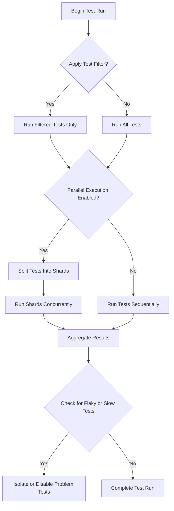

# Performance Tuning & Scaling Tests

Optimize your testing workflow by mastering techniques to reduce test execution time, efficiently run large suites, and manage overhead in GoogleTest environments. This guide focuses specifically on accelerating test runs through parallel execution, test filtering, handling disabled tests, and adopting best practices for maintaining performant test environments.

---

## Frequently Asked Questions

### How can I reduce the overall test execution time?
You can reduce execution time by running tests in parallel, filtering to run only relevant tests, and minimizing test overhead where possible. GoogleTest and GoogleMock integrate well with parallelization tools and provide flags for selective execution.

### What is test filtering and how do I use it?
Test filtering lets you run a subset of tests by name patterns using the `--gtest_filter` flag. For example, `--gtest_filter=FooTest.*` runs all tests in the test suite `FooTest`. This helps focus on specific tests instead of running the whole suite.

### How do disabled tests affect test performance?
Disabled tests (marked with `DISABLED_` prefix) are skipped by default and do not contribute to execution time unless explicitly run by removing the prefix from the filter. Keeping long-running tests disabled improves overall test suite speed.

### Can GoogleTest run tests in parallel?
GoogleTest supports parallel test execution externally via build systems or test runners that shard tests (e.g., Bazel). Breaking test workloads into shards and running them concurrently reduces wall-clock time.

### How to handle flaky or slow tests to maintain performance?
Identify flaky or slow tests using test output and logs. Consider disabling them temporarily with the `DISABLED_` prefix or isolate them into separate test suites. Use mock objects to replace slow dependencies and use expectations judiciously to avoid excess overhead.

### What are best practices to improve test performance in large suites?
- **Parallelize tests** when possible.
- **Filter tests** to run only what's needed.
- Use **test fixtures** to share expensive setup.
- Opt for **NiceMock** when uninteresting calls are not critical to check.
- Avoid excessive use of chaining `EXPECT_CALL` with complex matchers.
- Write **fast and independent tests** to reduce dependencies and flapping.

---

## Common Issues & Gotchas

### Running All Tests Instead of Subset
Forgetting to use the `--gtest_filter` flag may cause slow runs by running all tests. Always use filtering to speed up development cycles.

### Mishandling Disabled Tests
Disabled tests can be accidentally run or cause confusion in results. Be consistent with naming and communicate their status clearly.

### Parallelization Pitfalls
Tests that share global state or dependencies may fail or interfere when run in parallel. Analyze test isolation before parallel execution.

### High Overhead in Expectations
Complex or numerous `EXPECT_CALL` in gMock can slow tests. Minimize expectations to only what matters and prefer `ON_CALL` for default behavior.

---

## Error Messages & Debugging

### Identifying Test Bottlenecks
Check test output and logs for slow-running tests. Use profiling tools or timings from your test runner to find outliers.

### Understanding Warning Messages About Unexpected Calls
Warnings such as “Uninteresting mock function call” can indicate missing `EXPECT_CALL`s or overly strict mocks. Adjust mock strictness with `NiceMock` or review expectations.

### Common Errors Caused by Test Parallelization
Race conditions or resource contention can cause sporadic test failures. Use synchronization primitives or mock dependencies to isolate.

---

## Troubleshooting Procedures

### Step-by-Step to Isolate Slow Tests
1. Identify slow tests by running with verbose timing or profiling enabled.
2. Run suspected tests in isolation with filtering.
3. Check if failures correlate with environmental issues or flaky dependencies.
4. Consider using mocks or stubs for slow external calls.
5. Mark flaky tests as disabled and schedule investigation.

### Verify Parallel Execution Correctness
Use thread-safe mocks and ensure no shared mutable state unless protected. Test your setup with small parallel workloads before scaling.

### Filter Syntax Verification
Confirm your `--gtest_filter` expressions match the intended test names. Incorrect filters can omit tests or run all tests accidentally.

---

## Performance & Optimization Tips

### Utilizing Test Sharding
Split large test suites into shards using your build/test system, running shards in parallel. This dramatically reduces elapsed wall time without modifying test code.

### Minimizing Setup/TearDown Costs
Use `SetUpTestSuite` and `TearDownTestSuite` for shared setup among tests to avoid costly per-test initialization.

### Prefer ON_CALL for Default Mock Behavior
Use `ON_CALL` to define behavior without imposing expectations, reducing overhead when calls do not affect test verdicts.

### Using NiceMock for Less Verbose Mocks
`NiceMock` suppresses warnings on uninteresting calls, reducing noise and improving runtime by avoiding extra diagnostic work.

### Avoid Unnecessary Cardinality Constraints
Be cautious with matchers in `EXPECT_CALL`. Overly detailed constraints may require more matching work and increase runtime.

---

## Best Practices for Large Test Suites

- **Group related tests logically** to enable selective runs.
- Use **parameterized tests** for similar scenarios to reduce duplication.
- Monitor and **regularly review flaky or slow tests**.
- Use **mocking effectively** to replace slow or unreliable dependencies.
- Integrate with **CI systems** supporting test sharding and failure reporting.
- **Document test coverage and expectations** clearly to ease maintenance.

---

## Getting Help & Support

- Consult the [GoogleTest Primer](docs/primer.md) for foundational knowledge.
- Explore the [gMock Cookbook](docs/gmock_cook_book.md) for advanced mocking tips.
- Review the [Mocking Reference](api-reference/mocking-apis/expect-call-and-on-call.mdx) for detailed API explanations.
- Report issues or seek guidance on the [GoogleTest GitHub repository](https://github.com/google/googletest).
- Participate in community forums and mailing lists linked from official resources.

---

_For detailed insights on mock expectations, actions, and behaviors, see [Mocking Reference - EXPECT_CALL and ON_CALL](api-reference/mocking-apis/expect-call-and-on-call.mdx)._

_For guidance on running tests in parallel and sharding, consult the [Performance Optimization Guide](guides/real-world-examples-integration/performance-optimization.mdx)._

_For solving common test discovery and filtering issues, visit [Test Discovery & Running Tests FAQ](faq/usage-getting-started/test-discovery-running.mdx)._

---

### Related Documentation

- [GoogleTest Primer](docs/primer.md)
- [gMock Cookbook](docs/gmock_cook_book.md)
- [Mock Class Behaviors](api-reference/mocking-apis/mock-class-behaviors.mdx)
- [Call Count Expectations Cardinalities](api-reference/matchers-and-actions/call-cardinalities.mdx)
- [Test Discovery and Structure](api-reference/core-testing-apis/test-discovery-and-structure.mdx)
- [Common Scenarios and Solutions](guides/real-world-examples-integration/common-scenarios.mdx)
- [Integration with Build Systems](faq/advanced-integration/integration-with-build-systems.mdx)

### Example: Run Selected Tests in Parallel
```bash
# Run only the FactorialTest suite
./my_test_binary --gtest_filter=FactorialTest.*

# Run test shards with environment variables
GTEST_SHARD_INDEX=0 GTEST_TOTAL_SHARDS=4 ./my_test_binary
GTEST_SHARD_INDEX=1 GTEST_TOTAL_SHARDS=4 ./my_test_binary
# ... and so on for other shards
```

---

### Tips

<Tip>
Regularly profile your test suites and remove or isolate slow tests.
</Tip>

<Tip>
Use `--gtest_filter` to speed up development by focusing on failing or critical tests.
</Tip>

<Tip>
Set `RetiresOnSaturation()` on expectations that should not remain sticky, to avoid excess overhead in large, sequential tests.
</Tip>

<Tip>
Make use of `NiceMock` or `NaggyMock` to control logging verbosity for uninteresting calls.
</Tip>

### Callout
<Warning>
Beware of flaky tests causing intermittent failures; isolate and fix them to maintain reliable build health.
</Warning>

---

### Summary Diagram: Test Execution Optimization Flow


---

This structured approach empowers developers to maintain rapid and reliable test cycles even with large and complex GoogleTest test suites.
