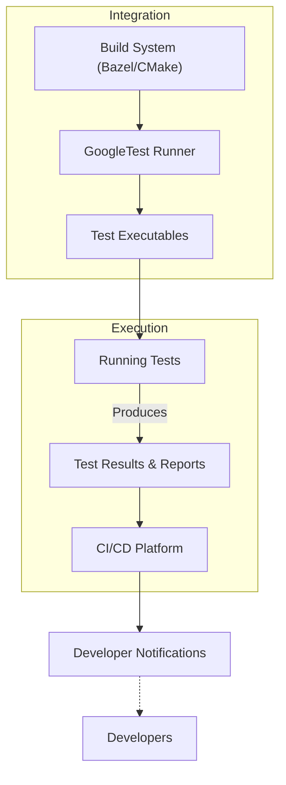

# Integration with Build Systems & CI Tools

This page focuses on diagnosing and resolving integration, build, execution, and reporting issues encountered when using GoogleTest with build systems such as Bazel and CMake, as well as popular Continuous Integration and Continuous Deployment (CI/CD) platforms. It is aimed at helping engineering teams smoothly adopt GoogleTest in automated workflows common in real-world software development environments.

---

## Frequently Asked Questions

### Build System Integration

#### How do I ensure GoogleTest integrates correctly with Bazel or CMake?

Ensure that your workspace and build files explicitly include GoogleTest dependencies as specified in Bazel `WORKSPACE` and `BUILD` files or CMake `CMakeLists.txt` files. Confirm that your test targets link against the appropriate GoogleTest libraries and that any necessary macros or flags (such as `-pthread` on Linux) are set. Refer to the official [Building and Integrating with CMake and Bazel](https://google.github.io/googletest/guides/integration_in_build_systems.html) guide for detailed steps.

---

### Common Build and Compilation Issues

#### Why do I sometimes see linker errors or missing symbols?  

Linker errors often occur when GoogleTest or GoogleMock libraries are not linked properly. Verify that your build scripts include the correct targets (`gtest`, `gtest_main`, `gmock`, etc.) and that your compilation environment matches the supported platforms and required C++17 standard as described in the [Supported Platforms and Requirements](https://google.github.io/googletest/overview/feature-overview/supported-platforms) page.

#### How do I handle platform or compiler-specific quirks in build configurations?

Consult the [Cross-Platform and Environment Considerations](https://google.github.io/googletest/guides/integration_scenarios/cross-platform-considerations.html) guide. It covers environment detection, compiler compatibility concerns, threading support, and platform-specific recommendations to avoid runtime and linking errors.

---

### Continuous Integration and Automated Testing

#### How do I configure GoogleTest to work with popular CI/CD platforms?

Most CI systems run test binaries directly from the command line. Use the default GoogleTest runner, which supports command line flags for filtering tests, output formatting (e.g., XML results), and repeated test execution. Integrate the `RUN_ALL_TESTS()` macro in your test harness to execute all tests, and ensure your build system generates the test executables for CI runs.

#### How can I produce machine-readable test reports for CI dashboards?

Pass `--gtest_output=xml:<path>` to your test executable during CI runs. This generates detailed XML reports compatible with most CI systems like Jenkins, GitLab, or CircleCI.

#### What if my tests fail to run or report results correctly on CI?

Check that the environment running the CI jobs matches supported platforms and compilers. Ensure that your test executable is built in the appropriate configuration (e.g., Debug or Release) and that any dependencies required at runtime are available in the CI environment. Refer to troubleshooting tips in the [Building and Running Tests](https://google.github.io/googletest/getting-started/first-test-execution-validation/building-running-tests.html) guide.

---

### Debugging Integrated Environments

#### My tests compile but don’t execute in Bazel or CMake environments. What should I check?

- Ensure the test executable target is correctly declared and built.
- Confirm that your test binaries have executable permissions.
- Verify that you invoke the test binaries via the build system's test runner (`bazel test` or `ctest` for CMake).
- Check for environment variables or runtime dependencies that might be missing in automated runs.

#### How to diagnose flaky or intermittent test failures in CI?

Enable verbose logging by passing `--gtest_brief=0` or the equivalent verbose flags to your tests. Use `--gmock_verbose=info` to visualize mock call sequences. Examine resource usage, thread safety, and timing issues, especially in parallel test execution scenarios.

### Best Practices for Smooth Integration

- Use provided CMake and Bazel integration examples as templates.
- Pin GoogleTest versions where possible to avoid unexpected breakage.
- Set `GMOCK_FLAG_SET(catch_leaked_mocks, true);` and configure `--gmock_verbose=warning` to catch mock leaks in CI.
- Isolate tests and mock dependencies appropriately to avoid side effects and improve reliability.

---

## Troubleshooting

<AccordionGroup title="Common Integration Issues">
<Accordion title="Test Binary Not Found After Bazel Build">
Check that your test target is declared with `test` rule in Bazel. Run `bazel build //path/to:test_target` and verify the binary exists in Bazel’s `bazel-bin` directory.
</Accordion>
<Accordion title="Linker Errors During CMake Build">
Verify that `target_link_libraries` includes `gtest` and `gmock` appropriately. Check that your C++ standard version is set to at least C++17 in your CMake configuration.
</Accordion>
<Accordion title="Tests Do Not Run On CI but Run Locally">
Ensure executable permissions, runtime dependencies, and environment variables are consistent between local and CI. Check CI logs to confirm test invocation and output capture.
</Accordion>
</AccordionGroup>

---

## Best Practices & Tips

### Using CMake with GoogleTest

- Link your test target against `GTest::gtest` and `GTest::gtest_main` imported targets.
- Use `include(GoogleTest)` and then `gtest_discover_tests()` for automatic test discovery.
- Maintain build isolation to avoid interference between tests.

### Using Bazel with GoogleTest

- Depend on `@com_google_googletest//:gtest` or appropriate Bazel workspace rules.
- Use `cc_test` rule for test targets.
- Leverage Bazel's caching and parallelism features for fast incremental testing.

### CI Integration

- Use the GoogleTest XML output to integrate with test result dashboards.
- Enable verbose logging during development, then reduce verbosity for production runs.
- Regularly update and verify that your CI base images or environments support required compiler versions and dependencies.

### Handling Mocking in Integrated Environments

Since GoogleMock is bundled with GoogleTest and tightly integrated, ensure your build system supports both simultaneously, especially for generated mock classes and test dependencies.

---

## Additional Resources

- [GoogleTest Primer](https://google.github.io/googletest/primer.html)
- [Building and Running Tests Guide](https://google.github.io/googletest/getting-started/first-test-execution-validation/building-running-tests.html)
- [Mocking Reference](https://google.github.io/googletest/reference/mocking.html)
- [Bazel Integration](https://docs.bazel.build/versions/master/tutorial/cpp.html)
- [CMake Integration](https://cmake.org/cmake/help/latest/module/GoogleTest.html)
- [Continuous Integration Best Practices](https://google.github.io/googletest/guides/integration_in_build_systems.html#continuous-integration)

---

## Summary Diagram of Integration Flow

