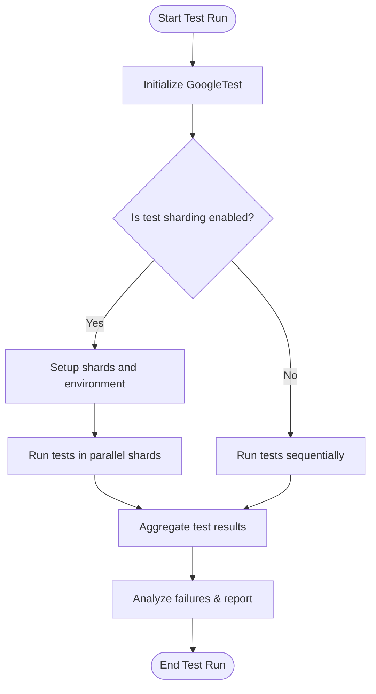

# Improving Test Execution Speed

Efficient test execution is critical for maintaining developer productivity and enabling faster feedback cycles. This guide outlines practical tips and techniques to help you run your GoogleTest-based tests faster, whether you're working on a small project or a large codebase with thousands of tests.

---

## 1. Run Tests in Parallel

Parallel test execution leverages multi-core processors by running multiple tests simultaneously, drastically reducing overall test runtime.

### How to Enable Parallel Test Execution

- **Test Sharding:** Divide your tests across multiple processes or machines (shards). Use the following environment variables:
  - `GTEST_TOTAL_SHARDS`: total number of shards
  - `GTEST_SHARD_INDEX`: 0-based index of the current shard

  This ensures each shard runs a distinct subset of tests.

- **Threaded Tests:** For platforms supporting threadsafe GoogleTest builds, tests can be run concurrently within the same process. Ensure your test code and fixtures are thread-safe.

### Benefits

- Utilizes all available CPU cores
- Shortens test iteration time

### Best Practices

- Ensure that your tests are **independent** — avoid shared state or synchronize access to allow safe parallel execution.
- Use sharding for integration with CI systems that support distributed execution.

<Tip>
If your tests don’t support parallel execution out-of-the-box, consider refactoring test fixtures to avoid data races and shared mutable state.
</Tip>

## 2. Selectively Run Tests and Test Suites

Running only the tests you need can save time during development and debugging.

### Use Test Filters

Use the `--gtest_filter` flag to run a subset of tests:

```shell
./my_tests --gtest_filter=MyTestSuite.MyTest
./my_tests --gtest_filter=MyTestSuite.*
./my_tests --gtest_filter=-*Disabled*
```

- Wildcards `*` and `?` can help specify patterns.
- Use `-` to exclude tests.

### Disable Tests Temporarily

Prefix the test or test suite name with `DISABLED_` to skip them without commenting out code.

### Also Run Disabled Tests

To include disabled tests, use the flag `--gtest_also_run_disabled_tests`.

### Resource-Light Instantiation

When you only care about one or a few tests during development, selectively running them avoids the overhead of executing the entire suite.

<Tip>
Combine filters with parallel execution to further reduce runtime, e.g., sharding with filters.
</Tip>

## 3. Minimize Test Suite Overhead

In large codebases, setup and teardown of test fixtures or global resources can dominate test runtime.

### Use Per-Test-Suite Setup and Teardown

Leverage `SetUpTestSuite()` and `TearDownTestSuite()` static methods to:

- Allocate expensive shared resources once per test suite
- Clean up after all tests in the suite finish

### Avoid Expensive Work in Per-Test Setup

Since `SetUp()` runs before every individual test, avoid redundant computation or resource allocation there.

### Use Fixtures Wisely

Design fixtures to share as much setup as possible without violating test isolation.

<Tip>
Remember: Test order is undefined. Fixtures must be resilient to the order tests run.
</Tip>

## 4. Manage Test Dependencies and Shared Resources

Tests that depend on external resources (databases, files, network) can slow down execution.

### Mock External Dependencies

Use GoogleMock to replace slow or unreliable dependencies with mocks, improving speed and reliability of your tests.

### Cache or Precompute Fixture Data

If some fixture data is reusable, consider caching or persisting it between test runs where feasible.

## 5. Use Test Execution Flags for Fine Control

GoogleTest provides multiple flags to optimize test runs.

| Flag                                | Description                                         |
|------------------------------------|-----------------------------------------------------|
| `--gtest_repeat=N`                  | Repeat all tests N times (useful for flakiness detection). |
| `--gtest_shuffle`                  | Shuffle tests randomly to uncover order dependencies. |
| `--gtest_break_on_failure`         | Break into the debugger at first failure.            |
| `--gtest_fail_fast`                | Stop execution on the first failure.                  |

Use these flags strategically depending on your testing phase and goals.

## 6. Continuous Integration (CI) and Build System Integration

To optimize test execution in CI environments:

- **Distribute Tests:** Use sharding and parallel jobs.
- **Cache Build Artifacts:** Avoid rebuilding GoogleTest or test binaries unnecessarily.
- **Schedule Long-Running Tests:** Separate them from quick unit tests.

See the [Integration and Ecosystem](../overview/architecture-features/integration-and-dependencies.md) guide for detailed CI integration tips.

---

## Summary Diagram: Test Execution Flow with Parallelism and Sharding



---

## Troubleshooting Common Performance Issues

- **Tests take too long to start:** Examine fixture setup and global environment setup.
- **Tests are not running in parallel:** Verify GoogleTest is built with thread safety enabled and you are using sharding or a parallel test runner.
- **Order-dependent failures when shuffling:** Identify and fix shared state or inter-test dependencies.

## Additional Resources

For further optimization techniques and advanced topics, refer to:

- [Performance Optimization & Scalability Guide](../guides/integration-optimization/performance-optimization.md)
- [Automating Tests in Continuous Integration Setup](../guides/integration-optimization/continuous-integration-setup.md)
- [Integrating with CMake and Bazel](../guides/integration-optimization/build-system-integration.md)

---

Remember, accelerating test execution without compromising correctness is an iterative process. Continuously profile and refine your tests, use GoogleTest's powerful flags and features, and leverage CI capabilities to deliver quick, reliable feedback to developers.