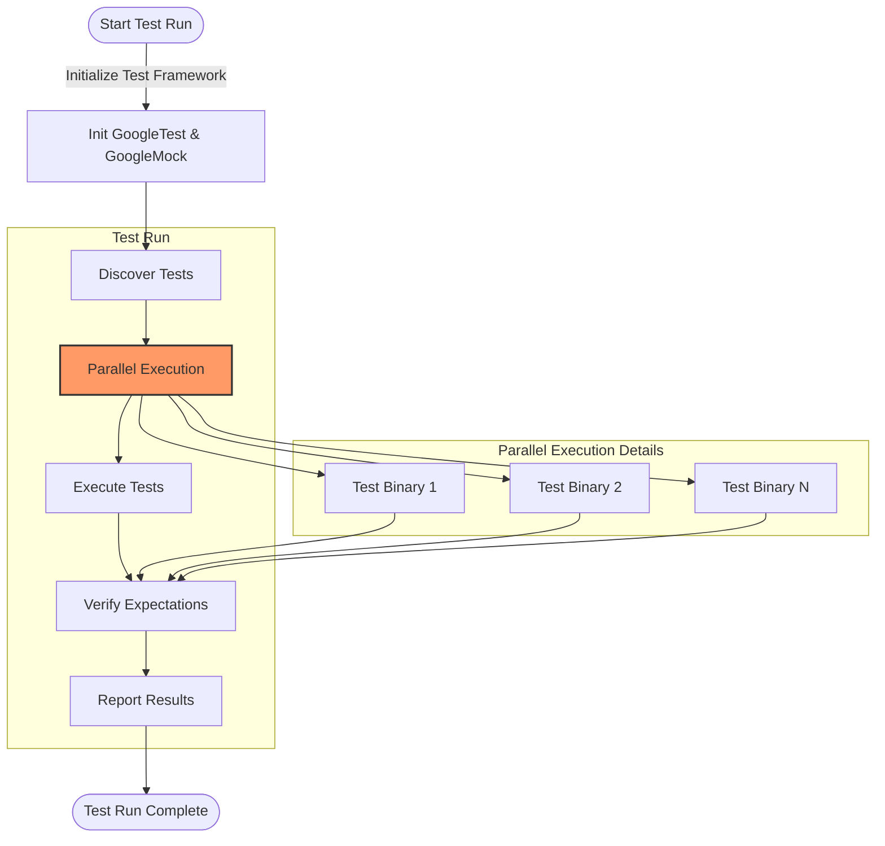

# How can I optimize the performance of my tests?

This FAQ page addresses your key questions about speeding up test execution with GoogleTest and GoogleMock. It covers strategies such as parallelizing test runs, designing your tests for efficiency, and managing large test suites effectively.

---

## Common Questions About Test Performance

### How can I run my tests faster using parallelization?

GoogleTest supports parallel test execution, which lets you fully utilize your CPU cores by running multiple test processes simultaneously. To do this:

- Use the `--jobs=N` (or equivalent) flag if supported by your build or test runner to run tests in parallel where `N` is the number of jobs.
- Alternatively, leverage external build tools or continuous integration (CI) platforms that split test binaries into groups executed in parallel.

This drastically reduces overall test suite runtime, especially for large suites that include many independent tests.

<Tip>
Ensure your tests are isolated and do not share state or global resources without proper synchronization before running them in parallel. Tests with side effects can cause intermittent failures when parallelized.
</Tip>

### What are the best practices to write efficient tests?

Efficient tests start with clear design:

- Keep individual tests **small and focused** to minimize setup and teardown overhead.
- Use **test fixtures** wisely to share common setup only when necessary but avoid heavy or expensive operations if they aren’t needed for every test.
- Prefer **`ON_CALL`** to set default behaviors for mocks rather than numerous `EXPECT_CALL` statements, which add verification overhead.
- Cache or reuse expensive resources/data outside of the test execution path (e.g., static initialization).
- Avoid unnecessary computations inside assertions or mock actions.

Being mindful of these leads to faster individual test runs and reduces flakiness.

### How can I optimize GoogleMock expectations to improve performance?

- Limit the number of `EXPECT_CALL`s and mock method invocations to only those you truly need to verify.
- Use `NiceMock` when you do not care about uninteresting calls to avoid warning overhead.
- If your mock methods return complex types, set sensible default return values with `ON_CALL` using lightweight actions.
- Avoid complex argument matchers or expensive matchers inside expectations if performance is critical.

### How do I handle very large test suites efficiently?

- Break your test suite into smaller logical groups or modules and run them as separate test binaries.
- Use test filters (`--gtest_filter`) to run only relevant tests when iterating locally instead of the whole suite.
- Use parameterized tests to cover many input variations in a compact way.
- Explicitly group tests by functionality or dependencies to facilitate smarter parallelization.

### Are there flags or settings to control logging verbosity during test runs to speed them up?

Yes, controlling logging verbosity via GoogleTest and GoogleMock can reduce overhead:

- Use `--gmock_verbose=warning` or `--gmock_verbose=error` to reduce mock call log output. The default is `warning`, which prints warnings but not informational logs.
- Use `--gtest_print_time=false` to disable timing logs if they are not needed.

Lower verbosity results in less I/O, speeding up test execution, especially in large test runs.

### What should I know about compiler and build system settings to optimize test build and run time?

- Keep your mocks’ constructor and destructor definitions in `.cc` files instead of headers to reduce redundant recompilation.
- Instruct your build system (CMake, Bazel) to only rebuild test executables and dependencies when necessary.
- Use compiler optimization flags favoring compile speed during active development (e.g., `-O0` with debugging) and switch to optimization for CI runs.
- Take advantage of incremental builds and caching mechanisms offered by your chosen build tools.

### How do default actions and expectations affect test performance?

GoogleMock creates some overhead when verifying expectations and during mock method calls:

- If you have many uninteresting calls without expectations, the default uninteresting call warnings may slow down tests. Use `NiceMock` or explicitly silence uninteresting calls.
- Setting precise `EXPECT_CALL` expectations narrows verification scope and may yield faster failures.
- Use `RetiresOnSaturation()` on expectations that are only meaningful until saturation to reduce matching checks for subsequent calls.

<Tip>
When tests slow down unexpectedly, review your mock setups and expectations to strike a balance between necessary verification and performance.
</Tip>

## Step-by-Step Guide to Speed Up Your Tests

<Steps>
<Step title="Parallelizing Your Test Execution">
Set up your test environment or CI to run multiple test executables or instances in parallel using available CPU cores or cloud runners. Verify tests don’t share mutable global state.
</Step>
<Step title="Design Efficient Tests and Fixtures">
Focus tests narrowly, minimize expensive setup, and reuse common setups judiciously. Simplify mock expectations and default behaviors.
</Step>
<Step title="Manage Large Test Suites Strategically">
Split large suites into groups, use filtering to run subsets locally, and leverage parameterized tests to reduce duplication.
</Step>
<Step title="Configure Logging and Verbosity Flags">
Reduce diagnostic output with `--gmock_verbose=error` and turn off unneeded timing logs with `--gtest_print_time=false`.
</Step>
<Step title="Optimize Build and Compilation Settings">
Move mock class constructors and destructors to `.cc` files, use incremental builds, and adjust compiler optimization flags based on your workflow.
</Step>
<Step title="Review and Refine Mock Expectations">
Limit expectations to what you need to verify, suppress uninteresting call warnings using `NiceMock`, and retire saturated expectations early.
</Step>
</Steps>

## Troubleshooting

<AccordionGroup title="Common Performance Pitfalls and Solutions">
<Accordion title="My tests are flaky or fail when run in parallel. What should I do?">
Check for shared state or resources not properly isolated between tests. Ensure proper synchronization or redesign tests to be independent. Use `NiceMock` for mocks that do not need strict call verification to reduce noise.
</Accordion>
<Accordion title="Test execution is slow, and I suspect verbose logging. How do I reduce this impact?">
Run tests with the flag `--gmock_verbose=error` to minimize logging output from GoogleMock. Also, consider disabling stack traces in warnings with `--gtest_stack_trace_depth=0`.
</Accordion>
<Accordion title="Compilation time of tests is very long. How can I reduce it?">
Forward declare mocks where possible and separate their constructor/destructor implementations to `.cc` files to avoid repeated compilation. Use precompiled headers and incremental build features.
</Accordion>
</AccordionGroup>

## Additional Tips and Best Practices

- **Suppressing Uninteresting Calls:** Switch to `NiceMock<T>` to silence warnings about mock methods called without expectations, improving clarity and speed.

- **Use `RetiresOnSaturation()`:** When an expectation only makes sense for a limited number of calls, marking it with `.RetiresOnSaturation()` prevents unnecessary matching after saturation.

- **Keep Assertions Lightweight:** Avoid complex heavy operations inside mock actions or assertions to minimize overhead.

- **Limit `EXPECT_CALL`s:** Overusing `EXPECT_CALL` can make tests brittle and slower. Use `ON_CALL` default behaviors when verification is not needed.

- **Group Test Execution:** Organize tests by functionality for easier parallelization and boosting cache-friendliness.

## Helpful References

- [GoogleTest Primer](../docs/primer.md) for foundational concepts on writing tests
- [Mocking Basics](../guides/core-workflows/mocking-basics) to effectively leverage mocks
- [Advanced Assertions and Matchers](../guides/core-workflows/advanced-assertions-matchers) for writing efficient verification
- [Build System Integration](../guides/integration-and-optimization/build-system-integration) to optimize building and running tests
- [Common Issues and Troubleshooting](../getting-started/troubleshooting-validation/common-issues) for resolving frequent problems

---

For detailed usage and control of mock behaviors that may affect performance, see the [gMock Cookbook](../docs/gmock_cook_book.md) and [Mocking Reference](../docs/reference/mocking.md).

<Note>
Improving test performance is not only about speed but also reliability and maintainability. Balance optimizations with clarity and correctness.
</Note>

---

#### Overview Diagram for Test Execution Flow Related to Performance

This flow highlights the parallel execution as a key performance lever.

---

**For immediate practical gains:** Run tests with appropriate parallelization enabled, keep mocks and expectations lean, and control verbosity settings to minimize logging overhead.