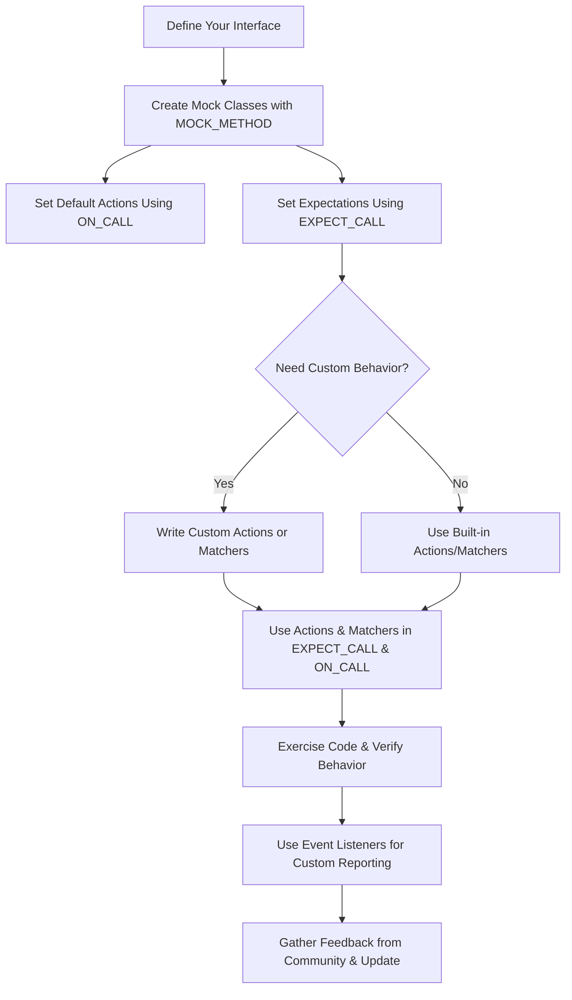

# Customization, Extensions, and Community Resources

GoogleTest and GoogleMock are designed with extensibility and user customization at their core. This page outlines the key ways you can extend overall functionality, customize assertions and events to fit your testing needs, and engage with vibrant community resources for support and further development.

---

## 1. Extending GoogleTest and GoogleMock

GoogleTest and GoogleMock provide flexible APIs and interfaces that let you tailor the framework for your unique requirements beyond the out-of-the-box capabilities.

### 1.1 User-Defined Assertions

- Create expressive, domain-specific assertions by defining your own macros or functions.
- Leverage custom **matcher definitions** (using `MATCHER`, `MATCHER_P` macros, or full matcher class implementations) to encapsulate complex validation logic.
- This enables cleaner, more readable tests that express intent clearly and provide detailed failure diagnostics.

Example snippet to define a simple matcher:

```cpp
MATCHER(IsPositive, "checks if a number is positive") {
  return arg > 0;
}

EXPECT_THAT(value, IsPositive());
```

Refer to the [Defining Custom Matchers](https://github.com/google/googletest/blob/main/api-reference/customization-and-matchers/defining-custom-matchers.md) for detailed guidance.

### 1.2 Event Listeners and Hooks

- GoogleTest supports **event listener interfaces** allowing users to intercept, customize, and react to events throughout the test lifecycle.
- Implement and register custom listeners to extend reporting, collect additional metrics, or integrate with external tools.
- Examples include listeners for test start/end, assertion failures, test suite completion, and more.

Using listeners, you can customize test execution reporting or inject custom test behavior.

### 1.3 Mock Behavior Customization

- Define your own **actions** that specify mock method behavior beyond built-in actions (returning values, invoking callables, throwing exceptions).
- Implement polymorphic actions or mock method-specific behaviors using the action interface or by combining existing actions.
- Customize or enhance matchers to recognize specialized argument properties.

Refer to the [gMock Cookbook](https://github.com/google/googletest/blob/main/docs/gmock_cook_book.md) and [Actions Reference](https://github.com/google/googletest/blob/main/api-reference/googlemock-mocking-apis/specifying-expectations-actions.md#actions) for recipes and examples.

### 1.4 Mock Class Generation and Simplification

- The `MOCK_METHOD` macro and other utilities allow streamlined creation of mocks.
- Advanced usage allows mocking of overloaded methods, methods with move-only types, and non-virtual methods with proper design.
- Consider creating simplified mock interfaces or adapters to reduce complexity and improve maintainability.

---

## 2. Key Plugins, Third-Party Extensions, and Tools

GoogleTest and GoogleMock ecosystems offer various third-party plugins, adapters, and tools to extend functionality:

- **Integration Plugins** for IDEs, CI systems, and build tools like Bazel, CMake, Ninja.
- **Coverage and Reporting** tools that interface with GoogleTest outputs.
- **Community-contributed matchers and actions** that can be imported to reduce development time.
- Tools for **benchmarking**, **performance profiling**, and **flakiness analysis**.

While this page does not list every extension, the community repositories and package managers hold numerous valuable utilities.

---

## 3. Community & Support Resources

Engaging with the community and official support resources can greatly accelerate your learning curve and problem solving.

### 3.1 Official Documentation and Tutorials

- [GoogleTest Primer](https://github.com/google/googletest/blob/main/docs/primer.md)
- [gMock for Dummies](https://google.github.io/googletest/gmock_for_dummies.html)
- [gMock Cookbook](https://github.com/google/googletest/blob/main/docs/gmock_cook_book.md)
- [Mocking Reference](https://github.com/google/googletest/blob/main/docs/reference/mocking.md)

### 3.2 Issue Tracker and Source Code

- Official GitHub repository: [https://github.com/google/googletest](https://github.com/google/googletest)
- Report bugs, request features, or contribute directly to the codebase.

### 3.3 Community Forums and Discussion

- Use GitHub discussions, mailing lists, and Stack Overflow to ask questions and share knowledge.
- Follow tags like `googletest` and `gmock` for relevant community input.
- Stay updated on new releases, best practices, and tips shared by experienced users.

### 3.4 Getting Professional Help

- While GoogleTest is open-source, professional consulting and support may be available via third-party and service providers.
- Consider contacting firms specializing in C++ testing to get tailored assistance.

---

## 4. Practical Tips for Leveraging Extensions

- Start with the built-in matchers and actions; use custom extensions when your test domain requires them.
- Prefer simple, readable custom assertions and matchers that clearly express intent.
- Use event listeners judiciously to keep tests isolated and avoid introducing side-effects.
- Regularly update your test dependencies and review community contributions for improvements.

---

## 5. Summary Diagram of Customization Workflow



---

## 6. Troubleshooting and FAQs

- If an assertion or matcher doesn’t behave as expected, verify custom matchers are functionally pure.
- When uninteresting call warnings appear unexpectedly, review mock strictness modes (`NiceMock`, `NaggyMock`, `StrictMock`).
- Use `--gmock_verbose=info` flag during test runs to get detailed logs of expected and actual mock calls.
- For trouble writing complex expectations, leverage the extensive matcher composition and sequence facilities.
- If compilation or linker errors arise with custom mocks or actions, ensure header dependencies and macro usages are correct.

---

## 7. Recommended Next Steps

- Explore the [Defining Custom Matchers](https://github.com/google/googletest/blob/main/api-reference/customization-and-matchers/defining-custom-matchers.md) documentation.
- Practice extending mock behaviors using the [gMock Cookbook](https://github.com/google/googletest/blob/main/docs/gmock_cook_book.md).
- Engage with the community on GitHub to share challenges and solutions.
- See the [Getting Started guides](https://github.com/google/googletest/tree/main/guides) to reinforce foundational knowledge.

---