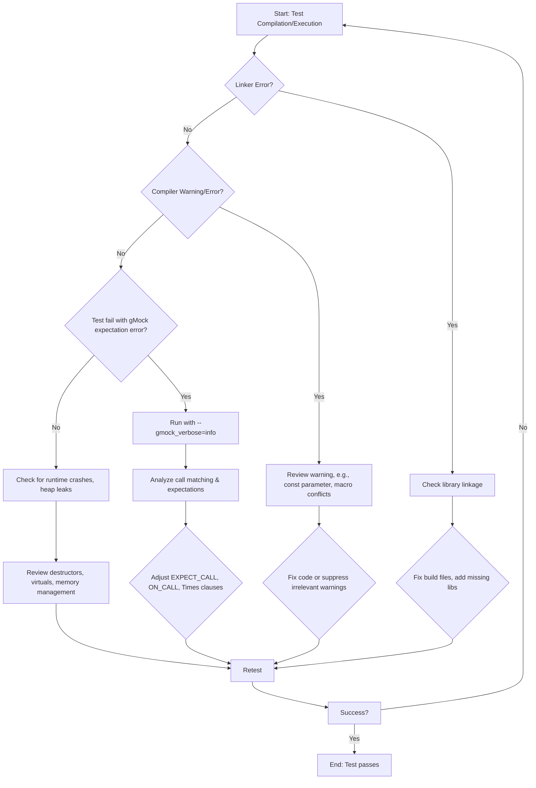

# Common Errors and How to Fix Them

This guide addresses frequent, cryptic error messages and pitfalls users may encounter when using GoogleTest and GoogleMock. The coverage ranges from linking errors and build issues to debugging test failures caused by incorrect mock usage and assertion misbehavior. Each section provides actionable explanations and solutions tailored to typical problems faced in writing and running unit tests with GoogleTest and GoogleMock.

---

## Linker and Build Errors

### Missing Symbols or Undefined References

**Problem:** You get linker errors complaining about missing GoogleTest or GoogleMock symbols.

**Causes & Solutions:**

- Ensure you added the proper GoogleTest and GoogleMock libraries to your build configuration.
- When using Bazel, make sure targets for `gmock` and `gtest` are included as dependencies and linked.
- For CMake, link your test executable against `gtest::gtest`, `gtest::gtest_main`, `gmock::gmock`, and `gmock::gmock_main` as appropriate.
- Confirm the include directories and library paths are correctly set.
- Verify you are compiling with at least C++17 standard, as required by GoogleTest/GoogleMock.

### Conflicts With Runtime Libraries on Windows

**Problem:** Linker errors or runtime problems related to different runtime libraries on Windows (e.g., CRT mismatches).

**Causes & Solutions:**

- Confirm that your project and all GoogleTest/GoogleMock binaries use the same runtime flags (`/MD` vs `/MT`).
- Avoid linking static and dynamic runtimes together.
- Use consistent compiler flags across all dependencies.

### Macro Conflicts (e.g., with Windows Headers)

**Problem:** Mock method names conflict with macros from system headers, like `Method` or `CreateWindow`.

**Causes & Solutions:**

- Include GoogleTest/GoogleMock headers after the inclusion of system headers.
- Use `#undef` to undefine problematic macros after including system headers but before mocking.
- Wrap mock definitions in namespaces or use fully qualified names.

---

## Compilation Issues

### Slow Compilation or Out-Of-Memory

- Large mock classes with many methods can cause slow compilation and high memory usage.
- **Mitigation:**
  - Move the mock class constructor and destructor definitions to a `.cc` source file instead of inline in the header.
  - Use type aliases and macro wrapping carefully to reduce template bloat.

### Compiler Warnings for Const Parameters

- MSVC may warn if you declare a function parameter as `const int` in a virtual function. While valid, these warnings can be suppressed by removing top-level `const` qualifiers on such parameters.

### Unsupported Features

- Variadic functions (`...` ellipsis) cannot be mocked directly; workarounds require refactoring code to use overloads or interfaces.

---

## Mock Expectations and Runtime Issues

### "Uninteresting function call encountered - default action taken"

**Explanation:**

- Your test called a mock method that had no expectations defined.
- GoogleMock warns because the call is unexpected from the test's viewpoint but allowed due to no explicit constraints.

**How to Fix:**

- Add specific `EXPECT_CALL()` statements to define expected calls.
- Use `ON_CALL()` to specify default behavior without strict call counts when calls may or may not happen.
- If you want to ignore all unexpected calls silently, wrap your mock with `NiceMock` to suppress warnings.
- If a call should *never* happen, specify `EXPECT_CALL(mock, Method()).Times(0);`

### "Actual function call count doesn't match this expectation"

- Occurs when a mock method is called fewer or more times than expected.
- **Tips:**
  - Review your `.Times()` clauses: `Exactly(n)`, `AtLeast(n)`, `Between(m, n)`, `AnyNumber()`.
  - Use `.RetiresOnSaturation()` if you need an expectation to be disabled after its call count is fulfilled.
  - Consider using sequences (`InSequence`) to enforce call order if multiple calls depend on ordering.

### "Unexpected mock function call"

- The called method arguments do not match any active expectations.

**How to Troubleshoot:**

- Run your test with `--gmock_verbose=info` to see detailed match attempts and which expectation was matched or failed.
- Check argument matchers (`_`, `Eq()`, custom matchers) for correctness.
- Review overlapping expectations and their order, since newer expectations override older ones.

### Setting Expectations Too Late

- `EXPECT_CALL()` must be set *before* the mock method is invoked.
- Defining expectations after code utilizing the mock has run yields undefined behavior.

### "Excessive call"

- Occurs when a mock method is called more times than allowed by the cardinality.

**Fix:**

- Review `.Times()` and `.WillRepeatedly()` clauses.
- Consider relaxing constraints or adding `.RetiresOnSaturation()`.

---

## Mock Method Declaration Issues

### Mocking Non-Virtual Methods

- Direct mocking requires methods to be virtual.
- For non-virtual methods, consider templates or wrappers for dependency injection.

### Overloaded Methods

- Must mock all overloads explicitly, or use `using` declarations to prevent hiding base methods.

### Move-Only Types

- Use `MOCK_METHOD` with move-only types (like `std::unique_ptr`) normally.
- Use lambdas for `.WillOnce()` or `.WillRepeatedly()` to return newly created objects each time rather than moving the same object multiple times.

### Mocking Private/Protected Methods

- `MOCK_METHOD` declarations must be in public sections regardless of base access.

---

## Debugging and Viewing Mock Behavior

### Controlling Verbosity of Mock Output

- Use `--gmock_verbose` flag with values `info`, `warning` (default), or `error`.
- `info` shows detailed tracing of each mock call and expectation matching, aiding in debugging complex failures.

### Enable Stack Traces on Failures

- Control stack trace depth with `--gtest_stack_trace_depth`.

### Use `SCOPED_TRACE` to Improve Failure Messages

- Helps identify failure points in nested function calls.

### Common Pitfalls

- Remember expectations are matched in reverse order (last matching expectation wins).
- Expectations are sticky unless `.RetiresOnSaturation()` or sequencing is used.
- Do not set expectations on mocks you do not own; otherwise, place mock definitions in appropriate test packages.

---

## Recommendations and Best Practices

- Prefer `ON_CALL` to set general default behavior, and only use `EXPECT_CALL` when you must verify call frequency or arguments.
- Use `NiceMock` when you want to ignore uninteresting calls without warnings.
- Use `StrictMock` to treat unexpected calls as test failures.
- Use `InSequence` or `Sequence` to verify call order logically.
- Define mock classes close to the interface owner to avoid duplication and maintenance overhead.

---

## Troubleshooting Quick Reference

<AccordionGroup title="Common Errors and Fixes">
<Accordion title="Linker Errors - Undefined Symbols">
Make sure GoogleTest and GoogleMock libraries are linked correctly. For CMake, link `gtest`, `gtest_main`, `gmock`, and `gmock_main` targets. For Bazel, check dependencies.
</Accordion>
<Accordion title="Uninteresting Call Warnings">
Either add `EXPECT_CALL`/`ON_CALL` to define behavior or use `NiceMock` to suppress warnings.
</Accordion>
<Accordion title="Unexpected Call Failures">
Run tests with `--gmock_verbose=info` to see detailed call matching and adjust your expectations or argument matchers accordingly.
</Accordion>
<Accordion title="Multiple Calls But Expected Fewer">
Verify your `.Times()` clauses and use `.RetiresOnSaturation()` if some calls can be ignored after a limit.
</Accordion>
<Accordion title="Compiling Slow or OOM">
Move mock class ctor/dtor to `.cc` file and reduce template bloat by aliasing complex types.
</Accordion>
</AccordionGroup>

---

## Additional Resources

- [gMock for Dummies](https://google.github.io/googletest/gmock_for_dummies.html) — Beginner-friendly guide explaining mock basics, mock classes, expectations, and usage.
- [Mocking Reference](https://google.github.io/googletest/reference/mocking.html) — API-focused detailed reference for mocks, expectations, actions, and matchers.
- [gMock Cheat Sheet](https://google.github.io/googletest/gmock_cheat_sheet.html) — Quick reference for defining mocks and expectations.
- [gMock Cookbook](https://google.github.io/googletest/gmock_cook_book.html) — Practical recipes for more advanced mock usages.
- [Legacy gMock FAQ](https://google.github.io/googletest/gmock_faq.html) — Answers to frequently asked questions and common errors.
- Troubleshooting build and environment setup: see [Common Installation & Build Issues](../../getting-started/troubleshooting-support/common-issues).

---

## Summary
This page guides you through typical errors encountered during setup, building, and running tests using GoogleTest and GoogleMock. It explains how to resolve linker errors, configure mocks correctly, write valid expectations, and debug common failure scenarios. Armed with this knowledge, you can overcome the hurdles that emerge in unit testing complex C++ codebases.

---

## Troubleshooting Workflow Diagram

---