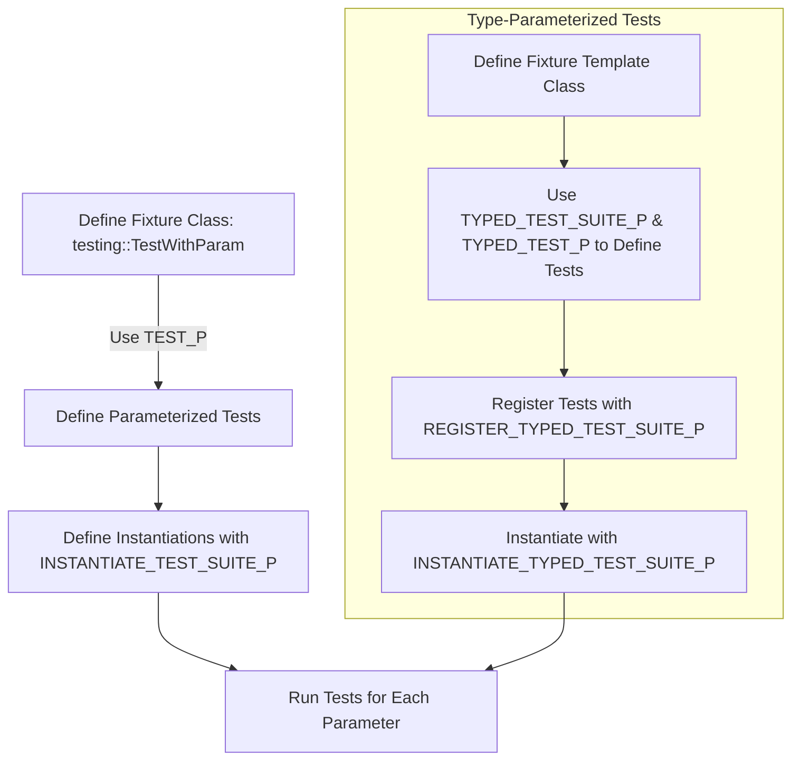

# Parameterized & Type-Parameterized Tests FAQ

This FAQ clarifies common questions about creating, running, and troubleshooting parameterized and type-parameterized test cases in GoogleTest. It explains key macros, common error patterns, and best practices for composing advanced tests using different parameter types and values.

---

## Frequently Asked Questions

### What is a Value-Parameterized Test? How do I write one?
Value-parameterized tests let you run the same test logic with different values or inputs without duplicating code. To write one:

1. Define a test fixture class deriving from `testing::TestWithParam<T>`, where `T` is the parameter type.
2. Use `TEST_P(FixtureName, TestName)` to define parameterized tests that access the parameter value with `GetParam()`.
3. Provide instantiations using `INSTANTIATE_TEST_SUITE_P` with a parameter generator such as `Values()`, `Range()`, `Combine()`, etc.

Example:
```cpp
class MyTest : public testing::TestWithParam<int> {};

TEST_P(MyTest, IsEven) {
  int n = GetParam();
  EXPECT_EQ(n % 2, 0) << n << " is not even";
}

INSTANTIATE_TEST_SUITE_P(EvenNumbers, MyTest, testing::Values(2, 4, 6));
```

### What types can I use as test parameters?
Parameters can be any copyable type, including primitive types, classes, enums, and even tuples. If a parameter type is a raw pointer, you must manage the lifetime safely.

For complex parameters, use `Combine()` to compose tuples of multiple parameters.

### How can I provide custom names for instantiated tests?
The last optional parameter to `INSTANTIATE_TEST_SUITE_P` accepts a callable or function that generates test names from the parameter. This is useful when the default name, which is based on `PrintToString`, is insufficient or produces unreadable names.

Example:
```cpp
INSTANTIATE_TEST_SUITE_P(
    NamedParams, MyTest, testing::Values("first", "second"),
    [](const testing::TestParamInfo<MyTest::ParamType>& info) {
      return info.param == "first" ? "FirstTest" : "SecondTest";
    });
```

### What is a Typed Test? How is it different from a Value-Parameterized Test?
Typed tests run the same set of tests over a list of types rather than values. Unlike value-parameterized tests, the set of types must be known at test definition time.

Usage steps:

1. Define a class template fixture deriving from `testing::Test`.
2. Declare a `Types<...>` list of types.
3. Use `TYPED_TEST_SUITE` to tie the fixture and type list.
4. Define tests with `TYPED_TEST(Fixture, TestName)`, using `TypeParam` to refer to the current type.

Example:
```cpp
template <typename T>
class MyTypedTest : public testing::Test {};

using MyTypes = ::testing::Types<int, double>;
TYPED_TEST_SUITE(MyTypedTest, MyTypes);

TYPED_TEST(MyTypedTest, IsDefaultConstructible) {
  TypeParam value{};
  (void)value;  // Silence unused variable warnings
}
```

### What is a Type-Parameterized Test? How is it different from Typed Tests?
Type-parameterized tests are like typed tests but allow test patterns to be defined *without* knowing the actual type list upfront. Test logic is defined using `TYPED_TEST_SUITE_P` and `TYPED_TEST_P`. Then, tests are registered with `REGISTER_TYPED_TEST_SUITE_P` and instantiated later with `INSTANTIATE_TYPED_TEST_SUITE_P`, specifying types to test.

This enables reusable abstract test suites that others can instantiate with their own types.

### What causes errors when using `TEST_P` or `TYPED_TEST_P`?

Common error sources include:
- Forgetting to provide an `INSTANTIATE_TEST_SUITE_P` for every `TEST_P` suite.
- Marking parameterized test suites as uninstantiated without explicit allowance (`GTEST_ALLOW_UNINSTANTIATED_PARAMETERIZED_TEST`).
- Using underscores (`_`) in test suite or test names, which is against naming conventions.
- Not declaring `SetUpTestSuite` and `TearDownTestSuite` as public when using parameterized tests.
- Omitting `REGISTER_TYPED_TEST_SUITE_P` after declaring `TYPED_TEST_P` test patterns.

### Can I define parameterized tests in one source file and instantiate them in another?
Yes. This supports modular testing where you distribute abstract test suites in headers/source files and instantiate concrete parameter lists elsewhere. Just put the test fixture and `TEST_P` or `TYPED_TEST_P` definitions into header/source files and call `INSTANTIATE_TEST_SUITE_P` or `INSTANTIATE_TYPED_TEST_SUITE_P` with the desired parameters in separate files.

### How do the instantiated tests appear in test discovery and filtering?
Instantiated value-parameterized tests get names like `InstantiationName/TestSuite.TestName/Index`, where `Index` is the zero-based index of the parameter.

Typed and type-parameterized tests include the type name in the test suite name, often with a prefix. Custom type name generators can be provided.

These names allow filtering with `--gtest_filter`.

### What happens if I do not instantiate a parameterized test suite?
GoogleTest treats it as a test suite with no tests, raising a failure in the special suite `GoogleTestVerification`. To avoid this for abstract tests or dynamically instantiated tests, add `GTEST_ALLOW_UNINSTANTIATED_PARAMETERIZED_TEST(SuiteName);`.

### Can I mix typed, type-parameterized, and value-parameterized tests?
Yes. They serve different testing needs: values vs types. You can have typed tests for running across types, and at the same time have value-parameterized tests that test a fixture with different input values.

---

## Best Practices and Tips

- **Name your test suites and tests without underscores** to avoid compatibility issues.
- Use **custom parameter name generators** to produce readable test names especially for complex parameters.
- Prefer **`TestWithParam<T>`** for value-parameterized tests for convenience.
- When dealing with complex parameter tuples, use `Combine()` to generate Cartesian products.
- Declare `SetUpTestSuite()` and `TearDownTestSuite()` as **`public`** if you use `TEST_P` or `TYPED_TEST_P`.
- Use `GTEST_ALLOW_UNINSTANTIATED_PARAMETERIZED_TEST` cautiously—only for abstract tests or special cases.
- For type-parameterized tests, always **register** your test patterns using `REGISTER_TYPED_TEST_SUITE_P` before instantiation.
- Remember that code inside `INSTANTIATE_*` macros is only evaluated after `InitGoogleTest()` is called.
- Carefully manage life-cycle of raw pointers if used as parameters.

---

## Common Issues & Troubleshooting

### Missing Instantiations
- You forgot to call `INSTANTIATE_TEST_SUITE_P` or `INSTANTIATE_TYPED_TEST_SUITE_P`.
- Forgot to register typed test patterns with `REGISTER_TYPED_TEST_SUITE_P`.
- Fix these by ensuring all parameterized tests are properly instantiated and registered.

### Naming Conflicts and Invalid Characters
- Test or test suite names with underscores or invalid characters produce errors.
- Use only alphanumeric characters; prefer CamelCase.

### Access Rights for SetUpTestSuite and TearDownTestSuite
- Tests fail at runtime because these functions are not `public`.
- Define them as `public` in parameterized test fixtures.

### Parameter Type Issues
- Non-copyable or complex parameters cause compiler errors.
- Ensure parameters are copyable and streamable (or define custom printers).

### Unexpected Test Names
- Test names look mangled or unreadable.
- Provide a custom naming functor or lambda to `INSTANTIATE_TEST_SUITE_P` or `TYPED_TEST_SUITE`.

### Debugging Test Parameters
- Use `PrintToString` or `SCOPED_TRACE` to log parameters on failures.

---

## Additional Resources

- [Value-Parameterized Tests - Detailed Guide](../advanced.md#value-parameterized-tests)
- [Type-Parameterized Tests - Detailed Guide](../advanced.md#type-parameterized-tests)
- [INSTANTIATE_TEST_SUITE_P Macro Reference](../reference/testing.md#INSTANTIATE_TEST_SUITE_P)
- [TYPED_TEST_SUITE and TYPED_TEST Macros Reference](../reference/testing.md#TYPED_TEST_SUITE)
- [GTEST_ALLOW_UNINSTANTIATED_PARAMETERIZED_TEST](../reference/testing.md#GTEST_ALLOW_UNINSTANTIATED_PARAMETERIZED_TEST)
- [Custom Test Name Generation](../advanced.md#specifying-names-for-value-parameterized-test-parameters)

---

## Troubleshooting Example

If you encounter this runtime error:

```
You forgot to instantiate test suite FooTest.
```

Make sure:

- Your `TEST_P(FooTest, ...)` definitions have a corresponding `INSTANTIATE_TEST_SUITE_P` macro invocation.
- If you intentionally want the suite uninstantiated (example, abstract tests), add
  `GTEST_ALLOW_UNINSTANTIATED_PARAMETERIZED_TEST(FooTest);`

---

## Diagram: Parameterized Test Flow



---