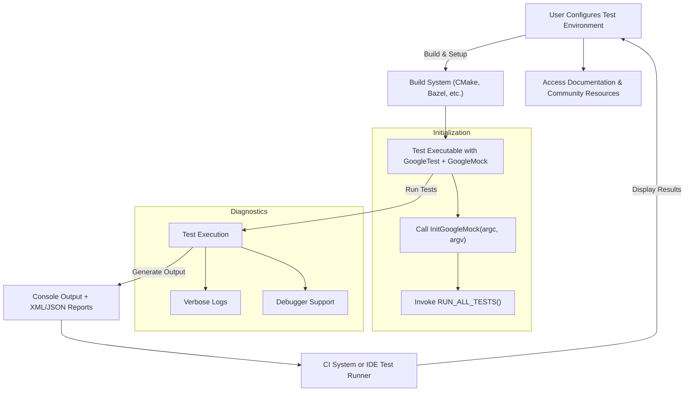

# Integration Troubleshooting (CI, IDEs, External Tools)

This page provides focused guidance to effectively integrate and troubleshoot GoogleTest and GoogleMock when used in continuous integration (CI) pipelines, popular IDEs like Visual Studio Code, and third-party tools. It addresses configuring the environment for smooth execution, managing test output formats for automated systems, and integrating diagnostic information to streamline debugging.

---

## 1. Common Integration Scenarios and User Intent

Users integrating GoogleTest and GoogleMock into CI pipelines or IDEs generally want to achieve the following goals:

- **Seamless test execution**: Run tests automatically as part of build and CI workflows.
- **Clear, structured test reports**: Generate machine-readable output that CI systems or test report dashboards can parse.
- **Efficient debugging**: Access detailed diagnostic information directly within IDEs or CI logs for quick problem identification.
- **Consistent environment setup**: Ensure the testing framework works reliably across different platforms and tools.

This page guides users on how to accomplish these outcomes.


## 2. Preparing Your Environment for Integration

To ensure smooth integration with CI systems and IDEs:

- **Initialize the testing framework appropriately**:
  - Use `testing::InitGoogleTest(&argc, argv);` or `testing::InitGoogleMock(&argc, argv);` at the start of your test executable's `main()` function. This is critical for parsing flags and enabling proper test registration.
  - For environments without standard argc/argv (e.g., embedded or Arduino-like), use the `InitGoogleTest()` or `InitGoogleMock()` overloads without arguments.

- **Return the proper status code from main()**:
  - Always return the result of `RUN_ALL_TESTS()` from your `main()` function. CI systems depend on the process exit code to determine test success or failure.

- **Build with the correct C++ standard and dependencies**:
  - GoogleTest requires C++17 or newer. Ensure your build system enforces this.
  - For multi-threaded environments, confirm pthread support is linked correctly, or disable pthread support explicitly if unavailable.

- **Use the provided gtest_main or gmock_main libraries when possible** for default `main()` implementations to avoid custom boilerplate.


## 3. Handling Test Output Formats for CI Pipelines

Effective CI integration requires test outputs in formats consumable by CI tools:

- **Default console output**:
  - GoogleTest prints readable summaries and detailed failure messages.
  - For CI logs, verbosity can be adjusted using flags like `--gtest_verbose`.

- **XML Output for CI Reporting**:
  - Use the flag `--gtest_output=xml[:path]` to generate JUnit-compatible XML test reports.
    - For example: `--gtest_output=xml:report.xml`
  - CI tools like Jenkins, GitLab CI, and CircleCI can parse this XML to display test results.
  - XML files are written after test suite completion.

- **JSON Output (Experimental)**:
  - Newer versions of GoogleTest support `--gtest_output=json[:path]` for JSON-formatted reports.
  - This format may require additional parsing tools compatible with your CI.

**Note:** Ensure your build or test runner captures and persists these output files within your CI environment.


## 4. Integrating with Popular IDEs (e.g., VS Code)

When using IDEs like Visual Studio Code, users seek:

- **Test discovery and navigation**:
  - Use extensions like the C++ TestMate extension or GoogleTest Adapter to discover and run tests inside the IDE.
  - Configure the extension to point to your test binary; ensure it supports GoogleTest's test listing format.

- **Interactive test run and failure diagnostics**:
  - Run tests via IDE UI to see real-time pass/fail results.
  - Leverage IDE debugging tools to set breakpoints on test failures.

- **Parsing output for inline error highlighting**:
  - GoogleTest outputs source file names and line numbers on failures, which IDEs recognize to link failures directly to code

- **Recommended IDE tasks**:
  - Customize your launch configurations to pass GoogleTest flag arguments (e.g., filters or output options).
  - Enable verbose or detailed output during test runs for better insight.


## 5. Diagnosing Common Integration Issues

<AccordionGroup title="Common Integration Challenges and Their Fixes">
<Accordion title="Tests Not Detected or Running in IDE">
- Ensure test executable is built with debug symbols and not stripped.
- Verify that `InitGoogleTest()` or `InitGoogleMock()` is correctly called, as test registration depends on it.
- Check for missing or incomplete test macros (`TEST()`, `TEST_F()`, etc.).
- Confirm IDE extensions support your GoogleTest version.
</Accordion>

<Accordion title="CI Reports Not Generating XML or JSON Output">
- Make sure command line flags like `--gtest_output=xml:report.xml` are passed to the test binary.
- Verify write permissions in the target directory.
- Confirm no conflicting flags alter output behavior.
- If reports are empty, check if tests are running and producing results.
</Accordion>

<Accordion title="Exit Code Is Always Zero, Even When Tests Fail">
- Confirm your `main()` returns `RUN_ALL_TESTS()`'s result.
- Do not call `RUN_ALL_TESTS()` multiple times.
- Avoid ignoring or overriding GoogleTest's exit status in scripts.
</Accordion>

<Accordion title="Failed Expectations or Assertions Not Shown Clearly in Logs">
- Use verbose flag `--gtest_verbose=info` to increase output details.
- Ensure logs are fully captured in CI environment.
- Use IDE debugging features to break on assertion failures.
</Accordion>
</AccordionGroup>


## 6. Best Practices for Reliable Integration

- Use the official GoogleTest and GoogleMock entry points (`gtest_main` and `gmock_main`) when possible, minimizing custom main functions.
- Automate test execution as part of your CI scripts with consistent flags.
- Embrace XML output and integrate with your CI dashboard for visual report summaries.
- Keep your test binaries stable and up-to-date to avoid IDE and tooling mismatches.
- Leverage GoogleTest’s filtering (`--gtest_filter`) to run subsets of tests in CI or IDE for rapid feedback.


## 7. Useful Diagnostic Tips

- Use `--gtest_list_tests` to display all recognized tests. If your test is missing, re-examine test macros and registration.
- Run with `--gtest_break_on_failure` to allow IDE debuggers to catch test failures instantly.
- Enable verbose messages with `--gtest_verbose=info` to identify test lifecycle details.
- When integrating mocks with GoogleMock, ensure `testing::InitGoogleMock()` is called to correctly initialize GoogleMock and GoogleTest.


## 8. Example: Minimal main() for CI and IDE Integration

```cpp
#include <gmock/gmock.h>  // Includes GoogleMock and GoogleTest

int main(int argc, char** argv) {
  testing::InitGoogleMock(&argc, argv);  // Initializes gMock and gTest flags
  return RUN_ALL_TESTS();  // Runs all tests and returns proper exit code
}
```


## 9. Additional Resources

- [GoogleTest Primer](primer.md) for basics on test writing
- [GoogleMock for Dummies](gmock_for_dummies.md) for mocking and expectations
- [CI Integration and Test Reporting Guide](guides/advanced-and-integrations/ci-integration-and-test-reporting.md) for detailed continuous integration workflows
- [Troubleshooting Common Setup Issues](getting-started/troubleshooting/common-setup-issues.md) for build and environment problems
- [Installation & Integration](getting-started/environment-installation/installation-integration.md) for setup and environment configuration

---

<Tip>
Always validate your integration by running tests locally first, using the exact commands and flags intended for CI or IDE usage. Reproduce reported issues locally to expedite fixes.
</Tip>

<Warning>
Never ignore the return value of `RUN_ALL_TESTS()`. Ignoring it can cause your CI to report false positives, breaking automated quality gates.
</Warning>

---

## 10. Summary Diagram of Integration Workflow



---

This diagram illustrates the typical flow from environment configuration through test execution and output consumption by CI/IDE systems, highlighting key integration steps.
