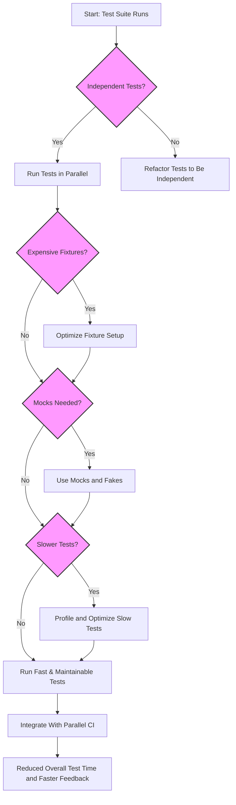

# Improving Test Suite Performance

Explore actionable tips to reduce test runtime, including running tests in parallel, optimizing fixture usage, leveraging value and type parameterized tests, and integrating with fast continuous integration (CI) systems. Understand resource management strategies to prevent bottlenecks and achieve a faster, more efficient test suite.

---

## 1. Why Focus on Test Suite Performance?

A fast test suite accelerates the development feedback cycle, boosts developer productivity, and enhances continuous integration efficiency. Slower tests lead to delayed bug detection and overall reduced momentum. This page arms you with practical strategies to identify, address, and prevent common test performance bottlenecks.

---

## 2. Techniques for Speeding up Your Test Suite

### 2.1 Run Tests in Parallel

Running tests concurrently is among the most effective ways to cut down total test time. Here’s how:

- **Divide tests into multiple binaries** where possible. This enables native parallelism without contention.
- **Shard tests across multiple processes or machines** to distribute workload effectively in CI environments.
- **Use GoogleTest’s built-in parallel test execution flags** where applicable (e.g., `--test-jobs` in Bazel).

<Tip>
Splitting test binaries by logical components or test suites simplifies parallelization and speeds up failure isolation.
</Tip>

### 2.2 Optimize Test Fixture Usage

Test fixtures help set up and tear down test state. However, heavy or unnecessary setup can slow tests down.

- **Avoid expensive setup in fixtures unless absolutely needed.**
- **Reuse shared resources carefully** but avoid cross-test state leakage.
- **Minimize I/O and external resource usage in fixtures.**

<Tip>
Prefer lightweight, fast setup in fixtures and isolate expensive initialization in fewer integration-style tests.
</Tip>

### 2.3 Use Value-Parameterized and Type-Parameterized Tests

Parameterized tests allow you to run the same test logic over multiple inputs efficiently:

- **Value-Parameterized Tests**: Run tests with a range of input data without duplicating code.
- **Type-Parameterized Tests**: Test multiple data types or templates with the same test logic.

This helps keep your test code concise and focused, often reducing overall test runtime by consolidating code paths.

### 2.4 Leverage Mocks and Fakes to Cut Dependencies

Complex tests relying on numerous dependencies (e.g., databases, networks) can be slow and flaky.

- Mock out external dependencies with GoogleMock to isolate tests.
- Use fakes or stubs where suitable to simulate realistic behavior with minimal overhead.

<Tip>
Use gMock’s abilities like `ON_CALL` for default behaviors and `EXPECT_CALL` for specific expectations to create fast, isolated tests.
</Tip>

### 2.5 Avoid Test Pollution and Resource Contention

Shared global or static resources can cause tests to interfere or serialize execution unintentionally.

- Ensure tests are independently executable and stateless where possible.
- Avoid file system locking or database contention with unique test data per invocation.
- Clean up thoroughly after tests.

### 2.6 Skip or Disable Slow Tests in Regular Runs

Not all tests must run every time.

- Categorize tests by runtime or flakiness.
- Use labels or filters to exclude long-running integration or flaky tests from frequent runs.

This keeps your fast feedback loop responsive while still enabling comprehensive testing in longer schedules.

### 2.7 Integrate with Fast and Scalable CI Systems

- Use build tools like Bazel or CMake’s test runners in a CI environment optimized for parallel execution.
- Generate and consume XML reports for failure visibility.
- Apply test retries judiciously to reduce false failures but avoid masking real issues.

<Tip>
A well-tuned CI pipeline that orchestrates parallel test runs and delivers clear reports immensely accelerates team velocity.
</Tip>

---

## 3. Best Practices for Managing Test Suite Performance

- **Profile your tests** to identify slow or flaky tests needing attention.
- **Continuously refactor tests** to use mocks and parameterized tests.
- **Keep tests small, independent, and fast** to support parallel execution seamlessly.
- **Document known long-running tests** and rationalize their inclusion.
- **Use proper synchronization and avoid race conditions** when tests run in parallel.

---

## 4. Common Pitfalls and How to Avoid Them

### Pitfall: Overusing Expensive Fixtures

> Tests run slowly as each test initializes heavy resources unnecessarily.

**Solution:** Use `SetUpTestSuite` and `TearDownTestSuite` for expensive one-time setup shared by all tests in a suite.

### Pitfall: Excessive Test Dependencies

> Tests take a long time waiting for network or disk I/O.

**Solution:** Mock external dependencies to keep tests isolated and fast.

### Pitfall: Flaky Tests due to Shared State

> Parallel runs cause intermittent failures.

**Solution:** Design tests to avoid shared global state and clean up resources diligently.

### Pitfall: Ignoring Test Failures Due to Overly Loose Expectations

> Using mocks without proper `EXPECT_CALL` can allow tests passing while the code under test misbehaves.

**Solution:** Balance use of `ON_CALL` and `EXPECT_CALL`. Use `StrictMock` or `NiceMock` to control strictness and warnings appropriately.

---

## 5. Useful Commands and Flags

- Run tests in parallel with Bazel: `bazel test --test_sharding_strategy=disabled --jobs=N //...`
- Control GoogleTest test filters: `--gtest_filter=Pattern`
- Control GoogleMock verbosity for detailed debug info: `--gmock_verbose=info`
- Enable GoogleTest sharding: `--gtest_shard_index=0 --gtest_total_shards=N`

Refer to the [Test Control guide](/guides/core-testing-workflows/test-control) for deeper details on controlling execution.

---

## 6. Additional Resources

- [gMock for Dummies](https://google.github.io/googletest/gmock_for_dummies.html) – Learn mocking basics.
- [gMock Cookbook](https://google.github.io/googletest/gmock_cook_book.html) – Advanced mocking recipes.
- [Performance Optimization Guide](/guides/advanced-and-integration/performance-tips) – Expand your performance strategies.
- [Continuous Integration and Test Automation](/guides/advanced-and-integration/ci-integration) – For integrating fast tests in CI.

---

### Related Documentation

- [Mocking Reference](/docs/reference/mocking.md) – Complete reference on mocks.
- [gMock Cheat Sheet](/docs/gmock_cheat_sheet.md) – Quick lookup of common APIs.
- [Mock Strictness: Nice, Naggy, and Strict Mocks](/api-reference/structuring-behaviors/mock-strictness.mdx) – How to control mock warnings and errors.
- [Test Control Guide](/guides/core-testing-workflows/test-control) – For filtering and ordering tests.

---

### Summary Flow Diagram

---

<Tip>
Remember that improving test performance is iterative. Start with the biggest bottlenecks, and gradually introduce mocks, parallelism, and fixture reusability to reap continuous gains.
</Tip>

<Check>
To get real benefits:
- Run tests in parallel wherever possible.
- Use `EXPECT_CALL` and `ON_CALL` judiciously to reduce test flakiness.
- Profile tests regularly to detect regressions.
- Integrate performance measures into your CI pipelines.
</Check>

---

## 7. Troubleshooting Common Performance Issues

### Q: Why are my tests slow despite mocks?
- Verify mocks are not creating unnecessary overhead.
- Ensure expectations (`EXPECT_CALL`) are set before mock usage.
- Avoid complex matcher expressions or redundant `WillOnce` actions.

### Q: How to handle flaky tests in parallel execution?
- Check for shared mutable global state.
- Use test-specific isolated resources.
- Apply synchronization if accessing shared resources.

### Q: How do I suppress uninteresting call warnings without hiding real issues?
- Use `NiceMock` for mocks where warnings are too verbose.
- Use `StrictMock` to catch unexpected calls as errors for critical mocks.
- Balance strictness by adding baseline `EXPECT_CALL(...).Times(AnyNumber())` for catch-all.

### Q: What command flags can help diagnose slow tests?
- Use `--gmock_verbose=info` to see mock call matching details.
- Use test filtering flags to isolate problematic tests.

---

## 8. Practical Tips

- **Order your expectations carefully:** Newer `EXPECT_CALL`s override older ones; put more general expectations first and specifics later.
- **Use `RetiresOnSaturation()` when sequencing expectations:** Avoid sticky expectations that block subsequent calls.
- **Wrap expectations in `InSequence` to enforce call order:** Especially useful to manage dependent interactions.
- **Keep default actions with `ON_CALL` to avoid unexpected default returns:** This keeps mock behavior predictable.

---