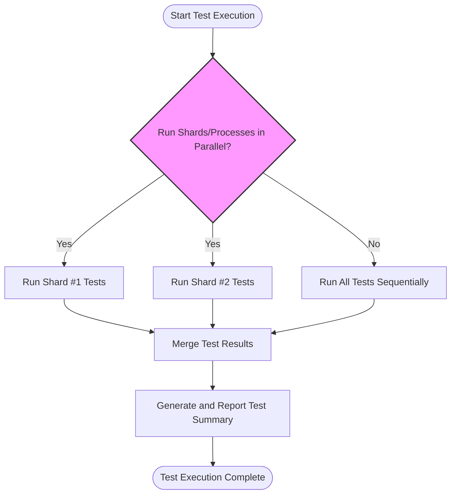

# How can I optimize test suite performance?

This guide provides targeted advice on how to reduce test execution time and resource usage when working with GoogleTest and GoogleMock. It highlights practical strategies including parallelization, leveraging test runners and sharding, and identifying bottlenecks common in complex and large test environments.

---

## 1. Reducing Test Execution Time

### Parallelizing Tests

GoogleTest supports running tests in parallel using multiple processes, which scales test execution across CPU cores:

- **Parallel Test Execution**: Use external tools or CI integration that supports running multiple test executables or instances simultaneously, making full use of available CPU cores.
- **Sharding Tests**: Use the `--gtest_shard_index` and `--gtest_total_shards` flags to split your tests into shards distributed across runners or machines.

***Example:***
```bash
./my_test_executable --gtest_shard_index=0 --gtest_total_shards=2 &
./my_test_executable --gtest_shard_index=1 --gtest_total_shards=2 &
wait
```
This splits the tests into two groups run concurrently, halving test runtime ideally.

### Test Filtering

If you want to optimize iterative development cycles, run only the tests related to the recent changes:

- Use the `--gtest_filter` flag to restrict running tests by name patterns.
- Organize tests with naming conventions and suites that facilitate targeted execution.

***Example:***
```bash
./my_test_executable --gtest_filter=MyComponent*  # Run only tests for MyComponent
```

### Efficient Test Suites and Fixtures

- Share expensive setup via `SetUpTestSuite` to reduce overhead.
- Avoid overly large, monolithic test fixtures to minimize resource locking and increase parallel scope.

### Use NiceMocks To Avoid Unnecessary Overhead

For mocks where behavior verification is not needed, use `NiceMock` to reduce warnings and performance overhead caused by uninteresting call checks.

---

## 2. Leveraging Available Runners and Tools

### Continuous Integration (CI) Integration

Improve performance in CI by:

- Distributing test shards across multiple CI agents.
- Using test result output in XML format (`--gtest_output=xml:filename`) for faster analysis without blocking builds.

### Multi-platform Testing

Use GoogleTest’s cross-platform support to run tests in parallel on different OS platforms and architectures.

### Validation Workflows

Run quick validations during local development with focused test filters, reserving full runs with extensive parallelism for nightly builds.

---

## 3. Recognizing and Addressing Bottlenecks

### Identify Slow Tests

- Use test timing output (`--gtest_print_time`) to detect unexpectedly slow tests.
- Refactor or isolate heavy tests to reduce total runtime.

### Avoid Race Conditions in Parallel Tests

- Ensure tests do not share and mutate global state unsafely.
- Use synchronization or isolate test data to avoid deadlocks or flaky failures.

### Reduce Mocking Overhead

- Limit mock complexity in critical paths.
- Delegate to fakes or real objects when appropriate instead of fully mocking.

### Minimize External Dependencies

- Avoid relying on slow external resources (databases, networks).
- Use mocks or lightweight fakes to speed up tests.

---

## 4. Practical Tips & Best Practices

- Use the `InSequence` or `Sequence` constructs wisely to avoid unnecessary serialization of tests.
- Use `RetiresOnSaturation()` to prevent expectations from remaining active when no longer needed, reducing matching overhead.
- When using parameterized or typed tests, ensure test instantiations are efficiently filtered or sharded.

---

## 5. Example Workflow for Performance Optimization

<Steps>
<Step title="Analyze Current Test Suite Performance">
Run tests with `--gtest_print_time` to get detailed timing information for each test case.
</Step>
<Step title="Isolate Slow Tests">
Focus refactoring or test isolation on tests that consume disproportionate runtime.
</Step>
<Step title="Parallelize Test Runs">
Configure CI to shard tests across multiple agents or use local parallel runs where possible.
</Step>
<Step title="Use Filtering During Development">
Run only impacted test subsets with `--gtest_filter` during coding iterations.
</Step>
<Step title="Adopt Mocking Best Practices">
Leverage `NiceMock` to reduce unnecessary warnings and optimize mock setup.
</Step>
</Steps>

---

## 6. Troubleshooting Performance Issues

<AccordionGroup title="Common Performance Pitfalls">
<Accordion title="Tests Not Running in Parallel as Expected">
Verify your build or CI system supports launching multiple test processes in parallel and that your test sharding (if used) aligns correctly.
</Accordion>
<Accordion title="Excessive Setup/TearDown Overhead">
Review fixture SetUp/TearDown performance. Consider moving heavy initialization to `SetUpTestSuite` or external resources.
</Accordion>
<Accordion title="Flaky Tests when Parallelized">
Ensure tests correctly isolate state and do not share resources without locks or synchronization.
</Accordion>
<Accordion title="Mock Overhead Causing Slowdowns">
Avoid complex mock setups or excessive expectations; delegate to fakes or real implementations where feasible.
</Accordion>
</AccordionGroup>

---

## 7. Related Resources

- [Integration and Build System Support](/overview/feature-overview-integration/integration-points) — Guide to integrating with build and CI systems
- [Performance & Optimization Guide](/guides/integration-real-world/performance-optimization) — Deep dive on optimizing tests
- [Mocking Reference](/docs/reference/mocking) — Effective mock techniques
- [Running Tests in Parallel](/concepts/extensibility-and-advanced-usage/integration-patterns) — Strategies on orchestrating test runs

---

## 8. Summary

Optimizing test suite performance involves parallelizing execution, selectively running tests via filters and shards, minimizing setup overhead, and applying best practices with mocks and fixtures. Recognizing bottlenecks and profiling test times drives targeted improvements, while integrating with CI pipelines expedites feedback cycles.

---

# Effective use of GoogleTest and GoogleMock for performance is a balance of structuring tests thoughtfully and harnessing available tooling to accelerate execution and maintain quality verification.


<Check>
Remember: maintaining test correctness and reliability while optimizing speed is critical. Always verify stability after performance tuning.
</Check>

---

# Appendices

### Key Flags for Performance

| Flag                        | Purpose                                             |
| --------------------------- | --------------------------------------------------- |
| `--gtest_filter=PATTERN`    | Run only tests matching the pattern                 |
| `--gtest_shard_index=N`     | Run shard number `N` of total shards                 |
| `--gtest_total_shards=M`    | Total number of shards to split the tests into       |
| `--gtest_print_time`        | Print execution time for each test                   |
| `--gtest_repeat=N`          | Repeat tests N times for stability analysis          |
| `--gmock_verbose=LEVEL`     | Verbosity for mock warning messages (e.g., info)    |

### Useful Constructs

- `InSequence` and `Sequence` — control call order to avoid unnecessary serialization.
- `RetiresOnSaturation()` — retire expectations promptly for less overhead.
- `NiceMock` — suppress warnings and reduce overhead from uninteresting calls.

---

# Diagram: Simplified Flow of Test Execution With Parallel Shards



This demonstrates running test shards concurrently and merging results for CI or reporting tools.


---