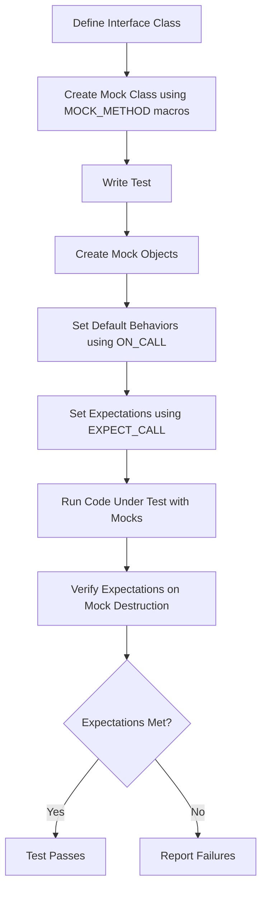

# What is GoogleMock and how do I use it?

GoogleMock (gMock) is a powerful C++ framework designed for creating and using *mock objects* — objects that simulate the behavior of real components in a controlled and observable manner. It works alongside GoogleTest (gTest) to enable interaction-based testing, allowing you to specify and verify how your code under test *interacts* with its dependencies rather than only checking final states.

Mock objects help you test units of code in isolation by replacing real collaborators with these programmable stand-ins, making tests faster, more robust, and easier to write, especially in complex or external-system-dependent scenarios.

---

## Core Concepts of Mocking

### What is a Mock Object?

A mock object:

- Implements the same interface as a real object.
- Is pre-programmed with *expectations* about how it should be used.
- Tracks interactions: which methods are called, with what arguments, and how many times.
- Can provide canned responses or invoke specified behaviors when called.

This lets you verify both *what happened* and *how it happened* during tests.

### Role of GoogleMock in GoogleTest

- GoogleTest provides the test framework and assertions.
- GoogleMock extends this by enabling mocks with intuitive syntax for setting expectations and behaviors.
- Together, they support first-class unit testing and interaction-based testing.


## Getting Started with GoogleMock

Here’s how you typically use GoogleMock to write a test:

### 1. Define Your Mock Class

Create a mock class that inherits from the interface you want to mock. Use the `MOCK_METHOD` macro to declare mock methods.

```cpp
#include <gmock/gmock.h>  // include the GoogleMock headers

class Turtle {
 public:
  virtual ~Turtle() {}
  virtual void PenUp() = 0;
  virtual void Forward(int distance) = 0;
  virtual int GetX() const = 0;
};

class MockTurtle : public Turtle {
 public:
  MOCK_METHOD(void, PenUp, (), (override));
  MOCK_METHOD(void, Forward, (int distance), (override));
  MOCK_METHOD(int, GetX, (), (const, override));
};
```

**Important:**
- The mock methods must appear in the `public:` section of your mock class, regardless of the original method access level.
- Add `(override)` to clarify you're overriding base virtual methods.
- For const methods, include `(const, override)`.

### 2. Create Mock Objects in Tests

Instantiate your mock class where you want to inject mocks.

```cpp
MockTurtle mock_turtle;
```

You can also create `NiceMock` or `StrictMock` wrappers:
- `NiceMock<T>` suppresses warnings on unexpected calls.
- `StrictMock<T>` treats unexpected calls as errors.

Example:

```cpp
using ::testing::NiceMock;
NiceMock<MockTurtle> mock_turtle;
```

### 3. Set Expectations and Default Behaviors

Use `EXPECT_CALL` to specify which methods should be called, how many times, and with what arguments.

```cpp
using ::testing::AtLeast;
using ::testing::_;  // wildcard matcher

EXPECT_CALL(mock_turtle, PenUp())
    .Times(AtLeast(1));
EXPECT_CALL(mock_turtle, Forward(_))  // Any integer
    .WillOnce(::testing::Return());
```

- `EXPECT_CALL` both sets expectations *and* defines behaviors.
- To set only default behavior without expectation, use `ON_CALL`:

```cpp
ON_CALL(mock_turtle, GetX())
    .WillByDefault(::testing::Return(42));
```

### 4. Exercise Your Code Under Test

Pass your mock object to the code that depends on it and run your test.

### 5. Verification

When the mock object is destructed (e.g., at end of a test), GoogleMock automatically verifies that all expectations were met. If not, it will report test failures.

You can also verify earlier manually using:

```cpp
ASSERT_TRUE(::testing::Mock::VerifyAndClearExpectations(&mock_turtle));
```


## Writing Expectations With `EXPECT_CALL`

`EXPECT_CALL` is the key to specifying mock method usage. Its syntax:

```cpp
EXPECT_CALL(mock_object, method(matcher_1, matcher_2, ...))
    .Times(cardinality)
    .WillOnce(action)
    .WillRepeatedly(action)
    .InSequence(sequence1, sequence2,...)
    .After(expectations...)
    .RetiresOnSaturation();
```

- Arguments are matchers defining acceptable input.
- `Times` controls the expected call count (e.g., `Exactly(2)`, `AnyNumber()`, `AtLeast(1)`).
- `WillOnce` and `WillRepeatedly` define behaviors when the call happens.
- `InSequence` and `After` clauses allow specifying call ordering.
- `RetiresOnSaturation` marks an expectation inactive after the expected number of calls is reached.

Common matcher `_` matches any value.

Example:

```cpp
EXPECT_CALL(mock_turtle, Forward(::testing::Ge(10)))
    .Times(Exactly(2))
    .WillRepeatedly(::testing::Return());
```

This expects exactly two calls to `Forward()` with an argument greater or equal to 10.


## Specifying Default Behavior With `ON_CALL`

Sometimes you want to specify how a mock method *always* behaves without setting an expectation it will be called:

```cpp
ON_CALL(mock_object, method(matcher)).WillByDefault(action);
```

Defaults are overridden if an expectation for the same call exists.

Example:

```cpp
ON_CALL(mock_turtle, GetX()).WillByDefault(::testing::Return(100));
```

Now, calls to `GetX()` return 100 unless `EXPECT_CALL` is set.


## Niceties: NiceMock and StrictMock

- **Naggy (default):** warns on uninteresting calls (methods with no expectations).
- **NiceMock:** suppresses warnings on uninteresting calls.
- **StrictMock:** treats uninteresting calls as test failures.

Use them by wrapping your mock:

```cpp
using ::testing::NiceMock;
using ::testing::StrictMock;

NiceMock<MockTurtle> nice_mock;
StrictMock<MockTurtle> strict_mock;
```

For day-to-day testing, `NiceMock` reduces noise.


## Handling Complex Scenarios

### Mocking Overloaded Methods

Specify distinct mocks for each overload:

```cpp
MOCK_METHOD(int, Add, (int x), (override));
MOCK_METHOD(int, Add, (int count, int x), (override));
```

Use `using Base::FunctionName;` in the mock class to avoid hiding base overloads.

### Mocking Template Classes

Mock class templates as usual:

```cpp
template <typename T>
class MockStack : public StackInterface<T> {
 public:
  MOCK_METHOD(int, GetSize, (), (const, override));
  MOCK_METHOD(void, Push, (const T& x), (override));
};
```

### Mocking Non-Virtual Methods

Define mock classes unrelated to the real classes but matching the interface and use template parameterization to inject mocks where needed.

### Delegating to Real or Fake Objects

You can forward mock calls to existing implementations for default behavior with `ON_CALL`:

```cpp
ON_CALL(mock, Method(_)).WillByDefault([&real](Args... args) {
  return real.Method(std::forward<Args>(args)...);
});
```


## Testing with GoogleMock: A Simple Example

```cpp
#include <gmock/gmock.h>
#include <gtest/gtest.h>

using ::testing::Return;
using ::testing::_;

class MockTurtle {
 public:
  MOCK_METHOD(void, PenDown, (), ());
  MOCK_METHOD(int, GetX, (), (const));
};

TEST(PainterTest, DrawsLine) {
  MockTurtle mock_turtle;
  EXPECT_CALL(mock_turtle, PenDown())
      .Times(1);
  ON_CALL(mock_turtle, GetX()).WillByDefault(Return(10));

  // Exercise code that uses mock_turtle
  mock_turtle.PenDown();
  EXPECT_EQ(10, mock_turtle.GetX());
}
```


## Best Practices

- Use `ON_CALL` to set up common default mock behavior.
- Use `EXPECT_CALL` sparingly to test precise interactions.
- Avoid overly strict expectations to keep tests maintainable.
- Use sequences and ordering clauses only when interaction order matters.
- Prefer `NiceMock` to reduce noise, especially in large test suites.
- Always mock interfaces rather than concrete classes when possible.


## Troubleshooting Tips

- Uninteresting calls emit warnings - use `NiceMock` or specify catch-all `EXPECT_CALL` with `.Times(AnyNumber())`.
- Overly strict `EXPECT_CALL` leads to brittle tests - use `.RetiresOnSaturation()` or sequences.
- Mock objects verify expectations upon destruction; if mocks are leaked, verification won’t run.
- Use `Mock::VerifyAndClearExpectations(&mock)` to force verification.


## Related Documentation and Resources

- [gMock for Dummies](https://google.github.io/googletest/gmock_for_dummies.html): Beginner-friendly introduction.
- [Mock Object Creation & Configuration](../api-reference/mocking-apis/mock-object-creation.md): Details on mock class definitions.
- [Expectations & Cardinalities](../api-reference/mocking-apis/expectations-cardinalities.md): Defining call expectations.
- [Using Mock Actions](../api-reference/mocking-apis/actions-and-return-values.md): Controlling mock behaviors.
- [Matchers Reference](../api-reference/mocking-apis/matchers.md): Advanced argument matching.
- [gMock Cookbook](../docs/gmock_cook_book.md): Practical recipes for advanced use cases.
- [Best Practices for Reliable and Maintainable Tests](../guides/integration-and-best-practices/best-practices.md): Testing tips.


## Summary

GoogleMock empowers your C++ tests with flexible and powerful mocking capabilities to simulate object behavior, verify interactions, and isolate test units. Defining mock classes, setting expectations with `EXPECT_CALL`, establishing default behaviors with `ON_CALL`, and leveraging nicety wrappers (`NiceMock`, `StrictMock`) are core to this process. Through proper use, you gain faster, more focused tests that let you detect integration errors early and confidently.

For practical guidance, start with the simple [gMock for Dummies](https://google.github.io/googletest/gmock_for_dummies.html) tutorial and explore the [gMock Cookbook](../docs/gmock_cook_book.md) for deeper mastery.

---

<Info>
Remember: Always set expectations *before* exercising the mock, and avoid mixing test execution and expectation setting to ensure clear, maintainable tests.
</Info>

<Note>
Mocks must mock *virtual* methods unless using advanced techniques; ensure your interfaces have virtual destructors!
</Note>

<Warning>
Beware overly strict or brittle expectations—they may cause frequent test failures when refactoring. Favor clear intent and maintainability.
</Warning>

---

## Diagram: Simple Mocking Workflow



---

## References

- [GoogleMock Mock Object Creation & Configuration](../api-reference/mocking-apis/mock-object-creation.md)
- [GoogleMock Expectations & Cardinalities](../api-reference/mocking-apis/expectations-cardinalities.md)
- [Using Actions and Return Values](../api-reference/mocking-apis/actions-and-return-values.md)
- [Matchers Reference](../api-reference/mocking-apis/matchers.md)
- [gMock Cookbook](../docs/gmock_cook_book.md)
- [gMock for Dummies](https://google.github.io/googletest/gmock_for_dummies.html)
- [Best Practices Guide](../guides/integration-and-best-practices/best-practices.md)
- [Getting Started with GoogleMock](../guides/getting-started-workflows/mocking-basics.md)

---

For a hands-on start, consider writing your first mock following the [Getting Started with GoogleMock](../guides/getting-started-workflows/mocking-basics.md) guide, then advance to creating custom matchers and actions as you build complex test scenarios.