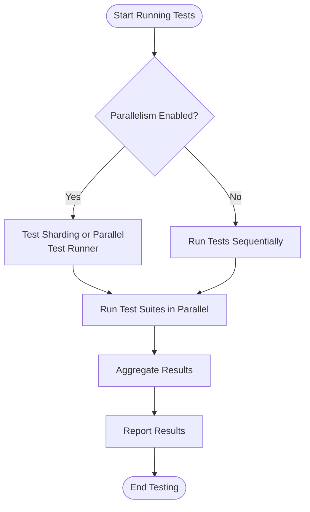

# Improving Test Performance & Scalability

GoogleTest and GoogleMock provide powerful tools for C++ testing, but as your project and test suite grow, maintaining efficient and scalable tests becomes critical. This guide shares strategic tips and practical techniques to run tests faster, structure large test suites effectively, and configure GoogleTest for high-performance scenarios.

---

## 1. Running Tests in Parallel

Parallel test execution is a straightforward way to speed up feedback cycles, especially for large test suites. Here’s how to make the most of it:

### Why Parallelism Matters

Splitting tests across multiple CPU cores or machines reduces overall test runtime, enabling faster development iterations and continuous integration cycles.

### How to Enable Parallel Test Runs

- Use the `--jobs=N` flag with your build or test runner (e.g., `make -jN`, or `bazel test --jobs=N`) to run tests in parallel.
- GoogleTest itself supports test-level parallelism, but the default test runner may require external orchestration.
- For fine-grained control, tools like `ctest` or `GoogleTest Adapter` in IDEs also support multiple test jobs.

### Best Practices

- **Isolate Tests:** Ensure tests do not share mutable global state to prevent race conditions.
- **Use Test Fixtures Wisely:** Keep fixtures independent or use thread-safe constructs if fixtures share resources.
- **Manage Dependencies:** Tests requiring specific execution orders (e.g., integration tests with side effects) should be isolated or labeled separately from parallel runs.

### Configuring for Parallelism Example

```bash
# Running tests with bazel using 8 parallel jobs
bazel test --jobs=8 //myproject/tests:all
```

### Handling Common Pitfalls

- **Flaky Tests:** Investigate and fix tests that intermittently fail under parallel execution.
- **Resource Limits:** Avoid exhausting system resources by setting parallelism level according to available CPU and memory.

<Tip>
Enable parallel testing early in your project to get immediate feedback improvement, but invest time into fixing flaky and state-dependent tests before scaling parallelism aggressively.
</Tip>

---

## 2. Structuring Large Test Suites

Maintaining scalable tests is as much about organization as raw execution speed.

### Organize Tests by Functional Components

Group related tests into well-named test suites and subdirectories. This clarity aids selective running, debugging, and maintenance.

### Split Tests into Logical Groups

- **Unit Tests:** Fast, isolated tests focusing on small pieces of code.
- **Integration Tests:** Tests interacting with multiple components or external resources.
- **End-to-End Tests:** Full workflow validations, typically slower and run less frequently.

Label or tag tests accordingly to enable selective execution via filtering (e.g., `--gtest_filter=...`).

### Use Test Fixtures to Reduce Redundancy

Leverage `TEST_F()` to initialize shared objects or state for groups of tests, reducing setup code duplication.

### Manage Test Dependencies and Order

Avoid implicit dependencies between tests by designing each test to be independent and idempotent. When ordering is required, use GoogleTest sequences to enforce call order or rely on explicit test filters.

### Employ Parameterized Tests for Variant Scenarios

When the same logic needs validation under multiple input values or configurations, use parameterized tests (`TEST_P`) to maintain concise and maintainable code.

### Example: Grouping Tests

```cpp
// In math_tests.cc
TEST(MathOperations, Addition) { ... }
TEST(MathOperations, Multiplication) { ... }

// In string_tests.cc
TEST(StringUtils, Trim) { ... }
```
Use the filter:
```bash
test_binary --gtest_filter=MathOperations.*
```

<Tip>
Avoid giant monolithic test files. Aim for smaller, thematic test suites that can be run and debugged independently.
</Tip>

---

## 3. Configuring GoogleTest for High Performance

For demanding environments, tuning GoogleTest can boost efficiency:

### Reduce Test Binary Size

- Disable unused features (e.g., if death tests or XML reporting aren’t needed, exclude relevant modules).
- Use compiler optimizations (e.g., `-O2`, `-O3`).

### Minimize Output Verbosity

- Use `--gtest_brief=1` to reduce test output clutter while keeping essential info.
- Reduce stack-trace depth with `--gtest_stack_trace_depth=0` if detailed traces aren’t needed.

### Skip Tests Selectively

- Use filters (`--gtest_filter=`) to run only relevant tests during development.
- Mark slow tests with custom tags and exclude them from quick runs.

### Enable Test Sharding

For certain build systems and CI environments, use test sharding to distribute tests equally across shards, for example:

```bash
# For GoogleTest test binary supporting sharding
./test_binary --gtest_shard_index=0 --gtest_total_shards=3
```

### Optimize Test Fixtures

- Avoid heavy setup/teardown in fixtures; when needed, consider `SetUpTestSuite` and `TearDownTestSuite` at the suite level instead of per-test.
- Limit heap allocations and large data structures in tests.

### Cache Expensive Resources

Reuse database connections, mock data, or external resource states if possible.

### Leverage GoogleTest Flags

| Flag                          | Purpose                                            |
|-------------------------------|---------------------------------------------------|
| `--gtest_repeat=N`             | Repeat tests `N` times to catch flakiness.        |
| `--gtest_break_on_failure`     | Halt on first failure to save time during debugging|
| `--gtest_shuffle`              | Randomize test order to detect inter-test dependencies|

### Example: Running Fast with Filters and Minimal Output

```bash
./test_binary --gtest_filter=FastTests.* --gtest_brief=1
```

---

## 4. Handling Flaky and Long-Running Tests

Unreliable tests slow down your feedback loop.

### Identify Flaky Tests

- Monitor recurrent failures that don't correspond to code changes.
- Use `--gtest_repeat` to reproduce flaky behavior.

### Address Flakiness

- Isolate causes such as time dependencies, concurrency issues, or external state.
- Stabilize or quarantine flaky tests.

### Separate Long-Running Tests

- Mark long tests to exclude from routine runs.
- Run them periodically or in nightly builds.

---

## 5. Example User Flow: Speeding Up Your Test Suite

1. Start by organizing your test codebase into clear modules and suites.
2. Enable parallel test execution in your build pipeline (`bazel test --jobs=N` or similar).
3. Use test filters to run subsets during development.
4. Monitor flaky or failing tests; fix or isolate them.
5. Adjust GoogleTest flags and fixture setups for efficiency.
6. Incorporate sharding in CI to spread tests.
7. Iterate and monitor test suite runtimes and failures for continual improvement.

---

## 6. Troubleshooting Common Issues

<AccordionGroup title="Troubleshooting and Tips">
<Accordion title="Tests Fail When Run in Parallel">
Check for shared global or static state that is not synchronized. Use thread-safe constructs or isolate state per test.
</Accordion>
<Accordion title="Flaky Tests Detected in Parallel Runs">
Run `--gtest_repeat` on individual tests to track down intermittent failures. Review concurrency aspects and timing dependencies.
</Accordion>
<Accordion title="Test Runs Slower After Enabling Parallelism">
Verify that parallelism level is not exceeding system resources (CPU, memory). Adjust job count and balance test distribution.
</Accordion>
<Accordion title="Build or Link Failures When Splitting Tests">
Ensure proper dependencies and linkage of all test suites. Keep mock classes consistent.
</Accordion>
</AccordionGroup>

---

## 7. Additional Resources

- [GoogleTest Primer](https://github.com/google/googletest/blob/main/docs/primer.md) - for basics on writing tests
- [Mocking Cookbook](https://github.com/google/googletest/blob/main/docs/gmock_cook_book.md) - for advanced mocking and performance tips
- [Integration with CI Systems](https://github.com/google/googletest/blob/main/docs/guides/integration-and-real-world-use/integration-ci.md) - continuous integration best practices

---

## Summary

This guide provided actionable strategies to enhance test performance and scalability in GoogleTest and GoogleMock, focusing on parallel execution, suite structuring, configuration tuning, and troubleshooting. By following these practices, users can achieve faster, more reliable test feedback and maintainability in large C++ projects.

---

## Diagram: Test Execution Workflow With Parallelism



<Tip>
Carefully design tests to be independent and side-effect free to benefit from parallel execution.
</Tip>
