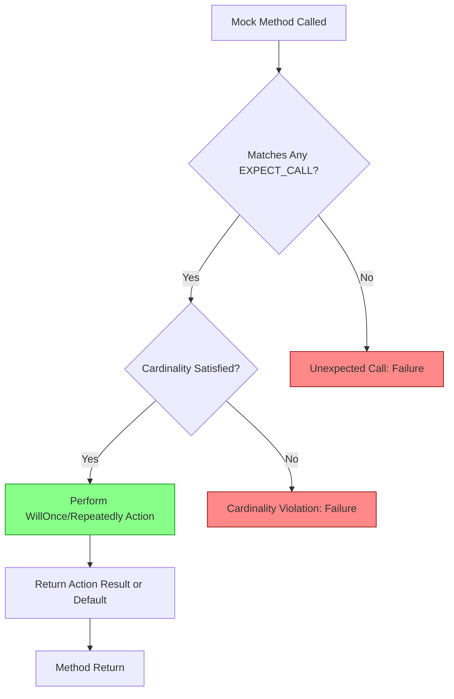

# Troubleshooting Common Mocking Errors

This page is dedicated to helping users diagnose and resolve frequent mistakes and confusion encountered when creating and using mocks in GoogleMock. It focuses specifically on errors related to expectation failures, test instability, and understanding mock behaviors, particularly around the use of `NiceMock`, `StrictMock`, `NaggyMock`, and the expectations syntax.

---

## 1. Understanding Expectation Failures

Expectation failures occur when mock methods are called in a way that violates the constraints specified with `EXPECT_CALL()`. Common causes and solutions include:

### Common Causes
- **Too Few Calls**: The mock method was called fewer times than the specified `.Times()`.
- **Too Many Calls**: The mock method was called more times than expected.
- **Unexpected Arguments**: The arguments in a method call didn’t match any of the provided matchers.
- **Call Order Violations**: When ordering constraints like `.InSequence()` or `.After()` are used, calls occur out of order.
- **Expectation Saturation**: Calls occur after an expectation has been exhausted (saturated).

### Diagnosing Failure Messages
GoogleMock produces detailed failure messages. Here’s how to interpret them:

- Look for lines like:
  ```
  Expected: to be called once
  Actual: called twice - over-saturated and active
  ```
  This means the mock method was called more than expected.

- Messages including:
  ```
  Unexpected mock function call - returning default value.
  Function call: Foo(9)
  ```
  indicate an unexpected call with unmatched arguments.

- Messages referencing:
  ```
  the following immediate pre-requisites are not satisfied:
  ```
  mean the call violated sequence or ordering constraints.

### Resolving Expectation Failures
<Steps>
<Step title="Verify Call Count Matches Expectations">
Double-check your `.Times()` usage. Use `Times(AnyNumber())` if you expect calls without strict limits.
</Step>
<Step title="Ensure Argument Matchers Correctly Reflect Calls">
Review the matchers in your `EXPECT_CALL` to ensure they correctly match the actual arguments used in tests.
</Step>
<Step title="Check Call Ordering Constraints">
If using `.InSequence()` or `.After()`, verify the actual call order matches the expected sequence.
</Step>
<Step title="Use Helpful Verbose Flags">
Run tests with `--gmock_verbose=info` to see detailed call traces.
</Step>
</Steps>

<Tip>
If your tests fail but the failure messages seem unclear, enabling `--gmock_verbose=info` will provide a trace of mock function calls and matched expectations, helping you pinpoint the issue.
</Tip>

---

## 2. Common Sources of Test Flakiness / Inconsistency

Tests with mocks can sometimes fail nondeterministically due to subtle expectation issues.

### Causes
- **Sticky Expectations**: Expectations remain active and match calls even after their cardinality is reached unless explicitly retired.
- **Improper Use of `RetiresOnSaturation()`**: Forgetting to retire expectations that should not be matched after being satisfied.
- **Overlapping Expectations**: Multiple `EXPECT_CALL`s match the same call causing ambiguous behavior.
- **Default Behavior Conflicts**: Interaction between `ON_CALL` default actions and `EXPECT_CALL` behaviors can cause unexpected results.

### Tips to Improve Test Stability
- Always use `.RetiresOnSaturation()` when an expectation is only meant for fixed times and should not remain active.
- Use sequences (`InSequence`) to enforce order and clarify expectations.
- Avoid overlapping or contradictory `EXPECT_CALL` matchers.
- Apply `NiceMock` or `StrictMock` wrappers appropriately to control warnings and failures on uninteresting calls.

---

## 3. Understanding Mock Behaviors: Nice, Naggy, and Strict Mocks

Mock strictness determines how GoogleMock treats calls to mock methods without corresponding expectations (called *uninteresting calls*).

| Mock Type      | Behavior on Uninteresting Calls           | Typical Usage                          |
|----------------|------------------------------------------|--------------------------------------|
| `NiceMock`     | Silences warnings; calls proceed normally| Preferred for less brittle tests      |
| `NaggyMock`    | Prints warnings on uninteresting calls   | Current default behavior; useful during debugging |
| `StrictMock`   | Treats uninteresting calls as errors     | Enforces strict verification         |

### Choosing the Right Mock Strictness
- Use **`NiceMock`** to reduce noise from unimportant calls.
- Use **`NaggyMock`** when you want to be warned about unexpected interactions but not fail the test.
- Use **`StrictMock`** to ensure your test fails if any unexpected calls happen.

### Example
```cpp
using ::testing::NiceMock;
using ::testing::StrictMock;

NiceMock<MockFoo> nice_mock;  // Suppresses warnings.
StrictMock<MockFoo> strict_mock;  // Fails test on unexpected calls.
```

<Note>
`NiceMock` and `StrictMock` affect *only uninteresting calls*—calls to mock methods with no `EXPECT_CALL`. Calls that do not match any expectation remain errors.
</Note>

---

## 4. Interpreting Common Warning and Error Messages

### Uninteresting Calls
- **Message:** "Uninteresting mock function call - default action taken..."
- **Meaning:** A mock method was called without any expectation set for it.
- **Action:** Add an `EXPECT_CALL(...).Times(AnyNumber())` if call is expected but unverified, or use a `NiceMock` to silence the warning.

### Unexpected Mock Calls
- **Message:** "Unexpected mock function call - returning default value..."
- **Meaning:** Method call arguments do not match any `EXPECT_CALL`.
- **Action:** Update or add expectations reflecting actual usage.

### Excessive Calls
- **Message:** "Mock function called more times than expected..."
- **Meaning:** A mock method was called more often than specified.
- **Action:** Adjust `.Times()` or extend the `WillRepeatedly` clause to handle repeated calls.

### Missing Return Values
- **Message:** "The mock function has no default action set, and its return type has no default value set."
- **Meaning:** Mock method returning non-default-constructible type was called without a specified action.
- **Action:** Use `ON_CALL` or set return values explicitly with `WillOnce`/`WillRepeatedly`.

---

## 5. Best Practices & Practical Tips

- Always set expectations *before* exercising code under test to avoid undefined behavior.
- When matchers mismatch unexpectedly, use `--gmock_verbose=info` to trace how calls match expectations.
- Use `RetiresOnSaturation()` to make expectations non-sticky and avoid call count conflicts.
- To disambiguate overloaded methods, use argument matchers or `Const()` as appropriate.
- Wrap your mocks with `NiceMock` or `StrictMock` depending on your test noise tolerance and strictness requirements.
- Use catch-all `EXPECT_CALL`s (`_` matcher with `Times(AnyNumber())`) to allow method calls that don’t need precise verification.
- Avoid overlapping matchers that cause multiple expectations to match the same call.

---

## 6. Troubleshooting Steps

<Steps>
<Step title="Enable Verbose Logging">
Run your tests with `--gmock_verbose=info` to get detailed insights about calls and expectations.
</Step>
<Step title="Inspect Expectation Ordering">
Check that calls happen in the correct order if you use `.InSequence()` or `.After()`.
</Step>
<Step title="Verify Matcher Correctness">
Ensure your argument matchers match the actual calls’ arguments.
</Step>
<Step title="Check Call Cardinalities">
Compare the number of calls against `.Times()`. Adjust to `AnyNumber()` for more leniency.
</Step>
<Step title="Use Strictness Wrappers to Debug">
Temporarily switch to `StrictMock` to catch unverified calls or to `NiceMock` to reduce warnings.
</Step>
<Step title="Clear and Verify Mock Between Tests">
If you reuse mocks, call `Mock::VerifyAndClear()` to reset their state.
</Step>
</Steps>

---

## 7. Related Documentation

- [gMock Cookbook](https://google.github.io/googletest/gmock_cook_book.html) — In-depth recipes for mocking.
- [Mock Object Strictness Policies](reference/mocking-api/nice-strict-mocks.md) — Details on `NiceMock`, `NaggyMock`, and `StrictMock`.
- [Mock Object Definition Reference](reference/mocking-api/mock-object-definition.md) — How to define mocks and expectations.
- [Expectations and Cardinalities](reference/mocking-api/expectations-cardinalities.md) — Managing call counts and ordering.
- [GoogleMock for Dummies](docs/gmock_for_dummies.md) — Beginner-friendly introduction to mocking.

---

## 8. Example: Expectation Failure and Resolution

```cpp
using ::testing::_;  
using ::testing::Return;  
using ::testing::Sequence;

class MockCalculator {
 public:
  MOCK_METHOD(int, Add, (int a, int b), ());
};

TEST(CalcTest, HandlesAdd) {
  MockCalculator mock_calc;
  Sequence s;

  EXPECT_CALL(mock_calc, Add(5, 3))
      .Times(1)
      .WillOnce(Return(8))
      .InSequence(s);

  EXPECT_CALL(mock_calc, Add(_, _))
      .Times(AnyNumber())
      .WillRepeatedly(Return(0))
      .InSequence(s);

  // Calling Add(3, 5) instead of Add(5,3) will cause an unexpected call.
  EXPECT_EQ(mock_calc.Add(5, 3), 8); // OK
  EXPECT_EQ(mock_calc.Add(3, 5), 0); // Matches generic expectation
}
```

In the above:
- The first call matches the specific expectation.
- The second call uses the catch-all expectation.

If the call order changes violating the sequence or if calls exceed `.Times()`, GoogleMock will notify detailed failures.

---

## 9. Summary Diagram of Expectation Flow



This flow explains how GoogleMock processes a mock method call against expectations.

---

## 10. Troubleshooting Checklist

- Confirm mock methods are declared `MOCK_METHOD` in `public:` scope.
- Ensure `EXPECT_CALL` statements appear before exercising mocks.
- Check if argument matchers correctly represent expected calls.
- Verify call cardinality clauses (`Times`, `WillOnce`, `WillRepeatedly`).
- Use sequences or `After` clauses to enforce call order when relevant.
- Control uninteresting calls via mock strictness wrappers to receive appropriate warnings or errors.
- Investigate errors with `--gmock_verbose=info` for detailed call tracing.
- Use `RetiresOnSaturation()` for non-sticky expectations to avoid ambiguity.
- Consider calling `Mock::VerifyAndClear()` when reusing mocks across test phases.

---

<Tip>
Maintaining clear and precise expectations, choosing a proper mock strictness policy, and leveraging GoogleMock's diagnostics can dramatically reduce mocking-related test failures and improve confidence in your tests.
</Tip>


---