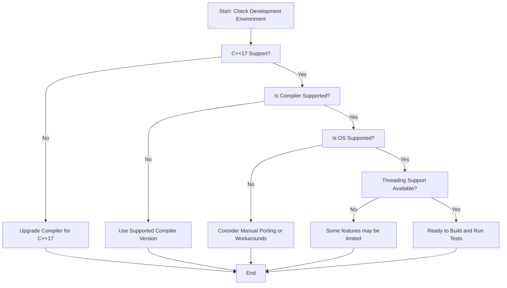

# Supported Platforms and Requirements

This page serves as your essential guide to confirming that your development environment is fully compatible with GoogleTest and GoogleMock. Before getting started or troubleshooting platform-specific issues, verify that your compiler, operating system, and C++ standard support meet the minimum requirements.

---

## 1. Minimum C++ Standard

GoogleTest requires an environment with support for C++17 or higher. This is crucial for ensuring compatibility and leveraging modern language features critical to the framework.

<Check>
Make sure your compiler invocation specifies C++17 or later. For CMake projects, this can be done using:

```cmake
set(CMAKE_CXX_STANDARD 17)
set(CMAKE_CXX_STANDARD_REQUIRED ON)
```

For manual compiler commands, use the appropriate flag (e.g., `-std=c++17` for GCC/Clang).
</Check>

---

## 2. Supported Compilers

GoogleTest officially supports a broad range of widely used C++ compilers. Ensuring your compiler version meets or exceeds the minimum supported version avoids build failures and subtle runtime issues.

- **GCC (GNU Compiler Collection)**: Versions supporting full C++17 features, generally GCC 7 or later.
- **Clang**: Versions with robust C++17 support.
- **Microsoft Visual C++ (MSVC)**: Minimum version Visual Studio 2017 Update 3 (MSVC 19.11) or later; MSVC 2015 or later is required for GoogleMock.
- **Intel C++ Compiler**: Compatible versions supporting C++17.

<Tip>
Older compiler versions lacking C++17 support will fail at compile time. Always verify your compiler version before beginning.
</Tip>

---

## 3. Supported Operating Systems

GoogleTest is designed to be cross-platform, supporting a wide variety of operating systems commonly used in development and CI environments.

- **Linux**: Including major distributions and Android.
- **Windows**: Desktop editions with MSVC or MinGW compilers.
- **macOS**: Including support for iOS builds where applicable.
- **BSD Variants**: FreeBSD, OpenBSD, NetBSD.
- **Other Platforms**: Cygwin, Solaris, AIX, QNX, Haiku, Fuchsia, and various embedded platforms such as ESP8266 and ESP32.

<Note>
Support for less common or embedded systems may be limited and community-driven. For these, manual verification and troubleshooting might be necessary.
</Note>

---

## 4. Runtime and Build Environment Considerations

- **Threading Support**: GoogleTest is thread-safe on platforms with pthreads or equivalent threading implementations. Use the macro `GTEST_HAS_PTHREAD` to confirm at compile time.

- **Shared vs Static Libraries**: When building GoogleTest or GoogleMock as shared libraries (DLLs on Windows), use the flags:

  - `-DGTEST_CREATE_SHARED_LIBRARY=1` (build library)
  - `-DGTEST_LINKED_AS_SHARED_LIBRARY=1` (build tests against shared libs)

- **Runtime Library Consistency**: For MSVC, ensure alignment between your project’s runtime library linking (static vs dynamic) and GoogleTest’s to avoid linker errors.


---

## 5. Platform-Specific Compiler Checks

GoogleMock enforces minimum compiler versions to avoid incompatibilities:

- For MSVC, Visual C++ 2015 (version 14.0) or later is required.

<Tip>
If the compiler version is below the required minimum, you will encounter compile-time errors such as:

```
#error "At least Visual C++ 2015 (14.0) is required to compile Google Mock."
```

Upgrade your compiler accordingly.
</Tip>

---

## 6. Environment Macros and Feature Detection

GoogleTest internally defines a set of macros to detect environment capabilities, including support for exceptions, RTTI, POSIX features, and regex implementations. These macros also help GoogleTest adapt to platform constraints.

For instance:

- `GTEST_HAS_EXCEPTIONS` indicates whether exceptions are enabled.
- `GTEST_HAS_RTTI` identifies run-time type information availability.
- `GTEST_HAS_POSIX_RE` indicates POSIX regex support.

These macros are automatically detected but can be overridden via build flags if needed.

---

## 7. Recommended Steps Before Starting

<Steps>
<Step title="Verify Compiler Support">
Confirm your compiler version supports C++17 and meets GoogleTest minimum requirements.
</Step>
<Step title="Identify Your Platform">
Check that your OS is among supported platforms or prepare for possible additional configuration.
</Step>
<Step title="Set C++ Standard Flags">
Configure your build system or compiler command line to use C++17.
</Step>
<Step title="Align Runtime Libraries (MSVC only)">
Ensure runtime linkage options match between your project and GoogleTest libraries.
</Step>
<Step title="Check Threading Macros">
On POSIX systems with pthreads, verify `GTEST_HAS_PTHREAD` is set or manually define it.
</Step>
<Step title="Prepare for Troubleshooting">
Consult platform-specific guides if you encounter environment- or build-related issues.
</Step>
</Steps>

---

## 8. Useful References and Next Steps

- [Prerequisites & System Requirements](/getting-started/setup-and-installation/prerequisites-system-requirements) — Detailed list of environment requirements.
- [Installing with CMake](/getting-started/setup-and-installation/installing-with-cmake) — How to configure the build on supported platforms.
- [Resolving Build & Integration Issues](/getting-started/common-issues-and-troubleshooting/build-issues) — For troubleshooting common platform-specific problems.
- [Supported Platforms Overview](https://github.com/google/oss-policies-info/blob/main/foundational-cxx-support-matrix.md) — External table detailing supported compiler and platform versions.

<Tip>
Consult the [GoogleTest README](https://github.com/google/googletest/blob/main/README.md) for additional platform-specific notes and recommended build flags.
</Tip>

---

### Summary Diagram: Platform & Compiler Compatibility Flow



---

This completes the guide for Supported Platforms and Requirements. Confirm your environment matches these criteria to ensure smooth installation, building, and running of GoogleTest and GoogleMock.


---