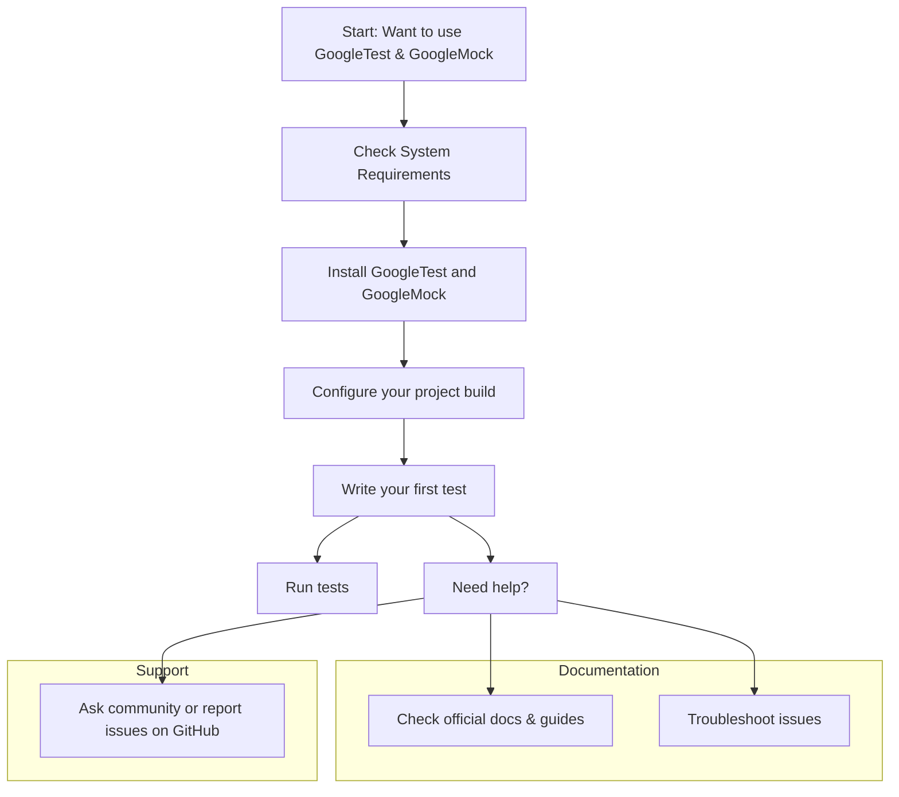

# How do I get started and where can I find support?

Welcome to GoogleTest and GoogleMock! This FAQ page guides you through getting started with setting up GoogleTest and points you to the right resources for documentation and support. Whether you’re integrating GoogleTest for the first time or looking for ways to get help, this page is your starting line.

---

## 1. How do I set up GoogleTest (and GoogleMock) in my project?

GoogleMock is bundled with GoogleTest, so you'll typically set up both together. Here’s a streamlined workflow to get you started:

<Steps>
<Step title="Check System Requirements">
Confirm your system meets the prerequisites, such as a supported OS, a C++17 compatible compiler, and necessary dependencies like pthreads. See the [System Requirements & Supported Platforms](https://github.com/google/googletest/tree/main/getting-started/prerequisites-installation/system-requirements) page for detailed info.
</Step>
<Step title="Download or Fetch GoogleTest">
Get the GoogleTest source from the official repository (`https://github.com/google/googletest`). You can either download the release, clone the repo, or add it as a submodule.
</Step>
<Step title="Build and Install">
Use CMake or Bazel to build and install the libraries. GoogleTest provides CMakeLists and Bazel BUILD files to simplify integration.
</Step>
<Step title="Configure Your Project">
Link your test targets to GoogleTest and GoogleMock libraries. Refer to the [Installation Instructions](https://github.com/google/googletest/tree/main/getting-started/prerequisites-installation/installation-instructions) and [Project Configuration](https://github.com/google/googletest/tree/main/getting-started/configuration-initial-run/project-setup) pages for examples on CMake and Bazel.
</Step>
<Step title="Write Your First Test">
Begin with a simple test to validate your setup. Instructions and samples can be found in [Writing Your First Unit Test](https://github.com/google/googletest/tree/main/getting-started/configuration-initial-run/first-test).
</Step>
</Steps>

<Tip>
Running [Quick Validation & Sample Tests](https://github.com/google/googletest/tree/main/getting-started/configuration-initial-run/quick-validation) helps verify your installation before diving deeper.
</Tip>

---

## 2. Where can I find official GoogleTest and GoogleMock documentation?

GoogleTest and GoogleMock offer extensive, well-structured documentation online, arranged to guide users from basics to advanced topics.

- **Core Concepts & Getting Started:** Learn what GoogleTest is, its architecture, and installation basics on the [Overview Tab](https://github.com/google/googletest/tree/main/overview/intro-core-concepts) and the [Getting Started Tab](https://github.com/google/googletest/tree/main/getting-started).
- **Authoring Tests & Using Mocks:** Detailed guides on writing unit tests and mocking dependencies are available under the [Guides Tab](https://github.com/google/googletest/tree/main/guides/core-workflows), including mocking best practices and advanced usage.
- **API References:** Explore the [Test Framework API](https://github.com/google/googletest/tree/main/api_reference/test_framework_api) and [Mocking API](https://github.com/google/googletest/tree/main/api_reference/mocking_api) for detailed class and function documentation.
- **Conceptual Details:** Deep-dive into test lifecycle, mocking models, and assertion mechanisms in the [Concepts Tab](https://github.com/google/googletest/tree/main/concepts).
- **FAQs:** Common questions and troubleshooting tips are collected in the [FAQ Tab](https://github.com/google/googletest/tree/main/faq/common-questions).

For immediate help with mocking, review [gMock for Dummies](https://google.github.io/googletest/gmock_for_dummies.html) and the [gMock Cookbook](https://google.github.io/googletest/gmock_cook_book.html) – practical guides packed with examples.

---

## 3. Where can I get community or official support?

Getting help quickly can make or break your development experience. Here are the primary channels:

- **GitHub Issues:** For bug reports or feature requests, use the official [googletest GitHub Issues](https://github.com/google/googletest/issues) page. Be sure to provide detailed reproduction steps.

- **Stack Overflow:** Tag your questions with `googletest` and `google-mock` to attract community expertise.

- **Google Groups & Forums:** Some users find value in mailing lists or forums discussed in community threads.

- **Official Documentation FAQs:** The [FAQ Sections](https://github.com/google/googletest/tree/main/faq/community-support/where-to-ask-questions) offer pointers on how to phrase questions clearly and where to post.

- **Documentation and Tutorials:** Thorough documentation often prevents common problems. Check the getting started guides, mock recipes, and troubleshooting pages.

<Tip>
Before seeking help, reproduce the issue with minimal code and report the exact error messages or unexpected behavior, which accelerates diagnosis.
</Tip>

---

## 4. What if I encounter issues during installation or setup?

Setup issues are common but solvable. For help:

- Consult the [Troubleshooting Installation & Configuration](https://github.com/google/googletest/tree/main/getting-started/troubleshooting-common-issues/common-setup-issues) page.
- Verify compiler compatibility and linking instructions.
- Ensure your environment variables and include paths are correctly set.
- Run provided sample tests to check the environment.

If problems persist, share detailed logs on the GitHub Issues page or community forums.

---

## 5. Are there quickstart guides to accelerate my onboarding?

Yes. We highly recommend:

- **The Quickstart Guide:** [Getting Started: Installation and Setup](https://github.com/google/googletest/tree/main/guides/core-workflows/setup-getting-started) walks you through building and running your first tests.
- **Writing Your First Unit Tests:** The guide at [Authoring Unit Tests](https://github.com/google/googletest/tree/main/guides/core-workflows/authoring-unit-tests) helps you write effective, maintainable tests.
- **Using Mocks:** The practical [Mocking Dependencies with GoogleMock](https://github.com/google/googletest/tree/main/guides/core-workflows/using-mocks) guide teaches dependency isolation techniques.

---

## Related Topics & Resources

- [GoogleTest Overview: What is GoogleTest?](https://github.com/google/googletest/tree/main/overview/intro-core-concepts/what-is-googletest)
- [Installing GoogleTest](https://github.com/google/googletest/tree/main/getting-started/prerequisites-installation/installation-instructions)
- [Mocking Reference](https://github.com/google/googletest/tree/main/api_reference/mocking_api/mock_object_basics)
- [gMock Cookbook](https://google.github.io/googletest/gmock_cook_book.html)

Ensure you take advantage of the official GitHub repository for the latest updates: https://github.com/google/googletest

---

## Practical Tips

- Always set expectations with `EXPECT_CALL` before exercising the mock functions to avoid undefined behavior.
- Use `NiceMock` or `StrictMock` wrappers to control warnings or enforce strict expectation matching.
- Perform quick validation tests immediately after setup to catch configuration mismatches early.

---

For any remaining questions or assistance, refer back to the [FAQ section on community support](https://github.com/google/googletest/tree/main/faq/community-support/where-to-ask-questions) or visit the official issue tracker.


---

### Troubleshooting common pitfalls

<AccordionGroup title="Common Set-up and Usage Questions">
<Accordion title="I get linker errors related to GoogleTest or GoogleMock symbols. What should I do?">
  Verify you have linked your test executable against the `gtest` and `gmock` libraries as appropriate. If using CMake, make sure to link against `gtest_main` or `gmock_main` if you rely on their built-in `main()` implementations. Ensure your compiler and linker flags include the correct library and include directories.
</Accordion>
<Accordion title="How do I suppress warnings about uninteresting mock calls?">
  Wrap your mock class instance with `::testing::NiceMock<YourMockClass>` to suppress warnings about calls without expectations. Use this to reduce noise in test outputs during development.
</Accordion>
<Accordion title="How do I specify default actions for mock methods?">
  Use the `ON_CALL` macro before exercising your mocks to define default behaviors when no explicit `EXPECT_CALL` matches. For example:

```cpp
ON_CALL(mock_obj, SomeMethod(_)).WillByDefault(Return(value));
```
</Accordion>
</AccordionGroup>


---

For comprehensive setup instructions and validation, please visit the official documentation linked above.

---

## Summary Diagram: Where does this page fit?



---


## Troubleshooting & Support Tips

* Keep build and test logs handy when requesting help.
* Start from templates and sample code to isolate problems.
* Use verbose output by passing `--gmock_verbose=info` to understand mock call matching.
* Refer to gMock Cookbook and GoogleTest Primer for deep dives.

---

This page sets you up to confidently start using GoogleTest and GoogleMock while pointing you toward community and official resources to smooth your development journey.


---