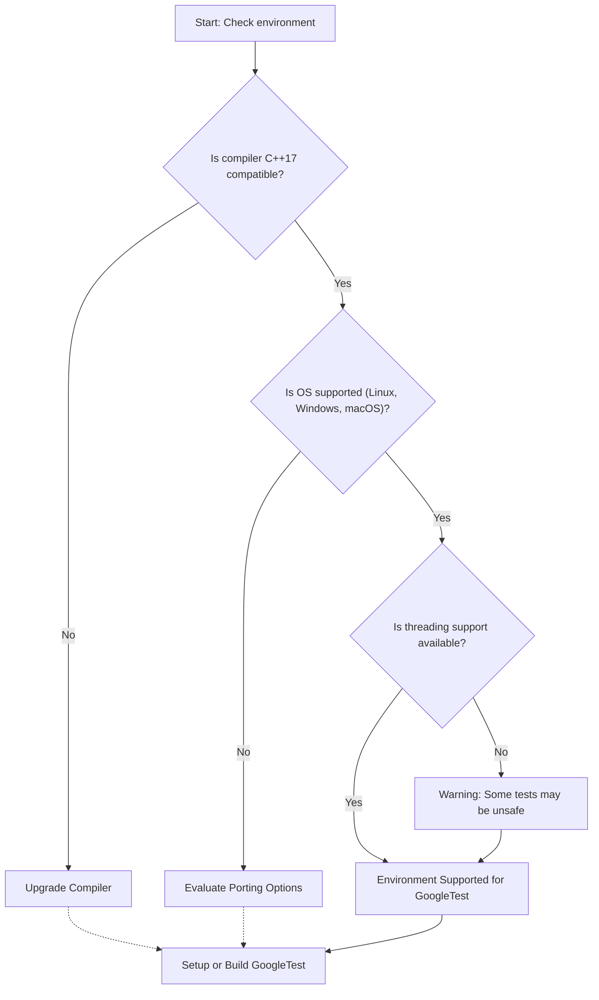

# Supported Platforms and Compatibility

Understanding whether GoogleTest and GoogleMock will work seamlessly in your development environment is crucial for effective testing and smooth integration. This guide lays out the supported platforms, compilers, C++ language standards, and practical tips to verify compatibility or find solutions when your environment isn't explicitly listed.

---

## Supported Platforms

GoogleTest and GoogleMock support a broad range of common desktop platforms including:

- **Linux** (major distributions like Ubuntu, Fedora, Debian)
- **Windows** (including MSVC 2015 and later, MinGW)
- **macOS**

These platforms cover the vast majority of typical C++ development workflows and ensure smooth operation across popular operating systems.

<Info>
If you are targeting embedded or uncommon platforms, support is not guaranteed. However, GoogleTest is mostly portable if your system provides a standard C++17 compiler environment and POSIX-like features.
</Info>

## Supported Compilers

GoogleTest requires a modern C++ compiler with robust support for C++17 features. Supported compilers include:

- **GCC** (version 7.0 or later recommended)
- **Clang** (modern versions supporting C++17)
- **Microsoft Visual C++ (MSVC)** 2015 Update 3 or later

These compilers have been tested extensively with GoogleTest and gMock and are the officially supported toolchains.

<Warning>
Compilers lacking full C++17 support, such as older GCC versions or other proprietary compilers, may cause compilation or runtime problems.
</Warning>

## Required C++ Standard

GoogleTest and GoogleMock require at least **C++17 minimum**. The codebase leverages language features and standard library enhancements introduced in this version for portability, safety, and performance.

Be sure to set your project or build system to use the C++17 standard (e.g., `-std=c++17` for GCC and Clang, or the equivalent `/std:c++17` for MSVC).

## Threading and POSIX Support

For full multi-threading support and advanced test features, your platform must provide:

- Native thread support such as **pthreads** on POSIX platforms or Windows threading APIs
- Functional file system APIs

GoogleTest and GoogleMock utilize these capabilities to enable thread safety, parallel test execution, and stream redirection.

<Note>
The test frameworks are thread-safe on platforms with pthread or robust threading implementations. On platforms without thread support, certain features (like death tests and parallel runs) may be disabled or unsafe.
</Note>

## How to Check Compatibility

### Basic Steps

1. **Verify Compiler Version**: Check your compiler version supports C++17.
2. **Confirm Platform**: Ensure your OS is Linux, Windows, or macOS, or otherwise supports the necessary build chain.
3. **Validate Dependencies**: Confirm pthread (or equivalent) and standard C++ libraries are available.
4. **Build a Minimal Test**: Try compiling and running a minimal GoogleTest sample test to identify environment issues early.

### Example Compiler Checks

- **GCC**:

  ```bash
  gcc --version
  g++ -std=c++17 my_test.cc -lgtest -lgmock
  ```

- **MSVC**:

  Use Visual Studio 2017 or later. Set project language standard to C++17.

### Troubleshooting Compatibility

If you encounter problems:

- Check for missing dependencies or outdated compiler versions.
- Review the [System Requirements](https://google.github.io/googletest/getting-started/prerequisites-installation/system-requirements) documentation.
- Verify your build and link settings align with GoogleTest expectations.

## Dealing with Unsupported or Custom Platforms

If your platform or compiler is not listed:

- Consider upgrading your toolchain to a supported compiler.
- For embedded or less common systems, evaluate porting effort or using a mock testing approach adapted to your environment.
- Review community contributions or forks that may add support for your platform.

<Tip>
When working in unusual environments, compiling GoogleTest in isolation first and running sample tests is the best way to spot compatibility hurdles early.
</Tip>

## Summary

Compatibility with GoogleTest and GoogleMock depends primarily on platform and compiler support for C++17 and basic system libraries. Linux, Windows, and macOS with modern compilers fully support the frameworks. Ensuring your environment matches these criteria guarantees a smooth testing experience.

---

## Additional Resources

- [System Requirements](https://google.github.io/googletest/getting-started/prerequisites-installation/system-requirements)
- [Installation Methods](https://google.github.io/googletest/getting-started/prerequisites-installation/installation-methods)
- [Configuring Your Project](https://google.github.io/googletest/getting-started/project-setup-first-run/configuring-project)
- [Troubleshooting Common Issues](https://google.github.io/googletest/getting-started/troubleshooting-validation/troubleshooting-common-issues)

---

## FAQ Highlights

<AccordionGroup title="Common Compatibility Questions">
<Accordion title="Does GoogleTest support cross-compilation?">

Yes. If your cross-compilation toolchain meets the C++17 language and system dependency requirements, GoogleTest can be built and run for your target platform.

</Accordion>
<Accordion title="What if my system lacks pthread support?">

GoogleTest can compile on some platforms without pthreads but features like thread-safe tests and death tests may be disabled or unsafe. Consider adding threading support or adjusting test strategies accordingly.

</Accordion>
<Accordion title="Are older compilers supported?">

Older compilers predating C++17 support are not officially supported and may cause build or runtime errors. Upgrading your compiler is recommended.

</Accordion>
</AccordionGroup>

## Best Practices

- Always use a supported compiler version and standard compliant with C++17 or later.
- Validate your environment with simple test builds before integrating into larger projects.
- Utilize GoogleTest and GoogleMock build examples as starting points.
- Keep dependencies such as pthreads up to date for stability.

## Next Steps

Once compatibility is confirmed, proceed to:

- Installing GoogleTest and GoogleMock according to your platform.
- Setting up your project with GoogleTest including linking and include paths.
- Writing your first tests and mock objects to take full advantage of the framework.

---

<Check>
Compatible platforms and compilers ensure stable tests and reduce runtime surprises. Always check the official System Requirements before the build.
</Check>

---

## Diagram: Simplified Compatibility Flow



---