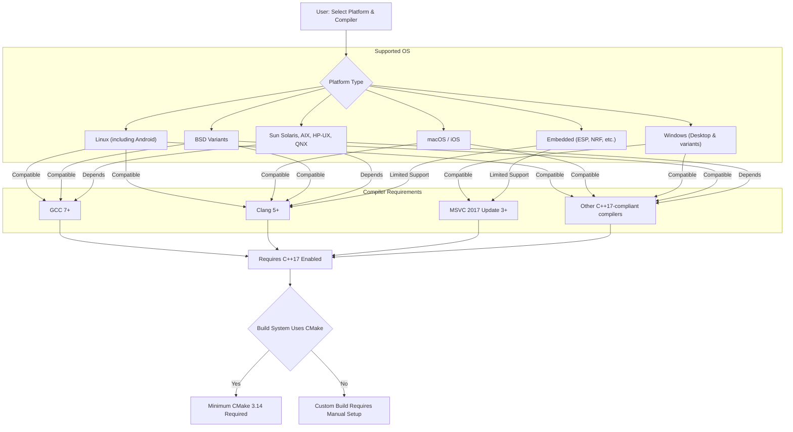

# Supported Platforms and Compilers for GoogleTest and GoogleMock

This page details the supported C++ standards, compilers, and operating systems for successful usage of GoogleTest and GoogleMock. Understanding this compatibility ensures smooth installation, build, and test execution without platform-specific issues.

---

## 1. Overview of Supported Platforms

GoogleTest follows Google's [Foundational C++ Support Policy](https://opensource.google/documentation/policies/cplusplus-support). Below are the primary aspects of platform support:

- **Operating Systems**
  - Linux (including Android)
  - macOS and iOS
  - Windows (Desktop editions, MinGW, Windows Mobile, and related variants)
  - BSD variants (FreeBSD, OpenBSD, NetBSD, DragonFlyBSD)
  - Other Unix-like systems: Solaris, AIX, HP-UX, QNX
  - Embedded platforms such as ESP8266, ESP32, and NRF52 with some limitations

- **Compilers**
  - GCC versions supporting C++17
  - Clang versions supporting C++17
  - Microsoft Visual Studio 2017 (version 15.3) or later
  - Other compilers supporting the C++17 standard

- **C++ Standard**
  - GoogleTest requires **C++17** or later to build and operate correctly.

---

## 2. Operating System Compatibility Details

| Platform        | Notes                                                                                          |
|-----------------|------------------------------------------------------------------------------------------------|
| **Linux**       | Full support including desktop and server distributions. Also supports Linux Android variants. |
| **Windows**     | Supported with variations for Desktop, Mobile, and CMake integration. Requires MSVC 2017+.     |
| **macOS / iOS** | Supported with Xcode; macOS typically uses CMake for builds.                                  |
| **BSD Systems** | FreeBSD, OpenBSD, NetBSD, DragonFlyBSD supported, but users may need to verify pthread support. |
| **Others**      | Solaris, AIX, HP-UX, and QNX supported with some platform-specific conditions.                |
| **Embedded**    | ESP8266, ESP32, NRF52 supported. Some system calls, file systems, and threading features may be limited. |

### Platform-Specific Considerations

- **Threading**: GoogleTest depends on pthreads where available for thread safety and death test support.
- **File System**: Platforms must provide file system support for file I/O; embedded systems without file systems may have limited functionality.
- **Death tests**: Supported on platforms that allow process forking or spawning and have filesystem support.

<Info>
On Windows with Visual Studio, ensure that the runtime library linkage matches GoogleTest's settings to avoid linker errors. Use the CMake option `gtest_force_shared_crt` to align runtime linkage.
</Info>

---

## 3. Compiler Requirements

### Minimum Supported Versions and Features

- **C++17 Support** is mandatory. Users must enable this standard explicitly if their projects default to older standards.

- **MSVC (Microsoft Visual C++)**
  - Minimum: Visual Studio 2017 Update 3 (MSVC Version 14.16, _MSC_VER >= 1911)
  - Required to compile GoogleMock as well.

- **GCC**
  - Versions that fully support C++17 (generally GCC 7 and later).

- **Clang**
  - Versions supporting C++17 (Clang 5.0 or later is recommended).

- **Other compilers**
  - Must comply with C++17, including support for exceptions, RTTI, and threading to some extent.

### CMake Version

- GoogleTest requires **CMake 3.14 or newer** to use the recommended `FetchContent_MakeAvailable()` approach.


<Note>
Building GoogleMock, which extends GoogleTest, additionally requires MSVC 2015 or later.
</Note>

---

## 4. Threading and Library Support

- **Pthreads**
  - GoogleTest automatically detects pthread availability.
  - Users can force pthread support with the compiler flag `-DGTEST_HAS_PTHREAD=1` or disable with `-DGTEST_HAS_PTHREAD=0`.
  - On platforms without pthreads (e.g., some embedded), GoogleTest operates single-threaded with degraded functionality.

- **Exceptions and RTTI**
  - GoogleTest detects whether exceptions and Run-Time Type Information (RTTI) are enabled.
  - Some features such as typed tests require RTTI.

- **Shared Libraries**
  - GoogleTest and GoogleMock can be built as static or shared libraries.
  - On Windows, runtime linkage mismatch errors are common; use CMake options to control linkage.

---

## 5. Platform-Specific and Build Notes

### Windows

- Visual Studio project files (`.sln`, `.vcproj`) are generated by CMake.
- By default, runtime libraries are linked statically; conflicts arise if your project uses dynamic linkage.
- Use `cmake .. -Dgtest_force_shared_crt=ON` to align GoogleTest runtime with your project.

### macOS

- Xcode project files can be generated by CMake.
- Make sure to use a modern compiler supporting C++17.

### Linux

- Typical `make` flow after CMake generation.
- Pthread flags are handled automatically by GoogleTest's CMake.

### Embedded Platforms

- Some GoogleTest capabilities (e.g., file system operations, environment variables) might be limited.
- Threading support depends on platform.
- Refer to the [Supported Platforms](https://github.com/google/googletest/blob/main/docs/platforms.md) for more details.

---

## 6. Verification and Troubleshooting

### Verifying Setup

- Confirm compiler compatibility:

```bash
<compiler> --version
# or
clang++ --version
```

- Verify C++17 is enabled (often `-std=c++17` or equivalent).

- Check CMake version:

```bash
cmake --version
```

- Run sample GoogleTest examples following the [Quick Validation & Sample Tests](https://github.com/google/googletest/blob/main/docs/getting-started/configuration-initial-run/quick-validation.md) guide.

### Common Issues

- **Linker errors on Windows** due to runtime library mismatch: use `gtest_force_shared_crt` option.

- **Compilation errors due to lacking C++17**: explicitly enable the correct standard in your build.

- **Missing pthreads**: manually add pthread linkage if you use custom build scripts.

- **Unsupported platforms or embedded targets**: refer to platform documentation and consider disabling non-supported features.

---

## 7. Additional Resources

- [Installation Instructions](https://github.com/google/googletest/blob/main/docs/getting-started/prerequisites-installation/installation-instructions.md)
- [Supported Platforms & Integration](https://github.com/google/googletest/blob/main/docs/overview/architecture-features-integration/platforms-and-integration.md)
- [System Requirements & Supported Platforms](https://github.com/google/googletest/blob/main/docs/getting-started/prerequisites-installation/system-requirements.md)
- [Troubleshooting Installation & Configuration](https://github.com/google/googletest/blob/main/docs/getting-started/troubleshooting-common-issues/common-setup-issues.md)

---

For a visual overview of how platform support fits into the GoogleTest architecture and build system integration, see the [High-Level Architecture](https://github.com/google/googletest/blob/main/docs/overview/architecture-features-integration/high-level-architecture.md) page.


---

### Diagram: Supported Platform and Compiler Flow



---

## 8. Best Practices

- Always verify compiler and CMake versions before starting.
- Use GoogleTest’s provided CMake scripts for consistent build experience.
- For Windows users, pay attention to runtime library linkage settings for MSVC.
- On unsupported or embedded platforms, verify which GoogleTest features are functional.
- Reference official GoogleTest platform support tables and documentation regularly.

---

## 9. Summary

This page empowers you to verify that your development environment— including OS, compiler, and build system— is compatible with GoogleTest and GoogleMock. Adhering to supported platforms and minimum compiler versions enables reliable, modern C++ testing with full feature access, including threading, exception handling, and cross-platform consistency.

---

For further assistance or specialized platform support, consult the community forums and GitHub issues, or reach out via official GoogleTest channels.

---

# End of Supported Platforms and Compilers Documentation
