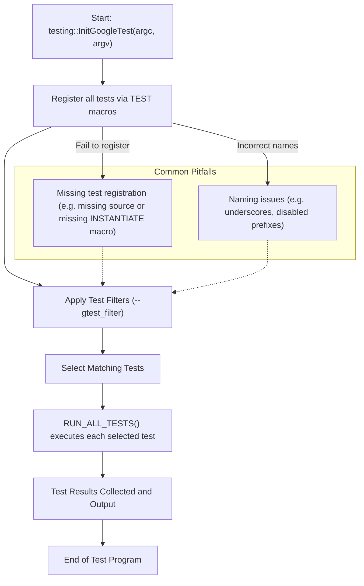

# Test Discovery and Execution Troubleshooting

This page provides comprehensive guidance to resolve issues where your tests are not discovered or do not run as expected in GoogleTest. It explains fundamental test registration rules, naming conventions, and troubleshooting workflows for different test runners and integrations.

---

## Understanding Test Discovery in GoogleTest

GoogleTest automatically discovers tests through its macros such as `TEST()`, `TEST_F()`, `TEST_P()`, and related parameterized and typed test macros. Proper discovery depends on adhering to naming and definition conventions, as well as linking and running test binaries correctly.

### How Tests Are Registered

- Each test is implicitly registered when you use GoogleTest macros like `TEST()` and `TEST_F()`.
- The test registration associates a test suite and test name with a fixture and test body.
- Registration occurs at static initialization time (before `RUN_ALL_TESTS()`).
- Tests are then run by invoking `RUN_ALL_TESTS()`, after initialization with `testing::InitGoogleTest()`.

### Key Test Types Supported

- **Simple Tests (`TEST`)**: Standalone tests grouped by test suite names.
- **Fixture-Based Tests (`TEST_F`)**: Tests sharing a common fixture class for reusable setup/teardown.
- **Value-Parameterized Tests (`TEST_P`)**: Tests parameterized over input values.
- **Typed Tests and Type-Parameterized Tests (`TYPED_TEST`, `TYPED_TEST_P`)**: Tests parameterized over types.

Understanding which kind of test you are writing and correctly using the associated macros ensures registration and discovery.

---

## Common Reasons Tests Are Not Discovered or Run

### 1. Naming Issues

- **Underscore (`_`) Usage**: Avoid underscores in test suite and test names in `TEST()` and `TEST_F()`. For instance, use `MyTestSuite` instead of `My_Test_Suite`.
- **Disabled Tests**: Tests or test suites prefixed with `DISABLED_` will **not run** by default. To run disabled tests, use the `--gtest_also_run_disabled_tests` flag.

### 2. Build and Linking Problems

- GoogleTest requires all test definitions to be linked into the test binary.
- If you use separate compilation or libraries, ensure all source files with tests are included in your build.
- Linking errors or omitting source files that define tests result in missing tests.

### 3. Missing Initialization

- Always call `testing::InitGoogleTest(&argc, argv);` before `RUN_ALL_TESTS()`.
- Omitting this causes flags to not parse, leading to unexpected behavior.

### 4. Filters Exclude Tests

- Your command line or environment variable `GTEST_FILTER` may exclude tests unintentionally.
- Check your filter string with `--gtest_list_tests` first to see which tests are discovered.

### 5. No Tests Linked

- If your binary does not contain any test registrations, `RUN_ALL_TESTS()` may report no tests to run.
- This can happen when tests reside in libraries not linked with the test binary.

---

## Troubleshooting Workflows

### Step 1: List Discovered Tests

Use:

```bash
./your_test_binary --gtest_list_tests
```

This shows all tests GoogleTest knows about in hierarchical form:

```
MyTestSuite1.
  TestA
  TestB
MyTestSuite2.
  TestX
```

If your expected tests do not appear, they are not registered.

### Step 2: Verify Test Names and Macros

- Ensure you use valid GoogleTest macros such as `TEST()`, `TEST_F()`, `TEST_P()`.
- Check for typos in macro names and test identifiers (must be valid C++ identifiers).
- Confirm you did **not** prefix test or suite names with `DISABLED_` unintentionally.

### Step 3: Inspect Build System and Linking

- Confirm all source files defining tests are compiled and linked in the test binary.
- For CMake, verify `add_executable` and `target_link_libraries` include test code.
- If using static or shared libraries, ensure symbols are not stripped out.

### Step 4: Check Test Execution Flags

- Review command line flags such as `--gtest_filter` and `--gtest_also_run_disabled_tests`.
- Remove filters or use `*` to run all tests.

### Step 5: Run Tests and Review Output

Run your test binary normally:

```bash
./your_test_binary
```

- Confirm output reports tests executed.
- Check for errors or unexpected skips.

If you see no tests run:
- Check if tests are disabled or filtered.
- Make sure `RUN_ALL_TESTS()` is called exactly once.

---

## Handling Parameterized and Typed Tests

Problems unique to parameterized and typed tests often involve missing instantiations.

### Parameterized Test Mistakes

- Defining tests with `TEST_P()` but forgetting to call `INSTANTIATE_TEST_SUITE_P()`.
- This results in zero instantiations and no tests discovered.

### Typed Test Mistakes

- Failing to define `TYPED_TEST_SUITE()` or `REGISTER_TYPED_TEST_SUITE_P()` properly.
- Omission leads to tests compiling but not running.

### Allowing Uninstantiated Test Suites

- Use `GTEST_ALLOW_UNINSTANTIATED_PARAMETERIZED_TEST(FooTest);` to suppress errors if appropriate.

---

## Common Pain Points & Their Fixes

| Issue                              | Cause                               | Resolution                                                     |
|----------------------------------|-----------------------------------|----------------------------------------------------------------|
| No tests appear on `--gtest_list_tests` | Tests missing from build or naming errors | Add source files, fix naming conventions, use correct macros  |
| Tests marked `DISABLED_` do not run | Intentional by design             | Use `--gtest_also_run_disabled_tests` to force running        |
| Tests filtered out by `--gtest_filter` | Filters exclude your tests        | Clear filter or correct it                                      |
| Parameterized tests not running    | No instantiation macro             | Add `INSTANTIATE_TEST_SUITE_P` calls with proper parameters     |
| Typed tests not discovered          | Missing `TYPED_TEST_SUITE` or registration | Add required typed test suite macros                            |

---

## Process-Specific Troubleshooting

### Using Different Test Runners

- Always ensure the runner executes the binary built with GoogleTest properly.
- Confirm environment variables and flags are correctly passed through.

### Continuous Integration Systems

- Check for environment-specific filtering or test sharding.
- Ensure shared libraries and dependencies are present on runner machines.

---

## Best Practices to Prevent Discovery Issues

- Use consistent naming conventions as documented in [Structuring and Organizing Tests](/guides/getting-started/test-structure-conventions).
- Always build and link all test source files.
- Use `--gtest_list_tests` to verify test registration before running full suites.
- Run disabled tests occasionally to avoid unnoticed rot.
- For parameterized tests, always instantiate the suites explicitly.

---

## Example: Diagnosing Missing Parameterized Tests

```cpp
// Define fixture
class FooTest : public ::testing::TestWithParam<int> {};

// Define parameterized tests
TEST_P(FooTest, DoesSomething) {
  EXPECT_GT(GetParam(), 0);
}

// Missing instantiation, so tests won't run!

// Fix: Instantiate
INSTANTIATE_TEST_SUITE_P(MyGroup, FooTest, ::testing::Values(1, 2, 3));
```

Without the instantiation macro, none of the parameter sets are created, and tests are absent from discovery.

---

## Using `--gtest_list_tests` to Investigate

Running with:

```bash
./my_test_binary --gtest_list_tests
```

You might see output like:

```
FooTest.
  Test1
  Test2
BarTest.
  DISABLED_Test3
```

- `Test1` and `Test2` will run by default.
- `DISABLED_Test3` will not.

To include disabled tests:

```bash
./my_test_binary --gtest_also_run_disabled_tests
```

---

## Tips & Tricks

- **Single `main()` and Initialization**: Always use one `main()` function that calls `testing::InitGoogleTest()` and then `RUN_ALL_TESTS()`.
- **Use Filters Wisely**: Filters let you focus on specific tests — use them to speed debugging.
- **Debug Skipped Tests**: Use `--gtest_list_tests` and `--gtest_filter` with inclusive filters to reveal skipped or disabled tests.
- **Logging Test Names**: Access current test info at runtime with `testing::UnitTest::GetInstance()->current_test_info()` for dynamic behavior.

---

## Related Documentation

- [Structuring and Organizing Tests](/guides/getting-started/test-structure-conventions) — for naming conventions and directory layouts.
- [Running and Validating Tests](/getting-started/quickstart-validation/run-validate-tests) — for execution basics.
- [Troubleshooting Common Setup Issues](/getting-started/quickstart-validation/troubleshooting-common-issues) — for build and environment troubleshooting.
- [GoogleTest Primer](docs/primer.md) — foundational test writing concepts.

---

## Support and Additional Help

If tests are still not discovered or running as expected, consider the following:

- Ensure your build environment meets [Prerequisites & System Requirements](/getting-started/setup-installation/prerequisites-requirements).
- Verify correctness with sample tested binaries provided by GoogleTest.
- Reach out to community forums or issue trackers linked at [Where to Get Help and Report Issues](/faq/taking-support-further/finding-help).

---

## Summary Diagram of Test Discovery and Execution Flow



---

By following these guidelines and systematically troubleshooting with listing and filtering tests, users can resolve most test discovery and execution problems.


