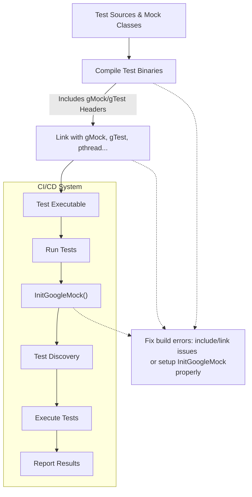

# Troubleshooting Common Problems

This guide provides focused, practical assistance for diagnosing and resolving typical issues encountered when building, integrating, and running GoogleMock (gMock) tests. Whether you face build failures, problems with test discovery, linking errors, or challenges integrating with popular build systems like CMake or Bazel, these workflows and tips will help you recover quickly and get back on track.

---

## 1. Build Failures

Common build failures often stem from misconfiguration, missing dependencies, or compiler incompatibilities.

### Symptoms
- Compiler errors about missing headers such as `gmock/gmock.h` or `gtest/gtest.h`.
- Undefined references related to `gmock` or `gtest` symbols.
- Errors about unsupported C++ features or version.

### Solutions
- **Check include paths:** Ensure the include directories for both GoogleTest and GoogleMock are correctly set in your build system.
- **Confirm library linking:** Link against both `gmock` and `gtest` libraries (or their combined versions) appropriately.
- **Verify C++ Standard:** GoogleMock requires at least C++11 support. Compilers should be configured to use C++17 or above where possible.
- **Compiler versions:** Use compilers known to be compatible (e.g., GCC, Clang, MSVC recent versions).
- **Separate Compilation:** For large mocks, consider moving mock class constructor and destructor definitions into `.cc` files to improve compile times and reduce memory consumption.

<Tip>
If using Visual C++, beware of known warnings involving `const` parameters in mocked methods. Removing top-level `const` in parameter declarations typically resolves these.
</Tip>

---

## 2. Test Discovery and Execution Issues

Sometimes, after building successfully, tests may not run or be discovered.

### Symptoms
- Test binaries run but report zero tests.
- Your `TEST()` or `TEST_F()` tests do not appear in output.
- Tests fail to execute or produce no output.

### Solutions
- **Ensure tests are linked:** Your test executable must include the compiled test sources and linked against GoogleTest/GMock libraries.
- **Call `InitGoogleMock()`:** Before running tests, make sure `testing::InitGoogleMock(&argc, argv);` is called to initialize flags and test discovery.
- **Entry Point:** If you write your own `main()`, confirm it calls `InitGoogleMock()` and returns the result of `RUN_ALL_TESTS()`.
- **Use `TEST_F()` for fixtures:** When tests use fixtures, define using `TEST_F()` instead of `TEST()`. Otherwise, tests might not be recognized appropriately.
- **Run with verbose flags:** Using command-line flags such as `--gmock_verbose=info` can reveal diagnostics on test registration.

---

## 3. Linking Errors

Linker errors like "undefined reference to `testing::...`" often arise from incorrect linkage.

### Common Causes
- Linking only gtest but not gmock.
- Missing threading libraries (e.g., pthread on Unix systems).
- Mixing static and dynamic libraries incorrectly.

### Action Steps
- Link with both `-lgmock` and `-lgtest` (or `gmock_main` which wraps both).
- Ensure thread libraries are linked (`-lpthread` on Linux).
- On Windows, confirm runtime libraries are consistent between GoogleMock and your test binary.

<Check>
Refer to the GoogleMock build and installation docs for exact linking instructions for your platform.
</Check>

---

## 4. Integration Pitfalls with Build Systems

### CMake Integration Issues

- **Symptom:** Tests do not build or fail during linking.
- **Solution:** Use the official GoogleTest / GoogleMock CMake targets. Typically:

```cmake
find_package(GTest REQUIRED)
find_package(GMock REQUIRED)

add_executable(my_tests test1.cc test2.cc)
target_link_libraries(my_tests GTest::GTest GTest::Main GMock::GMock GMock::Main pthread)
```

- If building GoogleMock from source, include it as a subdirectory or external project and link libraries as above.

- Ensure `GMock::Main` is linked or otherwise provide your own `main()`.

### Bazel Integration

- Bazel users should include `@com_google_googletest//:gmock` and `@com_google_googletest//:gtest` as dependencies.

- Build targets should depend on `gmock_main` or provide equivalent initialization.

- Verify target visibility and correct load macros.

---

## 5. Diagnostic Tips and Using Verbosity

Use the `--gmock_verbose` flag to control the level of output diagnostics from GoogleMock.

| Level   | Description                             |
|---------|---------------------------------------|
| info    | Show detailed info including all calls and stack traces |
| warning | Show warnings and errors (default)    |
| error   | Show errors only                      |

Run your tests as:

```bash
./my_tests --gmock_verbose=info
```

This will print comprehensive traces of expectations and calls, helping you pinpoint mismatches or unsatisfied expectations.

---

## 6. Common Failure Scenarios and Fixes

### Uninteresting Function Calls
When you see warnings about "Uninteresting mock function call encountered," this means:
- A mock method was called without any `EXPECT_CALL` set.

**Fix:**
- Use `ON_CALL` to set default behavior if the method can be called but you don't want to expect it.
- Wrap your mock objects with `NiceMock<T>` to suppress such warnings when you don't care about every call.
- If you want to fail on unexpected calls, use `StrictMock<T>`.

### Unexpected Calls
An unexpected call occurs when there are `EXPECT_CALL`s but the actual call arguments do not match any expectation.

**Fix:**
- Verify your expectations and the call arguments.
- Increase verbosity to see matching details.
- Update your test code or expectations to align.

### Calls with Exhausted Explicit Actions
If your test complains about "Explicit actions in EXPECT_CALL run out,"
- It means you specified `.WillOnce()` twice but called the method more times than expected.

**Fix:**
- Adjust `.Times()` clause accordingly.
- Add `.WillRepeatedly()` for the fallback behavior.

### Leaked Mock Objects
If warnings about leaked mocks appear, likely you have mocks allocated on the heap not deleted or verified.

**Fix:**
- Delete mock objects explicitly or transfer ownership appropriately.
- Use `Mock::AllowLeak()` if intentional.
- Validate mocks using `Mock::VerifyAndClearExpectations()` before test teardown.

---

## 7. Best Practices for Robust Testing

- Set expectations early using `EXPECT_CALL` before exercising mocks.
- Use `ON_CALL` to specify default behaviors without enforcing call expectations.
- Prefer `NiceMock` for suppressing noise except when strictness is needed.
- Use test fixtures (`TEST_F`) to share common mock setup.
- Use sequences and ordering constraints (`InSequence`, `After`) only when call order matters.
- Limit over-specification by matching only necessary arguments.

---

## 8. When to Seek Help

If you encounter persistent build or runtime issues:

- Review the GoogleMock README and official guides.
- Consult the [GoogleTest Primer](../../docs/primer.md) for setup and usage.
- Search community forums and issue trackers.
- Reach out through official support channels if available.

---

## Additional Resources

- [gMock Cheat Sheet](../../docs/gmock_cheat_sheet.md)
- [gMock Cookbook](../../docs/gmock_cook_book.md)
- [Mocking Reference](../../docs/reference/mocking.md)
- [GoogleTest Primer](../../docs/primer.md)
- [Integration with C++ Environments](../../overview/integration-getting-started/integration-with-environments)
- [Installation with CMake](../../getting-started/installation/install-cmake)
- [Installation with Bazel](../../getting-started/installation/install-bazel)

---

<Check>
Always ensure you are using compatible versions of compilers, GoogleTest and GoogleMock libraries, and your build system tools to avoid mysterious failures.
</Check>

---

# Summary Diagram: Build and Test Flow



This graph visualizes the key steps in building and running gMock-based tests, highlighting the importance of correct compilation, linkage, and initialization.

---

# Troubleshooting Checklist

- [ ] Have you included `<gmock/gmock.h>` and `<gtest/gtest.h>` properly?
- [ ] Is `InitGoogleMock(&argc, argv);` called once in `main()`?
- [ ] Are required libraries (`gmock`, `gtest`, pthread) linked?
- [ ] Are all mocked methods virtual or properly delegated?
- [ ] Are class destructors virtual where necessary?
- [ ] Are all expectations (`EXPECT_CALL`) set before exercising the mock?
- [ ] Do your mocks respect the expected call counts?
- [ ] Have you used `NiceMock` or `StrictMock` wisely to manage uninteresting call warnings?
- [ ] Are you using sequences or ordering only when needed?

Use this checklist to systematically verify common failure points.

---

# Example: Simple CMake Test Target Configuration

```cmake
cmake_minimum_required(VERSION 3.10)
project(MyTest)

# Find GoogleTest and GoogleMock
find_package(GTest REQUIRED)
find_package(GMock REQUIRED)

# Add test executable
add_executable(my_test test_main.cc foo_test.cc)

# Link test executable to gtest and gmock
target_link_libraries(my_test PRIVATE GMock::gmock GTest::gtest pthread)

# Enable testing
enable_testing()
add_test(NAME my_test COMMAND my_test)
```

Ensure similar patterns for linking and enabling tests in your project to avoid build and runtime issues.

---

# Additional Tips

- Use `--gmock_verbose=info` to get detailed mock invocation logs.
- Suppress uninteresting call warnings with `NiceMock<T>`.
- If building large mocks, separate definitions to reduce compile load.
- When mocking move-only types, set default actions carefully (see gmock cookbook).

---

# Summary
This troubleshooting guide equips users to diagnose and solve common build, discovery, linkage, and integration problems when working with GoogleMock test suites, enabling faster resolution and smoother development cycles.

---