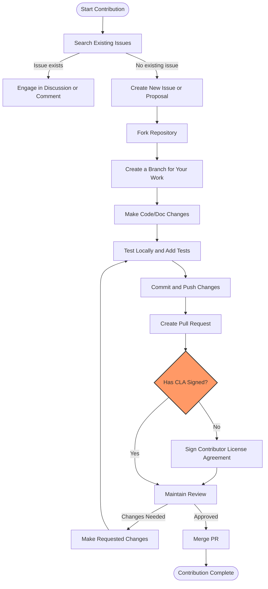

# How can I contribute to GoogleTest or GoogleMock?

Contributing to GoogleTest and GoogleMock is a spirited way to join a vibrant open-source community, improve testing tools you rely on, and help fellow developers write better C++ tests. This guide lays out the steps and expectations for submitting bug reports, feature requests, documentation improvements, and code contributions effectively.

---

## 1. Contribution Overview

Users contribute to GoogleTest and GoogleMock to:

- Report bugs or unexpected behavior.
- Request new features or enhancements.
- Improve or clarify documentation.
- Submit patches, fixes, or new functionality.

Your contributions help evolve the framework and ensure it remains robust and user-friendly.

---

## 2. Preparing Your Contribution

### Submitting Bug Reports and Feature Requests

1. **Search Existing Issues**: Before submitting, check the [GitHub Issues](https://github.com/google/googletest/issues) to see if your bug or feature request already exists.
2. **Provide Clear Details**:
   - Describe the problem or feature request clearly.
   - Include minimal reproducible examples for bugs.
   - Specify your environment (platform, compiler, GoogleTest version).
3. **Follow the Templates**: Use provided issue templates on GitHub to structure your report.

### Improving Documentation

Documentation improvements are welcomed and help everyone understand and use the framework more effectively.

- Fix typos, clarify explanations, add missing details.
- Suggest examples or rewrite complex sections.
- Follow the style and format consistent with existing docs.

### Preparing Code Contributions

To contribute code, be sure you:

- Understand the project's coding style and guidelines.
- Write clear, maintainable code with meaningful commit messages.
- Include tests that cover your changes.
- Ensure your code builds cleanly and passes all tests.

---

## 3. Contribution Process and Requirements

### Developer Certificate of Origin (DCO) / Contributor License Agreement (CLA)

Before your contribution can be merged, you must sign the Google Contributor License Agreement (CLA). This is a legal prerequisite confirming you have the right to contribute the code/documentation.

- You will be prompted automatically when submitting your first patch.
- Follow instructions in your pull request or on the project site to sign the CLA.

### Pull Request Submission

1. **Fork the repository** to your GitHub account.
2. **Create a feature branch** for your changes.
3. **Commit your changes** with descriptive messages.
4. **Run tests locally** and verify all pass.
5. **Open a Pull Request (PR)** detailing your changes and motivation.
6. Engage with maintainers during reviews and respond promptly.

---

## 4. Best Practices for Contributions

Below are guidelines to ensure your contributions are effective and successful:

- **Make incremental, focused changes**: Smaller PRs are easier to review and merge.
- **Follow existing coding conventions and style**: Consistency helps maintain code quality.
- **Test thoroughly**: Include or update tests to cover new or changed functionality.
- **Document your code and features**: Help users and maintainers understand your changes.
- **Be respectful and collaborative**: Engage constructively with reviewers.

---

## 5. Where to Find Help and Guidelines

- **CONTRIBUTING.md**: The canonical guide for contribution details, located in the [repository root](https://github.com/google/googletest/blob/main/CONTRIBUTING.md).
- **Code of Conduct**: Ensures a welcoming and respectful environment for all contributors.
- **Issue Tracker**: For reporting bugs or feature requests.
- **Community Forums and Discussions**: Engage with other users and maintainers.

---

## 6. References and Further Reading

- [GoogleTest GitHub Repository](https://github.com/google/googletest)
- [CONTRIBUTING.md Document](https://github.com/google/googletest/blob/main/CONTRIBUTING.md)
- [Google Contributor License Agreement (CLA)](https://cla.developers.google.com/)
- [GoogleTest User's Guide](https://google.github.io/googletest/)

---

## 7. Troubleshooting Common Contribution Issues

<AccordionGroup title="Common Questions When Contributing">
<Accordion title="I’m unsure if a bug is already reported. What should I do?">
Always search the existing issues before opening a new one. Use keywords and related terms. If unsure, post in discussion forums or comment on similar issues to clarify.
</Accordion>
<Accordion title="How do I ensure my changes are tested correctly?">
Run the existing test suite locally before and after your changes. Add new tests to cover your fixes or features. GoogleTest requires C++17 support, so ensure your build environment is up to date.
</Accordion>
<Accordion title="What if I can’t sign the CLA for some reason?">
Check the CLA FAQ linked from the prompt for guidance. Without signing, your pull request cannot be accepted. Contact the maintainers through official channels for assistance.
</Accordion>
</AccordionGroup>

---

## 8. Summary Flowchart of Contribution Process

---

## 9. Practical Tips

- Regularly sync your fork with the main branch to avoid merge conflicts.
- Use clear, descriptive commit messages following conventions (e.g., "Fix typo in documentation" or "Add parsing support for new feature").
- Engage with the community through discussions before significant feature proposals.

<Tip>
Contributing to GoogleTest and GoogleMock is not only about code — enhancing documentation, providing examples, and reporting issues are just as valuable to the health of the project.
</Tip>

<Note>
All contributions are subject to review, and maintainers may request changes to align with project goals and standards.
</Note>

<Warning>
Be aware of the C++17 requirement and build configuration details that may impact your ability to build and test contributions successfully.
</Warning>

---

Thank you for considering contributing to GoogleTest and GoogleMock. Your effort helps maintain the quality and usability of these essential C++ testing frameworks.