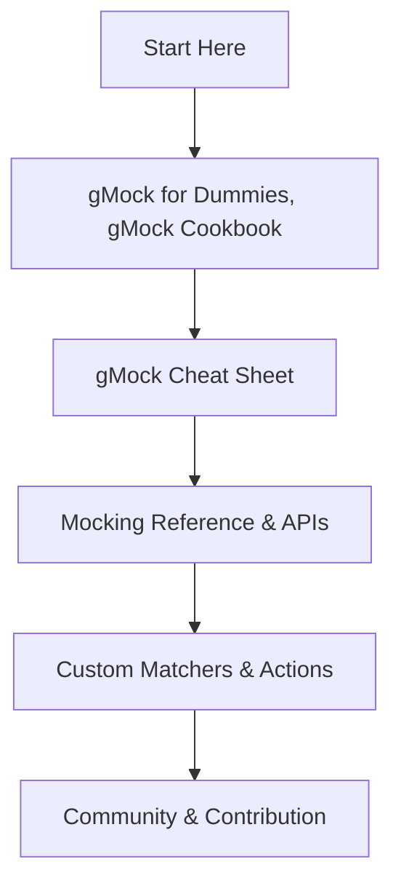

# Where to Learn More and Contribute

This page guides users to comprehensive resources, reference documentation, and community collaboration avenues to deepen their understanding of GoogleMock and contribute to its improvement. Whether you are a newcomer seeking tutorials or an advanced user interested in extending the framework, this page directs you to valuable learning paths and contribution processes.

---

## Comprehensive Learning Resources

GoogleMock is a sophisticated C++ mocking framework integrated into GoogleTest. To master it effectively, explore a variety of materials that address different aspects of usage—from getting started to advanced testing patterns.

### Essential Guides and Tutorials

- **gMock for Dummies**: A beginner-friendly introduction to mocking concepts and practical usage patterns to quickly bring new users up to speed.
- **gMock Cookbook**: A rich collection of recipes demonstrating advanced mocking techniques, practical tips, and pattern implementations.
- **Legacy gMock FAQ**: Addresses common conceptual issues and troubleshooting advice based on user experiences.

### Reference Documentation

- **Mocking Reference**: Detailed API descriptions for defining mocks, setting expectations, and using matchers and actions.
- **Mocking Methods & Objects**: Comprehensive details on the `MOCK_METHOD` macros and guidelines for mocking various C++ constructs.
- **Defining Expectations & Behaviors**: Explains `EXPECT_CALL`, `ON_CALL`, cardinalities, sequences, and behaviors.
- **Actions & Side Effects**: Guides how to specify return values, simulate side effects, and use callable objects as actions.
- **Strictness Modes**: Describes the use of `NiceMock`, `NaggyMock`, and `StrictMock` to control uninteresting call behavior.
- **Matchers Reference**: Catalog of built-in matchers, composing custom matchers, and complex argument validations.
- **Custom Assertions & Matchers**: Instructions on extending GoogleMock with custom assertion and matcher types.

### Quick Reference

- **gMock Cheat Sheet**: Summarizes key macros, syntax patterns, and common idioms for quick consultation during development.

---

## Community and Contribution

GoogleMock thrives on community contributions and collaborative improvements. Here's how to get involved and stay informed:

### Getting Help and Support

- **Official GitHub repository**: For bug reports, feature requests, and pull requests, visit the [GoogleTest GitHub repository](https://github.com/google/googletest).
- **Community Forums and Issue Trackers**: Utilize GitHub Issues for tracking problems and discussions.
- **Mailing Lists and Discussion Groups**: Some topics and announcements are available through GoogleTest mailing lists and community groups.

### How to Contribute

- **Familiarize Yourself with the Codebase**: Explore the source files, particularly areas like `gmock-spec-builders.cc` which implement core mocking behaviors.
- **Follow Coding Guidelines**: Comply with the project's C++ styling, testing, and documentation standards.
- **Writing Tests**: Contributions require thorough unit tests — check existing test suites (e.g., `gmock-spec-builders_test.cc`) for examples.
- **Documentation**: Help improve and expand documentation; clear, concise, and user-focused documentation is highly valued.

---

## Paths for Progression

To help you navigate your learning journey, here is a suggested sequence:

<Steps>
<Step title="Start with the Basics">
Begin with the gMock for Dummies guide to understand foundational mock concepts and practical usage.
</Step>
<Step title="Consult the Cheat Sheet">
Use the gMock Cheat Sheet during coding for quick reminders of common commands and patterns.
</Step>
<Step title="Deep Dive into the Mocking Reference">
Refer to the Mocking Reference for complete API details, including how to define mocks and specify expectations.
</Step>
<Step title="Master Advanced Patterns">
Explore the gMock Cookbook and Custom Assertions & Matchers pages to learn advanced techniques and extend functionality.
</Step>
<Step title="Contribute Back">
Engage with the community via GitHub, submit improvements, and help evolve the project.
</Step>
</Steps>

---

## Practical Tips for Using Resources

- Use **`ON_CALL`** to define default behaviors where calls are expected but do not need strict verification.
- Use **`EXPECT_CALL`** to set precise expectations on function calls including order, number, and arguments.
- Control test verbosity via `--gmock_verbose` for better insight into mock invocations, especially when debugging.
- Use strictness wrappers like `NiceMock`, `NaggyMock`, and `StrictMock` to manage warnings and errors from uninteresting calls.
- When writing tests, leverage patterns from the Cookbook to maintain clarity and reduce flakiness.

<Note>
Remember, mock expectations should always be set before exercising the mock objects to guarantee deterministic test behavior.
</Note>

---

## Where to Find the Documentation

- All official documents and guides are available online at the [GoogleTest documentation site](https://google.github.io/googletest/).
- The [GoogleTest GitHub repository](https://github.com/google/googletest) contains source code, tests, and the latest documentation.
- Links to commonly referenced pages:
  - [gMock Cheat Sheet](https://google.github.io/googletest/gmock_cheat_sheet.html)
  - [gMock Cookbook](https://google.github.io/googletest/gmock_cook_book.html)
  - [Mocking Reference](https://google.github.io/googletest/reference/mocking.html)
  - [Matchers Reference](https://google.github.io/googletest/reference/matchers.html)
  - [Actions Reference](https://google.github.io/googletest/reference/actions.html)

---

## Summary

This page helps you become a confident gMock user by directing you to well-crafted guides, comprehensive API references, practical cookbooks, and the active community where you can both learn and contribute. Armed with these resources, you can write robust, maintainable tests and collaborate on advancing the framework.

---

### Example Navigation Flow

---

## Additional Support Resources

- Visit the [GoogleTest FAQ](https://google.github.io/googletest/faq.html) for answers to common questions.
- Check troubleshooting pages if you encounter platform or build issues.
- Use mailing lists or forums for advanced discussions or assistance.

