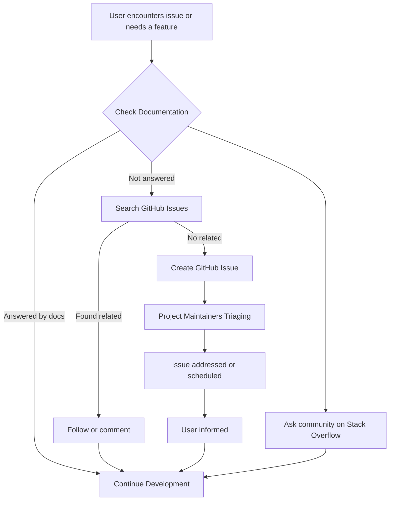

# Getting Help and Support

This page provides a comprehensive list of official channels and resources available for reporting bugs, requesting new features, or seeking troubleshooting assistance with GoogleTest and GoogleMock. It also includes direct links to essential documentation, mailing lists, forums, and community discussion hubs to connect users with expert support and peer guidance.

---

## Official Support Channels

### 1. GitHub Issue Tracker

Reporting bugs and requesting features is best done via the GitHub issue tracker for GoogleTest:

- GitHub Repository: [https://github.com/google/googletest/issues](https://github.com/google/googletest/issues)

Users are encouraged to provide detailed information including:

- Environment details (OS, compiler, version)
- Steps to reproduce
- Expected and actual behavior
- Minimal reproducible example

This helps maintainers triage and address issues efficiently.

---

### 2. Mailing Lists

While GoogleTest does not officially maintain a dedicated mailing list, users often seek help and share knowledge on various developer mailing lists related to C++ testing. You may find it useful to join:

- C++ community forums
- Testing-related discussion groups

Check for any community-based lists or local team lists related to GoogleTest.

---

### 3. Online Forums and Q&A Sites

Broader programming communities can be valuable for troubleshooting:

- [Stack Overflow](https://stackoverflow.com/questions/tagged/googletest)
  - Use tags such as `googletest`, `gmock`, and `google-test` to filter relevant questions.

- GoogleTest Discussions or relevant subreddits (e.g., r/cpp)

Keep questions precise, include error messages, and your test code snippet for quicker responses.

---

## Documentation Resources

Official documentation is the first source for learning, troubleshooting, and understanding GoogleTest and GoogleMock:

- [GoogleTest Primer](https://github.com/google/googletest/blob/main/docs/primer.md): Beginner-friendly introduction to writing and running C++ tests.
- [gMock for Dummies](https://google.github.io/googletest/gmock_for_dummies.html): Step-by-step guide on mocking basics.
- [gMock Cookbook](https://google.github.io/googletest/gmock_cook_book.html): Practical recipes and best practices.
- [gMock Cheat Sheet](https://google.github.io/googletest/gmock_cheat_sheet.html): Quick reference on mocking constructs and patterns.
- [Mocking Reference](https://github.com/google/googletest/blob/main/docs/reference/mocking.md): Detailed API documentation.

These resources offer extensive guidance and can resolve most routine questions.

---

## Community and Contribution

If you want to contribute or learn from others' contributions:

- Explore the repository's [contributing guidelines](https://github.com/google/googletest/blob/main/CONTRIBUTING.md).
- Participate in issue discussions and pull requests.
- Review community-driven examples and sample tests.

Sharing your use cases, bug fix ideas, or feature proposals benefits the entire community.

---

## Best Practices for Seeking Help

When asking for assistance, follow these recommendations:

- Check existing issues and documentation before creating a new issue or posting.
- Provide complete and minimal code examples.
- Include relevant information about your setup (GoogleTest version, compiler, OS).
- Report exact error messages and expected behavior.
- Be respectful and clear in your communication.

---

<AccordionGroup title="Frequently Asked Questions about Getting Help and Support">
<Accordion title="Where do I report a bug or request a feature?">
Use the [GitHub Issue Tracker](https://github.com/google/googletest/issues) for bug reports and feature requests. Be as detailed as possible.
</Accordion>
<Accordion title="Are there any official mailing lists I can join?">
No official GoogleTest mailing list exists, but many developers use C++ and testing-related community forums and mailing lists to discuss issues.
</Accordion>
<Accordion title="Where can I find detailed documentation for GoogleMock?">
Visit the official [gMock for Dummies](https://google.github.io/googletest/gmock_for_dummies.html), [Cookbook](https://google.github.io/googletest/gmock_cook_book.html), and [Reference](https://github.com/google/googletest/blob/main/docs/reference/mocking.md) for comprehensive guidance.
</Accordion>
<Accordion title="How do I get help more quickly on Stack Overflow?">
Tag your question with `googletest` and `gmock`. Provide a minimal reproducible example, environment details, and error output to facilitate faster replies.
</Accordion>
<Accordion title="Can I contribute to the GoogleTest or GoogleMock projects?">
Absolutely. Review the [CONTRIBUTING.md](https://github.com/google/googletest/blob/main/CONTRIBUTING.md) and actively participate via GitHub pull requests or issue comments.
</Accordion>
</AccordionGroup>

---

## Summary Diagram: Help & Support Flow

---

## Additional Tips

<Tip>
Leverage the extensive official documentation before seeking external help to resolve questions quickly.
</Tip>
<Tip>
Use friendly and clear language in issue reports and community posts to maximize engagement.
</Tip>
<Tip>
Stay updated by subscribing to GitHub notifications on relevant modules or issues.
</Tip>

---

## Related Documentation

- [GoogleTest Primer](https://github.com/google/googletest/blob/main/docs/primer.md)
- [gMock for Dummies](https://google.github.io/googletest/gmock_for_dummies.html)
- [Mocking Reference](https://github.com/google/googletest/blob/main/docs/reference/mocking.md)
- [gMock Cookbook](https://google.github.io/googletest/gmock_cook_book.html)
- [gMock Cheat Sheet](https://google.github.io/googletest/gmock_cheat_sheet.html)
- [Installation Methods](https://github.com/google/googletest/blob/main/docs/getting-started/setup-basics/installation-methods.md)

---

For direct access to the documentation navigation and deeper learning, see the [Getting Started](../getting-started/setup-basics/installation-methods.md) and [Guides](../guides/getting_started/googlemock-quickstart.md) sections.
