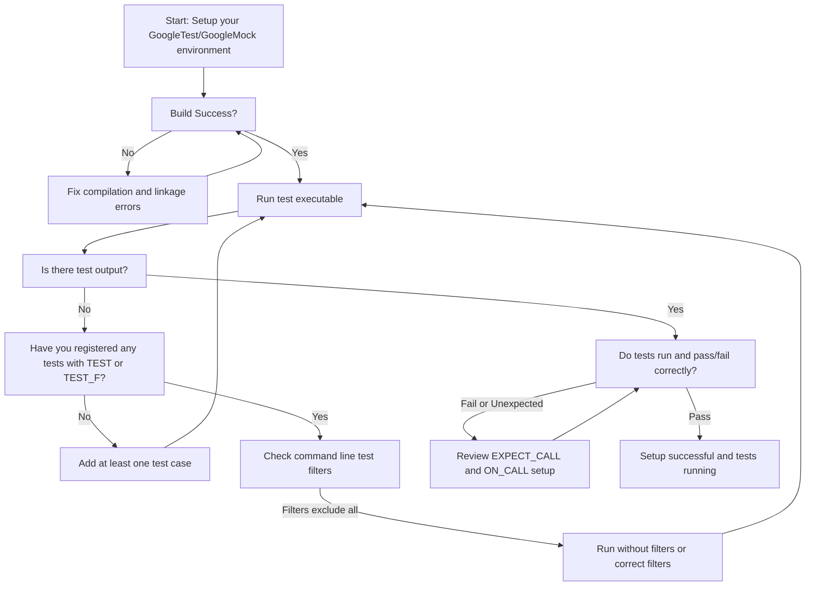

# Getting Started: Common Issues  

Welcome to the GoogleTest and GoogleMock setup FAQ. This guide helps you overcome typical challenges encountered during initial installation, build configuration, and environment setup. By addressing common issues upfront, you'll ensure that your testing environment is stable and your workflow smooth.

---

## Frequently Encountered Setup Issues

### 1. Build Errors and Missing Dependencies

**Problem:** You encounter compilation or linker errors referencing GoogleTest or GoogleMock symbols, or missing header files.

**Cause:** Often due to incorrect include paths, missing libraries, or improper linkage in your build system.

**Solution:**

- Verify that your project includes the appropriate GoogleTest and GoogleMock header directories.
- Ensure that you link against the correct libraries (`gtest`, `gmock`, `gtest_main`, or `gmock_main`) according to your needs.
- When using CMake, confirm that you use provided `FindGTest.cmake` or `GoogleTest` targets correctly.
- If using Bazel, check workspace declarations and dependencies.
- Confirm that the source and header files are from compatible versions to avoid API mismatches.

<Tip>
Always prefer linking with `gtest_main` or `gmock_main` libraries to avoid manually implementing a `main()` function unless customization is needed.
</Tip>

### 2. Unsupported or Incompatible Compiler Versions

**Problem:** Your compiler doesn’t support required C++11 or later features, resulting in syntax errors or warnings.

**Cause:** GoogleTest and GoogleMock require modern C++ features, especially from C++11 onwards.

**Solution:**

- Use a compiler with proper C++11 support or later. GCC 4.8+, Clang 3.3+, MSVC 2015+ are confirmed to work.
- Enable the appropriate language standard flags (e.g., `-std=c++11` or higher) in your build configuration.
- If cross-compiling or working in constrained environments, verify platform-specific support.

<Warning>
Compiling without enabling C++11 (or later) standard will lead to numerous errors. This is non-negotiable.
</Warning>

### 3. Unrecognized Build Flags or Command-Line Arguments

**Problem:** Flags such as `--gmock_verbose`, `--gtest_filter`, or others seem to be ignored or cause errors.

**Cause:** Flags must be passed correctly and parsed by the appropriate initialization functions.

**Solution:**

- Always call `testing::InitGoogleTest(&argc, argv);` or `testing::InitGoogleMock(&argc, argv);` in your `main()` before running tests. These functions parse and consume recognized flags.
- Remove flags intended for GoogleTest/GoogleMock from `argv` before proceeding.
- For programs without `main()` (e.g., Arduino boards), use provided `setup()` and `loop()` initialization as per platform-specific instructions.

### 4. Linking Multiple Main Functions

**Problem:** Linking errors occur because multiple libraries provide `main()` functions.

**Cause:** Linking both `gtest_main` and `gmock_main` or multiple main-source files simultaneously.

**Solution:**

- Choose only one main library depending on what your tests require:
  - Use `gtest_main` if you only use GoogleTest.
  - Use `gmock_main` if you use GoogleMock (which internally initializes GoogleTest).
- If you provide a custom `main()`, exclude those libraries from linking.

### 5. Running Tests on Embedded or Arduino-like Platforms

**Problem:** Your tests don’t run as expected on ESP8266, ESP32, or other Arduino targets.

**Cause:** These platforms do not use traditional `main()` signatures and require `setup()`/`loop()` functions.

**Solution:**

- GoogleTest and GoogleMock provide platform-specific entry points in `googletest/src/gtest_main.cc` and `googlemock/src/gmock_main.cc`.
- Implement your `setup()` function where you call `testing::InitGoogleTest()` or `testing::InitGoogleMock()`.
- Continuously run your tests within the `loop()` function using `RUN_ALL_TESTS();`.

<Tip>
Check your platform-specific macros (`GTEST_OS_ESP8266`, `GTEST_OS_ESP32`, `GTEST_OS_NRF52`) to confirm support and entry points.
</Tip>

### 6. Warnings About Uninteresting or Unexpected Calls (gMock Specific)

**Problem:** Tests produce warnings about calls to mock methods that were not expected or matched.

**Cause:** GoogleMock's default behavior flags unexpected or uninteresting mock calls to help maintain test accuracy.

**Solution:**

- Use `NiceMock` or `NaggyMock` wrappers to control the strictness of mock warnings.
- Define explicit `EXPECT_CALL` or `ON_CALL` statements for all relevant mock interactions.
- Use `Times()` clauses to specify how often mock methods are expected to be called.

<Note>
Ignoring these warnings can result in brittle tests or unverified behavior. Address them proactively.
</Note>

### 7. Tests Not Running or Returning Zero Without Output

**Problem:** Calling `RUN_ALL_TESTS()` returns 0 with no tests run or output visible.

**Cause:** 

- No tests have been registered, possibly due to missing test code or incorrect macros.
- Command-line filters exclude all tests.

**Solution:**

- Ensure your test code uses `TEST()` or `TEST_F()` macros correctly.
- Verify your build includes all test source files.
- Check that no `--gtest_filter` or similar flags exclude all tests.
- Confirm use of `InitGoogleTest()` or `InitGoogleMock()` in `main()` is correctly done.

### 8. Issues with Deprecated or Legacy Mock Syntax

**Problem:** Old mocking macros (e.g., `MOCK_METHOD*`) or outdated patterns cause compilation errors or warnings.

**Cause:** GoogleMock evolved to require `MOCK_METHOD` with the modern syntax for C++11.

**Solution:**

- Update all mock definitions to use the modern `MOCK_METHOD` macro.
- Refer to migration guides for examples on transforming old mocks.
- Avoid underscores in test suite and test names where possible.

---

## Best Practices for a Smooth Setup

- **Link with gmock_main**: For typical mock-enabled test binaries, linking `gmock_main` handles all initialization.
- **Call Init Functions First**: Always initialize GoogleTest or GoogleMock with provided initialization functions before running tests.
- **Use Provided Main Files**: Avoid redundant or conflicting `main()` implementations.
- **Keep Test Sources Included**: Verify test source files are compiled and linked.
- **Use Correct Compiler Flags**: Enable at least C++11 support and necessary warning flags.

<Tip>
Before raising issues on forums or bug trackers, reproduce your problem with a minimal test case that includes the test `main()` and a single `TEST()`.
</Tip>

---

## Troubleshooting Flowchart

---

## Where to Find More Help

- **Official GoogleTest Primer**: [Getting Started and Writing Your First Test Case](https://github.com/google/googletest/blob/main/docs/primer.md)
- **Mocking for Dummies**: Learn mock creation and usage.
- **gMock Cookbook and Cheat Sheet**: For advanced mocking workflows.
- **Community Support Channels**: Stack Overflow, GitHub Issues, and mailing lists.

---

Remember, comprehending common pitfalls during setup saves precious time. GoogleTest and GoogleMock provide mature infrastructure, but thoughtful integration ensures your project benefits fully from automated testing.

Happy Testing!
