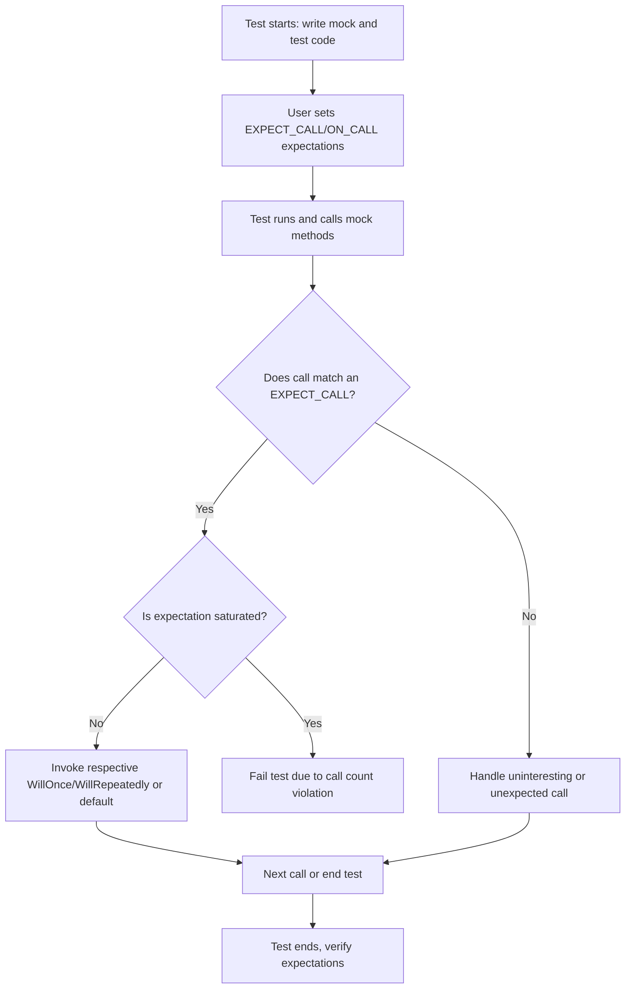

# Assertions and Matchers: Solving Common Pitfalls

This documentation addresses frequently misunderstood matcher usage, common assertion failures, diagnosing test result messages, and extending GoogleTest with custom assertions. Understanding these topics helps you write more robust, maintainable tests and interpret error messages effectively.

---

## 1. Understanding Matcher and Assertion Failures

### Why Do My EXPECT_CALL Matchers Fail?

Matchers are predicates used to specify expectations on mock method arguments. Failures often arise when these predicates don't match the actual arguments provided during a test run.

**Common reasons include:**
- Using overly specific or incorrect matchers that don't correspond to argument types or values.
- Incorrect ordering of EXPECT_CALL statements, causing expectations to shadow one another.
- Overloading ambiguities requiring explicit disambiguation (e.g., using `Const()` wrapper for const methods).

**How to diagnose:**
Use the `--gmock_verbose=info` flag when running tests to see detailed traces on which expectations matched or failed, including argument values and stack traces. This insight quickly reveals mismatches and ordering issues.

### Why Am I Getting "Uninteresting Mock Function Call" Warnings?

Calls to mock methods that have no `EXPECT_CALL` set are called **uninteresting calls**. By default, gMock prints warnings about them, though these are not failures.

**Tip:**
- If your test is not interested in calls to that method, you can safely ignore these warnings.
- To suppress them, use `NiceMock<T>` or add a catch-all expectation:

```cpp
EXPECT_CALL(mock_obj, MethodName(_)).Times(AnyNumber());
```

Avoid suppressing by blindly adding `EXPECT_CALL`s without purpose; this results in fragile tests.

### What Does "Unexpected Mock Function Call" Mean?

An **unexpected call** occurs when a mock method has expectations (`EXPECT_CALL`s) but the actual call does not match any.

This is always an error indicating the tested code behaves differently than expected.

### Why Do I Get Multiple Failure Messages for One Failed Expectation?

gMock can report failures for the exact expectation violation and for calls that followed (possibly repeated failures). Though redundant at first glance, each corresponds to a distinct failure moment and provides useful context for debugging.

---

## 2. BEST PRACTICES: Writing Robust Expectations and Assertions

### Use `ON_CALL` for Default Behavior, `EXPECT_CALL` for Verification

- Use `ON_CALL` to set default mock behaviors without expecting the call explicitly. This reduces over-specifying tests.
- Use `EXPECT_CALL` only when you want to verify that the call is made with specific arguments and cardinality.

Example:
```cpp
ON_CALL(mock_obj, GetSize()).WillByDefault(Return(5));
EXPECT_CALL(mock_obj, Reset()).Times(1);
```

### Specify Only Necessary Matchers

Don’t over-specify argument values unless needed. Use wildcards (`_`) when arguments aren’t relevant.

Example:
```cpp
EXPECT_CALL(mock, Process(_, _));  // Matches any arguments.
```

### Avoid Overlapping Expectations Without Proper Ordering

Since newer expectations override older ones, place the generic expectations *before* more specific ones.

Example:
```cpp
EXPECT_CALL(mock, Foo(_)).Times(AnyNumber());  // Generic catch-all.
EXPECT_CALL(mock, Foo(42)).Times(1);            // Specific expectation.
```

### Use `InSequence` or `After` to Enforce Call Order Where Needed

If the order of calls matters, express that explicitly:

```cpp
Sequence s;
EXPECT_CALL(mock, Init()).InSequence(s);
EXPECT_CALL(mock, Process()).InSequence(s);
```

Or use `After` for partial ordering:
```cpp
Expectation e1 = EXPECT_CALL(mock, Start());
EXPECT_CALL(mock, Finish()).After(e1);
```

### Retire Expectations After Saturation When Appropriate

By default, expectations remain active (sticky) after the expected calls are made. If you want them to retire after their call count is met, use `.RetiresOnSaturation()`. This prevents later calls from triggering the retired expectation again.

---

## 3. Diagnosing Assertion Errors and Test Failures

### Interpreting gMock Failure Messages

Failure messages often include:
- The failing expectation source code location.
- Which arguments matched and which did not.
- Call counts and expected cardinalities.
- State of sequences and ordering constraints.

Carefully review these to identify:
- Whether arguments did not match due to wrong matchers or values.
- If call order violated sequence constraints.
- Whether the expectation was retired or saturated unexpectedly.

### Using `--gmock_verbose=info` to Gain Full Call Trace

This verbose mode prints all expectations and matching calls with stack traces.

It helps identify why your expectation was skipped or failed.

### Common Pitfalls

- Forgetting that `EXPECT_CALL` must appear before exercising the mock.
- Overloading ambiguities—use `Const(mock).Method()` or typed matchers to resolve.
- Using multiple `WillOnce` clauses exceeding `Times()` cardinality without `.RetiresOnSaturation()`, leading to "actions ran out" warnings.

---

## 4. Extending with Custom Assertions and Matchers

GoogleTest provides facilities to author custom matchers and actions, allowing expressive, reusable validations.

### Writing a Custom Matcher

Use `MATCHER` or `MATCHER_P` macros for simple cases, specifying the boolean logic and optional description strings.

Example:
```cpp
MATCHER(IsDivisibleBy7, "") {
  return (arg % 7) == 0;
}
```

Use:
```cpp
EXPECT_CALL(mock, Foo(IsDivisibleBy7()));
```

For complex or polymorphic matchers, implement the matcher interface with `MatchAndExplain`, `DescribeTo`, and `DescribeNegationTo` methods.

### Writing Custom Actions

Actions define the behavior of mock methods.

You can use lambdas or function objects:

```cpp
EXPECT_CALL(mock, DoSomething(_))
    .WillOnce([](int val) { return val * 2; });
```

Or define complex actions by implementing `ActionInterface` or using `MakePolymorphicAction`.

### Safeguards for Matchers and Actions

Matchers must be **pure functions** without side effects, ensuring stable and deterministic test results.

Actions can be stateful but must respect expectations around call counts and order.

---

## 5. Troubleshooting Common Issues

### "The mock function has no default action set" Error

This occurs when a mock method returning a value has no default action specified.

**Fix:** Add an `ON_CALL` specifying `WillByDefault(...)` or add specific expectations with actions.

### "Too many/few actions specified in EXPECT_CALL" Warning

Seen when the number of `WillOnce()` actions does not align with the `Times()` expectation.

**Fix:** Make sure that the number of `WillOnce()` calls matches your cardinality or add a `WillRepeatedly()`.

### Overloading and Const Ambiguities

Ambiguous calls to overloaded or const-qualified mock methods require extra hints.

Use:
- `Const(mock).Method()` for const methods.
- Typed matchers like `TypedEq<T>(value)` or `SafeMatcherCast<T>(matcher)`.

### Mock Object Destruction and Verification

Expectations are verified automatically upon mock object destruction. If mocks are leaked or not destroyed, verification never happens leading to false passes.

Use `Mock::AllowLeak(&mock)` to suppress errors related to leaked mocks.

Force verification early with `Mock::VerifyAndClearExpectations(&mock)` if needed.

---

## 6. Practical Tips for Success

- Set expectations *before* exercising mocks.
- Use `NiceMock` to suppress noisy warnings on uninteresting calls in stable tests.
- Use `StrictMock` when you want uninteresting calls to cause failures.
- Prefer `ON_CALL` to set default behaviors shared across tests.
- Use `EXPECT_CALL` sparingly and purposefully to verify behavior.
- When matching complex arguments, use `SaveArg` to capture and verify values post-call.
- For methods with many parameters, simplify by wrapping complex arguments or using helper methods.
- Document your tests clearly to specify why expectations exist.

---

## 7. Summary Diagram of Typical User Assertion Workflow



---

## 8. Resources and Further Reading

- Refer to the [Mocking Reference](reference/mocking.md) for detailed syntax of `EXPECT_CALL` and `ON_CALL`.
- Explore the [gMock Cookbook](gmock_cook_book.md) for practical mocking recipes.
- Utilize the [Matchers Reference](reference/matchers.md) for built-in matchers.
- Review the [Assertions Reference](reference/assertions.md) for how to write effective assertions.
- Inspect [Custom Matchers and Actions](reference/matchers-actions-utilities/custom-matchers-actions.mdx) to extend your tests.

---

For concrete examples and common scenarios, see the [gMock for Dummies](gmock_for_dummies.md) guide.

---

## 9. Troubleshooting Tips Summary

- If tests fail mysteriously, enable verbose logging (`--gmock_verbose=info`).
- Always verify that mock objects are destroyed to trigger checks.
- Check for overload ambiguities when `EXPECT_CALL` doesn't behave as expected.
- Use `.RetiresOnSaturation()` judiciously to avoid sticky expectation surprises.
- Set catch-all expectations with wildcards to avoid unintentional errors.

---


<Tip>
Ensure you set expectations before calls, keep expectations minimal and focused, and use verbose logging for debugging matcher failures.
</Tip>

<Note>
Remember that expectations remain active unless explicitly retired. Misunderstanding this leads to common failures.
</Note>

<Warning>
Over-specifying expectations or complex ordering without clear intent can make tests brittle and hard to maintain.
</Warning>

<Info>
Extending GoogleTest with custom matchers and actions unlocks powerful verification capabilities tailored to your domain.
</Info>

<Check>
Use `NiceMock` to suppress warnings, `StrictMock` to enforce strictness, and `NaggyMock` to get warnings on uninteresting calls.
</Check>

<Steps>
<Step title="Diagnose Matcher Failures">
Run tests with --gmock_verbose=info for detailed call matching information.
</Step>
<Step title="Refine EXPECT_CALL Usage">
Define expectations only for calls you intend to verify; otherwise, use ON_CALL for defaults.
</Step>
<Step title="Use Wildcards Appropriately">
When arguments aren't important, use `_` matcher to avoid over-specifying.
</Step>
<Step title="Enforce Call Order Explicitly">
Use `InSequence` or `After` to specify call order to avoid unexpected failures.
</Step>
<Step title="Review Failure Messages Carefully">
Pay attention to the expectation description, file location, and call counts.
</Step>
<Step title="Extend When Needed">
Create custom matchers or actions if built-in ones don't capture your test logic.
</Step>
</Steps>

---

## 10. How to Write Custom Assertions and Matchers Quickly

GoogleTest allows defining custom matchers using macros such as `MATCHER` and `MATCHER_P`. These let you define readable, reusable predicates.

Example:
```cpp
MATCHER(IsPositive, "Checks if a number is positive") {
  return arg > 0;
}
```
Use in tests:
```cpp
EXPECT_THAT(value, IsPositive());
```

For more complex matchers, implement `MatchAndExplain`, `DescribeTo`, and `DescribeNegationTo` methods in a class and wrap it with `Matcher<T>`.

Actions can be customized by providing callables/lambdas or implementing the `ActionInterface`.

---

End of this guide on resolving common assertion and matcher pitfalls in GoogleTest.