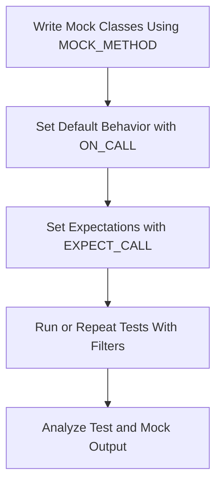

# Writing and Running Tests

This page guides you through the essential process of authoring effective tests, using assertions and mocks, and understanding how test output should be interpreted. It clarifies common misconceptions about test structure, how tests are discovered by the framework, and how to run tests either individually or as a group. By following these guidelines, you will be able to write clear, maintainable, and robust tests that accelerate your development workflow.

---

## 1. Writing Effective Tests

Writing tests is not just about verifying code correctness; it’s about communicating intent and ensuring reliability over time. Here’s how to write tests that deliver lasting value:

- **Aim for Clarity:** Each test should verify a single behavior or outcome. Avoid mixing multiple assertions that test unrelated functionality.

- **Use the TEST and TEST_F Macros:**
  - `TEST(TestSuiteName, TestName)` is for simple independent tests.
  - `TEST_F(FixtureName, TestName)` is for tests that share common setup/teardown logic via test fixtures.

- **Structure Your Tests for Readability:** Use descriptive test names and organize your tests so that their purpose is clear at a glance.

- **Employ Assertions Thoughtfully:** Use GoogleTest assertions such as `EXPECT_EQ`, `ASSERT_TRUE`, `EXPECT_THROW`, etc., to clearly express expected outcomes.

- **Avoid Over-Specifying Expectations:** Tests should focus on the contract—not the implementation details. Excessively detailed expectations make tests brittle and hard to maintain.

### Example: A Simple Test

```cpp
#include <gtest/gtest.h>

TEST(MathTest, Addition) {
  int a = 2;
  int b = 3;
  EXPECT_EQ(a + b, 5);  // Verifies sum is correct
}
```

### Test Fixtures for Shared Setup

When you have multiple tests that require the same setup, use fixtures:

```cpp
class MyTestFixture : public testing::Test {
 protected:
  void SetUp() override {
    // Code here runs before each test
  }

  void TearDown() override {
    // Code here runs after each test
  }

  // Shared resources here
};

TEST_F(MyTestFixture, Test1) {
  // Test code
}

TEST_F(MyTestFixture, Test2) {
  // Another test
}
```

---

## 2. Using Assertions and Mocks

Assertions validate conditions within tests, and mocks allow you to test the interactions between components effectively. Here’s how to leverage both:

### 2.1 Assertions

- Use `EXPECT_` macros for non-fatal assertions that allow continuation post-failure.
- Use `ASSERT_` macros for fatal assertions that abort the current test upon failure.
- Select assertions tailored to your data: `EXPECT_EQ`, `EXPECT_NEAR`, `EXPECT_THROW`, etc.
- For complex conditions, use GoogleTest’s matcher framework, e.g., `EXPECT_THAT(value, Contains("text"))`.

### 2.2 Mocking with gMock

Mocks enable controlling and verifying interactions with dependencies. Use the following approach:

- Define mock classes with `MOCK_METHOD` macros overriding virtual functions.
- Use `ON_CALL` to set default mock behavior when the call is made but not necessarily expected.
- Use `EXPECT_CALL` to set expected calls, including the number of calls (`Times()`), argument matchers, call order (`InSequence`), and actions (`WillOnce`, `WillRepeatedly`).
- Use `NiceMock`, `NaggyMock`, or `StrictMock` wrappers to control how uninteresting calls are handled.

### Example: Basic Mock Use

```cpp
#include <gmock/gmock.h>

class Foo {
 public:
  virtual ~Foo() = default;
  virtual int Bar(int x) = 0;
};

class MockFoo : public Foo {
 public:
  MOCK_METHOD(int, Bar, (int x), (override));
};

TEST(FooTest, BarReturnsExpected) {
  MockFoo mock;
  EXPECT_CALL(mock, Bar(5)).WillOnce(testing::Return(10));

  EXPECT_EQ(mock.Bar(5), 10);
}
```

---

## 3. Understanding Test Discovery and Execution

GoogleTest automatically discovers test cases and runs them, providing a streamlined test execution workflow:

- **Test Registration:** Tests are registered at static initialization using macros.
- **Test Discovery:** On execution, the framework lists all registered tests.
- **Test Execution:** Tests run in a prescribed order or according to command-line filters.
- **Output and Reporting:** Detailed output shows successes, failures, and stack traces as needed.

### Running Tests Individually or in Bulk

- Use command-line filters to run specific tests:

  ```sh
  ./my_tests --gtest_filter=TestSuiteName.TestName
  ```

- Run all tests by default with no filters.

- Use `--gtest_repeat=N` to run tests multiple times for stability checking.

### Common Pitfall: Setting Expectations Before Use

Always set mock expectations before exercising code that calls mock methods. Setting expectations after calls leads to undefined behavior and unreliable tests.

---

## 4. Test Output Interpretation

GoogleTest and GoogleMock emit clear output that includes:

- Test pass/fail status
- Failure messages with file/line and assertion details
- Stack traces for tracing failures
- Mock invocation traces based on verbosity flags

### gMock Verbosity Flags

Control diagnostic output with:

- `--gmock_verbose=info` — show all info, warnings, and errors with stack traces
- `--gmock_verbose=warning` — show warnings and errors (default)
- `--gmock_verbose=error` — show errors only

### Diagnosing Test Failures

- Look at the expected vs actual call counts and arguments.
- Use `--gmock_verbose=info` to see what expectations matched or failed.
- For unexpected mock calls, GoogleMock provides detailed messages on mismatches.
- Verify call sequencing if sequences or `After()` clauses are used.

---

## 5. Running Tests Efficiently

- Organize tests in suites logically to ease individual or bulk runs.
- Use test filters and repetition flags to focus test runs.
- Leverage mock strictness modes (`NiceMock`, `NaggyMock`, `StrictMock`) to reduce noise or increase rigor.
- Employ default actions (`ON_CALL`) to reduce boilerplate without over-restricting behavior.

---

## 6. Common Misconceptions Clarified

### Test Structure

- The test macro `EXPECT_CALL` defines expectations for future calls, not past calls.
- Tests should not mix setting expectations after exercising code.

### Test Discovery

- Tests are automatically discovered via macro registration—no manual test suites are required.

### Running Tests

- Tests can be run individually with filters or collectively.
- Running tests in any order is allowed unless ordering constraints are specified explicitly.

---

## 7. Troubleshooting Tips

- **No test runs?** Confirm test macro usage and compilation includes the test files.
- **Unexpected mock failures?** Run with `--gmock_verbose=info` to trace matching.
- **Test hangs or crashes?** Use `gtest` and `gmock` logs to isolate issues.
- **Uninteresting call warnings?** Use `NiceMock` or add permissive expectations where appropriate.

---

## 8. Further Reading and Resources

- [gMock Cookbook](https://google.github.io/googletest/gmock_cook_book.html): Practical recipes and detailed usage.
- [Mocking Reference](https://google.github.io/googletest/reference/mocking.html): Complete API details on mocking.
- [gMock Cheat Sheet](https://google.github.io/googletest/gmock_cheat_sheet.html)
- [GoogleTest Primer](https://google.github.io/googletest/primer.html): Intro to writing tests with GoogleTest.
- [Mocking Workflow Guide](https://google.github.io/googletest/guides/mocking-best-practices/mocking-workflow.html)

---

## Callouts

<Tip>
Set expectations with `EXPECT_CALL` before using the mock in your test to ensure proper verification and avoid undefined behavior.
</Tip>

<Warning>
Avoid over-specifying mock expectations; verify contracts rather than implementation to keep tests resilient.
</Warning>

<Note>
Use `ON_CALL` when you want to define default mock behavior without setting call expectations.
</Note>

---

## Related Topics

- [Defining and Using Mock Methods](https://google.github.io/googletest/api-reference/mocking-apis/mock-methods.html)
- [Call Expectations & Sequences](https://google.github.io/googletest/api-reference/mocking-apis/call-expectations.html)
- [Actions & Return Value Control](https://google.github.io/googletest/api-reference/mocking-apis/mock-actions.html)
- [Nice, Naggy, and Strict Mocks](https://google.github.io/googletest/api-reference/mocking-apis/mock-strictness.html)


---

## Summary Diagram



---

This completes the core information on writing and running tests with GoogleTest and GoogleMock, creating a foundation for reliable, maintainable, and understandable test coverage.