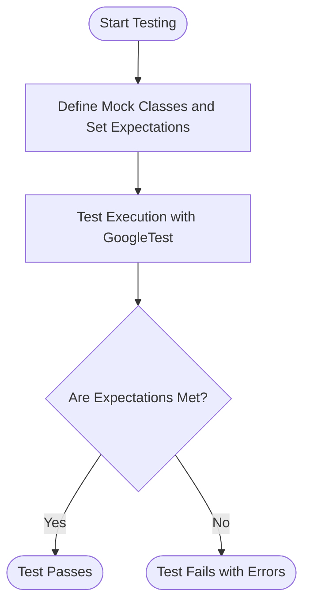

# What are GoogleTest and GoogleMock?

GoogleTest and GoogleMock are two complementary frameworks for C++ developers designed to facilitate robust, scalable, and expressive unit testing.

- **GoogleTest** is a C++ testing framework that provides automated test discovery, rich assertion libraries, test fixtures, and a structured xUnit-style architecture.
- **GoogleMock** is an extension integrated with GoogleTest that allows the creation and use of mock objects to simulate and verify interactions between components, enabling interaction-based testing.

Together, they form a powerful suite for writing comprehensive tests that cover both the state and behavior of C++ codebases.

---

## Purpose and Roles

| Framework    | Purpose                                                | Key Differentiators                                   |
|--------------|--------------------------------------------------------|------------------------------------------------------|
| GoogleTest   | Enables writing and running unit tests with assertions | Automated test discovery, fixture support, extensive assertion macros |
| GoogleMock   | Provides tools to create mock objects for interaction verification | Declarative mock classes, rich matchers, actions, and call sequencing control |

---

## When to Use GoogleTest

Use GoogleTest when you want to:

- Write tests that verify the expected **state** and **outputs** of your units.
- Organize tests in logical suites and leverage test fixtures for setup and teardown.
- Use expressive assertions to validate values, exceptions, and more.
- Integrate easily with build systems, CI pipelines, and IDEs.

### Example: Writing a Basic Test with GoogleTest

```cpp
#include <gtest/gtest.h>

// Function to test
int Add(int a, int b) {
  return a + b;
}

TEST(MathTests, AddTwoNumbers) {
  EXPECT_EQ(Add(2, 3), 5);
  EXPECT_NE(Add(2, 2), 5);
}
```

This test demonstrates a simple state verification scenario validating output correctness.

---

## When to Use GoogleMock

GoogleMock should be used when your tests need to:

- Verify **interactions** between your code and its collaborators (i.e., that certain methods are called with certain arguments, in a specified order).
- Simulate complex or unavailable components by mocking interfaces.
- Control and verify sequences, number, and parameters of function calls precisely.
- Customize behavior of dependencies dynamically within tests.

### Key Features of GoogleMock

- Define mock classes easily using `MOCK_METHOD` macros.
- Set expectations using `EXPECT_CALL`, specifying argument matchers, call counts, and sequences.
- Provide default and expected behaviors with `ON_CALL` and action clauses (`WillOnce`, `WillRepeatedly`).
- Control call ordering with `InSequence` and `After` clauses.
- Handle uninteresting calls gracefully with `NiceMock`, `NaggyMock`, and `StrictMock` wrappers.

### Example: Defining a Mock and Setting Expectations

```cpp
#include <gmock/gmock.h>

class Turtle {
 public:
  virtual ~Turtle() {}
  virtual void PenDown() = 0;
  virtual void Forward(int distance) = 0;
};

class MockTurtle : public Turtle {
 public:
  MOCK_METHOD(void, PenDown, (), (override));
  MOCK_METHOD(void, Forward, (int distance), (override));
};

using ::testing::AtLeast;

TEST(PainterTest, DrawsCircle) {
  MockTurtle turtle;
  EXPECT_CALL(turtle, PenDown()).Times(AtLeast(1));
  EXPECT_CALL(turtle, Forward(100));

  // Code under test that uses turtle...
}
```

---

## How GoogleTest and GoogleMock Work Together

GoogleMock extends GoogleTest seamlessly, allowing you to:

- Use GoogleMock's mock objects in GoogleTest test cases.
- Combine state verification (assertions) with interaction verification (mock expectations) in your tests.
- Automatically verify all expectations at the end of each test.

This integration empowers developers to write powerful tests that ensure not only correct results but also correct behavior.

---

## Best Practices

- **Use GoogleTest** for pure state-based testing scenarios.
- **Use GoogleMock** to mock dependencies and verify interactions.
- Combine both where complex testing needs arise.
- Set expectations before exercising the mocks to avoid undefined behavior.
- Use appropriate matchers to avoid brittle tests.
- Prefer `NiceMock` for general tests to suppress uninteresting warnings.
- Explicitly use `StrictMock` sparingly when strict verification is essential.

---

## Common Scenarios and Guidance

| Scenario                                      | Recommended Approach                                  |
|-----------------------------------------------|-----------------------------------------------------|
| Testing a pure function or method output      | Use GoogleTest assertions                            |
| Testing component interactions and collaborations | Use GoogleMock expectations to verify calls        |
| Mocking interfaces and dependencies            | Define mock classes using `MOCK_METHOD` macros       |
| Handling uninteresting method calls            | Use `NiceMock<T>` to suppress warnings             |
| Enforcing call order in tests                   | Use `InSequence` and `After` clauses                 |
| Returning sequence of values from mocks         | Use chained `WillOnce` clauses followed by `WillRepeatedly` |

---

## Additional Resources

- [gMock for Dummies](https://google.github.io/googletest/gmock_for_dummies.html): Beginner-friendly guide to GoogleMock concepts and usage.
- [Mocking Reference](https://google.github.io/googletest/reference/mocking.html): Complete reference for GoogleMock macros, classes, and clauses.
- [gMock Cheat Sheet](https://google.github.io/googletest/gmock_cheat_sheet.html): Quick summary of GoogleMock features and syntax.
- [Writing Your First Test](https://google.github.io/googletest/guides/getting-started/writing-your-first-test.html): A practical guide to creating tests using GoogleTest.
- [Mocking with GoogleMock Guide](https://google.github.io/googletest/guides/advanced-testing/mocking-with-googlemock.html): In-depth tutorial on creating mocks, setting expectations, and actions.

---

## Integration and Setup

GoogleTest and GoogleMock are typically included together. To enable mocking:

- Include the header `#include <gmock/gmock.h>` which brings in GoogleMock with GoogleTest.
- Initialize GoogleMock in your `main` function using `::testing::InitGoogleMock(&argc, argv);`.
- Link against the `gmock` and `gtest` libraries as per your build system.

---

## Troubleshooting Tips

- Expectation mismatches are reported with detailed failure messages pinpointing which call did not meet the expectations.
- Use verbosity flags (e.g., `--gmock_verbose=info`) for detailed logs of mock call matches and mismatches.
- Verify mocks have virtual destructors to avoid memory and cleanup issues.
- Be mindful of mocking overloaded and const-qualified methods — use correct mock method declarations.
- Avoid over-specifying your expectations to keep tests maintainable and resilient.

---

## Summary Diagram


