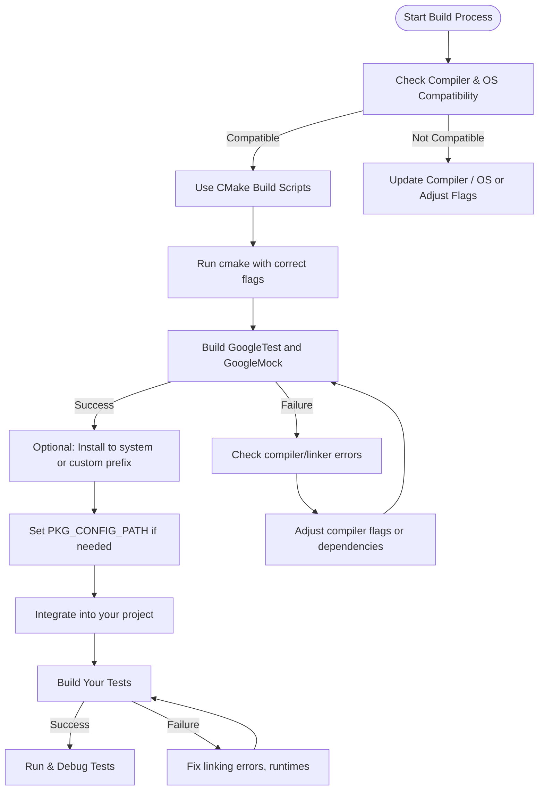

# Troubleshooting Build and Integration Issues with GoogleTest and GoogleMock

This guide addresses common challenges users face when building or integrating GoogleTest and GoogleMock with popular build systems. Whether you use CMake, pkg-config, or other build tools, here you will find practical tips to diagnose and resolve failures related to compilation, linking, and runtime integration.

---

## Frequently Asked Questions

### How do I resolve linking errors or missing symbols when building GoogleTest?

Linking errors often arise due to mismatches in compiler flags, runtime settings, or incomplete linking of required libraries.

- **Use the official CMake build scripts:** GoogleTest ships with robust CMake scripts (`CMakeLists.txt`) that configure compiler flags and link options carefully for a wide range of platforms.
- **Pay attention to static vs. shared runtimes on Windows:** Visual Studio commonly uses dynamic CRTs (`/MD`), but GoogleTest defaults to static CRTs (`/MT`). Resolve mismatches by enabling the `gtest_force_shared_crt` CMake option, which synchronizes your project’s runtime linkage with GoogleTest’s.
- **Link against pthread where required:** On POSIX systems, ensure the `-pthread` flag is used for compiling and linking, as it enables thread support necessary for GoogleTest’s thread-safe features.
- **Include all relevant libraries:** Link your tests with `gtest_main` or `gtest` and `gmock_main` or `gmock` as appropriate. Verify your build system properly links dependent libraries like `Threads::Threads`.

### Why is my build system not locating the GoogleTest pkg-config files?

If you installed GoogleTest manually, pkg-config may not know where to find the `.pc` files.

- Set the environment variable `PKG_CONFIG_PATH` to point to the directory containing `gtest.pc` and `gmock.pc`, for example:

  ```sh
  export PKG_CONFIG_PATH=/usr/local/lib64/pkgconfig
  ```

- In cross-compilation setups, you must set `PKG_CONFIG_SYSROOT_DIR` and `PKG_CONFIG_LIBDIR` appropriately to inform pkg-config about your sysroot:

  ```sh
  export PKG_CONFIG_SYSROOT_DIR=/home/user/sysroot
  export PKG_CONFIG_LIBDIR=${PKG_CONFIG_SYSROOT_DIR}/usr/lib64/pkgconfig
  ```

These settings ensure compile and link flags generated use the correct rooted paths.

### How can I tweak compiler and linker settings if my environment requires it?

GoogleTest provides control macros and CMake options to customize its build behavior:

- Define macros such as `DGTEST_HAS_PTHREAD=1` to explicitly enable or disable pthread support.
- For shared library builds, use `-DGTEST_CREATE_SHARED_LIBRARY=1` when building the library and `-DGTEST_LINKED_AS_SHARED_LIBRARY=1` when building your tests.
- Use the provided `config_compiler_and_linker()` macro in the CMake build scripts to get a sane default suitable for the majority of environments.
- Override or extend compiler flags using the `cxx_base_flags` and related variables if you need stricter warning levels or exceptions settings.

### How do I ensure C++17 support is enabled?

GoogleTest requires C++17 or later:

- Set `set(CMAKE_CXX_STANDARD 17)` and `set(CMAKE_CXX_STANDARD_REQUIRED ON)` in your top-level `CMakeLists.txt`.
- If integrating manually, add appropriate compiler flags for C++17.

### How do I build and run GoogleTest samples and tests?

- Enable the CMake options `gtest_build_samples` or `gtest_build_tests` to build sample programs or GoogleTest’s own tests.

- Use `make test` or `ctest` to run tests after building.

- When using Windows Visual Studio, open the generated solution file (`gtest.sln`) and build.

---

## Troubleshooting Common Issues & Best Practices

### 1. Runtime Library Mismatches on Windows

If you see errors like:

```
gtest.lib(gtest-all.obj) : error LNK2038: mismatch detected for 'RuntimeLibrary'
```

It usually means your project and GoogleTest use conflicting CRT linkage (static vs dynamic).

**Solution:** In your CMake configuration, set

```cmake
set(gtest_force_shared_crt ON CACHE BOOL "" FORCE)
```

This forces GoogleTest to use the dynamic runtime to align with typical Visual Studio project defaults.

### 2. Missing pthread Support on POSIX

Linker errors complaining about missing pthread symbols on Linux or macOS indicate the threading library is not linked.

**Solution:** Ensure you build with `-pthread` flags. The official GoogleTest CMake scripts do this automatically, but with custom build systems, add:

```sh
-lpthread
```

to your linker flags.

### 3. Pkg-Config Issues with Custom Installs

After building and installing GoogleTest manually, pkg-config doesn’t find `gtest`:

**Solution:** Export your pkg-config path:

```sh
export PKG_CONFIG_PATH=/usr/local/lib64/pkgconfig
```

and confirm your `.pc` files exist there.

### 4. Cross-Compilation Flag Problems

When cross-compiling, pkg-config might report incorrect include or lib paths pointing to the build host instead of the target sysroot.

**Solution:** Set these environment variables:

```sh
export PKG_CONFIG_ALLOW_SYSTEM_CFLAGS=yes
export PKG_CONFIG_ALLOW_SYSTEM_LIBS=yes
export PKG_CONFIG_SYSROOT_DIR=/path/to/sysroot
export PKG_CONFIG_LIBDIR=/path/to/sysroot/usr/lib64/pkgconfig
```

This enables pkg-config to inject the sysroot path properly.

### 5. Incorrect Compiler or Linker Flags

- GoogleTest’s CMake config tweaks flags to stricter warning levels (e.g., switches `/W3` to `/W4` on MSVC).
- If you have custom needs, examine `cmake/internal_utils.cmake` for details on how flags are set.

---

## Step-by-Step Troubleshooting Approach

<Steps>
<Step title="Verify Environment Compatibility">
Check your compiler supports C++17, and your OS is supported. Refer to the [Prerequisites & Platform Support](https://google.github.io/googletest/getting-started/environment-setup/prerequisites-platform-support) guide.
</Step>
<Step title="Use Official Build Scripts">
Prefer building GoogleTest with the official CMake scripts. Clone the repo, use `cmake ..` from a build directory, then `make` or build via your IDE.
</Step>
<Step title="Check Compile and Link Flags">
Ensure that you link with the correct GoogleTest libraries (`gtest_main` or `gtest`, `gmock_main` or `gmock`), and set compiler flags as per your environment.
</Step>
<Step title="Set Environment Variables for pkg-config">
If using pkg-config and custom install paths, make sure `PKG_CONFIG_PATH` and related variables point to the right directories.
</Step>
<Step title="Examine Error Messages Closely">
Look for hints about linking missing symbols, runtime library mismatches, or missing dependencies.
</Step>
<Step title="Adjust CMake options if necessary">
Set `gtest_force_shared_crt` on Windows or disable pthreads explicitly if your environment conflicts.
</Step>
</Steps>

---

## Helpful Tips and References

- Always build GoogleTest and your tests with the same compiler flags to avoid ABI or runtime clashes.
- Prefer linking against `gtest_main` to avoid writing your own `main()` function, unless customization is needed.
- Use `target_compile_options(testapp PRIVATE ${GTEST_CFLAGS})` and `target_link_libraries(testapp PRIVATE ${GTEST_LDFLAGS})` when integrating with pkg-config data in CMake.
- Consult the [Quickstart Guide for CMake](https://google.github.io/googletest/docs/quickstart-cmake.html) for an easy setup and build example.
- Enable build-time tests in GoogleTest to validate your environment by setting `-Dgtest_build_tests=ON` in CMake.

---

## Further Support

- Refer to the [Common Installation Issues](https://google.github.io/googletest/getting-started/troubleshooting-support/common-issues-and-fixes) guide for deeper troubleshooting.
- Use community forums, GitHub issues, and mailing lists detailed in the [Community Support Channels](https://google.github.io/googletest/getting-started/troubleshooting-support/community-support-channels) page.
- Check the official CMake documentation for build system diagnostics and configuration.

---

## Summary Diagram: Typical Build and Integration Workflow



---

## Recommended Reading

- [GoogleTest Primer](https://google.github.io/googletest/primer.md) — for test writing basics.
- [Integration & Build System Support Overview](https://google.github.io/googletest/overview/feature-overview-integration/integration-points) — to understand build system interactions.
- [Quickstart Building with CMake](https://google.github.io/googletest/docs/quickstart-cmake.html) — stepwise CMake build setup.

---

For more detailed solutions or questions not covered here, consult the FAQ section or open an issue with a minimal reproduction.


---