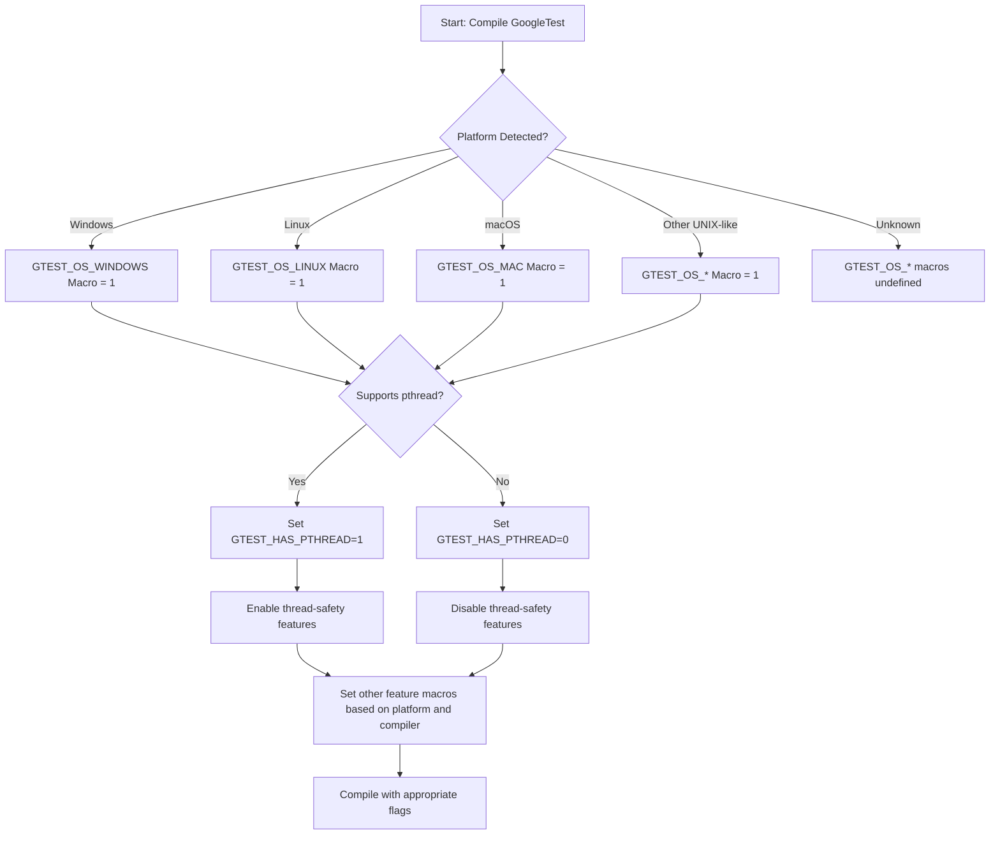

# Supported Platforms for GoogleTest and GoogleMock

GoogleTest and GoogleMock support a wide range of platforms and compilers, ensuring broad compatibility for diverse development environments. This page provides an authoritative overview of the officially supported platforms, compilers, and build tools according to Google's [Foundational C++ Support Policy](https://opensource.google/documentation/policies/cplusplus-support).

---

## Overview

GoogleTest follows strict criteria for support and compatibility to provide stable, reliable testing capabilities across commonly used environments. It targets platforms where modern C++ standards (C++17 or later) are available and where supported toolchains facilitate consistent compilation and linking.

Users should verify their environment compatibility early in their setup process to avoid integration and build issues.

## Supported Platforms

GoogleTest automatically detects the target platform using platform-specific macros. These platforms include but are not limited to:

- **Windows Desktop** (including MSVC, MinGW)
- **Linux distributions**
- **macOS and iOS**
- **FreeBSD, OpenBSD, NetBSD, DragonFlyBSD**
- **Solaris and other UNIX variants**
- **Embedded and specialized platforms** like Android (Linux Android), Fuchsia, Native Client (NaCl), and others with varying degrees of support

Some less commonly used or legacy platforms may have reduced or experimental support.

## Supported Compilers and Versions

GoogleTest requires a compiler with support for **C++17** or later.

The following compilers and versions are officially supported:

- GCC 7.0 and newer
- Clang 3.8 and newer
- Microsoft Visual Studio 2017 (MSVC v19.11) and newer
- Intel LLVM and Intel C++ compilers with C++17 support
- SunPro C++ compilers with appropriate exception and RTTI support

Support for additional compilers may exist but can be limited or experimental.

## Build Systems and Tools

GoogleTest is designed to integrate smoothly with common build systems:

- **CMake:** Officially supported with build scripts that facilitate native builds on multiple platforms.
- **Bazel:** Supported in environments that use Bazel for build automation.
- Other build systems can integrate GoogleTest by including source files and proper compiler flags manually.

The preferred build environment enforces modern C++ standards and platform detection macros automatically.

## Handling Platform and Compiler Variations

Some features and support depend on specific platform capabilities and compiler support:

- Threading support requires awareness of supported threading libraries like POSIX pthreads or Windows threading APIs.
- Regular expression support varies, with POSIX or RE2 used where available.
- File system operations are conditioned on platform availability.

GoogleTest uses configuration macros such as `GTEST_HAS_PTHREAD`, `GTEST_HAS_POSIX_RE`, and platform detection macros like `GTEST_OS_WINDOWS` or `GTEST_OS_LINUX_ANDROID` to adapt implementations accordingly.

## How to Ensure Compatibility

- Verify your platform and compiler version against the [Foundational C++ Support Matrix](https://github.com/google/oss-policies-info/blob/main/foundational-cxx-support-matrix.md).
- Use the recommended compiler flags to enable C++17 standard or above.
- Utilize CMake provided with GoogleTest to automatically manage environment detection and necessary compiler/linker flags.
- If necessary, override certain macros manually per your environment to force or disable specific GoogleTest features (see the macros section in `gtest-port.h`).

## Where to Find More Information

- Detailed support matrix: [Google OSS Foundational C++ Support Matrix](https://github.com/google/oss-policies-info/blob/main/foundational-cxx-support-matrix.md)
- Build instructions and environment setup: [Building and Running Tests FAQ](https://github.com/google/googletest/blob/main/googletest/README.md)
- Platform-specific macro definitions and advanced configuration: Header file [gtest-port.h](https://github.com/google/googletest/blob/main/googletest/include/gtest/internal/gtest-port.h)

---

## Troubleshooting Platform Compatibility Issues

If you encounter build or runtime issues related to platforms or compilers:

- Check for unsupported or outdated compilers that lack C++17 support.
- Confirm that platform macros are correctly defined and detected during compilation.
- Verify threading support and ensure the build links against necessary threading libraries (such as pthreads on Unix-like systems).
- Check the GoogleTest build flags for shared library configurations, exception handling, and RTII support.

<Tip>
If builds fail due to missing platform or feature macros, explicitly define or disable macros such as `-DGTEST_HAS_PTHREAD=1` or `-DGTEST_HAS_EXCEPTIONS=0` during compilation as needed.
</Tip>

---

## Summary Diagram: Platform Detection Flow

---

## Related Documentation

- [System Requirements](https://github.com/google/googletest/blob/main/getting-started/prerequisites-installation/system-requirements.md)
- [Installation on Different Platforms](https://github.com/google/googletest/blob/main/getting-started/prerequisites-installation/installation-methods.md)
- [Build System and Platform Integration](https://github.com/google/googletest/blob/main/concepts/integration-patterns-advanced/build-system-and-platform-integration.mdx)

---

## Best Practices

- Use the officially supported compilers and platforms to guarantee the best stability and feature support.
- Always specify C++17 or later in your build configurations to avoid compatibility issues.
- Use the provided CMake integration to handle environment detection and platform-specific compiler flags automatically.
- Consult the platform detection macros inside `gtest-port-arch.h` and `gtest-port.h` if custom platform support or debugging is needed.

---

## Summary

This page provides a single source of truth about supported platforms and compilers for GoogleTest and GoogleMock. It helps users avoid integration pitfalls by choosing compatible environments and understanding how GoogleTest adapts to different platforms internally. For any platform not explicitly supported, users are encouraged to report issues or contribute fixes upstream.

---

_* This document is part of the wider GoogleTest documentation ecosystem. For optimal results, users should consult related guides on installation, building, and platform-specific setup._
