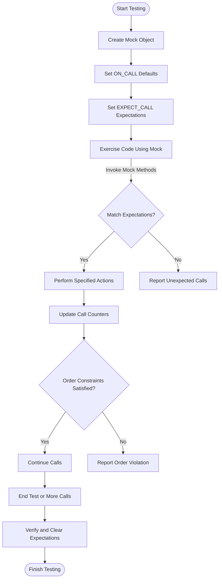

# Core Concepts of GoogleTest and GoogleMock

GoogleTest and GoogleMock are powerful tools for writing and managing unit tests and mock objects in C++. This guide introduces the essential concepts users need to understand to write effective tests, from the basics of test cases and assertions to advanced mocking techniques involving matchers and actions.

---

## 1. Test Cases and Test Suites

- **Test Case**: A function that contains a set of expectations or assertions to verify a specific behavior or functionality.
- **Test Suite**: A collection of related test cases grouped logically to organize tests effectively.

GoogleTest defines tests primarily using the macro `TEST(TestSuiteName, TestName)`, which creates an isolated test case.

```cpp
TEST(ExampleTestSuite, SimpleTest) {
  EXPECT_EQ(1 + 1, 2);
}
```

This test checks if the sum is correct.

---

## 2. Assertions

Assertions check conditions during tests and report failures if conditions are not met. There are two main types:

- **Fatal Assertions (EXPECT_*)**: Continue running the test after failure.
- **Non-fatal Assertions (ASSERT_*)**: Abort the current test case after failure.

Example:

```cpp
EXPECT_TRUE(SomeFunction()); // Logs failure but keeps running
ASSERT_NE(value, 0);         // Aborts test if condition fails
```

Assertions form the backbone to validate expected outcomes.

---

## 3. Matchers: Precise Argument Validations

Matchers enable tests to express expectations about function arguments flexibly and declaratively in GoogleMock.

- Matchers act as predicates on arguments, e.g., `_` matches any value.
- They enable precise control, like `Ge(5)` to match arguments greater or equal to 5.

Example usage in mock expectations:

```cpp
using ::testing::_;
using ::testing::Ge;
EXPECT_CALL(mock_obj, SomeMethod(Ge(5))); // Expects argument >= 5
```

Matchers can be combined, customized, and shared for readability and maintainability.

---

## 4. Mock Objects

Mocks simulate interfaces by defining fake implementations where calls and interactions are controlled and expectations verified.

Features:

- Create mock classes inheriting interfaces.
- Define mock methods with `MOCK_METHOD` macro specifying return type, method name, and arguments.
- Set expectations on calls, such as how many times a method is called, argument matching, and call order.

Example mock class:

```cpp
class MockFoo : public Foo {
 public:
  MOCK_METHOD(int, GetSize, (), (const, override));
  MOCK_METHOD(void, DoSomething, (int value), (override));
};
```

Creating mock objects and specifying behavior helps isolate testing from dependencies.

---

## 5. Actions: Specifying Mock Method Behavior

Actions define what a mock method does when invoked.

- Actions can return values (`Return()`), invoke user-defined functions (`Invoke()`), or change arguments (`SetArgPointee()`).
- Multiple actions can be chained using `WillOnce()` and `WillRepeatedly()`.

Example:

```cpp
EXPECT_CALL(mock, GetNumber())
    .WillOnce(Return(42))
    .WillRepeatedly(Return(7));
```

This means `GetNumber()` returns 42 the first time, then always 7 afterwards.

---

## 6. Setting Expectations

Expectations verify that your code interacts with mocks correctly.

- Use `EXPECT_CALL` to specify how mock methods are expected to be used.
- Control the invocation count via `Times()`, with cardinalities like `Exactly(N)`, `AtLeast(N)`, or `AnyNumber()`.
- Specify argument matchers to narrow expected calls.
- Control call ordering with `InSequence` and `After` clauses.

Example:

```cpp
EXPECT_CALL(mock, Process(_))
    .Times(AtLeast(1));
```

By default, expectations are "sticky", meaning they remain active even after saturation, unless you use `.RetiresOnSaturation()`.

---

## 7. Controlling Call Order

Control the expected order of mock method calls for stricter verification.

- **Unordered calls**: By default, calls may happen in any order.
- **Strict sequence (`InSequence`)**: Enforce calls to happen exactly in the order declared.

Example using `InSequence`:

```cpp
{
  InSequence s;
  EXPECT_CALL(mock, Step1());
  EXPECT_CALL(mock, Step2());
}
```

Here, `Step1()` must happen before `Step2()`.

---

## 8. Strictness Levels of Mock Objects

Manage warnings and failures on uninteresting calls (calls to mock methods with no expectations):

- **NaggyMock (default)**: Warnings are printed when uninteresting calls occur.
- **NiceMock**: Suppresses warnings for uninteresting calls.
- **StrictMock**: Treats uninteresting calls as errors (failures).

Example:

```cpp
NiceMock<MockFoo> nice_mock; // No warnings for uninteresting calls
StrictMock<MockFoo> strict_mock; // Fails tests on uninteresting calls
```

Use these wrappers to balance test robustness and noise.

---

## 9. Default Actions via ON_CALL

`ON_CALL` sets default behavior for mock methods when no explicit expectation matches.

Example:

```cpp
ON_CALL(mock, GetValue())
    .WillByDefault(Return(10));
```

This does not set any expectation on call count but specifies the default action.

`EXPECT_CALL` takes precedence over `ON_CALL` for matched calls.

---

## 10. Verifying and Clearing Mocks

Mocks automatically verify expectations upon destruction.

- To verify earlier, use:

```cpp
Mock::VerifyAndClearExpectations(&mock_obj);
```

- To verify and clear default actions and expectations:

```cpp
Mock::VerifyAndClear(&mock_obj);
```

Avoid setting new expectations after verification to prevent undefined behavior.

---

## 11. Best Practices and Tips

- Always mock **virtual** methods; non-virtual methods require alternate patterns.
- Specify expectations **before** exercising mock methods.
- Use **Matchers** to avoid over-specifying argument values.
- Apply **StrictMock** judiciously to avoid brittle tests.
- Use `RetiresOnSaturation()` to prevent "sticky" expectations from causing issues when calls repeat beyond expected times.
- Control output verbosity with `--gmock_verbose` flag for focused debugging.
- When mocking move-only types (e.g. `std::unique_ptr`), use lambdas or `WillOnce` with freshly created objects for proper behavior.

---

# Further Learning

To deepen your mastery of GoogleTest and GoogleMock, explore the following resources:

- [gMock for Dummies](https://google.github.io/googletest/gmock_for_dummies.html) — Beginner-friendly comprehensive introduction
- [Mocking Reference](https://google.github.io/googletest/reference/mocking.html) — Exhaustive API documentation
- [gMock Cookbook](https://google.github.io/googletest/gmock_cook_book.html) — Practical recipes and best practices
- [Matchers Reference](https://google.github.io/googletest/reference/matchers.html) — Catalog of matchers for argument validation
- [Actions Reference](https://google.github.io/googletest/reference/actions.html) — Predefined and custom actions
- [Strictness and Mock Call Controls](https://google.github.io/googletest/api/gmock.html#strictness) — Managing mock strictness

These will help you navigate complex mocking scenarios and optimize test reliability.

---

# Summary Diagram of Call Flow and Expectations



Use `InSequence` or `After` to enforce order constraints.

---

This guide equips you to understand and apply GoogleTest and GoogleMock core concepts with confidence, enabling precise, maintainable tests and effective mocking.
