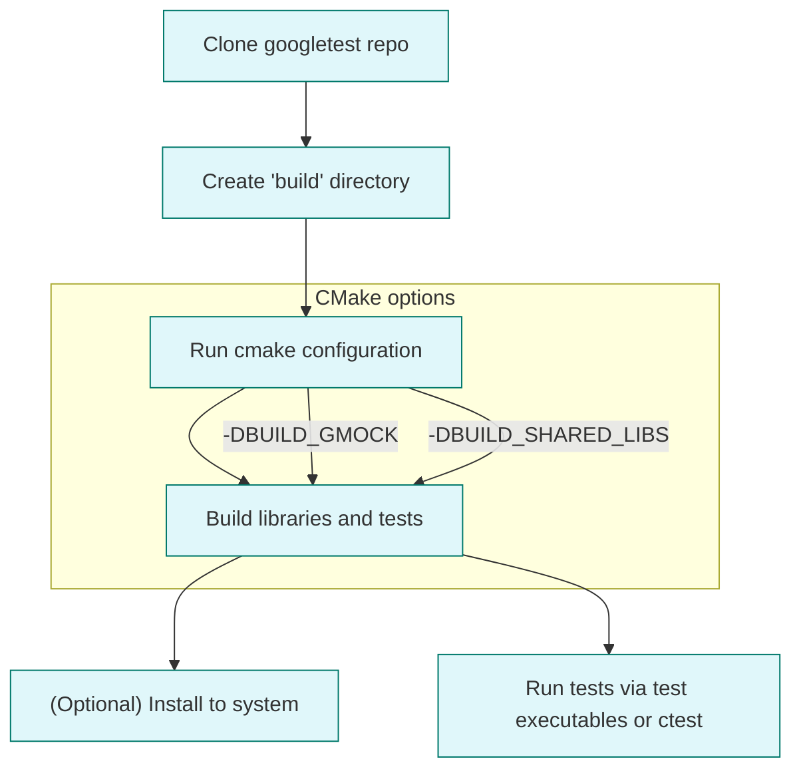

# How do I install and build GoogleTest/GoogleMock?

GoogleTest and GoogleMock provide a reliable, scalable C++ testing and mocking framework that integrates smoothly into your build process. This guide walks you through the essential steps to get GoogleTest and GoogleMock installed and built on your system, covering the key build systems in use—primarily CMake and Bazel—with clear, actionable instructions.

---

## Supported Build Systems and Installation Flows

### 1. Building with CMake (Recommended)

CMake is the primary and widely supported build system for GoogleTest and GoogleMock. It offers cross-platform flexibility and works well in standalone projects or as part of an existing CMake-based build.

#### Standalone CMake Build of GoogleTest and GoogleMock

Follow this concise flow to build GoogleTest and GoogleMock as standalone projects:

<Steps>
<Step title="Clone the Repository">
Clone the official repository and switch to the desired release tag (replace `v1.17.0` with your version):

```bash
git clone https://github.com/google/googletest.git -b v1.17.0
date googletest
```
</Step>
<Step title="Create a Build Directory">
Create and switch to a new directory for build artifacts, keeping sources clean:

```bash
mkdir build
cd build
```
</Step>
<Step title="Generate Build Files">
Run CMake to configure and generate native build files for your platform:

```bash
cmake ..
```

If you want to build only GoogleTest (without GoogleMock), specify:

```bash
cmake .. -DBUILD_GMOCK=OFF
```
</Step>
<Step title="Build the Libraries">
Build the libraries using your platform's native build tool:

- On Linux/macOS:

  ```bash
  make
  ```

- On Windows with Visual Studio:

  Open the generated `gtest.sln` file and build the projects inside Visual Studio.

- On macOS with Xcode:

  Open the `.xcodeproj` file to build.

</Step>
<Step title="(Optional) Install GoogleTest and GoogleMock">
To install the libraries and headers system-wide (usually requires admin privileges):

```bash
sudo make install
```

This installs GoogleTest/GoogleMock to the default system locations.
</Step>
</Steps>

#### Integrating GoogleTest/GoogleMock into an Existing CMake Project

You have two flexible approaches:

- **Use Installed Libraries:** Use `find_package(GTest CONFIG REQUIRED)` to locate the installed GoogleTest/GoogleMock libraries and link your tests with `GTest::gtest` or `GTest::gmock`.

- **Build as Part of Your Project:** Include GoogleTest/GoogleMock source code in your project and add it using `add_subdirectory()`. This ensures matching compiler options and prevents compatibility issues.

Example snippet in your project's CMakeLists.txt:

```cmake
include(FetchContent)
FetchContent_Declare(
  googletest
  URL https://github.com/google/googletest/archive/5376968f6948923e2411081fd9372e71a59d8e77.zip
)
set(gtest_force_shared_crt ON CACHE BOOL "" FORCE)
FetchContent_MakeAvailable(googletest)

add_executable(example example.cpp)
target_link_libraries(example gtest_main)
add_test(NAME example_test COMMAND example)
```

This requires CMake 3.14 or newer.

### 2. Building with Bazel

GoogleTest and GoogleMock support Bazel builds typically used at Google and other organizations. Refer to the Bazel-specific build configurations in the repository for details.

(For detailed Bazel setup, consult the official GoogleTest Bazel documentation accessible through the repository.)

---

## Minimum System Requirements

- **C++ Compiler:** Must support C++17 standard.
- **Build Tools:** CMake 3.16 or later recommended for smooth build configuration.
- **Platform Support:** Linux, Windows, macOS supported.
- **Threading Library:** pthreads is detected and used automatically when available on POSIX systems.

See the [Prerequisites & Requirements](https://your-doc-url/getting_started/intro_and_setup/prerequisites_requirements) page for detailed platform-specific notes.

---

## Important Build Configuration Options

- `BUILD_GMOCK` (default ON): Controls whether GoogleMock is built alongside GoogleTest.
- `BUILD_SHARED_LIBS` (default OFF): Controls building shared vs static libraries.
- `gtest_force_shared_crt` (default OFF): On Windows Visual Studio, controls CRT linkage mode to avoid runtime conflicts.

Customize these options with `cmake -D<OPTION>=ON|OFF ..` as needed.

---

## Using Provided `main()` Libraries

To simplify running tests, GoogleTest and GoogleMock provide libraries that implement a `main()` function.

- Linking your test binary with `gtest_main` or `gmock_main` will automatically provide a proper entry point:

```cpp
#include <gtest/gtest.h>

int main(int argc, char **argv) {
  ::testing::InitGoogleTest(&argc, argv);
  return RUN_ALL_TESTS();
}
```

This is already handled if you link against `gtest_main` or `gmock_main`, so you generally do not have to write your own `main()`.

---

## Typical User Workflow

- **Clone** the repository.
- **Configure** with CMake, setting flags based on your needs (e.g., build tests, shared libs).
- **Build** your test binaries alongside GoogleTest/GoogleMock.
- **Run** your test executables or use CTest (`ctest`) to execute and report on tests.

---

## Best Practices & Common Pitfalls

- Use CMake’s `FetchContent` or Git submodules to keep GoogleTest updated and consistent.
- When building with MSVC on Windows, ensure `gtest_force_shared_crt` matches your project’s runtime linkage.
- Prefer linking with `gtest_main`/`gmock_main` to avoid redundant or conflicting mains.
- Avoid mixing debug and release builds between your code and GoogleTest/GoogleMock to prevent linker errors.

---

## Troubleshooting Build Issues

- If you encounter missing pthreads on MinGW, GoogleTest disables pthreads internally.
- Ensure your compiler supports C++17; otherwise builds will fail.
- On Windows, linker errors related to runtime mismatch often stem from CRT mismatch; verify `gtest_force_shared_crt` setting.
- For detailed troubleshooting, refer to [Installation & Build Options](https://your-doc-url/getting_started/intro_and_setup/installation_options) and the [Troubleshooting FAQ](https://your-doc-url/faq/troubleshooting-usage/common-errors).

---

## Additional Resources

- [Getting Started: Setup and Installation Guide](https://your-doc-url/guides/getting-started/setup-and-installation)
- [Writing Your First Test](https://your-doc-url/guides/getting-started/writing-your-first-test)
- [GoogleTest Core Concepts Primer](https://your-doc-url/docs/primer.md)

---

## Summary Diagram: Typical Build Flow With CMake



---

By following these instructions, users and developers can quickly set up, build, and integrate GoogleTest and GoogleMock into their C++ projects, ensuring a smooth testing experience.

---

<Info>
For full platform and toolchain compatibility, refer to the [Supported Platforms & Compatibility](https://your-doc-url/overview/integration-platforms/platform-support) documentation.
</Info>

<Info>
GoogleMock builds depend on GoogleTest and are integrated within the same build sequences. To customize builds, refer to `BUILD_GMOCK` CMake option.
</Info>

<CallToAction>
Ready to build your first test? Visit the [Writing Your First Test](https://your-doc-url/guides/getting-started/writing-your-first-test) guide!
</CallToAction>

---

_Last updated on branch `main`. Source repository: [https://github.com/google/googletest](https://github.com/google/googletest)_

