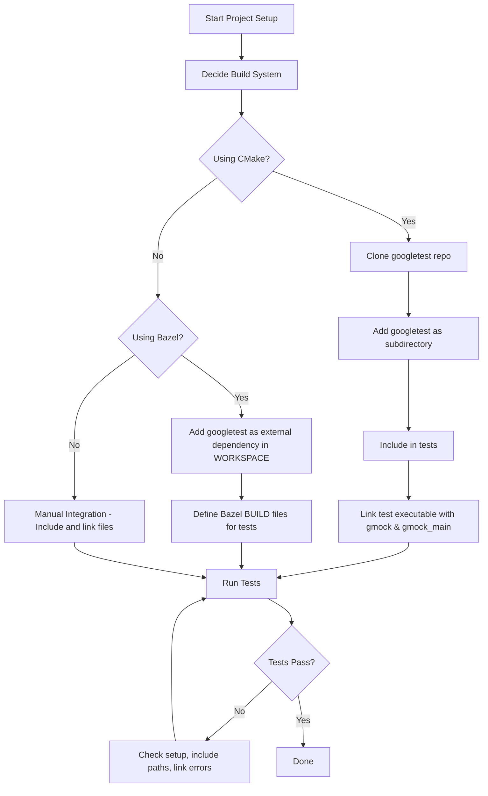

# How do I integrate GoogleTest/GoogleMock with my project?

GoogleTest and GoogleMock are essential tools for C++ testing, but integrating them properly into your project requires some clear steps and awareness of best practices. This page provides step-by-step answers to the most common integration questions, including supported build systems, minimum requirements, and initial setup pitfalls. You'll learn which files to include, how to organize your tests, and how to avoid common early mistakes to get a smooth start.

---

## 1. Supported Build Systems and Setup Requirements

GoogleTest and GoogleMock support a variety of build systems widely used across platforms:

- **CMake** — The primary and recommended build system.
- **Bazel** — Popular in large-scale and Google-style projects.
- **Makefiles and IDE Integration** — Possible, but less straightforward.

### Minimum Requirements

- C++17 compliant compiler.
- Proper compiler and linker configuration to locate GoogleTest and GoogleMock headers and sources.

<Tip>
Make sure your build system knows where the GoogleTest and GoogleMock source files and headers are located. Without proper include and link directives, your build will fail.
</Tip>

## 2. Initial Setup and Including the Right Files

To use GoogleTest and GoogleMock, follow these key steps:

### 2.1 Include Headers

At the top of your test file, include the main GoogleMock header, which also brings in GoogleTest:

```cpp
#include <gmock/gmock.h>
```

This header provides all the macros, matchers, and utilities needed.

### 2.2 Link Against the Correct Libraries

When building your test executable, link against `gmock` and `gmock_main` libraries to get the mocking features and default `main()`:

- `gmock` : Mocking framework implementation.
- `gmock_main` : Default main() entry point so you don’t have to define one.

If you prefer to define your own `main()`, link only with `gmock`.

### 2.3 Organize Test Files

Place your test source files in a dedicated test folder or sub-package. This keeps production and test code separate.

<Tip>
Keep mock class definitions adjacent to the code under test, or in well-known test directories. Avoid defining mocks in application code directories to ease maintenance.
</Tip>


## 3. Building GoogleTest/GoogleMock Into Your Project

### 3.1 Standalone Build (Preferred)

- Clone the git repository:
  ```
git clone https://github.com/google/googletest.git
  ```

- Create a build directory:
  ```
cd googletest && mkdir build && cd build
  ```

- Run `cmake` to generate native build files:
  ```
cmake ..
  ```

- Build using `make` or your system’s build tool:
  ```
make
  ```

- Optionally install system-wide (usually `/usr/local`):
  ```
sudo make install
  ```

### 3.2 Embedding into an Existing CMake Project

Instead of installing system-wide, embed GoogleTest by adding it as a subdirectory:

```cmake
add_subdirectory(path/to/googletest)

# Link tests against gtest and gmock
add_executable(my_test test_main.cpp ...)
target_link_libraries(my_test gtest gmock gtest_main)
```

Use CMake's `FetchContent` for automatic download and integration at configure time:

```cmake
include(FetchContent)
FetchContent_Declare(
  googletest
  URL https://github.com/google/googletest/archive/release-1.11.0.zip
)
FetchContent_MakeAvailable(googletest)
```

This method keeps your project self-contained and makes CI integration simpler.

## 4. Integrate with Bazel

If your project uses Bazel:

- Add GoogleTest and GoogleMock as external dependencies in your `WORKSPACE` using `http_archive`.
- Write appropriate `BUILD` files to depend on `@com_google_googletest//:gmock_main` for your tests.
- Bazel handles the build and linking complexities automatically.

Refer to the [Bazel Integration Guide](getting-started/installation-guides/bazel-integration) for detailed steps.

## 5. Common Initial Setup Pitfalls

### 5.1 Missing Virtual Destructors

Mocking requires the destructors of base classes to be virtual to avoid undefined behavior and leaks. Ensure all interfaces you mock have virtual destructors.

### 5.2 Linking Errors

Link errors often occur because:

- Forgetting to link with `gmock_main` or `gmock`
- Mixing debug and release builds
- Compiler runtime mismatches, especially on Windows with Visual Studio runtimes

Verify the linked libraries and compiler flags.

### 5.3 Using Unsupported Language Features

GoogleTest requires at least C++17 support. Using older standards leads to build failures.

### 5.4 Overlooking Include Paths

Make sure your build configuration includes paths to GoogleTest and GoogleMock headers.

## 6. Organizing Your Tests for Success

- Write tests in source files separate from production code.
- Name tests clearly following GoogleTest conventions.
- Use mocks where appropriate (see mocks-related pages such as [Building & Using Mocks](/guides/mocking-advanced-usage/building-mocks) for detailed guidance).
- Initialize GoogleMock at program start if running tests standalone:

```cpp
int main(int argc, char** argv) {
  ::testing::InitGoogleMock(&argc, argv);
  return RUN_ALL_TESTS();
}
```

If you link with `gmock_main`, this main function is provided for you.

## 7. Example CMakeLists.txt Snippet

```cmake
cmake_minimum_required(VERSION 3.14)
project(MyProject)

# Add GoogleTest as a subdirectory or use FetchContent
add_subdirectory(googletest)

add_executable(my_tests test/foo_test.cpp)

target_link_libraries(my_tests gtest gmock gtest_main)

enable_testing()
add_test(NAME my_tests COMMAND my_tests)
```

## 8. Troubleshooting Your Integration

If you face issues:

- Run your tests with verbose logging: `--gmock_verbose=info` to diagnose mock failures
- Verify you're linking and including the right headers
- Check your compiler and build flags
- Consult platform-specific issues, especially on Windows where Visual Studio compiler settings can cause mismatch errors

<Callout>
**Tip:** To avoid uninteresting call warnings, wrap mock objects in `::testing::NiceMock`.
</Callout>

## 9. Related Documentation

- [GoogleTest Installation Overview](getting-started/setup-requirements/installation-overview)
- [Setting Expectations & Behaviors](api-reference/mocking-apis/expectations-behaviors)
- [Building & Using Mocks](guides/mocking-advanced-usage/building-mocks)
- [Bazel Integration](getting-started/installation-guides/bazel-integration)
- [First Test Experience - Project Setup](getting-started/first-test-experience/project-setup)
- [Integration with Build Systems](guides/mocking-advanced-usage/integration-with-build-systems)

---

This completes the core guidance you need for integrating GoogleTest and GoogleMock with your project's build.


---

### Flow Diagram: Basic Integration Flow



---