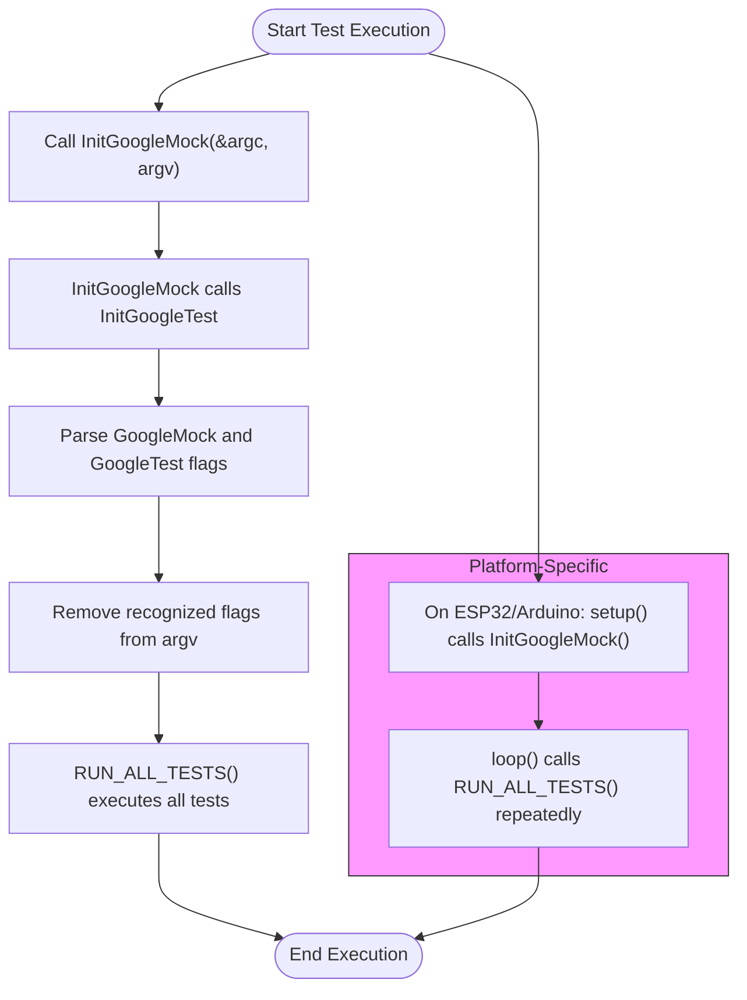

# Installation and Setup Questions FAQ

This FAQ addresses common questions and issues encountered during the installation and initial configuration of GoogleTest and GoogleMock. It guides you through environment compatibility, build system integration, C++ standards compliance, and troubleshooting platform-specific obstacles to get your testing setup running smoothly.

---

## 1. Getting Started with Installation and Setup

### Q: What are the minimum system requirements to build and use GoogleTest and GoogleMock?

GoogleTest requires a platform that supports C++17, including Linux, Windows, and macOS. Supported compilers must be compatible with C++17, and the build environment should include dependency tools such as CMake (version 3.13 or higher recommended).

Ensure your compiler and linker are set up to handle threading libraries (like pthread on Unix systems), as GoogleTest is thread-safe if pthread is available.

_For details, see the [System Requirements guide](/getting-started/prerequisites-installation/system-requirements)._

### Q: How do I set up GoogleTest with CMake in a new or existing project?

You have two main options:

- **Standalone Build:** Clone the repository, create a build directory, and run `cmake ..` to generate native build files. By default, this includes GoogleMock. To disable GoogleMock, use `cmake .. -DBUILD_GMOCK=OFF`.
- **Integration Into Existing Project:** Use `find_package` to import installed GoogleTest libraries or add GoogleTest source code to your project using `add_subdirectory()`. This ensures consistent compiler/linker settings.

For example, embedding via `FetchContent` in your `CMakeLists.txt` allows automatic downloading and building during the configure step:

```cmake
include(FetchContent)
FetchContent_Declare(
  googletest
  URL https://github.com/google/googletest/archive/5376968f6948923e2411081fd9372e71a59d8e77.zip
)
set(gtest_force_shared_crt ON CACHE BOOL "" FORCE)
FetchContent_MakeAvailable(googletest)

add_executable(example example.cpp)
target_link_libraries(example gtest_main)
add_test(NAME example_test COMMAND example)
```

_Set `gtest_force_shared_crt` appropriately on Windows if you encounter runtime library mismatches._

See the full [Basic Configuration guide](/getting-started/initial-configuration-validation/basic-configuration) and [Setup and Integration guide](/googletest-guides/getting-started/setup-integration).

### Q: What C++ standard version is required for GoogleTest?

GoogleTest requires C++17 or later. Set the compiler standard explicitly, for example in CMake with:

```cmake
set(CMAKE_CXX_STANDARD 17)
set(CMAKE_CXX_STANDARD_REQUIRED ON)
```

If your project does not use C++ natively, you can specify it via compiler flags using `-DCMAKE_CXX_FLAGS`.

### Q: How can I avoid macro name clashes with other libraries?

GoogleTest defines many common macros like `TEST`, `ASSERT_*`, and `EXPECT_*` in the global namespace. In case of clashes, use the following compiler flags to rename GoogleTest macros, for example:

```
-DGTEST_DONT_DEFINE_TEST=1
```

This causes `TEST` to be renamed to `GTEST_TEST` and requires updating your test code accordingly.


## 2. Common Issues and Solutions

### Q: I get linker errors related to runtime libraries on Windows. How do I fix this?

Ensure that your project and GoogleTest agree on dynamic versus static runtime linkage. Visual Studio defaults to dynamic runtimes, but GoogleTest links runtimes statically by default.

Set the CMake option `gtest_force_shared_crt` to `ON` to make GoogleTest link dynamically, matching your project:

```cmake
set(gtest_force_shared_crt ON CACHE BOOL "" FORCE)
```

Then reconfigure and rebuild.

### Q: What if my compiler does not detect pthread support correctly, leading to link errors?

GoogleTest detects pthread availability automatically, but you can override this with:

```
-DGTEST_HAS_PTHREAD=1
```

or disable it with

```
-DGTEST_HAS_PTHREAD=0
```

Add linker flags manually if you are not using CMake.

### Q: How to build GoogleTest as a shared library (DLL)?

Add the flag

```
-DGTEST_CREATE_SHARED_LIBRARY=1
```
to compile GoogleTest as a shared library. When building your own tests against it, add:

```
-DGTEST_LINKED_AS_SHARED_LIBRARY=1
```

Make sure to adjust your build system to produce and link shared libraries accordingly.

### Q: How do I verify that my GoogleTest and GoogleMock installation was successful?

After building and linking, run sample test executables included with GoogleTest or create your own simple test file. Verify that tests run as expected and the framework initializes correctly.

For embedded or special platforms like Arduino, call `testing::InitGoogleMock()` without arguments.

See the [Validating Setup guide](/getting-started/initial-configuration-validation/validating-installation) for full instructions.

## 3. Initializing GoogleMock and GoogleTest

### Q: Do I need to call both `InitGoogleTest()` and `InitGoogleMock()` when testing with mocks?

No. Calling `InitGoogleMock()` is sufficient since it internally calls `InitGoogleTest()`. For example:

```cpp
int main(int argc, char** argv) {
  testing::InitGoogleMock(&argc, argv);
  return RUN_ALL_TESTS();
}
```

On platforms without argc/argv (e.g., Arduino), use the no-argument version:

```cpp
testing::InitGoogleMock();
```

### Q: Where does the default main function come from if I don't provide one?

GoogleMock and GoogleTest provide default main entry points in the `gmock_main` and `gtest_main` libraries respectively. Linking your test executable with `gmock_main` or `gtest_main` includes a provided `main()` that calls the appropriate initialization and runs all tests.

If you use your own `main()`, link with `gmock` or `gtest` libraries instead.

### Q: How are GoogleMock command-line flags handled?

GoogleMock supports command-line flags prefixed with `--gmock_`, like `--gmock_verbose`. These flags are automatically parsed and removed from `argv` by `InitGoogleMock()`. Unrecognized flags are left in `argv` for other uses.

For example:

```console
./mytests --gmock_verbose=info
```

Removes the flag from argument list and sets verbose output.

## 4. Platform-Specific Notes

### Q: How does GoogleTest/GoogleMock work on Arduino and embedded platforms?

Entry points on Arduino-like platforms use `setup()` and `loop()` instead of `main()`. GoogleMock's `InitGoogleMock()` initializes the framework, and `RUN_ALL_TESTS()` is called inside the `loop()` function.

Ensure that you link with the appropriate embedded versions (`gmock_main` or `gtest_main`) and follow platform-specific instructions.

### Q: Are there any known platform bugs or workarounds?

- On Windows with MSVC, `_tmain` is avoided in favor of `main()` to bypass linker bugs when Unicode is enabled.
- On certain Unix systems, you may need additional compiler/linker flags for large object support or threading.

Refer to the documentation for your platform and GoogleTest's system requirements page for up-to-date details.

---

## 5. Troubleshooting Tips

- **Compile Errors:** Check compiler version compatibility (must support C++17).
- **Linking Failures:** Verify linking all necessary GoogleTest/GoogleMock libraries and runtime compatibility.
- **Undefined Symbols:** Ensure you link against `gmock_main` or `gtest_main` when using default main.
- **Flag Parsing Issues:** Confirm that flags start with `--gmock_` and that you call the appropriate `InitGoogleMock()` variant.

<Tip>
Always build and test your GoogleTest and GoogleMock setup independently before integrating into a larger project. Use the provided sample tests and verify outputs match expected behavior.
</Tip>

<Tip>
On Windows, using `gtest_force_shared_crt` alleviates common runtime library mismatches. Make sure to clean and regenerate your build files after toggling this.
</Tip>

---

## 6. Additional Resources

- [GoogleTest Basic Configuration](/getting-started/initial-configuration-validation/basic-configuration)
- [Setup and Integration Guide](/googletest-guides/getting-started/setup-integration)
- [Validating Installation](/getting-started/initial-configuration-validation/validating-installation)
- [Common Installation & Build Issues](/getting-started/troubleshooting-support/common-issues)
- [GoogleMock API Reference](https://github.com/google/googletest/blob/main/googlemock/include/gmock/gmock.h)

These resources provide in-depth examples, command-line usage, platform coverage, and next steps for your test development journey.

---

## 7. Summary Diagram of Initialization Flow



---

For any further setup assistance, consult the community forums and support channels linked via the Getting Started section.

---