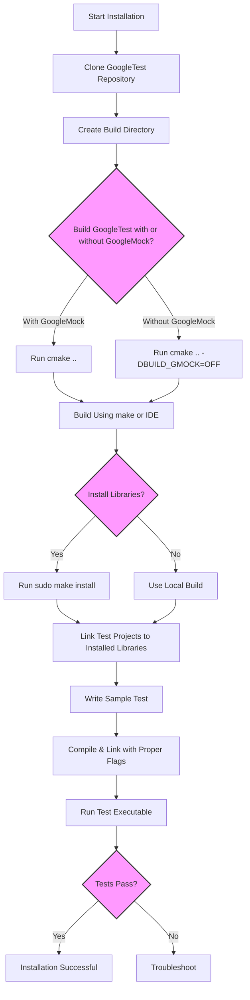

# Installation and Compatibility FAQ

This FAQ page addresses the most common questions related to installing **GoogleTest** and **GoogleMock**, clarifying required prerequisites, supported platforms, and C++ compatibility. Whether you're getting started or upgrading your test environment, this guide will help you smoothly set up and verify your installation.

---

## 1. What are the prerequisites for installing GoogleTest and GoogleMock?

Before installing GoogleTest and GoogleMock, ensure the following prerequisites are met:

- **Supported C++ Compiler:** Your compiler must support the C++17 standard or later. Examples include GCC 7+, Clang 5+, MSVC 2017 Update 3+, and others.
- **Operating System:** Supported platforms include popular OSes such as Linux, Windows (including MinGW and Visual Studio environments), and macOS.
- **Threading Support:** GoogleTest supports multi-threading using pthreads on supported platforms. Ensure pthread library is available or configure accordingly.
- **Build Tools:** CMake 3.14 or later is recommended to configure and build GoogleTest (which includes GoogleMock).

<Tip>
Setting the C++ standard explicitly in your build system with `set(CMAKE_CXX_STANDARD 17)` and `set(CMAKE_CXX_STANDARD_REQUIRED ON)` ensures proper compiler behavior.
</Tip>

## 2. Which platforms and compilers does GoogleTest officially support?

GoogleTest supports a broad range of platforms and compilers in accordance with Google's [Foundational C++ Support Policy](https://opensource.google/documentation/policies/cplusplus-support) and detailed in the corresponding matrix at:

[Foundational C++ Support Matrix](https://github.com/google/oss-policies-info/blob/main/foundational-cxx-support-matrix.md)

Key supported platforms:

- **Linux:** Various distributions with GCC or Clang
- **Windows:** Desktop with Visual Studio, MinGW
- **macOS:** With Xcode or Clang

Minimum compiler requirements include robust C++17 support. Certain embedded or mobile platforms have limited or no support.

<Note>
For detailed platform-specific notes, including multi-threading and build system integration, refer to the _Supported Platforms & Dependencies_ guide.
</Note>

## 3. How do I perform a typical installation of GoogleTest and GoogleMock using CMake?

The recommended installation steps are:

1. **Clone the repository**, optionally specifying the desired release version:
   ```bash
   git clone https://github.com/google/googletest.git -b v1.17.0
   cd googletest
   ```

2. **Create and enter a build directory:**
   ```bash
   mkdir build && cd build
   ```

3. **Run CMake to configure the build:**
   - To build GoogleTest with GoogleMock included (default):
     ```bash
     cmake ..
     ```
   - To build GoogleTest only (without GoogleMock):
     ```bash
     cmake .. -DBUILD_GMOCK=OFF
     ```

4. **Build the libraries:**
   - On Unix-like systems:
     ```bash
     make
     sudo make install  # Optional, for system-wide installation
     ```
   - On Windows, open the generated `.sln` file with Visual Studio and build.

5. **Link your projects** against the installed or built libraries accordingly.

<Tip>
Using GoogleTest as part of your existing CMake project via `add_subdirectory` is recommended to ensure consistent compiler and linker flags.
</Tip>

## 4. What about the main function for tests? Can I use GoogleMock with or without it?

GoogleMock provides two primary library options for linking:

- **`gmock_main`:** This library includes a `main()` function that initializes GoogleMock and runs all tests. Useful if you want a ready-to-use test binary without writing your own main.
- **`gmock`:** This library excludes the main function, so you will provide your own `main()` function that calls `testing::InitGoogleMock()` and triggers test execution.

By linking to `gmock_main`, you simplify test setup, but if you need customized initialization or integration, link against `gmock` and define your own main function.

Example custom main snippet:
```cpp
#include "gmock/gmock.h"

int main(int argc, char** argv) {
  testing::InitGoogleMock(&argc, argv);
  return RUN_ALL_TESTS();
}
```

## 5. What are the common compiler flags or macros required during build?

- `-DGTEST_HAS_PTHREAD=1` or `0`: Controls pthread usage if automatic detection fails.
- `-DGTEST_CREATE_SHARED_LIBRARY=1`: For building GoogleTest as shared libraries.
- `-DGTEST_LINKED_AS_SHARED_LIBRARY=1`: To compile test code linking GoogleTest shared library.
- `-DGTEST_DONT_DEFINE_XXX=1`: Prevents GoogleTest from defining certain macros to avoid clashes.

Your build system will often set these flags automatically when using the official CMake scripts.

## 6. How to handle multi-threading and pthread support?

GoogleTest is thread-safe when pthread support is enabled (on Linux, macOS, and other POSIX platforms). If your environment does not correctly detect pthread availability, you can explicitly define:

```bash
-DGTEST_HAS_PTHREAD=1  # Or 0 to disable
```

When enabling pthreads, ensure your linker includes the pthread library (e.g., `-lpthread`).

## 7. Are there any common installation pitfalls?

- **Runtime Library Mismatches (Windows Visual Studio):** Linking GoogleTest static libraries built with static runtime against projects using dynamic runtime causes linker errors (e.g., LNK2038). Use the CMake variable `gtest_force_shared_crt` set to `ON` to build GoogleTest with dynamic runtime libraries to match your project.
- **Compiler Compatibility:** Ensure your compiler version fully supports C++17; older versions will fail to compile.
- **Outdated CMake:** CMake versions older than 3.14 may not support required commands like `FetchContent`

<Warning>
Failure to match runtime libraries on Windows is the most frequent cause of build failures.
</Warning>

## 8. Does GoogleTest support building as shared libraries (DLLs)?

Yes, it does. To build GoogleTest as a shared library:

- Add `-DGTEST_CREATE_SHARED_LIBRARY=1` to compiler options.
- When compiling your tests against the shared library, also add `-DGTEST_LINKED_AS_SHARED_LIBRARY=1`.

This setup requires proper linker flags for creating shared libraries on your platform.

## 9. How to link GoogleMock with GoogleTest?

GoogleMock depends on GoogleTest. Typically, linking involves:

```bash
-lgmock_main  # Includes gmock, gtest, and main()
# OR
-lgmock -lgtest  # If providing your own main()
```

Using package management tools or CMake `find_package(GTest REQUIRED)` allows linking through targets like `GTest::gmock_main`.

## 10. Where can I find the installation libraries and header include paths after install?

- **Typical system install locations:**
  - Headers under `/usr/local/include` or chosen prefix include directory.
  - Libraries under `/usr/local/lib` or chosen prefix lib directory.

- **Pkg-config files:** After installation, `.pc` files named `gmock.pc` and `gmock_main.pc` are placed under `lib/pkgconfig`.
- These files specify `libdir` and `includedir`, simplifying integration with build systems that use pkg-config.

## 11. How to verify that installation and build succeeded?

1. Build and install GoogleTest/GoogleMock as per instructions.
2. Create a minimal test source file using the `TEST` macro.
3. Compile and link your test using GoogleTest libraries.
4. Run the test executable:
   - It should output test results.
   - Exit code zero indicates success.

If tests fail to build or run, check for:
- Missing include paths or library links.
- C++17 compatibility.
- Runtime mismatches on Windows.

## 12. Where can I find further help and expanded documentation?

- [Installation Guide](https://github.com/google/googletest/blob/main/docs/INSTALL.md) in the official repo.
- [Supported Platforms & Dependencies](../../overview/integration-and-ecosystem/platforms-dependencies.mdx).
- [Prerequisites & Supported Platforms](../../getting-started/setup-requirements-installation/prerequisites-supported-platforms.mdx).
- [Troubleshooting Installation Issues](../../getting-started/first-run-validation/installation-troubleshooting.mdx).

---

### Related Documentation Links

- [Writing Your First Test](../../getting-started/first-run-validation/writing-first-test.mdx)
- [Setting Up and Integrating GoogleTest](../../guides/getting-started/setup-integration.mdx)
- [CI/CD Integration](../../guides/integration-and-realworld/ci-cd-integration.mdx)

---

### Summary Diagram: Installation Workflow



---

For comprehensive coverage and stepwise advancement, consult the detailed guides and installation troubleshooting documents linked here.
