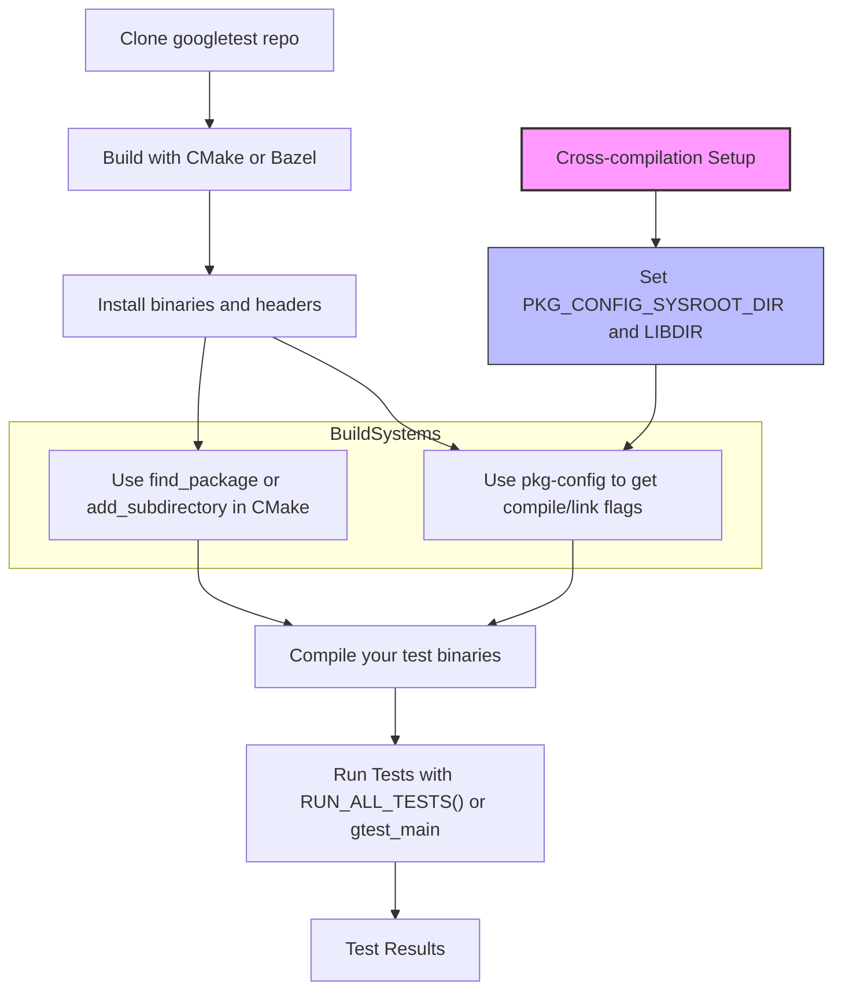

# How do I install and integrate GoogleTest/GoogleMock?

This guide walks you through the supported methods for installing and integrating GoogleTest and GoogleMock into your development environment. It covers popular build system workflows, dependency management via pkg-config, common pitfalls encountered during setup, and answers frequent questions related to configuring test targets.

---

## 1. Supported Installation Methods

### Building GoogleTest and GoogleMock as Standalone Projects

The most straightforward way to get started is by cloning the official repository and building GoogleTest with your preferred build system. Using CMake, the process is as follows:

```bash
# Clone the GoogleTest repository
git clone https://github.com/google/googletest.git -b v1.17.0
dcd googletest
mkdir build && cd build

# Generate build files
cmake .. # Includes GoogleMock by default

# To build only GoogleTest (without GoogleMock):
cmake .. -DBUILD_GMOCK=OFF

# Build the library
make

# Optionally install the headers and libraries (usually in /usr/local)
sudo make install
```

This method places the compiled binaries on your system, making it easier for other projects to find and link against GoogleTest and GoogleMock.

### Incorporating GoogleTest and GoogleMock into an Existing CMake Project

If your project already uses CMake, you have two main ways to integrate GoogleTest:

- **Use Installed Libraries via `find_package` or pkg-config:**

  After installing GoogleTest, you can locate the libraries and headers by:

  ```cmake
  find_package(PkgConfig)
pkg_search_module(GTEST REQUIRED gtest_main)

  add_executable(mytests test.cpp)
target_sources(mytests PRIVATE test.cpp)
target_link_libraries(mytests PRIVATE ${GTEST_LDFLAGS})
target_compile_options(mytests PRIVATE ${GTEST_CFLAGS})
  ```

- **Add GoogleTest as a Subdirectory:**

  Embed the GoogleTest source using CMake's `add_subdirectory()` command:

  ```cmake
  add_subdirectory(path/to/googletest)

  add_executable(mytests test.cpp)
  target_link_libraries(mytests PRIVATE gtest_main)
  enable_testing()
  add_test(NAME mytests COMMAND mytests)
  ```

  This approach ensures compiler and linker settings between your tests and GoogleTest remain consistent, avoiding common build issues.

### Using `FetchContent` in CMake to Download GoogleTest Automatically

This modern approach enables you to integrate GoogleTest without manually downloading sources:

```cmake
include(FetchContent)
FetchContent_Declare(
  googletest
  URL https://github.com/google/googletest/archive/5376968f6948923e2411081fd9372e71a59d8e77.zip
)

set(gtest_force_shared_crt ON CACHE BOOL "" FORCE) # For Windows runtime compatibility
FetchContent_MakeAvailable(googletest)

add_executable(mytests test.cpp)
target_link_libraries(mytests PRIVATE gtest_main)
add_test(NAME mytests COMMAND mytests)
```

This requires CMake 3.14 or later.

---

## 2. Integration with Build Systems

### Using pkg-config for Compiler and Linker Flags

GoogleTest provides pkg-config files (`*.pc`) that help your build system automatically discover compiler flags and linkage options:

- Includes directories (`-I`)
- Required macros (`-D`)
- Threading flags such as `-pthread`
- Linker libraries and paths (`-L` and `-l`)

All major build systems support `pkg-config`. Example snippet for CMake:

```cmake
find_package(PkgConfig)
pkg_search_module(GTEST REQUIRED gtest_main)

add_executable(testapp samples/sample3_unittest.cc)
target_link_libraries(testapp PRIVATE ${GTEST_LDFLAGS})
target_compile_options(testapp PRIVATE ${GTEST_CFLAGS})

enable_testing()
add_test(NAME first_and_only_test COMMAND testapp)
```

> **Tip:** Use `target_compile_options` with `${GTEST_CFLAGS}` instead of `target_include_directories` with `${GTEST_INCLUDE_DIRS}` to ensure macros and additional flags like `-pthread` are included seamlessly.

### Handling pkg-config in Cross-Compilation

Cross-compilation requires extra care, as the default pkg-config files embed paths for the build host, not the target system. To fix this:

1. Build GoogleTest with the install prefix set to the target root (e.g., `/usr`).

2. Install into your sysroot via `DESTDIR`:

```bash
make -j install DESTDIR=/path/to/sysroot
```

3. Set environment variables for pkg-config to use the sysroot paths, preventing incorrect flag stripping:

```bash
export PKG_CONFIG_ALLOW_SYSTEM_CFLAGS=yes
export PKG_CONFIG_ALLOW_SYSTEM_LIBS=yes
export PKG_CONFIG_SYSROOT_DIR=/path/to/sysroot
export PKG_CONFIG_LIBDIR=$PKG_CONFIG_SYSROOT_DIR/usr/lib64/pkgconfig
```

Now pkg-config will produce flags pointing inside your sysroot, e.g.,

```
$ pkg-config --cflags gtest
-DGTEST_HAS_PTHREAD=1 -lpthread -I/path/to/sysroot/usr/include
$ pkg-config --libs gtest
-L/path/to/sysroot/usr/lib64 -lgtest -lpthread
```

Refer to [autotools.io cross-compiling pkg-config tutorial](https://autotools.io/pkgconfig/cross-compiling.html) for a deeper dive.

---

## 3. Common Pitfalls and Troubleshooting

<AccordionGroup title="Common Issues When Installing and Integrating GoogleTest">
<Accordion title="CMake Error: 'None of the required gtest_main found'">
This error occurs when pkg-config cannot find the GoogleTest `.pc` files, typically if GoogleTest was built and installed manually without updating `PKG_CONFIG_PATH`.

**Solution:** Set the environment variable to include the location of `.pc` files:

```bash
export PKG_CONFIG_PATH=/usr/local/lib64/pkgconfig
```

Replace with your actual installation prefix.
</Accordion>
<Accordion title="Linker Errors Related to pthread">
If you encounter unresolved references to pthread symbols, ensure that your compile and link flags include `-pthread`.

Using pkg-config with GoogleTest will automatically add these flags when you use `GTEST_CFLAGS` and `GTEST_LDFLAGS`.

If manually configuring, add `-pthread` explicitly.
</Accordion>
<Accordion title="Mismatch between Static and Dynamic CRT on Windows">
GoogleTest links the C runtime statically by default, which can cause linker errors in Visual Studio if your project links CRT dynamically.

**Fix:** Enable the CMake option:

```cmake
set(gtest_force_shared_crt ON CACHE BOOL "" FORCE)
```

This aligns GoogleTest's runtime linking with your application.
</Accordion>
</AccordionGroup>

---

## 4. Managing Test Targets

When defining test executables, decide whether to link against `gtest` or `gtest_main`:

- `gtest` requires you to write your own `main()` function that calls `RUN_ALL_TESTS()`.
- `gtest_main` provides a suitable `main()` entry point for you, simplifying test setup.

Example using `gtest_main`:

```cmake
add_executable(mytests test1.cpp test2.cpp)
target_link_libraries(mytests PRIVATE gtest_main)

enable_testing()
add_test(NAME AllTests COMMAND mytests)
```

If you need custom test initialization, link with `gtest` and provide your own main.

---

## 5. Best Practices

- **Prefer Using pkg-config Where Possible:** This automates complex flag management including threading macros and library paths.
- **Use `target_compile_options` with `${GTEST_CFLAGS}`:** It adds compile flags including `-I` paths and macros, avoiding common pitfalls with incomplete flag sets.
- **Link Against `gtest_main` Unless Custom `main()` Needed:** This reduces boilerplate and potential entry point errors.
- **For Cross-Compilation, Set pkg-config Environment Carefully:** Use `PKG_CONFIG_SYSROOT_DIR` and `PKG_CONFIG_LIBDIR` to ensure correct paths.
- **Build GoogleTest and GoogleMock Using the Same Compiler Settings as Your Project:** To prevent ABI incompatibilities, especially important on Windows.

---

## 6. Additional Resources

- [pkg-config usage with GoogleTest example](docs/pkgconfig.md)
- [CMakeLists.txt for GoogleTest](CMakeLists.txt)
- [Building and Using GoogleMock with CMake](googlemock/CMakeLists.txt)
- [Generic Build Instructions in googletest/README.md](googletest/README.md)
- [Getting Started with Setup & Installation Guide](guides/getting-started/setup-installation.md)

---

## 7. Troubleshooting and Support

If you encounter issues during installation or integration, check the following:

- Confirm you have a compatible C++17 compiler and CMake version >= 3.16 for building GoogleTest.
- Verify that your environment variables such as `PKG_CONFIG_PATH` are correctly set to locate `.pc` files.
- On Windows, ensure runtime library settings between your project and GoogleTest match.
- Check for missing or conflicting flags related to threading (e.g., `-pthread`).
- Consult the Troubleshooting & Common Issues documentation for detailed solutions.

You can always seek help through community forums or report issues on the official GitHub repository.

---

### Summary Diagram of Typical Integration Flow



---