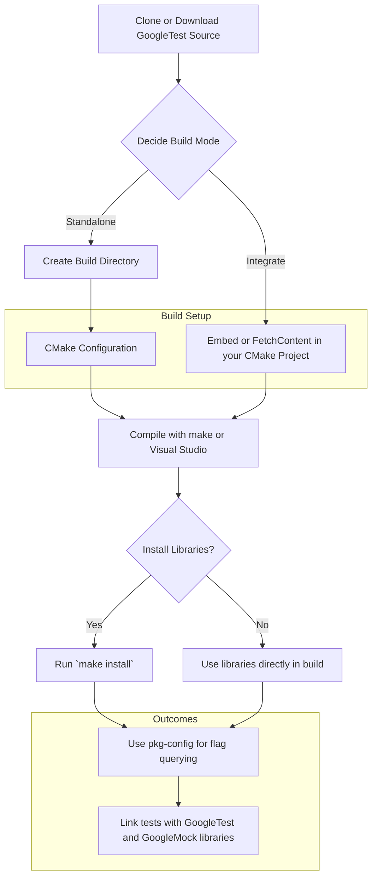

# How do I install and build GoogleTest/GoogleMock?

This guide provides clear, practical instructions to install and build GoogleTest and GoogleMock using the CMake build system. It covers standalone and integrated builds, options for controlling features, handling dependencies, and troubleshooting common issues.

---

## 1. Overview

GoogleTest and GoogleMock together form a robust C++ testing and mocking framework. Building and integrating them properly ensures you can write reliable tests and leverage the full feature set.

The majority of users build GoogleTest and GoogleMock using CMake, either as standalone projects or integrated into an existing CMake build system.

---

## 2. Prerequisites

Before building GoogleTest/GoogleMock, ensure you have:

- A compatible C++ compiler supporting at least C++17.
- CMake (version 3.13 or newer recommended).
- On UNIX-like systems, `make` or another build tool supported by CMake (e.g., Ninja).
- If building with threads enabled, make sure pthread development libraries are installed.

See the [Supported Platforms](platforms.md) and [System Requirements](getting-started/prerequisites-installation/system-requirements.md) for comprehensive details.

---

## 3. Building GoogleTest and GoogleMock with CMake

### a. Standalone Build

This method clones, configures, builds, and optionally installs GoogleTest (and GoogleMock) as a separate project.

```bash
# Clone the repository and select a stable tagged version
git clone https://github.com/google/googletest.git -b v1.17.0
cd googletest

# Create a build directory
mkdir build && cd build

# Generate build files (default builds both GoogleTest and GoogleMock)
cmake ..

# To build only GoogleTest (without GoogleMock), use:
# cmake .. -DBUILD_GMOCK=OFF

# Build the libraries and tests
make

# Optionally, install system-wide (may require sudo)
sudo make install
```

You can then link your test projects against the installed libraries.

> On Windows with Visual Studio, Visual Studio project files (.sln/.vcxproj) will be generated.
>
> On Mac OS X with Xcode, an Xcode project file (.xcodeproj) will be generated.

### b. Integration in Your Existing CMake Project

To seamlessly integrate GoogleTest into your own project:

1. Use CMake's [`FetchContent`](https://cmake.org/cmake/help/latest/module/FetchContent.html) to download GoogleTest during your build configuration.

2. Add GoogleTest as a subdirectory so that it compiles with your project using your compiler settings.

Example minimal `CMakeLists.txt` snippet:

```cmake
cmake_minimum_required(VERSION 3.14)
project(my_project LANGUAGES CXX)

set(CMAKE_CXX_STANDARD 17)
set(CMAKE_CXX_STANDARD_REQUIRED ON)

include(FetchContent)
FetchContent_Declare(
  googletest
  URL https://github.com/google/googletest/archive/refs/tags/v1.17.0.zip
)
# For Windows: Ensure consistent runtime library usage
set(gtest_force_shared_crt ON CACHE BOOL "" FORCE)
FetchContent_MakeAvailable(googletest)

add_executable(my_tests my_tests.cpp)
target_link_libraries(my_tests gtest_main)

include(GoogleTest)
gtest_discover_tests(my_tests)
```

This setup downloads, builds, and links GoogleTest automatically.

---

## 4. Configuration Options During Build

GoogleTest offers a number of CMake options to customize your build:

- `BUILD_GMOCK` (default `ON`): Build GoogleMock alongside GoogleTest.
- `INSTALL_GTEST` (default `ON`): Enable installation of the GoogleTest libraries and headers.
- `gtest_force_shared_crt` (default `OFF`): On Windows, controls whether to use shared CRT; important to match your project settings.
- `BUILD_SHARED_LIBS` (default `OFF`): Build GoogleTest as shared libraries (DLLs) instead of static.
- `gtest_build_tests` (default `OFF`): Enables building GoogleTest's own test suites.
- `gtest_disable_pthreads` (default `OFF`): Disable pthread support if your environment does not support it.

Example usage when running cmake directly:

```bash
cmake .. -DBUILD_GMOCK=OFF -DBUILD_SHARED_LIBS=ON
```

---

## 5. Using pkg-config with GoogleTest

GoogleTest installs `pkg-config` (`.pc`) files that simplify compiling and linking your tests. This standardizes flags across build systems.

Typical information provided by pkg-config includes:

- Include directories (`-I`)
- Compiler macros (`-D`)
- Linker flags (`-L` and `-l`)
- Required system libraries like `-pthread`

### Using pkg-config in CMake

Example snippet:

```cmake
find_package(PkgConfig)
pkg_search_module(GTEST REQUIRED gtest_main)

add_executable(test_binary my_test.cc)
target_sources(test_binary PRIVATE my_test.cc)
target_link_libraries(test_binary PRIVATE ${GTEST_LDFLAGS})
target_compile_options(test_binary PRIVATE ${GTEST_CFLAGS})

enable_testing()
add_test(NAME MyTest COMMAND test_binary)
```

### Troubleshooting pkg-config

If pkg-config cannot find GoogleTest modules:

- Ensure `.pc` files are installed (usually in `/usr/local/lib/pkgconfig` or `/usr/local/lib64/pkgconfig`).

- Set path environment variable:

```bash
export PKG_CONFIG_PATH=/usr/local/lib64/pkgconfig
```

This directs pkg-config to the correct location.

### Cross-compiling

GoogleTest supports cross-compilation using pkg-config with proper environment variables:

```bash
export PKG_CONFIG_ALLOW_SYSTEM_CFLAGS=yes
export PKG_CONFIG_ALLOW_SYSTEM_LIBS=yes
export PKG_CONFIG_SYSROOT_DIR=/path/to/sysroot
export PKG_CONFIG_LIBDIR=${PKG_CONFIG_SYSROOT_DIR}/usr/lib64/pkgconfig
```

This ensures flags contain the actual sysroot path rather than build host paths.

See a detailed tutorial [here](https://autotools.io/pkgconfig/cross-compiling.html).

---

## 6. Build Output

The build produces:

- `libgtest.a` and optionally `libgmock.a` static libraries (or DLL/shared equivalents if enabled).
- Header files installed in `include/gtest/` and `include/gmock/`.
- Pkg-config files in `[prefix]/lib/pkgconfig`.

You can link your tests against `gtest_main` for a main() entry point or just `gtest` if you define your own.

---

## 7. Common Issues & Solutions

### Linking Errors
- Missing `-pthread` or thread library flags can cause linking errors.
- Use pkg-config to ensure proper flags.
- When not using CMake, manually add `-lpthread` or equivalent.

### Runtime Library Conflicts on Windows
- The `gtest_force_shared_crt` option helps avoid conflicts between static/dynamic CRTs.
- Match this setting to your project’s runtime dependency.

### Unsupported Compiler Errors
- GoogleTest requires a C++17-compliant compiler.
- Make sure to set `CMAKE_CXX_STANDARD` to 17 or higher.

### Pthread Detection
- If GoogleTest does not detect pthread support correctly, force it using the `-DGTEST_HAS_PTHREAD=1` compiler flag.

---

## 8. Next Steps

- Proceed to [Configure Your Project for Testing](/getting-started/configuration-first-run/configure-project) to set up your code base.
- Learn how to [Write and Run Your First Test](/getting-started/configuration-first-run/write-first-test).
- Explore [Quick Start: Using GoogleMock](/getting-started/configuration-first-run/quick-start-mocking) to begin mocking.

---

## 9. Additional Resources

- [GoogleTest GitHub Repository](https://github.com/google/googletest): Source code, latest releases, and issues.
- [CMake FetchContent Documentation](https://cmake.org/cmake/help/latest/module/FetchContent.html): Learn how to use CMake to download dependencies at configure time.
- [Pkg-config Cross-compiling Guide](https://autotools.io/pkgconfig/cross-compiling.html): Handling sysroots and cross builds.
- [GoogleTest Official Samples](samples.md): Example test code.

---

<Tip>
When integrating GoogleTest and GoogleMock in large projects, prefer the CMake FetchContent method to ensure consistent compiler settings and easy version updates.
</Tip>

<Warning>
Always verify C++ standard compliance and threading support in your environment before building. Mismatches here are the most common causes for build failures.
</Warning>

<Note>
Windows users should pay special attention to runtime library settings to avoid linker conflicts. Setting `gtest_force_shared_crt` accordingly is crucial.
</Note>

---

## 10. Summary Diagram: GoogleTest/GoogleMock Build Workflow



---

This completes your quick practical guide to installing and building GoogleTest and GoogleMock. For detailed build flags, customization macros, and further troubleshooting, consult the full build-related documentation in the API Reference and Guides sections.
