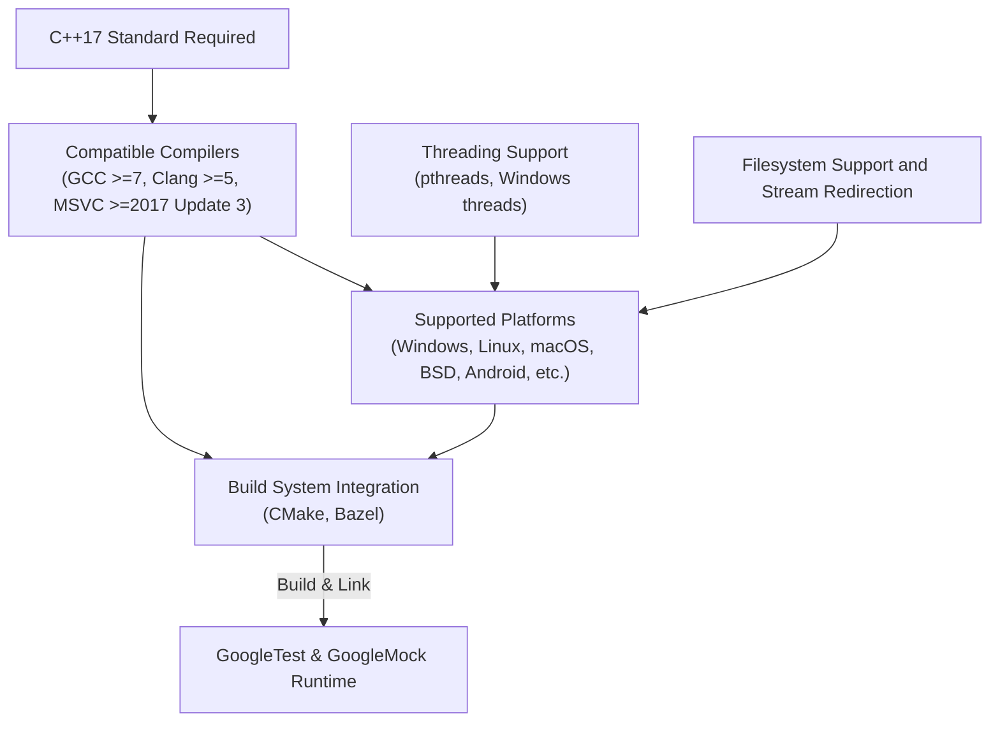

# Language and Platform Compatibility

This page explains the supported C++ standards, platform support, and common compatibility pitfalls. It clarifies what environments are supported by GoogleTest and GoogleMock, and how to address environment-specific setup issues.

---

## Supported C++ Standards

GoogleTest and GoogleMock require a minimum of C++17. This standard ensures compatibility with the features and language constructs used internally, such as template handling, type traits, and move semantics.

### Key Points:
- C++17 is mandatory. Earlier standards such as C++11 or C++14 are not supported.
- Compilers must fully support the C++17 standard (language and standard library).
- This requirement affects both building GoogleTest and any user test code that relies on GoogleTest or GoogleMock.

### Practical Tips:
- Verify your compiler version before attempting to build GoogleTest/GoogleMock.
- GCC (>=7), Clang (>=5), and MSVC (>=2017 Update 3) provide full C++17 support.
- Use build system checks or flags (`--std=c++17`) to enforce the correct standard.

<Note>
Using a compiler that does not support C++17 will result in build failures. Consult the System Requirements and Supported Platforms document for a compatibility matrix.
</Note>

---

## Platform Support

GoogleTest follows Google's Foundational C++ Support Policy, covering a wide range of operating systems and platforms.

### Supported Platforms Include:
- Windows (Desktop, MinGW)
- Linux (most distributions)
- macOS
- Android
- BSD variants
- Other Unix-like systems

Platform support includes both the runtime environments and compilers that meet the C++17 and threading requirements.

### Platform-Specific Notes:
- Some embedded or mobile platforms may have limited support, particularly if lacking a proper filesystem or threading.
- Stream redirection and death tests have platform-specific support and limitations.
- Windows CE, Windows Phone, and other minimal platforms may have reduced API availability.

### Recommended Practices:
- Check the System Requirements & Supported Platforms documentation for detailed platform-specific information.
- Consider platform-specific compiler or linker flags as recommended by Installation Guides.

---

## Common Compatibility Pitfalls and How to Address Them

### 1. Compiler Incompatibility
- Error: Build fails due to unsupported C++ language features.
- Solution: Upgrade to a compiler version supporting C++17 or configure the build system properly.

### 2. Missing Threading or Synchronization Primitives
- Issue: Tests fail or behave incorrectly on platforms without pthreads or Windows threading.
- Mitigation: GoogleTest provides fallbacks, but multi-threaded tests may not work properly.

### 3. Unavailable Filesystem or Stream Redirection
- Effect: Death tests or output capturing may fail or degrade.
- Workaround: Disable or avoid tests relying on these features on unsupported platforms.

### 4. Linking Errors
- Cause: Improper linkage to GoogleTest and GoogleMock libraries.
- Fix: Follow installation and setup guides closely, ensuring linkage to both `gtest` and `gmock` where needed.

### 5. Runtime Exceptions Support
- GoogleTest detects whether exceptions are enabled.
- Tests requiring exceptions may not work if exceptions are disabled on the platform.

### 6. RTTI (Run-time Type Information) Availability
- GoogleTest adapts to platforms with or without RTTI.
- Some features may be limited or unavailable without RTTI.

<Check>
If you experience unexplained build, link, or runtime issues, verify platform compliance with the prerequisites detailed in System Requirements and Common Setup Issues documentation.
</Check>

---

## Summary Diagram of Platform Compatibility and Language Requirements

---

## Related Setup and Troubleshooting

If you encounter compatibility problems:

- Review the [System Requirements & Supported Platforms](https://github.com/google/googletest/blob/main/docs/getting-started/prerequisites-installation/system-requirements.md) for detailed environment prerequisites.
- Consult the [Common Setup Issues](https://github.com/google/googletest/blob/main/docs/getting-started/troubleshooting-support/common-setup-issues.md) guide for typical integration and configuration problems.
- For installation, see the [Installation and Setup](https://github.com/google/googletest/blob/main/docs/guides/getting-started/installation-setup.md).

---

## Summary

GoogleTest and GoogleMock require C++17 and officially support major desktop and server platforms along with widely-used compilers. The framework detects platform-specific capabilities such as threading, exceptions, RTTI, and filesystem availability to provide maximum portability. Users must ensure their build environment and toolchain conform to these requirements to avoid installation and runtime issues.

<Info>
Proper configuration and awareness of platform specifics are essential for robust and maintainable test suites across environments.
</Info>

---

## Further Reading and Resources

- [System Requirements & Supported Platforms](/getting-started/prerequisites-installation/system-requirements)
- [Common Setup Issues](/getting-started/troubleshooting-support/common-setup-issues)
- [Installation and Setup Guide](/guides/getting-started/installation-setup)
- [Platform Support and Integration Concepts](/concepts/integration-and-extensibility/platform-support-integration)
- [Mocking Reference](docs/reference/mocking.md)

---

## Practical Recommendations

- Always use a compiler that fully supports C++17.
- Verify multithreading support is enabled and supported on your platform.
- Ensure build system integration includes linking to both `gtest` and `gmock` libraries if using mocking.
- For embedded or limited platforms, review limitations on stream redirection, death tests, and filesystem API availability.

<Tip>
Regularly consult the System Requirements and Common Setup Issues documentation if moving between environments or upgrading toolchains.
</Tip>
